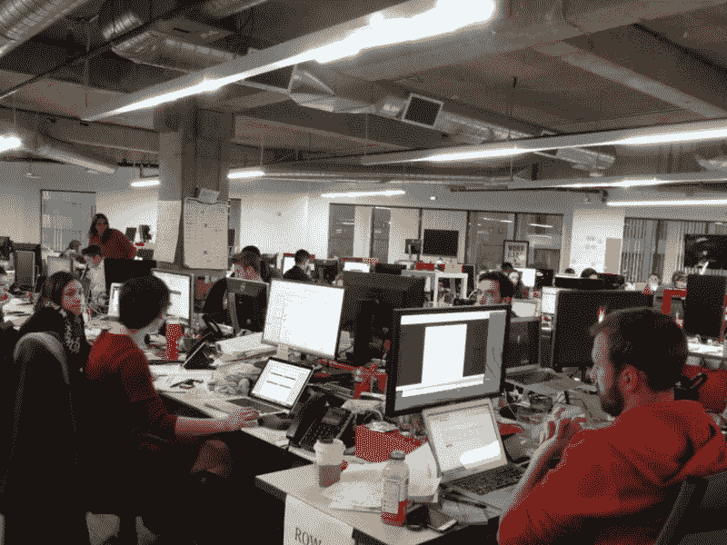
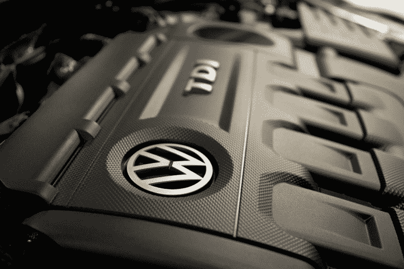

# 优步、大众和捷恩斯有什么共同点？他们都使用隐藏代码来违反法律。

> 原文：<https://www.freecodecamp.org/news/dark-genius-how-programmers-at-uber-volkswagen-and-zenefits-helped-their-employers-break-the-law-b7a7939c6591/>

> “没有一个受过道德训练的软件工程师会同意编写一个摧毁巴格达的程序。相反，基本的职业道德要求他编写一个摧毁城市的程序，巴格达可以作为一个参数。”
> 
> —纳撒尼尔·博伦斯坦

### 优步利用软件在数百个城市非法运营

两个小时前,《纽约时报》爆出了优步有史以来最大的新闻。自 2013 年以来，优步动不动就用一种复杂的工具来削弱当地执法部门。

这个程序叫做[灰球](https://www.nytimes.com/2017/03/03/technology/uber-greyball-program-evade-authorities.html?_r=0)，它是这样工作的:

1.  在优步是非法的城市——仍然有很多——Greyball 可以识别试图招呼优步司机，逮捕他们的司机，扣押他们的车辆的便衣警察。
2.  当这些警察打开优步应用程序并试图拦一辆车时，他们看到幻影优步汽车在城市里行驶，但他们从来没有真正能够搭车。
3.  由于应用程序中显示的汽车不是真实的，警察无法让司机来接他们，他们无法逮捕任何人。

最终结果是，优步基本上可以忽略一个城市尚未批准拼车的事实，无论如何都要在那里开始运营。

花点时间让它深入人心。得益于其优秀的软件，优步基本上凌驾于法律之上。

他们识别这些骑手的方式实际上相当天才。根据警方使用的信用卡，优步可以交叉检查商户数据库和公务员数据库，找出谁可能是警察，然后“禁止”他们使用优步。

警察从来没有成功拦到车，但据他们所知，他们只是在错误的时间被困在了错误的地方。这就是优步多年来能够实施这一骗局的原因，直到几个心怀愧疚的优步工程师站出来揭发此事。

### Zenefits 使用软件欺诈性地认证了数百名保险代理人

Zenefits 是一家向企业提供软件的公司，然后试图在保险套餐中追加销售。

2016 年，据透露，他们的首席执行官帕克·康拉德(Parker Conrad)开发了一种工具，帮助 Zenefits 代理商在许可过程中作弊。

在他们定制的浏览器扩展的帮助下，Zenefits 代理能够跳过法律要求的 52 小时在线课程的大部分。

他们可以更快地开始销售保险，而不必花钱让新员工花一周半的时间来完成这个课程。

康拉德在被发现后不久就辞职了。这一丑闻让该公司损失了一半的估值——25 亿美元——并导致数百人失业。

### 大众汽车公司利用软件销售了 1000 万辆污染严重的汽车

从 2008 年到 2015 年，大众汽车生产了超过 1000 万辆“清洁柴油”汽车。许多工程师感到惊讶的是，柴油发动机产生的排放比标准无铅汽车少得多，但仍有如此高的里程数。好吧，他们的怀疑在 2014 年被证明是正确的，当时研究人员发现这些汽车使用了“失败装置”。

大众汽车的高管已经命令他们的软件工程师想出一种方法，在排放测试中欺骗环境保护局。他们知道在这些测试中，监管者会使用特定的参数。因此，他们编写了逻辑，如果这些参数被选中，引擎将以一种特殊的模式运行。

这个“失效装置”掩盖了一个事实，即“清洁柴油”大众汽车发动机实际上产生的氮氧化物(NOx)排放量比法律允许的要多得多。高达联邦上限的 40 倍。

这种东西会导致肺癌。麻省理工学院的科学家估计，这些排放最终将导致 60 人过早死亡。这还只是在美国。

没错——这些开发者写的软件害死了无辜的人。

大众汽车最终在 2016 年支付了 147 亿美元的和解金。

这仍将是我们这个时代最大的环境悲剧之一——这一切都是由少数服从命令的开发商造成的。

> “权力越大，责任越大”——本叔叔

这个世界越来越依赖于开发人员创建的代码。因此，开发人员正迅速成为世界上最有权力的人。

编码是一种超能力。有了它，你可以让现实屈从于你的意志。你可以让世界变得更美好。或者你可以毁掉它。

你也许能骗过监管者、警察和法官。你也许可以愚弄大众。你也许可以无限期地这样做而不被抓住。

但这并不意味着这是对的。

开发者的权力很大。他们必须负责任地使用这种权力。

如果你是一名开发人员，或者正在努力成为一名开发人员，我强烈推荐你阅读 [Bill Sourour](https://www.freecodecamp.org/news/dark-genius-how-programmers-at-uber-volkswagen-and-zenefits-helped-their-employers-break-the-law-b7a7939c6591/undefined) 的文章“[我仍然为之感到羞耻的代码](https://medium.freecodecamp.com/the-code-im-still-ashamed-of-e4c021dff55e)

如果有人要求你建造一些明显非法的——或者彻头彻尾的邪恶——去找媒体。这三个案例中的开发人员本可以做到这一点，并为世界省去许多痛苦。

记住:[只有你能阻止邪恶代码](https://twitter.com/intent/tweet?text=Remember:%20only%20YOU%20can%20prevent%20evil%20code.&url=https://medium.freecodecamp.com/dark-genius-how-programmers-at-uber-volkswagen-and-zenefits-helped-their-employers-break-the-law-b7a7939c6591)。

我只写编程和技术。如果你在推特上关注我，我不会浪费你的时间。？