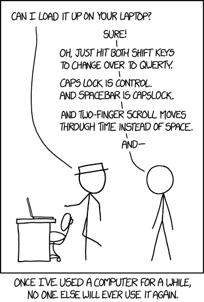
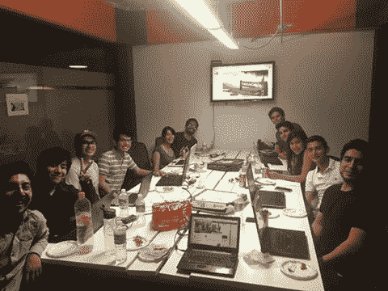

# 这位 94 岁的锂离子电池发明者刚刚宣布了一种不会着火的电池

> 原文：<https://www.freecodecamp.org/news/the-94-year-old-inventor-of-lithium-ion-batteries-just-announced-a-battery-that-cant-catch-on-fire-e9767d6a7998/>

这里有三个值得你花时间的链接:

1.  德克萨斯大学教授约翰·古德诺(对一个发明家来说是个讽刺的名字)带领一个团队开发下一代电池，这种电池充电速度快 3 倍，无论你如何滥用都不会着火
2.  你的软件即服务工具应该收费多少？我分析了 1530 种产品的价格来找出答案( [4 分钟阅读](http://bit.ly/2mBhBlC)
3.  在您埋头于包之前，先了解 Node.js 运行时本身( [9 minute read](http://bit.ly/2lDFCUj) )

额外收获:Beau 解释了如何让你的网络应用程序使用 JavaScript 向你的用户显示桌面通知

### 想到这一天:

> “我认为计算机病毒应该算作生命。我认为这说明了人性的一些东西，我们迄今为止创造的唯一生命形式纯粹是破坏性的。我们按照自己的形象创造了生命。”——斯蒂芬·霍金

### 今日趣事:

漫画作者 [XKCD](http://bit.ly/2mmR2Ab)

### 今日学习小组:

墨西哥城自由代码营

编码快乐！

–昆西·拉森，自由代码营的老师