# 我从飞往西雅图参加微软最后一波设计面试中学到了什么

> 原文：<https://www.freecodecamp.org/news/what-i-learned-from-flying-to-seattle-for-microsofts-final-wave-of-design-interviews-8eab06c50ce5/>

蒂芙尼·伊顿

# 我从飞往西雅图参加微软最后一波设计面试中学到了什么

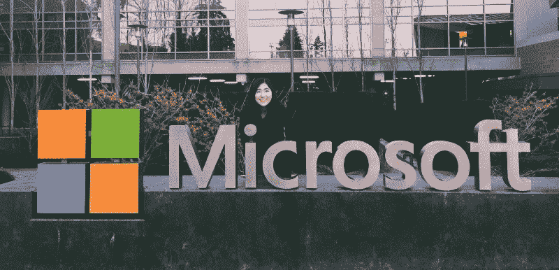

在我告诉你我在微软的现场面试之前，我申请了 UX 设计实习生的职位。我的经历可能与其他人不同，但就相当严格(和漫长)的过程而言，肯定是相似的。

### 背景

我的目标之一是在一家真正的大公司获得经验，并致力于对全球数百万用户产生巨大影响的产品。在我面试过的公司中，我写的是微软，因为这是一次非常全面的经历。这让我有机会思考面试过程的每个方面。虽然在面试方面事情可能会变得更好，但我对自己以及如何提高自己作为一名设计师有了更多的了解。

我过去使用过微软的产品，自从使用它们以来，它们帮助我毫不费力地完成了简单的任务，比如用 Word 写论文或用 Excel 创建电子表格。通过无数次的使用，这些产品给我留下了持久的印象，因为它们是如此的多功能和方便。

我也看到了在微软工作的各种设计师和他们最近的产品发布。我看到了巨大的多样性和交叉协作推动公司为广泛的用户重新设想生产力。这是真正让我想在微软工作的原因。

### 第一封邮件

> 你好蒂芙尼，

> 我们非常有兴趣与您谈论更多关于您的技术技能和能力，以便在用户体验角色的面试过程中继续。微软有许多令人兴奋的机遇和挑战，我们希望与您探讨这些可能性。

当我看到这封邮件时，我欣喜若狂。这太出乎意料了，我以为这不是真的。我真的*通过了*简历筛选，获得了在微软实习的机会。

我通过在线申请向微软申请，没有推荐人，在发送申请后的 2-3 周，我收到了一封来自招聘人员的电子邮件，他有兴趣面试我，并给我发了一个链接来安排我的面试。

我迅速输入我的信息和我有空的时间。第一轮面试只是时间问题。是时候拥有它了。

### 准备

在电话面试之前，我有两周的准备时间，所以我对微软做了一些研究，比如他们当时在做什么以及公司本身(价值观、产品等)。我也在积极寻找公司，并与另一家公司进行了现场面试，我收到了该公司的邀请，所以我对电话面试有所期待。

我在网上(Quora、Glassdoor、博客帖子)查阅了人们对电话面试的体验，以及可能出现的问题。

**这三个问题是设计面试中引导对话的典型问题:**

*   告诉我你自己的情况(你的设计背景，比如你是如何进入这个行业的)
*   说说 xxx 项目(项目的大致情况；标题、项目是什么、贡献、流程的要点版本、结果、学习和您本可以采取的不同做法，为什么项目对您很重要)
*   为什么是 x？(总结你的技能，你如何能为公司做出贡献，你是一个文化契合者吗？)

通过对可能会被问到的问题有一个基本的了解，我把它们写下来，然后我可以针对每个问题谈论有针对性的经历(项目的例子、学校或实习中的情况)，把它与微软的价值观联系起来，并传达我如何为公司的需求做出贡献。

### 电话面试

我采访了 Bing 团队的一位高级交互设计师。从其他人的经验来看，他们会先与招聘人员面谈来筛选申请人，但这不是我的情况。我相信他们出于某种原因加快了面试过程。

> 说说你自己吧

在交换了基本的你好吗之后，面试官马上让我介绍一下我自己。因为这是一个非常宽泛的问题，我问她想知道关于我的什么，让她解释得更清楚一点。如果你对回答一个问题没有把握，问一些澄清性的问题也无妨，因为这显示了你对面试官想听的问题的考虑。

> 告诉我你做过的一个项目

在我告诉她我是如何进入设计行业的之后，她让我谈谈我当时最近的一个项目。我谈到了一个启动项目，我和一个由三名设计师组成的团队一起工作，将初级设计师和高级设计师联系起来。我告诉她产生这个想法的过程，以及我们最初设计这个产品的总体目的。

> 像讲故事一样回答每个问题

我不只是谈论这个项目；我讲了一个故事，关于我和我的队友是如何产生这个想法的，我们作为一个团队所经历的斗争，我们是如何克服的，以及我从这次经历中学到了什么。通过把每个答案组织成一个故事，面试官可以更好地和你交流，这创造了一个更好的面试氛围。这是我的老师克里斯蒂娜·沃特克教我的学生不用记住脚本就能回答问题的结构:S.T.A.R。

1.  **情景** -解释体验(背景)
2.  **触发** -你需要解决什么问题？
3.  **行动** -你解决问题的步骤
4.  **结果** -结果是积极的还是消极的？(描述你从这次经历中学到了什么，或者你会从中学到什么)

用这种方法，不管问题是什么，我都能够描述一个面对障碍的故事，这比给出一个直截了当的答案更能引起共鸣。面试官想了解你这个人，以及你为什么做出这样的选择。

> 说说一个技术问题，你是怎么克服的？

在问完关于我的项目的问题后，面试官接着问了我一个项目中出现的技术问题，以及我是如何解决的。在 5 到 10 分钟的时间里，我告诉她关于验证我们的想法以及向我们的目标受众传达我们的价值主张的问题。

然后我提出了一个解决方案，我创建了一个登陆页面，在 Linkedin、脸书等网站上做广告。为了了解人们是否会对我们收集的注册人数感兴趣，我们找到了一种采访他们的方式，并获得了关于迭代我们服务的见解。

最后，我介绍了我的发现、我从克服问题中学到的东西以及我们团队的下一步行动。面试官问了我一些关于我的想法的问题，比如为什么它很重要，甚至给了我关于下一步的反馈，我发现这些对我的前进很有帮助。

> 你为什么想去微软工作？

你应聘的每个公司都会问这个问题。他们想知道你在多大程度上符合公司文化和他们的目标，但他们最想知道的是*为什么*你感兴趣。

你会和他们的团队一起工作吗？微软有你成长需要的东西吗？你有对公司有益的技能吗？你对他们的问题有热情吗？

通过传达你的兴趣和诚实来说明你为什么想要这个职位，以及为什么他们应该选择你而不是其他合格的候选人，这将大有帮助。

众所周知，微软有很多好处和巨大的品牌价值。我希望能够超越公司名称，真正了解我想从实习经历中获得什么。我审视了角色和整体文化，以便更好地理解期望什么，以及如何使其符合我的目标。根据我的研究，我想去微软工作有几个原因:

#### **微软正在经历文化变革**

我想体验一下他们如何成为一家更注重以客户为中心、多元化和包容性的公司。

#### **微软在不断成长**

我希望能够在一个快节奏的环境中学习，这样可以让我做出快速而周密的决定。

#### **微软有许多才华横溢、聪明的设计师，他们不仅拥有设计知识，还拥有如何利用设计来评估企业和消费者不同方面的经验**

接受指导对我来说非常重要，因为我希望有人能坦诚地给我诚实的建议和反馈，让我成长为一名设计师。在我最后一次实习期间， [Aviva Rosenstein](https://www.freecodecamp.org/news/what-i-learned-from-flying-to-seattle-for-microsofts-final-wave-of-design-interviews-8eab06c50ce5/undefined) 是一位了不起的导师，因为她不怕给我批评性的反馈，而且当我需要建议时，她总是能够安排时间和她交谈。

#### **微软一直在将技术转移到云上，并让它在所有产品上发挥作用**

他们还一直在创造有可能改变我们使用软件和通过技术导航的方式的产品，例如用 Hololens 探索混合现实。根据产品团队的工作方式，有机会开发与其他产品直接相关的高影响力产品。我希望能够探索不同的技术，以及它们如何联系起来，作为一个有凝聚力的体验一起工作。

我会建议你在面试前想好为什么你想在某个地方工作。事实上，不理解你为什么想在 x 公司工作是没有做研究的危险信号。如果面试官看到你没有努力去了解他们，会浪费他们的时间，并且显示出你对公司缺乏尊重/热情。

> 你有什么问题要问我吗？

这部分是我有机会展示我对微软的兴趣和热情的地方。我问了面试官一些关于我的角色的问题，比如对我的期望是什么，如何成为一名成功的实习生。我还询问了可交付成果，以及我可能参与的项目类型，以了解我的技能是否适合我。

接着，我向招聘人员询问了自己的情况；她在过去 6 个月做了什么项目，为什么她喜欢在微软工作，她学到了什么。能够听到我的面试官谈论她在微软的工作真的很有见地，因为我可以从她的声音和她描述工作的细节中看出她有多么喜欢在微软工作。

> 我看了你的作品集，你的设计很有想法。我喜欢你的审美观。无论你去哪里，你都会成功，任何人都会喜欢和你一起工作。

在电话结束之前，采访者将焦点转移回我身上，尽管她不知道接下来的步骤是什么，也不知道微软何时会回复我，但她说了一些关于我的工作的非常鼓舞人心的事情，给我留下了非常积极的氛围，是我继续创作对我来说意义重大的作品的动力。

> 好的面试是一种对话

通过用你讲故事和向面试官提问的方式来展示你的激情，它会增强面试的整体感觉，让你感觉更像一次对话，并能让面试官通过你，因为你不仅有资格和擅长回答问题，还因为你的个性(文化契合度)和出色的沟通技巧。

### 等待游戏(更多电子邮件)

几天过去了，一周又一周过去了，差不多一个月过去了，我收到了招聘人员的电子邮件，告知我通过了最后一轮面试，要去西雅图参加最后一轮面试了！

> 下午好，

> 我想伸出双手，感谢您抽出时间来面试微软。你在面试中表现出色，我很高兴地告诉你，我们希望你进入最后一轮面试！

由于紧张的日程安排，招聘人员告诉我，他们在那个月很少有机会安排我面试，我必须等待。我和招聘人员交换了电子邮件，通知她我收到了其他公司的邀请，并询问他们是否会加快流程。我的招聘人员告诉我，她会尽最大努力提前安排面试。

> 当你有悬而未决的工作机会时，对招聘人员非常透明是很重要的，这样他们可以尽最大努力加快面试过程，让你有时间在多个工作机会中做出决定。

尽管有时这不起作用，你不得不接受另一份工作，但这比拒绝它并指望得到一份“更好”的工作要好得多。毕竟，现在找工作竞争非常激烈，有实习总比没有好。

最终，我收到了一封电子邮件，为最后的面试做准备，以及日期和那天会发生什么:

> 我已经为您在即将到来的 x/xx/xxxx 最后一轮活动中争取到了一个位置，我非常期待您有机会向我们更广泛的设计团队展示您的作品！如果需要的话，日程安排者将很快联系安排旅行和住宿。

所有的等待都有了回报；我要去西雅图！！

### 更多准备

> 重点将放在 45-50 分钟。早上是长时间的作品集展示，因为这将是你向面试官介绍你的作品和设计理念。

使用我收到的演示指南作为参考，我积极地为现场做准备，从学校作业中留出一些时间来准备我的演示并练习向我的同事演示。我收到了来自我那了不起的同学和老师网络的反馈。我想如果我没有向寻求帮助，我就不会对我的工作有所了解，也不会如此精炼我的陈述。

> 微软希望看到我的过程的广度和深度，我对项目的贡献，并以克服巨大障碍的方式来构建它。他们想看到我报道各种各样的问题以及由此产生的结果。

面试前几周，一位旅游专家为我准备了航班、酒店以及是否需要租车的一切事宜。我填写了一张旅行表格，要求填写我的基本信息以及航班的日期和时间。当我完成表格后，微软为我做了所有的安排。

### 在登陆日之前

我乘坐优步到机场，在那里我乘坐了两个小时的下午航班到西雅图。当我到达酒店时，我告诉接待员我已经预订了房间，当她发现我的名字时，她立即代表微软和酒店欢迎我(太酷了)。她解释说，只要我保留发票，房间服务和食物都是由微软支付的。交通费用没有限制，所以我想坐多少次优步或出租车都行。

我收到了我的酒店钥匙，然后去了我的房间，在那里我探索了酒店房间。很不错，可以看到很不错的城市建筑！

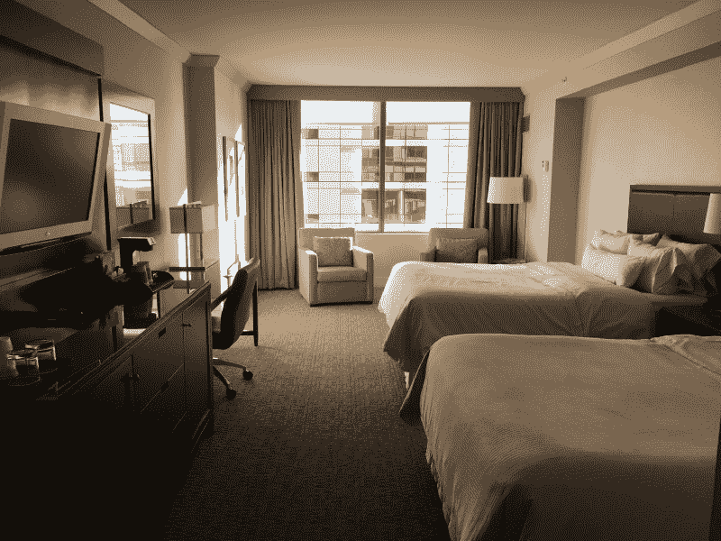

Got a room with two beds!

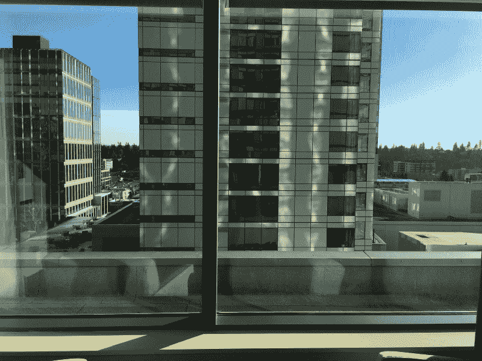

等我安顿下来的时候，已经是下午 3 点半了。我决定去市区探索派克市场。

我只想说，高峰时间从贝尔维尤到西雅图市中心的交通简直是折磨。我花了一个小时才到达派克市场。当我到达时，大多数地方都开始关门了。最后，我只去了几个地方，比如 Piroshki Piroshki，他们卖 Piroshki，里面有馅的油炸小圆面包。

晚餐，我去了一家法国餐厅。这么说吧，那天晚上我用微软给我的预算吃了一顿非常丰盛的晚餐。在一顿令人满意的晚餐后，我回到了我练习演讲的酒店。我准备为我的设计决定和其他在大日子会被问到的问题辩护。

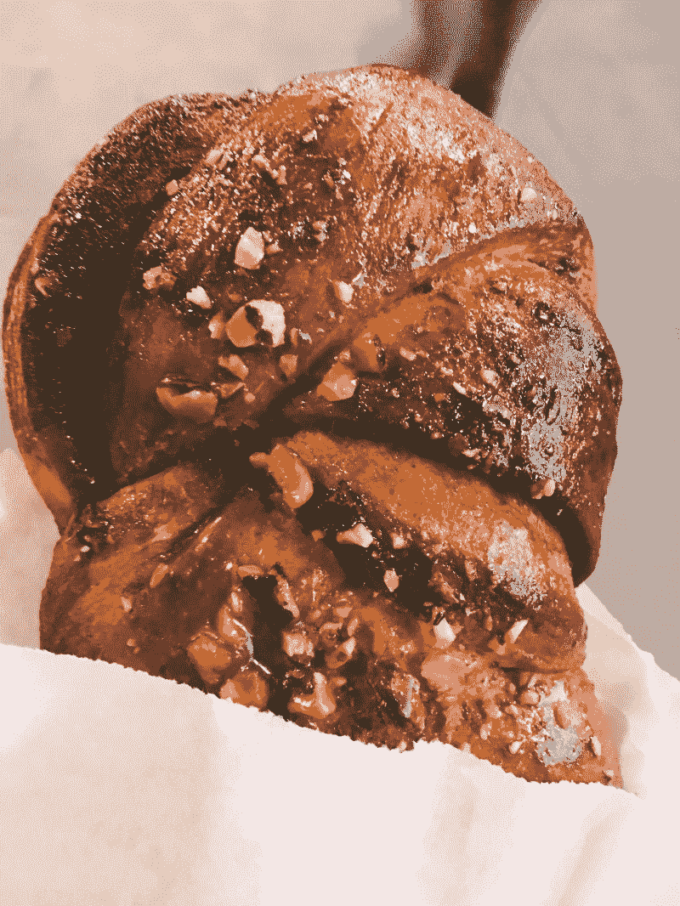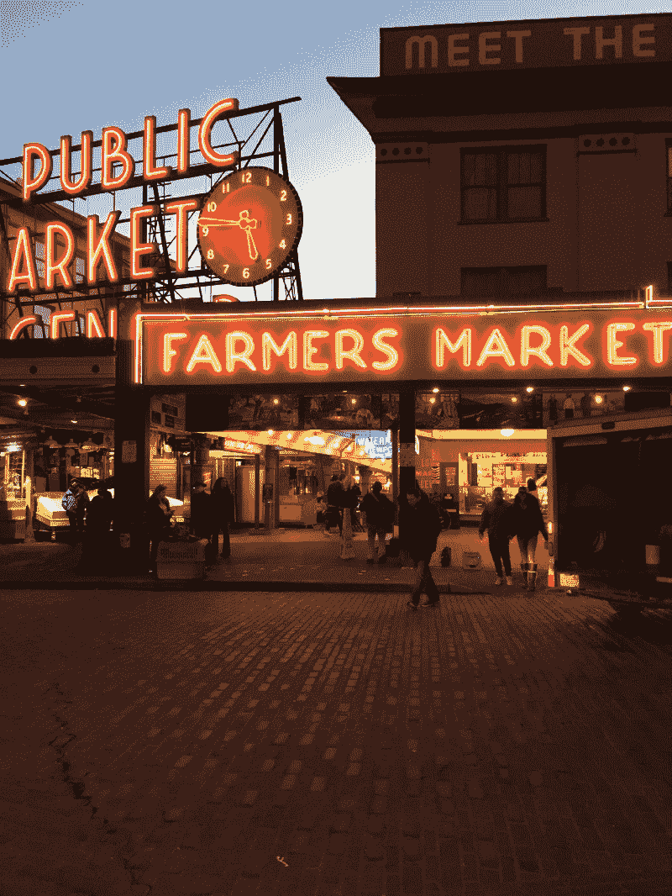

### 面试日

我早上 5 点起床，穿好衣服，准备我的演讲。我必须在上午 9:30 之前登记进入微软，但我希望在离开之前有足够的时间来展示。前一天晚上，我叫了客房服务(因为免费餐和 YOLO)，所以在早上 5:40 左右，早餐送到了我面前，在我吃完一顿高价的填饱饭后，我又练习了 3-5 次。

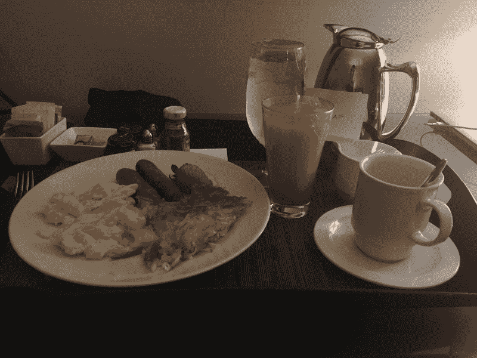

Overpriced meal but it was very filling and Microsoft provided

上午 8:30 左右，我订购了优步，然后前往微软园区。我很早就离开了，以防交通堵塞，当然，也确实是这样。当我越来越接近我的目的地时，我看到了建筑物。直到我走进校园，我才知道那些是微软的建筑，但是它们很大。司机在找正确的大楼时遇到了一点麻烦，因为有很多号码，但我最终还是到了。

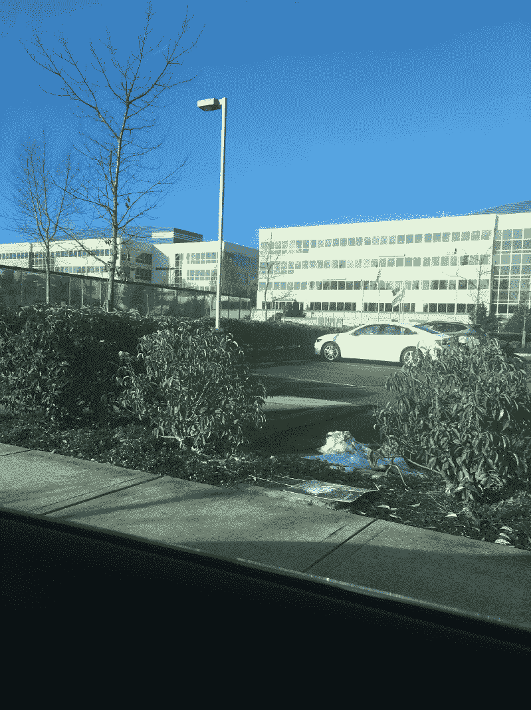

Each one of Microsoft’s buildings looked like it could be a building for ONE decently sized company

我走进我将接受采访的大楼，在接待处拿到了我的胸牌。当我准备进入其他面试者的区域时，我问接待员我是否可以带一支或两支笔作为纪念。拿了一些笔(后来我拿了很多哈哈)后，我去了会场，那里有其他和我年龄相仿或比我大的候选人在闲逛和交谈。这里为候选人提供了大量的咖啡、饮料和食物，还有一个可以玩 X-Box 和玩电脑的地方。这个空间是被采访者接受采访以及在采访之间休息 15 分钟的地方。

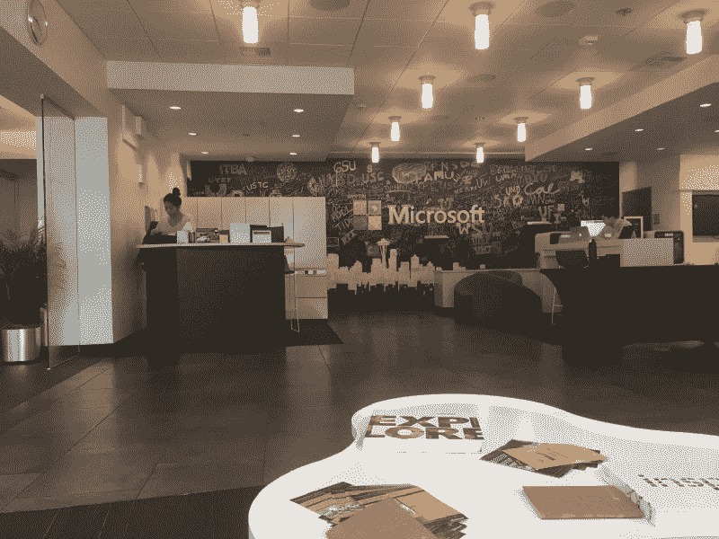

总的来说，我注意到有很多人申请全职 UX 设计师的职位，而我几乎找不到像我一样申请 UX 设计实习生职位的人。我遇到的一些人会是我在休息时间一起出去玩和聊天的人。上午 10 点之前，招聘人员会问候候选人，并向我们简要介绍当天剩下的时间会是什么样子。

#### 作品集展示

有一次是上午 10 点，我的面试官给我打电话，把我带到一个房间，在那里我将向她和另外两个来自不同团队的设计师展示我的作品。她告诉我演示是非正式的，并让我不要担心。在面试结束之前，还没有具体说明我将和哪个团队一起工作。我做了 30 分钟的演示，并为问答留出了大量时间。

> 展示你的设计作品是很重要的，这样面试官可以了解你每天是如何互动的，以及你解决问题的技巧。

他们希望看到不同工作和流程的广度和深度。确保支持你的决定，表明你能够从反馈中学习，我认为可能决定你的演示成败的最重要的事情之一是你是否理解支持你的设计风格的基本设计原则。

在演示结束时，面试官问了我一些关于我的项目的问题，比如澄清我是否发运了产品(我发运了)，并询问我对每个项目的贡献。他们还问了一些关于我的设计决策的问题，但没有问太多细节，只是问了一些关于我的技术技能和流程的一般性问题。总的来说，他们想知道结果，我为什么做某事的权衡，以及它如何有利于解决问题，而不是什么。

#### 午餐

在投资组合审查之后，我们离午餐还有一个小时，所以我和早上遇到的人聊天。面试之间的时间是与其他人交流的好机会，尤其是当大公司的候选人很多且竞争非常激烈的时候。我能够遇到超级有激情和才华的设计师。

> 设计行业很小，所以通过与你遇到的人联系，你很有可能会再次遇到他们

中午 12 点，一名招聘人员和一些员工来了，带我们去自助餐厅拿食物。自助餐厅很大。它就像一个购物中心，里面有太多的食物选择和其他商店。食物不是免费的，但是有补贴。我们收到了一张用来购买食物的饭卡，如果我们想要更多的食物，我们可以得到更多的饭卡。我和我的新朋友点了泰国菜，就大小和质量而言都相当不错！没有像其他人经历的那样与面试官共进午餐，相反，应聘者和一些员工一起吃饭。

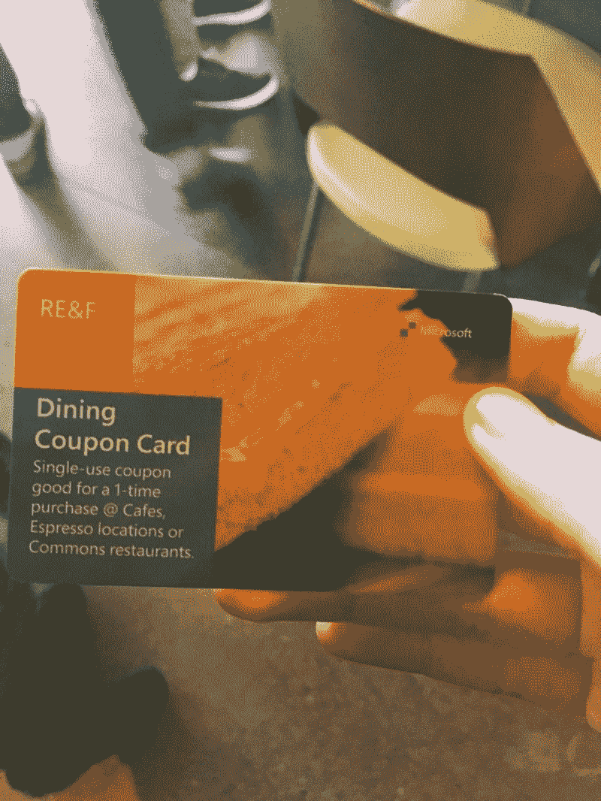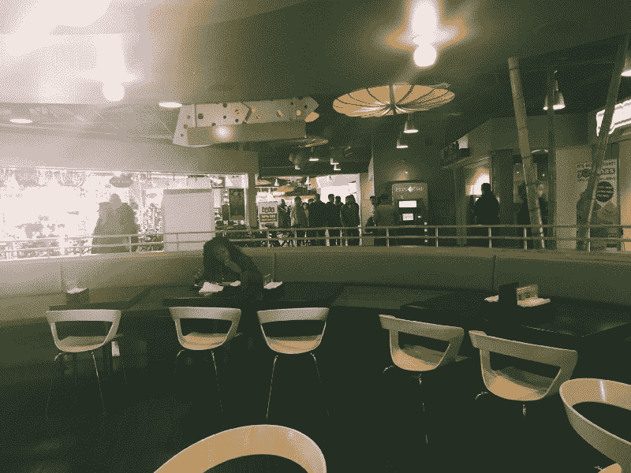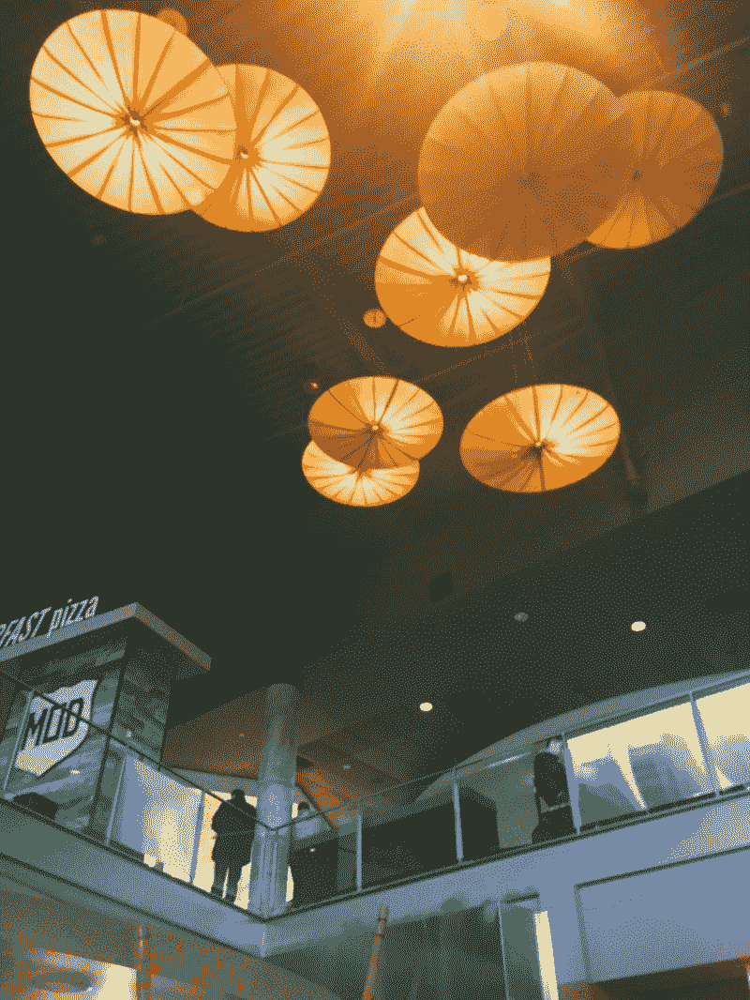

午饭后，我们回到面试大楼，一直等到我们的第一位面试官单独来接我们。

就结构和我收到的问题种类而言，每次面试都是不同的。因为这对面试官不公平，我不会透露具体的问题，因为这些问题是我的面试或现场面试的人特有的。

#### 第一次面试

在第一次面试中，我的面试官让我描述一个团队项目，以及我是如何参与其中的。我去我的网站向她展示了我的一件作品，在那里我向她描述了我作为团队领导者的角色以及这个过程的每个部分。我本可以描述我是如何为每一步做出具体贡献的，但我没有。面试的下一部分是白板挑战，我必须为一个应用程序设计一个改进的体验。从这里开始，我提出澄清性的问题以更好地理解问题，并大声谈论我的设计。

**我是这样框定流程的:**问题、用户、产品价值、人物角色(假设我有研究洞察力)、规划当前体验、寻找痛点和机会以及头脑风暴关键特性。**这个过程并不适用于每一个问题，但基于我得到的信息，我能够在给定的时间内集思广益，找到不同的解决方案。**

> 每个人都有不同的设计过程，这取决于你所处的环境，能够展示你分析问题的框架比解决问题更有益

练习结束后，面试官问“你有问题要问我吗？”我问了她一些关于她的角色以及对我的期望的问题。我想说这次采访在一个非常好的音符中结束，我们离开会议室回到等候室。

#### 第二次面试

第二次面试可能是我经历过的最“随意”的面试之一，但却是最具挑战性的。起初面试官问我是否有问题要问他，当我问完之后，最终给了我一个非常开放的问题，这个问题可以用来问其他问题。

除了一个开放式问题和与此相关的问题，面试官还要求我展示一个与我的设计陈述相关的项目，我为什么想在微软实习，以及它们如何与我的目标保持一致。我解释了我是如何希望能够与各种不同的设计师、来自不同背景的人以及导师一起工作。我还谈到了想要开发对许多人有影响的产品，并能够通过持续使用他们的产品来创造新的意义和用途。面试结束时，我向面试官提了一些问题，其中一些问题与我的角色或面试官的角色有点无关。

> 我是什么样的设计师？

我认为整个面试本来可以更好，因为我对公司做了更多的研究，阅读了更多关于设计的一般知识，最重要的是，想想*我是什么样的*设计师**。**我想解决什么问题？我的优势是什么？我仍然不太清楚自己具体想做什么，以及如何利用自己的优势为公司目前的工作做出贡献。此外，彻底思考给我的问题，并在回答之前问一些澄清性的问题，这也是今后要做的事情。

#### 第三次面试

第三位面试官关注的是我作为设计师的技能。有人问我的强项和弱项是什么，我使用的工具种类以及我的设计风格是什么。我提供了与我的风格相关的产品示例，以及它们为什么能成功地做到这些。然后我们讨论了设计权衡，面试官使用了我之前提到的设计特征的例子，并提出了一个特定设计特征的问题。我将提供解决问题的替代方案，并通过研究和应用程序的使用，用我记得的其他 UI 功能的例子来回答。

> 其他面试官和我都很想知道:你将来是想专注于更多的 UX 研究还是 UX 设计？

这个问题真的很重要，因为它表明了我有多么强调我的研究工作，以至于听起来好像我是在申请 UX 研究实习生的职位。这也让我意识到，我可能不清楚自己在 UX 的优势，以及我热衷于解决的问题。

在这个问题之后，我被问及我想从事什么产品，以及我是否有任何问题要问我的面试官。

> 不管和面试官的谈话有多好，你都处在一个非常专业的情况下，成败在此一举。

总的来说，我认为我在解释我的技术技能方面做得很好，但我肯定需要更多地看看工作描述，更好地突出我在 UX 方面的优势，以及如何通过我的设计工作传达出来。我犯了一个小错误，我觉得与面试官在一起太舒服了，结果问了一个与工作或微软完全无关的问题，还问了一个关于我如何不知道他们的一个产品的问题。

面试结束后，我被送到等候室，面试官告诉我，我将在未来一两周内收到一封电子邮件，告知结果。

### 面试后

我和我的新朋友去市区探索西雅图。我们遇到了我朋友的朋友，她带我们去了一家日本餐馆，并给了我们一份晚饭后可以去探索的地方的清单。

晚餐后，我们去吃冰淇淋，开车去星巴克，太空针塔，然后去了凯瑞公园，在那里我们看到了这座城市美丽的天际线。我们肯定是通过对设计的热情联系在一起的，我认为能够见到他们是面试经历中最棒的部分之一。

从那天起我们就一直保持联系，我相信我们很快就会见面。

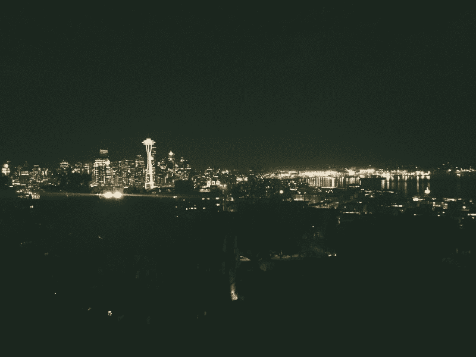

The beautiful skyline of Seattle; a perfect way to end the night!

### 我的目标是什么

我有一些小目标，我想与新朋友建立联系，从员工和文化的角度更好地了解微软，自信地展示，回答问题，了解整个面试过程。我可以说，我实现了所有这些目标，并且比我仅仅是为了这份工作时，我已经从这些目标中获得了更多的进步。

> 在你得到这份工作之前，永远不要去想你有多大把握得到它。

找工作和得到工作是一个竞争非常激烈的过程，所以即使你得到了一份工作，也不要想当然。我原本打算拒绝微软的所有其他邀请，但作为一名学生，只要你能得到实习机会，实习并不太重要，尽管我已经进入了这个过程，但我并不能保证我首先会得到这份工作。最后，从你面临的机会中学习比放弃一切去追逐一个机会更重要。

### 学习

#### **微软在西雅图的巨大影响力**

当优步/出租车司机问我在西雅图做什么，我说我有一个面试，他们立即认为这是微软。

#### **公司本身**

尽管微软正在改变他们的文化，但他们仍然觉得自己是一家公司。当我与我的面试官交谈时，我收到了来自多个招聘人员的电子邮件，我可以明确地感受到一种官僚主义的氛围，人们经常在梯子之间移动以做出决定，这可能是微软面试过程如此缓慢的原因。

#### **惊人的候选人数量**

因为微软是一个巨大的公司，它吸引了顶尖人才。我能够遇见那些做着令人惊奇的事情并且对设计有着强烈爱好的人。我很感激认识了我的新朋友，他们肯定是我寻求反馈或建议的人，因为他们有很多经验，并且不怕分享他们的建议。作为一个开放的、不断发展的社区的一员，在这里人们互相鼓励，这种感觉太棒了，我想成为一个人们可以寻求帮助或鼓励的人。如果没有人能够相互学习和成长，就没有必要在你的同龄人中制造竞争。作为一名设计师，这不全是关于你自己，而是你周围的社区和与他人建立关系的能力。

#### **准备工作任重道远**

我在面试前几周就做了准备，这真的帮助我在面试中保持冷静和沉着，并通过我的工作更好地了解了作为一名设计师我是谁以及如何表达这一点。

#### 西雅图的交通很糟糕

旅途中我不太喜欢的一件事是交通。很难准时到达任何地方，除非你做了相应的计划，在我旅行的第一天后，我学会了这样做。

### 外卖食品

总的来说，我在面试过程中学到了很多，与员工和朋友建立了新的联系，并为我的职业生涯开辟了新的机会。最后，对我来说最重要的是在过程中享受乐趣，享受我的旅行。

### 最后的想法

实现你的梦想或目标是一个过程。它并不总是马上发生，但最终如果你下定决心，加上决心、努力工作和运气，你会以某种方式到达那里。你现在可能到不了那里。

我在微软的经历是一个学习的机会，主要目标是享受乐趣，保持开放的学习态度，并保持好奇心。即使我没有得到这份工作，我仍然有很多需要改进的地方，而不是满足于现状。我真的很感谢微软给我机会发现我的潜力和挑战自己，以及能够在一家我非常钦佩并希望在未来为之工作的公司面试。

#### *如果你对设计有任何疑问，请在 **[LinkedIn](https://www.linkedin.com/in/tiffany-w-eaton-551584a0/)** 上给我发消息，我会写下来的！*

#### 为了帮助你开始拥有自己的设计生涯，这里有一些来自 [Rookieup](https://transactions.sendowl.com/stores/8000/107314) 的惊人工具，我曾经在这个网站上得到资深设计师的指导:

*   [**在经验丰富的设计师**](https://transactions.sendowl.com/stores/8221/107314) 的帮助下打造作品集
*   **强化和建立你的投资组合的必备工具**
*   **成为自由职业者 ，掌控你的时间和职业**
*   **[**获得惊人设计工作的小技巧**](https://transactions.sendowl.com/stores/8222/107314)**

#### **链接到其他一些很酷的读物:**

*   **[**《品牌感知评论》(优步对现实)**](https://medium.com/startup-grind/uber-vs-reality-db290f6f3c5#.14xmw6b54)**
*   **[**如何把拒绝变成成功(所以你没有得到你梦想的工作)**](https://medium.com/@twazzle/so-you-didnt-get-your-dream-job-now-what-9ecba6ac26b9)**