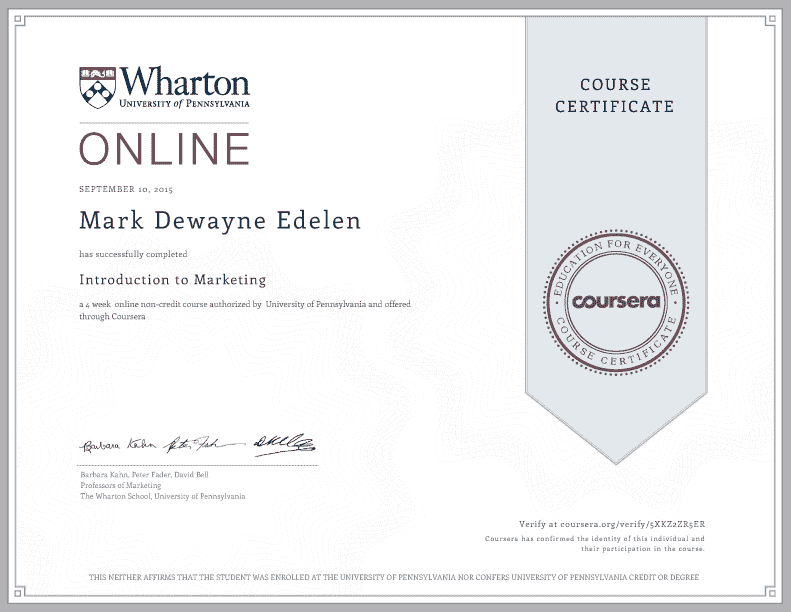
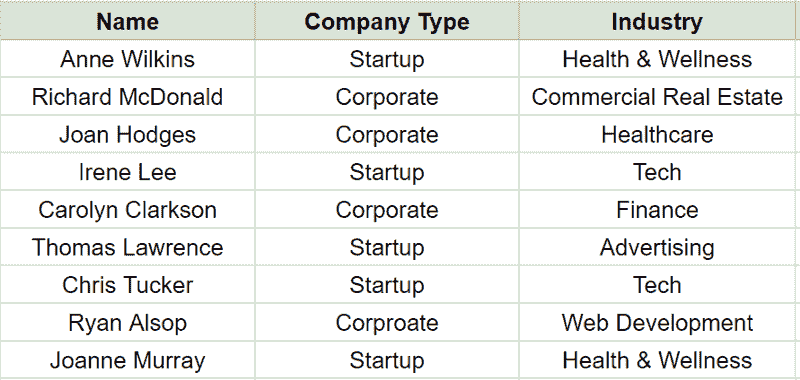
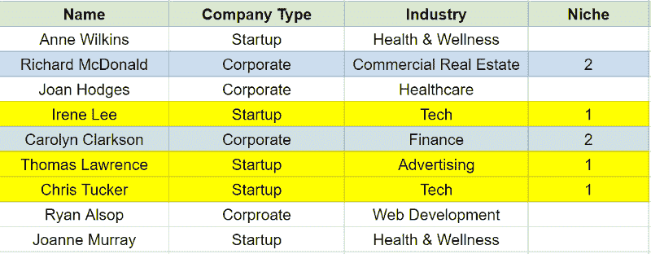
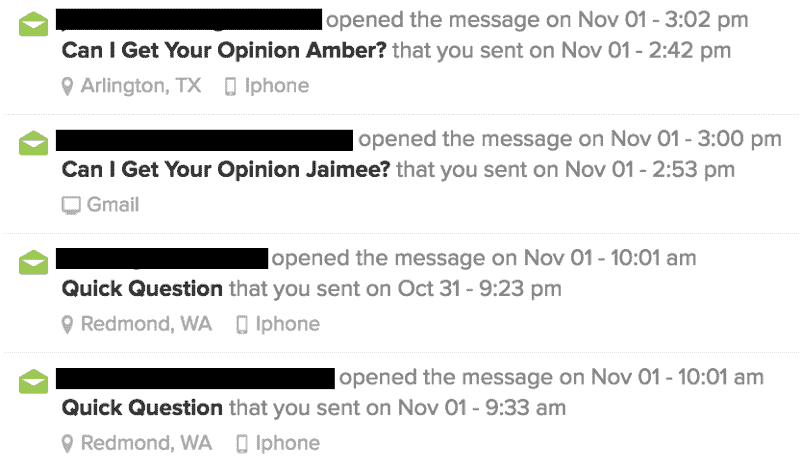
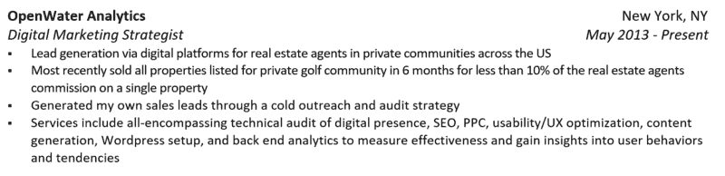

# 如何在没有“经验”的情况下在一个不同的领域开始职业生涯——让我得到工作机会的建议…

> 原文：<https://www.freecodecamp.org/news/how-you-start-a-career-in-a-different-field-without-experience-tips-that-got-me-job-offers-from-7425f590f3eb/>

上周，我谈到了如何通过公司内部的人引荐，在没有人脉的科技行业获得一份 6 位数的工作。

这篇文章出现在很多人面前，他们有很多问题。最常见的问题集中在一件事上:体验。

许多人发现他们目前的职业没有达到他们的期望。他们想改变道路，但他们没有任何其他领域的经验，也不知道从哪里开始。

在这篇文章中，我将向你展示如何快速获得任何领域的经验，以及如何利用新的经验在该领域获得工作机会。

我个人使用这种策略从医疗领域——我在医院手术室工作——过渡到科技行业，在那里我收到了谷歌和其他科技公司的邀请(以及 200%的加薪)。

### 转换领域时不需要的东西的神话

在我们深入探讨之前，我认为有必要澄清几个关于行业变化的“神话”:

*   你不需要广泛的人际网络。事实上，您根本不需要任何联系人—您可以自己创建所有联系人。
*   你不需要你想转行的领域的学位。感知就是现实，当涉及到感知时，结果就很有说服力。它们比任何学位或以前的职位都有价值。稍后会详细介绍。
*   你不需要钱。你需要知道的一切都可以免费学到。事实上，我将向你展示这个过程是如何帮助你产生第二份收入的。

*Courtesy of [StareCat.com](http://StareCat.com)*

接下来，我将概述我在一个完全不同的行业找到工作的具体步骤，这样你就可以自己找到工作。

### 第一部分:描绘一幅完美候选人的图画

进入一个完全不同的领域的好消息是，你是一张空白的画布。你可以选择你的技能，把自己塑造成完美的候选人。

#### 完美是什么样子的？

为了成为理想的候选人，我们必须首先了解在将要雇佣你的人眼中“理想”是什么样的。有两种方法可以实现这一点:

#### 工作说明

职位描述本质上是简历的反过来。他们详细说明了你在那个特定的角色中取得成功所需要的技能。这听起来显而易见，但我们将从一个非典型的角度来看待这个问题。

让我们来看看我从脸书的网站上获得的这个*增长型营销分析师*的角色:

> ***职责***

> *-利用数据深入了解我们的产品，识别机会领域，并执行项目来推动脸书用户的增长和参与。*

> *-推动关注新用户增长、移动使用和收入的项目——与设计、产品、工程和数据团队密切合作。*

> 从事脸书的核心产品，如新闻订阅、通知和手机，以及场外营销渠道，如 SEO、SEM 和电子邮件。

> *-使用 Hadoop/Hive、Oracle、ETL、R、PHP、Python、Excel、MicroStrategy 等工具以及许多其他内部工具，大规模高效工作。*

> ***最低学历***

> 工程、计算机科学、数学、物理、统计学学士或硕士学位。

> 1 年以上 SQL 经验。

> 2 年以上定量或统计分析经验。

> 1 年以上的项目管理经验。

> 1 年以上的营销、广告或成长经验。

> *-处理和分析数据集，并解释它们以做出商业决策的能力。*

> *-管理项目或产品的沟通技巧和能力。*

> ***首选资格***

> *-软件开发经验。*

> *-互联网营销经验。*

你在这里看到了什么？理想的候选人是什么样的？他们需要什么才能被雇佣？

我猜你在想，“好吧，他们需要计算机或数学学位。然后，他们需要至少两年在一家公司编码和管理项目的经验。”

嗯，这是我看到的:

脸书正在寻找懂得如何识别大数据中对收入有直接影响的趋势/模式的人。这个人也有足够的编程知识来有效地做出这些发现，并以简单、简洁的方式呈现出来。

许多人的主要问题是，他们认为获得“经验”的唯一途径是在公司工作或拥有高级学位。这是求职过程中最大的误区之一。

为了理解它，让我们退一步想想公司为什么要招聘。

他们希望有人能加入进来，并对他们的底线产生巨大的积极影响。

有人可能拥有计算机科学博士学位，并能流利使用上述所有编程语言，但如果他们缺乏清晰传达结果的能力，公司就不会受益。

另一方面，一个可能没有学位或完全流利，但知道如何找到有影响力的见解，并以简洁、可行的方式呈现出来的人是非常有价值的。

你的目标是成为第二个人。

#### 信息访谈

除了梳理职位描述，与从事该行业的人接触也同样重要。

他们将能够帮助你优先考虑你在这些工作申请中发现的技能，并给你一些无形的内部信息(招聘过程的细微差别，让你接触他们的联系人，等等。).

我发现实现这一点的最佳方式是利用 LinkedIn 的高级搜索过滤器。

你可以搜索特定公司有特定头衔的人。如果你有 LinkedIn Premium，你甚至可以搜索曾经在你的行业工作，现在在你的目标行业工作的人——或者甚至在你的目标公司工作的人。

然后，您可以使用此电子邮件脚本进行联系:

**主题:**快速提问

*你好【姓名】，*

我叫奥斯汀，目前在 Cultivated Culture 工作。我在 LinkedIn 上浏览，看到了你的信息——我希望你不介意我突然联系你。

我知道你在脸书的垂直增长分析领域拥有丰富的经验，我很想了解更多关于这个领域的信息。我很乐意有机会回答您的一些问题，以及利用您对行业的了解提出的任何建议。

我知道你的时间非常宝贵，所以请不要觉得需要深入回答。如果你有 5 分钟时间聊天，我会非常感激。

*最佳，*

*奥斯汀*

当他们同意会面时，你需要准备一些问题。他们应该关注:

*   确定哪些技能对完成日常活动最重要(这将让你分清主次)
*   提供一些背景资料，说明这个人是如何达到现在的位置的(你会惊讶于有多少人来自其他行业)
*   如果他们处在你的位置，他们会怎么做——试图在几乎没有或根本没有这方面经验的情况下得到这份工作

以下是问题形式的要点，可以帮助你开始:

1.  我做了一些研究，似乎*【技能 1】—【技能 3】*在这个领域很常见。你认为哪一个对成功最重要？
2.  我在翻看你的 LinkedIn，看到你来自*【之前的角色/公司】*。你最初是如何涉足这个行业的，又是如何在*【目前的角色】*结束的？
3.  假设你处在我的位置——你是这个行业的新手，没有太多的经验。你会如何获得目前的工作？你会采取什么具体步骤？

#### 将这一切结合在一起

现在你已经了解了你需要的技能，它们的优先级，以及曾经担任过你想要的角色的人提供的路线图。

接下来，你需要用这些技能建立一个基础，并使用它们来产生与公司对该角色的目标直接一致的结果。

### 第 2 部分:钉牢基础(便宜的)

在接下来的一两个月里，我们将专注于建立对你上面确定的技能所需的基础知识的坚实理解。

目前，最好的方法是通过阅读书籍、参加课程和创建一个沙盒来测试你的知识。

#### 向上阅读(免费)

书籍是理解某一特定主题的基本概念的绝佳途径。它们也很容易免费获得。

还记得你小时候父母想让你去的那个公共图书馆吗？其实还在！很神奇，对吧？

对你来说，好消息是甚至公共图书馆也赶上了时代，现在都有电子书了。你可以像任何其他书籍一样免费借阅，但它们将直接发送到你的手机上，这样你就可以随时随地阅读它们。你所需要做的就是安装 Kindle 应用程序(你可以在 [iOS](https://itunes.apple.com/us/app/kindle-read-books-ebooks-magazines/id302584613?mt=8) 和 [Android](https://play.google.com/store/apps/details?id=com.amazon.kindle&hl=en&gl=us) 上免费获得)。

为了找出该读哪些书，我会用谷歌搜索“关于[主题]的最佳书籍”，或者去问 Quora 上的一些人。

#### 参加课程(免费)

虽然书籍能让你对你的主题有 30，000 英尺的视野，但课程会帮助你弄清楚事情的本质。它们是学习实际技能的更好方法，因为它们往往是交互式的，并且定期更新。

对我们来说，Coursera 是最好的资源之一。Coursera 汇集了美国最好的学校里最好的教授的课程(我说的是普林斯顿、斯坦福、哈佛——他们不会乱来)。

这些课程棒极了，因为它们的结构就像你在大学里会上的一门真正的课程。他们有视频，但他们也有测试，项目和学生可以合作的论坛。这是关键，因为它有助于使课程“有粘性”,因为你致力于以上所有内容，而不仅仅是看几个视频。

最重要的是，在课程结束时，你可以收到一份证书，表明你通过了课程。上面甚至会有那所大学的印章！它确实要花 49 美元左右，但是非常值得，因为你可以把它写在你的简历上:

*Oh this? Just some cred from a top 10 biz school (Courtesy of Coursera)*

#### 订阅行业博客和时事通讯

接下来，你会想要注册一些时事通讯。

博客通过拥有最高质量、最新的信息并尽可能快地传播出去而保持其商业地位。这是最简单的方法，让你在掌握行业最新动态的同时，也能学到大量的知识。

你可以用和找书一样的方法找到它们——谷歌和 Quora。

此外，尝试找到一个利基博客，因为他们往往有你的主题非常详细的信息。以下是一些例子:

**SEO:**[SEO 十章入门](https://moz.com/beginners-guide-to-seo)

**内容营销:** [内容营销高级指南](https://www.quicksprout.com/the-advanced-guide-to-content-marketing/)

**脸书广告:** [用脸书广告赚钱的终极指南](http://rich20something.com/blog/the-ultimate-guide-to-making-money-with-facebook-ads/)

#### 免费资源(如果适用)

许多行业和领域都有大量免费资源来帮助你学习。例如，如果你是一个分析人员，谷歌分析是完全免费的。此外，谷歌在平台上免费提供整个课程。

如果你的计划是打入开发领域，你已经在正确的地方。免费代码营是众多帮助你免费学习编程基础的资源之一。

一定要对你的行业进行彻底的搜索。免费培训资源很有可能存在。

#### 额外的专业提示:谷歌提醒

Google Alerts 是一个很棒的方法，可以节省你花在搜索特定主题或公司的文章上的时间。

你可以为他们设置任何你可以在谷歌上搜索到的东西，但可能要坚持突出点，如特定行业、特定技能、你想为之工作的公司和碧昂斯。

然后，每天，谷歌都会在网上搜索，找到与你的特定主题最相关的(也是最有价值的)文章，并将它们直接发送到你的收件箱。

你可以在这里注册谷歌快讯。

### 第 3 部分:获得报酬磨练你的技能

是的，你没看错。我们将学习如何让人付钱给你，让你学习改变行业所需的技能。

#### 建立可信度和真实结果

既然你已经理解了这些技能的基础，是时候真正地发展它们了。

我发现真正学到东西的最好方法是去做。我想不出比卖你的技能换些冰冷的现金更好的“做”的方式了。

### 通过自由职业快速发展你的技能

虽然这看起来是一项令人畏惧的任务，但是即使你之前没有“经验”，开始从事自由职业也是相当容易的。

正如蒂姆·费里斯所说，专家的定义是比与他们打交道的人懂得更多。

当你开始寻找客户时，有两种方法——自由职业者聚合网站和传统的冷接触:

#### **Upwork(一个自由职业者聚合器)**

Upwork 是一个社区，企业主可以在这里找到自由职业者来做所有的事情。

Upwork 的美妙之处在于，它让你无需投入大量时间来推销自己。这是一个入站网站，意味着你的服务会展现给那些已经在寻找特定服务的人，使他们更有可能雇佣你。对于那些不习惯传统销售流程的人来说，这可能也很有吸引力。

代价是，虽然你节省了时间，但 Upwork 为你节省的时间收取了高额费用。对我们来说，这并不可怕，因为你主要是为了学习，而金钱只是锦上添花。

如果你自己管理销售过程有困难，或者如果你刚刚起步，需要积累一些成功的故事，我建议你使用 Upwork。

如果你真的想扩大你的初始接触范围，看看 Hubstaff 的全面升级替代方案概要，让自己在多个平台上工作。

#### **冷外联**

第二个选择，也是我推荐的方法，是自己处理销售过程。这样你就可以保留 100%的收入，去掉中间商。

这在一开始可能会有点困难，因为这些企业可能不会主动寻找你的服务，如果你没有太多的销售经验，学习曲线可能会很陡。

在本节中，我们将介绍我用来获得首批客户的步骤，建立成功案例，然后利用这些结果来扩大我的投资组合(并增加我的收入)。

### 定义你的定位

Courtesy of Partner’s Title Co.

我们自由职业旅程的第一步是定义我们的目标客户。大多数文章告诉你，当你开始创业时，你的利基市场应该是激光聚焦的，就像 47-54 岁患有背痛的男性高尔夫球手一样。

虽然我同意它应该有针对性，但在你与一个客户合作之前，期望你了解你的目标受众的细节是不合理的。

你将开始在你的理想利基上磨练，但现在我们将使用以下过程来确定我们的目标受众(实际上，我们将选择 3)。

#### 定义您的初始目标客户

首先列出你认识的 50 个人的名单。它可以包括所有人，从你最好朋友的父母到你去年在一次会议上认识的 LinkedIn 上的一个关系。他们需要满足的唯一标准是，你必须对接触那个人感到舒服。

将这些人以及他们的公司类型和行业添加到我为您创建的电子表格中(暂时忽略电子邮件列，我们稍后再讨论):

既然有了我们的人，那我们就来看看他们的公司类型和行业。哪些行业和公司类型最符合你的知识和技能？

如果我们拿我的清单来看，我知道我的营销技能可以让一家科技公司受益，但它们也可以让一家寻求建立受众的健康和保健初创公司受益。此外，要知道当你第一次创业时，向创业公司推销要比向公司推销容易得多。考虑到这一点，我的理想组合是:

**公司类型:**创业

**行业:**广告、科技、网络开发&健康/保健

现在我们有了一个“利基”，但我的名单上只有 10 个人。我想让你试着找到三个不同的领域，在那里你可以运用一项或多项技能。然后，我希望你给每个利基分配一个数字，并给你的电子表格贴上标签(如果有帮助，你也可以突出显示):

厉害！你刚刚定义了你可以销售的 3 个领域，你有了第一批潜在客户。

***关键要点:*** *在预订客户之前，不要忙于寻找一个超级特定的利基市场。保持广阔的视野，接受一些最初的客户，随着时间的推移，你的领域会变窄。*

### 创造时间&保持一致

我花了很多时间阅读关于成功的书籍。我也花了很多时间建立业务，希望能实现它。在筛选了成千上万的页面和教训后，我发现有一件事对我是否成功影响最大:

***一致性***

不管你感觉如何，不管你的工作有多疯狂，也不管有多少朋友告诉你去快乐时光，每天都有能力做一些事情，这是创业成功与失败的区别。

为了保持一致，你必须创造时间。你知道时间不会被打断。对我来说，这意味着早上 5:30 醒来。对你来说，早也许管用，或者晚也许是你的事。无论你做什么，确保它是适合你的。你不想让自己觉得必须要拖着自己去做这件事，否则永远不会成功。

#### 把它放在你的日历上

首先打开你的谷歌日历，找到一个 1.5 小时的时间段，每周至少 5 天(是的，包括周末)。

创建一个事件，并设置 1 小时前和 15 分钟前的提醒。在日历上将该时间标记为“忙碌”:

### 让自己负起责任

现在它是真的了——纸上的墨水。然而，你的日历邀请不会让你在出门太累的第二天起床，也不会帮你拒绝去看 Kanye 的免费音乐会门票。如果我们真的想坚持下去，我们需要一些外界的帮助。

我个人推荐 [StickK](http://www.stickk.com/) 因为我是一个好胜的人，不喜欢输。StickK 基本上是让你自己赌自己会创业。

你写下一美元的金额(我推荐 100 美元)，然后设定一个目标。然后你会被指派一个“裁判”让你承担责任。如果你完成了你的目标，你可以拿回你的 100 美元。如果你没有，这些钱会捐给你选择的慈善机构。

我个人可以告诉你，从我钱包里掏出 100 美元的想法帮我度过了许多宿醉。

### **获得你的第一个客户**

既然我们已经确定了我们的服务和我们的定位，是时候获得一些付费客户了。

由于我们没有太多的投资组合，我们打算从我们有个人关系的潜在客户开始。然后，我们将利用您现有的经验来达成交易。

让我们回到我们的电子表格，浏览一下我们在每一个位置突出显示的名字列表。我希望你继续下去，按照这些人帮助你的可能性的顺序排列他们。然后我们将从上到下接触每一个人。

#### 查找电子邮件

如果你还没有他们的电子邮件，你可以通过使用 [VoilaNorbert](http://voilanorbert.com/) 或【FindAnyEmail.net】T2 轻松找到。一旦你有了它，就把它插入到你的电子表格中以备将来参考。

#### 伸手

现在，我们将联系我们的联系人，询问他们是否可以帮助我们安排一次会面。以下是您可以使用的确切电子邮件模板:

**主题:**快速提问

*嗨[ **姓名]** ，*

希望你一切都好！我想让你了解一下我正在创办的一家名为**【公司名称】**的企业。它旨在帮助公司**【插入价值主张】**。

*最近，我们能够**【插入成功案例】**。我对**【潜在客户的公司】**做了一个快速审计，我有一些想法想和你分享。你能帮我联系正确的人吗？不管怎样，我都想尽快赶上来！*

*最佳，*

***【你的名字】***

你只需要填写他们的名字，你的技能，然后点击发送。

我也强烈推荐使用电子邮件跟踪器，比如免费的 Hubspot 或 T2 的 Yesware。这些将让你看到你的潜在客户是否阅读你的信息，并帮助你决定是否跟进。

如果他们打开你的邮箱一次，线索就断了。但是，如果他们在多天内多次打开它，请在 4 到 5 个工作日之后继续跟进。在最终得到促成交易的回复之前，我个人已经跟进了 8-10 次。

#### 为会议做准备

一旦会议确定下来，我们想提出一个令人信服的理由来说明为什么这家公司需要你的服务。最好的方法是使用我喜欢称之为*的审计技术*。

这非常简单有效:

*   仔细检查我们潜在客户的当前设置(网站、社交媒体、内容、文案、健康——任何适合您的服务)
*   尽可能多地发现问题/改进
*   确定解决这些问题的可衡量的影响
*   分享解决 2-3 个问题的具体策略，然后展示解决所有问题的潜在结果
*   告诉他们，不管他们是否雇佣你，他们都可以保留审计报告

嘣！简单。

#### 完成交易

一开始，大多数潜在客户不会主动找你。这意味着你必须让他们相信你的服务值得他们花费时间和金钱。最好的方法是通过以下框架:

***1。*地址**

我们将从解决您在他们网站上发现的问题开始会议。不要太挑剔。这里的目标是让他们对自己的业务感觉良好，同时也让他们知道还有很多未开发的潜力。

将您的审计报告交给他们，并带他们浏览每个问题。解释发生了什么，为什么会损害他们的业务，以及解决方案是什么。

***2。*说明潜在的**

一旦你解释了这些问题，你就会想弄清楚潜在客户错过了什么。这越可以量化越好。例如:

*   你在网站上的行动号召不够有力。你的转化率大概比应该的低了 5%。如果你的网站每月有 30，000 名访客，那就有 1，500 人我们没有抓住！
*   像你这样的 Instagram 账户通常每天会有 100 到 300 个关注者，但你只能获得 20 到 30 个。如果你执行我在这里提出的策略，你应该在几天内看到立竿见影的效果。这可能意味着每月增加 2400 名粉丝！

向他们展示这如何影响他们的底线。向他们介绍数学:

> **你:**从你的邮件列表来看，你典型的销售转化率是多少？

> 前景:嗯，3%左右

> **你:**哇，真不错！你从每笔销售中获得多少利润？

> 潜在客户:通常我们每笔销售净赚约 150 美元。

> **你:**牛逼。根据我的审计，我发现由于糟糕的文案和 CTA 位置，我们错过了获取网站额外 3-5%的流量。我四处打听了一下，发现您的网站每月有大约 30，000 名访客，这意味着我们每月可以额外吸引 1，500 名访客。根据你刚才给我的数字，每月 6750 美元！

如果你每月收费 2，000 美元，这对你的潜在客户来说是显而易见的。任何企业主都会支付 2000 美元，如果他们知道这将带来 4750 美元的增量利润，而你今年刚刚赚了 24k 美元！

#### 向他们询问销售情况

既然您已经证明了其价值，请他们销售:

*   告诉他们无论如何都要保留审计报告
*   重申他们必须获得的潜在机会
*   概述下一步雇佣你的步骤
*   问他们是否想继续前进

他们很可能需要一些时间来考虑。完全不用担心——在日历上写下便条，72 小时后再跟进。

你刚预约了你的第一个客户！

现在，我要你冲洗并重复这个过程，为你的电子表格上的每个人。如果你能迈出第一步，你可以期待大约 5%-10%的成交率。

#### **安慰:免费提供服务**

因为我们主要是为了学习，如果上面的过程最初没有成功，这是一个很好的选择。

我发现，当我有成功的故事可以讲述时，找到客户就容易多了。在你全力投入资金之前，想办法得到一些结果是很重要的。

你可以联系商家，同上，免费提供服务。这消除了公司的所有风险，使他们更有可能同意，同时允许你直接学习并创造现实世界的结果。

请记住，我们从事这项工作是为了找到一份我们热爱的工作，并得到我们应得的报酬。这比几份有偿自由职业合同有价值得多。如果自由职业变成了收入来源，那就是锦上添花。

### 利用你的成果获得新工作

这就是你想要的——一个循序渐进的计划，为你积累加入不同行业所需的经验。现在是时候走出去，迈出你的第一步了。

首先，编辑简历。

#### 在你的简历中加入你的经历

一旦你有了一些具体的成果，你会想把它们直接放在简历的顶部。

这将是你的潜在雇主看到的第一样东西，它有助于消除对你资格的任何怀疑。

回到文章的开头，我们看了一下公司为什么要招聘。X 年的资历不过是公司随便定的一个数字，让他们觉得是在雇佣一个能做这份工作的人。

加入你的自由职业经历不仅表明你能胜任这份工作，还表明你对如何经营企业有所了解。这种知识对雇主来说非常有价值，尤其是对技术人员来说，因为技术人员通常视野狭窄，很难看到他们的工作与赚钱的大局有什么联系。

下面是我简历上的咨询经历截图:

#### **确定目标公司的影响者**

既然你已经有了相关的经验，你应该开始和有影响力的人联系，他们可以帮你找到理想的工作。

在我的文章《如何在没有关系的情况下获得一份 6 位数的技术工作》中，我概述了确切的过程，所以当你准备好的时候，一定要检查一下。

### 想要更多关于找到理想工作的建议吗？

点击这里注册我的免费时事通讯，开始从 0-100 开始你的职业生涯。

更多类似的职业建议，请查看我的博客[cultured Culture。](https://cultivatedculture.com)