# 让我们构建一个具有角度、持久性和安全性的无服务器 REST API

> 原文：<https://www.freecodecamp.org/news/serverless-rest-api-with-angular-persistence-and-security-ff274f04e3d0/>

布鲁诺·克雷布斯

# 让我们构建一个具有角度、持久性和安全性的无服务器 REST API

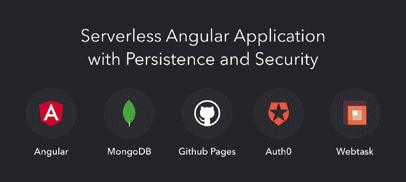

在这篇文章中，我将向你展示如何用静态文件托管、安全的 REST API 和健壮的持久层快速构建一个**无服务器全栈**应用。

以下是我们管理所有移动部件的方式:

*   **由 [Auth0](https://auth0.com/?utm_source=freecodecamp&utm_medium=gp&utm_campaign=serverless_angular_app) 和 JSON Web Tokens (JWT)支持的身份管理和安全性**
*   **无服务器 REST API** 由 [Express](https://expressjs.com/) app 提供 [Webtask](https://webtask.io/)
*   **持久层**带有由 [mLab](https://mlab.com/) 托管的 [MongoDB 数据库](https://www.mongodb.com/)
*   **静态文件托管**通过部署到 [GitHub 页面](https://pages.github.com/)

由于这个应用程序在功能方面非常简单，所以没有必要在您的本地环境中运行 MongoDB。我们将在开发和生产过程中使用 mLab。您需要安装的唯一工具是 [NodeJS 和 NPM](https://docs.npmjs.com/getting-started/installing-node) 。

我们的应用程序将具有以下特性:

*   登录和注销
*   显示用户任务的列表
*   允许用户添加新任务的表单
*   每个任务一个按钮，使用户能够删除这些任务

### 创建新的角度应用程序

我们将使用 [Angular CLI](https://github.com/angular/angular-cli) 创建新的 Angular 应用程序。实际上，我们将在整个过程中使用这个工具来创建组件/服务，并为生产构建我们的应用程序。

以下是我们安装 Angular CLI 和创建应用程序框架时必须发出的一些命令:

```
# install Angular CLI globally
npm install -g @angular/cli

# create skeleton
ng new task-list && cd task-list

# serve the skeleton on our dev env
ng serve
```

最后一个命令负责用开发概要文件打包我们的应用程序，并用 [Webpack 开发服务器](https://webpack.github.io/docs/webpack-dev-server.html)在本地为它提供服务。执行完所有这些命令后，导航到`http://localhost:4200/`查看它的启动和运行。

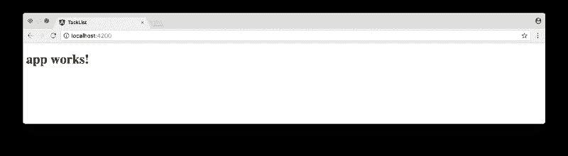

### 使用 Auth0 保护角度

在我们的应用程序中，我们首先要考虑的是安全性。在任何处理敏感的第三方数据的应用程序中，如我们即将开发的任务列表，安全性必须是第一位的。

首先，[注册一个免费的 Auth0 账户](https://auth0.com/?utm_source=freecodecamp&utm_medium=gp&utm_campaign=serverless_angular_app)，并记下`Client ID`和`Domain`。这两个值都将用于配置[锁](https://auth0.com/docs/libraries/lock):一个可嵌入的登录系统。

**重要** : Auth0 需要一个*允许的回调 URL 列表*。该列表包含 Auth0 在发出 JWT 后可以将用户重定向到的所有 URL。因此，我们必须配置至少两个 URL:`http://localhost:4200/`和我们的应用程序将被公开的 URL，类似于:`https://brunokrebs.github.io/task-list/`。这个 URL 将在我们发布到 GitHub 页面时定义。

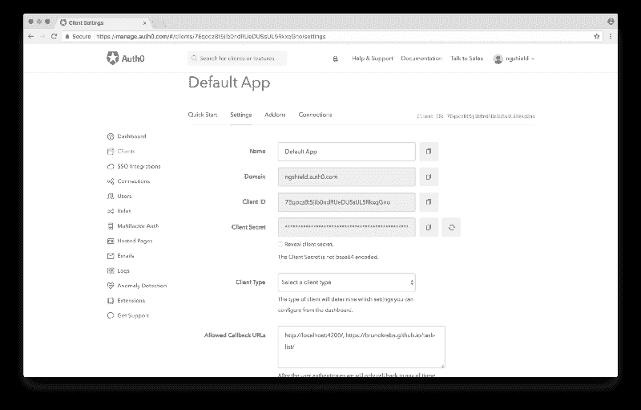

要使用 Lock，我们必须在应用程序中安装两个库:`auth0-lock`和`angular2-jwt`。由于我们将 TypeScript 与 Angular 一起使用，我们还将安装`@types/auth0-lock`库，它为 Lock 提供了 TypeScript 定义。此外，因为我们想为我们的用户提供一个好看的界面，我们将安装[角状材料](https://github.com/angular/material2)。这些依赖项是使用以下命令安装的:

```
# Auth0 Lock and Angular 2 JWT runtime deps
npm install --save auth0-lock angular2-jwt @angular/material

# Types definitions for Auth0 Lock
npm install --save-dev @types/auth0-lock
```

让我们使用 Angular CLI 创建一个`NavBarComponent`。该组件将有*签到*和*签出*按钮。我们还将创建一个负责`sign in`、`sign out`并验证用户是否是`authenticated`的`AuthService`。

```
# generates NavBarComponent files under src/app/nav-bar
ng g component nav-bar

# generates AuthService under src/app/auth.service.ts
ng g service auth
```

执行这些命令后，Angular CLI 将创建以下文件结构:

```
src
  |-app
    |-nav-bar
      |-nav-bar.component.ts
      |-nav-bar.component.html
      |-nav-bar.component.css
    |-auth.service.ts
```

> *实际上创建了两个额外的文件:`src/app/auth.service.spec.ts`和`src/app/nav-bar/nav-bar.component.spec.ts`。我们将使用这些文件为组件和服务编写测试。然而，为了简单起见，我们不会在这篇文章中讨论测试。您可以查看以下参考资料，了解 Angular 中的测试: [Angular 2 深度测试:服务](https://auth0.com/blog/angular-2-testing-in-depth-services/)；[角度测试](https://angular.io/docs/ts/latest/guide/testing.html)；[用茉莉](https://semaphoreci.com/community/tutorials/testing-components-in-angular-2-with-jasmine)* 测试角度 2 中的元件

为了与 Lock 集成，我们先用下面的代码实现`src/app/auth.service.ts`:

```
import { Injectable } from '@angular/core';
import Auth0Lock from 'auth0-lock';
import { tokenNotExpired } from 'angular2-jwt';

// FIXME: replace these with your own Auth0 'Client ID' and 'Domain'
const AUTH0_CLIENT_ID = 'YOUR_AUTH0_CLIENT_ID';
const AUTH0_DOMAIN = 'YOUR_AUTH0_DOMAIN';

// this is the key to the JWT in the browser localStorage
const ID_TOKEN = 'id_token';

@Injectable()
export class AuthService {
  lock = new Auth0Lock(AUTH0_CLIENT_ID, AUTH0_DOMAIN, {});

  constructor() {
    // listening to 'authenticated' events
    this.lock.on('authenticated', (authResult) => {
      localStorage.setItem(ID_TOKEN, authResult.idToken);
    });
  }

  signIn() { this.lock.show(); }

  signOut() { localStorage.removeItem(ID_TOKEN); }

  authenticated() { return tokenNotExpired(); }
}
```

auth-service.ts

在上面的代码中，有三件事值得一提。首先，我们必须用之前记录的值替换`AUTH0_CLIENT_ID`和`AUTH0_DOMAIN`。第二，`ID_TOKEN`引用了 JWT 将被保存的关键字(在用户的浏览器`localStorage`上)。第三，这个服务的构造函数为 Lock 上的`authenticated`事件添加了一个回调监听器。这个回调保存 Auth0 在`localStorage`发出的令牌。要注销用户，只需从`localStorage`中删除这个令牌。

我们的`AuthService`类已经准备好了，但是与`components`不同，Angular CLI 在默认情况下不会将`services`添加到我们的`@NgModule`定义中。为此，打开`src/app/app.module.ts`文件，将此`service`添加为`provider`，并在`imports`数组中添加角形材料:

```
// ... other imports
import { AuthService } from './auth.service';
import { MaterialModule } from '@angular/material';

@NgModule({
  // ... other properties
  imports: [
      // ... other imports
      MaterialModule.forRoot(),
  ],
  providers: [ AuthService ],
  // ... other properties
})
export class AppModule { }
```

app-module.ts

我们现在可以专注于实现我们的`NavBarComponent`。首先，我们将注入`AuthService`并添加三个将被我们的 HTML 接口使用的公共方法。然后我们将实现接口，并添加一些 CSS 规则来改进它。

让我们打开`src/app/nav-bar/nav-bar.component.ts`文件并实现以下代码:

```
import { Component } from '@angular/core';
import { AuthService } from '../auth.service';

@Component({
  selector: 'app-nav-bar',
  templateUrl: './nav-bar.component.html',
  styleUrls: ['./nav-bar.component.css']
})
export class NavBarComponent {
  constructor(private authService: AuthService) { }
}
```

nav-bar.component.ts

这个组件只是被注入`AuthService`而已。正如我们将看到的，注入这样的服务允许用户界面调用它的方法。现在，让我们打开`src/app/nav-bar/nav-bar.component.html`，实现如下:

```
<md-toolbar color="primary">
  <span>Task List</span>
  <span class="fill-space"></span>
  <button md-button (click)="authService.signIn()" *ngIf="!authService.authenticated()">Sign In</button>
  <button md-button (click)="authService.signOut()" *ngIf="authService.authenticated()">Sign Out</button>
</md-toolbar>
```

nav-bar.component.html

我们的`NavBar`展示了应用程序的标题和两个按钮。在任何给定的时间，只有一个按钮对用户是真正可见的。当用户还没有到达`authenticated`时*签到*按钮将可见，否则*签出*将可见。为了让我们的界面看起来更好，我们还添加了一个`span.fill-space`元素。该元素将负责将两个按钮推到右边界。为此，我们需要将下面的 CSS 规则添加到`src/app/nav-bar/nav-bar.component.css`文件中:

```
.fill-space {
  flex: 1 1 auto;
}
```

nav-bar.component.css

很好，我们现在已经完全实现和集成了`NavBarComponent`和`AuthService`。但是我们仍然需要将这个组件添加到我们的`src/app/app.component.html`文件中，否则它将永远不会被渲染。为此，只需用以下代码行替换该文件的内容:

```
<app-nav-bar></app-nav-bar>
```

app.component.html

如果我们现在运行我们的应用程序，它看起来会不整洁，因为大多数主流浏览器在元素上有一个空白，因为我们还没有配置任何有角度的材质主题 T4。我们将通过更新我们的`src/styles.css`文件来解决这两个问题，如下所示:

```
@import '~@angular/material/core/theming/prebuilt/indigo-pink.css';

body {
  margin: 0;
}
```

styles.css

我们现在准备好了，所以让我们通过发出`ng serve`来启动我们的开发服务器，并前往`http://localhost:4200`来查看事情是如何进行的。你甚至可以*签到**签出*，虽然不会有太多看点。

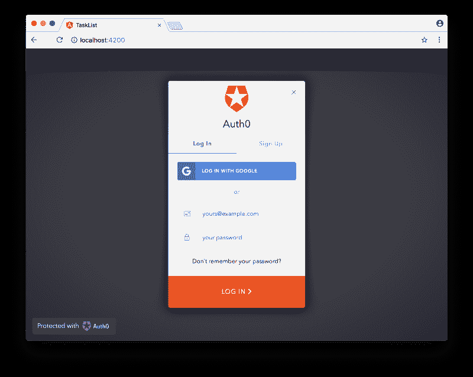

### 向访问者添加欢迎信息

为了使我们的应用程序友好，让我们添加一条欢迎消息。为此，首先我们将添加两个方法并在`src/app/app.component.ts`文件中注入`AuthService`，使其看起来像这样:

```
import { Component } from '@angular/core';
import { AuthService } from './auth.service';

@Component({
  selector: 'app-root',
  templateUrl: './app.component.html',
  styleUrls: ['./app.component.css']
})
export class AppComponent {
  constructor(private authService: AuthService) { }
}
```

app.component.ts

之后，我们将添加消息，作为来自[角状物质](https://material.angular.io/components/component/card)的`md-card`成分，到`src/app/app.component.html`:

```
<app-nav-bar></app-nav-bar>

<div class="app-container">
  <md-card *ngIf="!authService.authenticated()">
    <md-card-title>Hello, visitor.</md-card-title>
    <md-card-subtitle>
      Please <a (click)="authService.signIn()">sign in</a> to manage your task list.
    </md-card-subtitle>
  </md-card>
</div>
```

app.component.html

最后，我们将通过向`src/app/app.component.css`添加一条规则来修复界面:

```
.app-container {
  padding: 20px;
}
```

app.component.css

转到我们的应用程序`http://localhost:4200/`，我们可以看到新的欢迎消息(如果我们没有通过认证)。

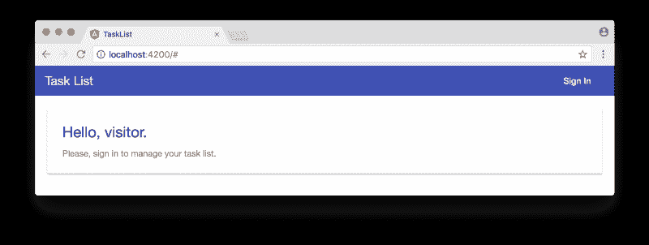

### 实现无服务器 REST API

现在我们已经将应用程序与 Auth0 集成，它允许用户登录和注销，让我们创建我们的无服务器 REST API。这个 API 将处理`POST`请求(保存新任务)、`GET`请求(从用户处检索任务)和`DELETE`请求(删除任务)。

我们将首先在一个名为`webtask`的新文件夹中创建一个名为`tasks.js`的文件，然后我们将向其中添加以下代码:

```
'use strict';
// imports node modules
const express = require('express');
const mongojs = require('mongojs');
const bodyParser = require('body-parser');
const jwt = require('jsonwebtoken');

// creates Express app with JSON body parser
const app = new express();
app.use(bodyParser.json());

// defines REST API (HTTP methods)
app.get('/', getTasks);
app.post('/', addTask);
app.delete('/', deleteTask);

// exports REST API
module.exports = app;

function addTask(req, res) {
  let userCollection = loadUserCollection(req.webtaskContext);

  // save new task to user collection
  userCollection.save({
    createdAt: new Date(),
    description: req.body.description
  }, () => res.end())
}

function getTasks(req, res) {
  let userCollection = loadUserCollection(req.webtaskContext);

  // retrieves all tasks sorting by descending creation date
  userCollection.find().sort({ createdAt: -1 }, (err, data) => {
    res.status(err ? 500 : 200).send(err || data);
  });
}

function deleteTask(req, res) {
  let userCollection = loadUserCollection(req.webtaskContext);

  // removes a task based on its id
  userCollection.remove({ _id: mongojs.ObjectId(req.query.id) }, () => res.end());
}

function loadUserCollection(webtaskContext) {
  // this secrets are configured when creating the Webtask
  const AUTH0_SECRET = webtaskContext.secrets.AUTH0_SECRET;
  const MONGO_USER = webtaskContext.secrets.MONGO_USER;
  const MONGO_PASSWORD = webtaskContext.secrets.MONGO_PASSWORD;
  const MONGO_URL = webtaskContext.secrets.MONGO_URL;

  // removes the 'Bearer ' prefix that comes in the authorization header,
  let authorizationHeader = webtaskContext.headers.authorization;
  authorizationHeader = authorizationHeader.replace('Bearer ', '');

  // verifies token authenticity
  let token = jwt.verify(authorizationHeader, AUTH0_SECRET);

  // connects to MongoDB and returns the user collection
  let mongodb = mongojs(`${MONGO_USER}:${MONGO_PASSWORD}@${MONGO_URL}`);
  return mongodb.collection(token.sub);
}
```

tasks.js

代码非常简单，易于理解，但一个全面的解释可能会派上用场。这个文件的主要目的是导出一个 [Express 应用程序](https://expressjs.com/en/starter/hello-world.html)，它为一个单独的路由(主`/`路由)处理三个 HTTP 方法。如前所述，这三种方法允许用户在 MongoDB 数据库的集合中创建、检索和删除任务。

每个用户都有自己的收藏——这不是最好的方法，因为 [MongoDB 最多可以处理 24，000 个收藏](https://docs.mongodb.com/manual/reference/limits/#namespaces)，但是已经足够好了。该集合基于由 Auth0 发布的标识用户在 JWT 的`sub`声明[。](https://tools.ietf.org/html/rfc7519#section-4.1.2)

`tasks.js`文件中的最后一个函数定义`loadUserCollection`实际上负责两件事:安全性和 MongoDB 连接。当用户向我们的 API 发出任何请求时，该函数验证发送的`authorization`头是否确实由 Auth0 签名。如果没有发送，将生成一个非用户友好的错误。这是通过`jwt.verify`功能和`AUTH0_SECRET`键的帮助完成的。第二个责任是连接到 MongoDB，由`mongojs`模块处理，依赖于三个配置变量:`MONGO_USER`、`MONGO_PASSWORD`、`MONGO_URL`。

所有这些配置变量——三个用于连接 MongoDB，一个用于验证 Auth0 令牌——都在创建无服务器函数时传递给 Webtask。我们将很快看到这是如何做到的。

这是**整体 REST API 实现**，有了这些代码，我们就可以处理用户请求，这些请求将由我们即将在 Angular 应用上创建的组件发送。但是我们还需要执行几个步骤。

### 创建 MongoDB 数据库

为了让我们的生活更轻松，避免自己安装和支持 MongoDB，我们将使用 [mLab](https://mlab.com/) ，一个云托管的 MongoDB。我们要做的第一件事就是[去他们的网站](https://mlab.com/)注册一个免费账户。验证我们的电子邮件地址后，我们必须[创建一个新的部署](https://mlab.com/create)。由于我们刚刚启动我们的 app，不会获得太多的流量，所以我们选择 ***单节点*** 计划和 ***沙箱*** 类型，免费为我们提供 500 MB 的 DB 存储。您还需要键入一个数据库名称，选择类似于`task-list`的名称。

我们必须做的最后一件事是创建一个用户来连接到这个数据库。如果您选择`task-list`作为数据库的名称，[这是创建用户](https://mlab.com/databases/task-list#users)的链接。

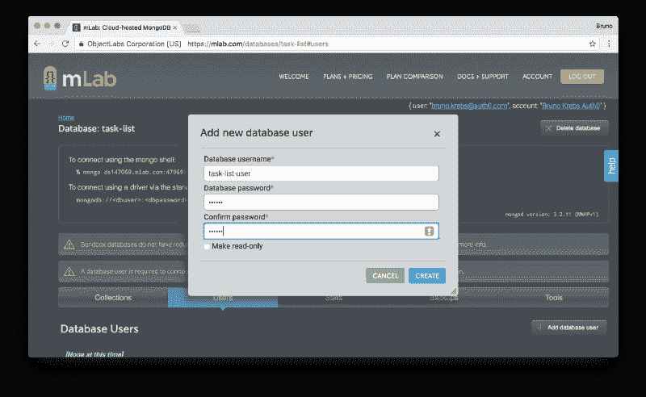

### 配置 Webtask 帐户

我们还需要创建一个 [Webtask 帐户](https://webtask.io/)，但这非常简单。作为 Auth0 的产品，Webtask 依赖于 Lock，使我们能够在以下身份提供商(IdP)之一创建帐户:脸书、GitHub、谷歌或微软。创建一个账户只需要点击一个按钮。

选择 IdP 后，我们将看到一个简洁的三步流程，演示如何创建一个 *Hello World* 无服务器功能。我们已经有一个 Webtask 要部署，所以让我们只遵循前两个步骤，以便在我们的计算机中配置 CLI 工具:

```
# install Webtask CLI tool
npm install wt-cli -g

# initialize it with our email address
wt init me@somewhere.com
```

您将被要求输入发送到您电子邮件地址的验证码。这是 Webtask 帐户配置的最后一步。

### 部署我们的无服务器 REST API

创建了 mLab 和 Webtask 帐户并正确配置了 Webtask CLI 工具后，我们现在可以将无服务器 REST API 部署到生产环境中了。这是通过以下代码完成的:

```
wt create webtask/tasks.js \
  --meta wt-compiler=webtask-tools/express \
  -s AUTH0_SECRET=secret-from-auth0.com \
  -s MONGO_USER=task-list-user \
  -s MONGO_PASSWORD=111222 \
  -s MONGO_URL=ds147069.mlab.com:47069/task-list \
  --prod
```

传递给`wt`工具的第一个选项指定我们想要基于我们的`webtask/tasks.js`文件`create`一个 Webtask。第二个参数标识我们的代码是一个 Express app，需要 Webtask 借助`webtask-tools/express`工具进行预编译。以下四个参数是我们在 Webtask 中使用的`secrets`(`-s`前缀表示它们为`secrets`)。最后一个参数在`production`模式下创建我们的 Webtask，这样会更快。

请注意，上面的值必须替换为来自我们的 Auth0 帐户和 mLab 帐户的值。`AUTH0_SECRET`值可以在`Client ID`和`Domain`相同的地方找到。最后三个值与 MongoDB 相关，可以在 mLab 的仪表板上找到。

成功发出 Webtask 创建命令后，我们现在可以专注于我们的 Angular 应用程序的主要特性，即任务列表组件。

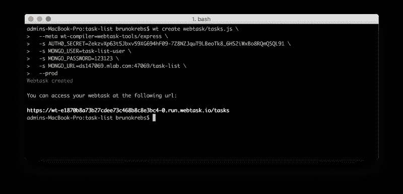

### 构建我们的角度界面

我们需要创建两个组件来允许用户与他们的任务列表进行交互。我们将创建一个`TaskListComponent`来显示任务列表，并创建一个`TaskFormComponent`来允许用户创建新任务。除了这些组件之外，我们还将创建一个`TaskListService`，它将处理所有的 AJAX 请求。我们将使用 Angular CLI 为我们创建它们:

```
# creates the main component that lists tasks
ng g component task-list

# creates a component to hold a form to add tasks
ng g component task-list/task-form

# creates a service to handle all interaction with our REST API
ng g service task-list/task-list
```

### 集成 Angular 和无服务器 REST API

`TaskListComponent`和`TaskFormComponent`都将依靠`TaskListService`与我们的无服务器 REST API 通信，所以让我们先处理服务实现。

打开最近创建的服务文件`src/app/task-list/task-list.service.ts`，插入以下代码:

```
import { Injectable } from '@angular/core';
import { Observable } from 'rxjs';
import { AuthHttp } from 'angular2-jwt';

@Injectable()
export class TaskListService {
  private static TASKS_ENDPOINT =
    'https://wt-e1870b8a73b27cdee73c468b8c8e3bc4-0.run.webtask.io/tasks';

  constructor(private authHttp: AuthHttp) { }

  loadTasks$(): Observable<any> {
    return this.authHttp.get(TaskListService.TASKS_ENDPOINT);
  }

  addTask$(task) : Observable<any> {
    return this.authHttp.post(TaskListService.TASKS_ENDPOINT,
      { description: task });
  }

  deleteTask$(task): Observable<any> {
    return this.authHttp.delete(TaskListService.TASKS_ENDPOINT +
      '?id=' + task._id);
  }
}
```

task-list.service.ts

这段代码中有三件重要的事情需要注意。首先是`TASKS_ENDPOINT`常数。这个常量必须引用上面的`wt create`命令返回的 *URL* 。

第二，这个类没有使用来自`@angular/http`的`Http`。它使用的是`AuthHttp`，由`angular2-jwt`提供，并与`auth0-lock`优雅地集成在一起。这个类的实例自动发送一个`authorization`头，它在用户浏览器`localStorage`的`id_token`键上找到任何内容。您可能已经注意到，这是我们在配置`AuthService`时存储令牌的同一个地方。

第三，`TaskListService`中的所有方法返回`Observables`，让调用者决定如何处理我们的无服务器 REST API 发送的响应。

为了将`TaskListService`注入到我们的组件中，我们需要对位于`src/app/app.module.ts`的主`@NgModule`进行一些更改:

```
// ... other imports
import { Http, RequestOptions } from '@angular/http';
import { AuthHttp, AuthConfig } from 'angular2-jwt';
import { TaskListService } from './task-list/task-list.service';

// creates a factory to AuthHttp
export function authHttpFactory(http: Http, options: RequestOptions) {
  return new AuthHttp(new AuthConfig(), http, options);
}

@NgModule({
    // ... other properties
    providers: [
      AuthService,
      TaskListService, // adds new service
      {
        provide: AuthHttp,
        useFactory: authHttpFactory, // defines how to provide AuthHttp
        deps: [ Http, RequestOptions ]
      }
    ],
    bootstrap: [AppComponent]
})
```

app.module.ts

我们对我们的模块所做的第一个改变是添加`TaskListService`作为提供者，就像我们之前对`AuthService`所做的一样。第二个变化也增加了一个提供者，但是形式更复杂。

`AuthHttp`提供者需要一个工厂的帮助——声明为`authHttpFactory`——来创建。这个工厂有`Http`和`RequestOptions`作为依赖项，所以我们需要将提供者定义为一个文字对象，显式地传递这个依赖项。

### 使用角度列出任务

我们的`TaskListComponent`现在可以实现了。我们现在将打开`src/app/task-list/task-list.component.ts`文件并应用下面的代码:

```
import { Component, OnInit } from '@angular/core';
import { TaskListService } from './task-list.service';

@Component({
  selector: 'app-task-list',
  templateUrl: './task-list.component.html',
  styleUrls: [ './task-list.component.css' ]
})
export class TaskListComponent implements OnInit {

  private tasks: String[];

  constructor(private taskListService: TaskListService) { }

  ngOnInit() { this.loadTasks(); }

  private loadTasks() {
    this.taskListService.loadTasks$().subscribe(
      response => this.tasks = response.json(),
      error => console.log(error)
    );
  }

  taskAddedHandler(task) {
    this.taskListService.addTask$(task).subscribe(
      response => this.loadTasks(),
      error => console.log()
    );
  }

  deleteTask(task) {
    this.taskListService.deleteTask$(task).subscribe(
      response => this.loadTasks(),
      error => console.log()
    );
  }
}
```

task-list.component.ts

这个类被注入了`TaskListService`，并向`Observables`响应添加了一些回调方法。当`Observables`响应无误时，`taskAdded$`和`deleteTask$`都会触发对`loadTasks`方法的调用。`console.log`由这些方法触发，处理无服务器 REST API 发出错误的情况。

`loadTasks`方法调用`taskListService.loadTasks$`将结果分配给`tasks`属性。

有了三个公开的方法和填充的`task`属性，我们现在可以实现位于`src/app/task-list/task-list.component.html`文件中的`TaskListComponent`接口。

这个文件应该是这样的:

```
<md-card>
  <md-card-title>Task List</md-card-title>
  <md-card-subtitle>All your tasks in one place.</md-card-subtitle>
  <md-list>
    <div class="task-item" *ngFor="let task of tasks; trackBy: $index">
      <p><small><strong>{{ task.createdAt | date: 'short' }}</strong></small></p>
      <p>{{ task.description }}</p>
      <button class="delete" md-button md-raised-button
        color="accent" (click)="deleteTask(task)">Delete</button>
    </div>
    <div class="task-item" *ngIf="tasks?.length == 0">
      <p>You have no pending tasks.</p>
    </div>
  </md-list>
</md-card>
```

task-list.component.html

这里我们添加了一个由 Angular Material 提供的`md-list`组件[，它遍历`tasks`，显示它们的创建日期和描述。此外，每个任务都有一个`button`，用户可以删除它们。](https://material.angular.io/components/component/list)

为了使我们的界面更好，让我们向`src/app/task-list/task-list.component.css`文件添加两个 CSS 规则:

```
.task-item {
  padding: 10px;
  margin-bottom: 10px;
  background-color: #eee;
}

button.delete {
  float: right;
  top: -60px;
}
```

task-list.component.css

这将使不同的任务以灰色背景区分开来，并向右推动删除按钮，使其与任务垂直对齐。

现在我们的界面已经准备好列出任务，所以我们需要通过将它添加到`src/app/app.component.html`文件中来使它可见。按如下方式打开它和`TaskListComponent`:

```
<app-nav-bar></app-nav-bar>

<div class="app-container">

  <!-- ... card with welcome message -->

  <app-task-list *ngIf="authService.authenticated()"></app-task-list>
</div>
```

app.component.html

如果我们在浏览器中打开我们的应用程序，通过访问`http://localhost:4200`，我们会看到下面的屏幕。

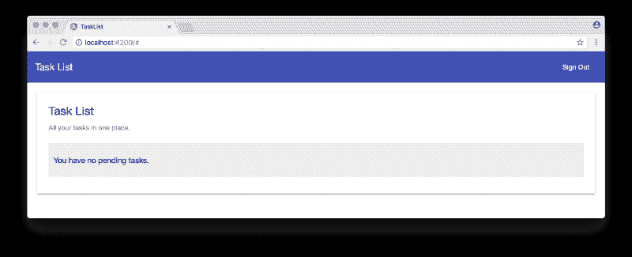

我们的应用程序的完成现在依赖于实现最后一个组件`TaskFormComponent`，允许用户向他们的列表添加任务。

### 使用角度添加任务

为了使用户能够添加任务，我们需要打开`src/app/task-list/task-form/task-form.component.ts`文件并如下实现它:

```
import { Component, EventEmitter, Output } from '@angular/core';

@Component({
  selector: 'app-task-form',
  templateUrl: './task-form.component.html',
  styleUrls: ['./task-form.component.css']
})
export class TaskFormComponent {

  @Output()
  taskAdded = new EventEmitter();

  public task: String = null;

  addTask() {
    this.taskAdded.emit(this.task);
    this.task = null;
  }
}
```

task-form.component.ts

该组件接受用户的任务输入，并用数据发出一个`taskAdded`事件。这个组件的 HTML 位于`src/app/task-list/task-form/task-form.component.html`文件中，也非常简单:

```
<div class="task-form">
  <md-input-container>
    <input mdInput [(ngModel)]="task" placeholder="New task">
  </md-input-container>
  <button md-button md-raised-button color="primary" (click)="addTask()">Add</button>
</div>
```

task-form.component.html

点击*添加*按钮，触发组件中的`addTask`方法。这个方法然后触发`taskAdded`事件发射器。`TaskListComponent`是将监听这些事件的组件。我们已经实现了一个叫做`taskAdded`的方法，可以处理这样的事件。我们只需要更新这个组件的 HTML 来添加`TaskFormComponent`并注册事件处理程序。

为此，让我们打开`src/app/task-list/task-list.component.html`并在列表前添加`app-task-form`标签，如下所示:

```
<md-card>
  <!-- ... card title and subtitle -->

  <app-task-form (taskAdded)="taskAddedHandler($event)"></app-task-form>

  <!-- ... md-list -->
</md-card>
```

task-list.component.html

我们开始吧。我们的应用程序现在已经完全实现，并准备投入生产。

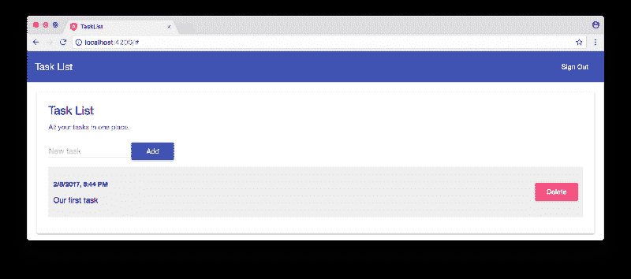

或者是？如果我们稍微玩一下这个应用程序，我们会发现在某些情况下用户体验并不是那么好。当添加新任务或删除现有任务时，应用程序需要一段时间来更新任务列表。所以还有改进的空间。

### 添加 AJAX 加载指示器

为了解决这个问题，让我们使用一个叫做 [Angular 2 Slim Loading Bar](https://github.com/akserg/ng2-slim-loading-bar) 的小模块。要安装它，运行`npm install --save ng2-slim-loading-bar`，然后打开`src/app/app.module.ts`文件导入它:

```
// ... other module imports
import { SlimLoadingBarModule } from 'ng2-slim-loading-bar';

@NgModule({
  // ... declarations
  imports: [
    // ... other imports
    SlimLoadingBarModule.forRoot()
  ],
  // ... providers and bootstrap
})
export class AppModule { }
```

app.module.ts

我们还将通过在我们的`src/styles.css`文件的顶部添加下面一行来导入它的 CSS 规则:

```
@import '~ng2-slim-loading-bar/bundles/style.css';

/* ... everything else ... */
```

styles.css

之后，我们需要让我们的`AppComponent`使用`SlimLoadingBarService`。为此，让我们打开`src/app/app.component.ts`，编辑如下:

```
// ... other imports
import { SlimLoadingBarService } from 'ng2-slim-loading-bar';

// ... component definition
export class AppComponent {
  constructor(private authService: AuthService, private slimLoading: SlimLoadingBarService) { }

  // ... method definitions
}
```

app.component.ts

`SlimLoadingBarService`包含了我们将要用到的两个方法:`start`，启动加载栏；和`complete`，结束装载指示。这些方法将在`TaskListComponent`上注册为事件监听器。我们仍然没有在这个组件中创建事件发射器，但是我们可以预先配置侦听器。我们打开`src/app/app.component.html`，编辑成这样:

```
<app-nav-bar></app-nav-bar>

<div class="app-container">
  <!-- ... welcome message ... -->

  <app-task-list *ngIf="authService.authenticated()"
    (startAjaxRequest)="slimLoading.start()"
    (completeAjaxRequest)="slimLoading.complete()">
  </app-task-list>
</div>

<!-- adds the slim loading bar to our app -->
<ng2-slim-loading-bar [color]="'gold'" [height]="'4px'"></ng2-slim-loading-bar>
```

app.component.html

我们要做的最后一件事是编辑`src/app/task-list/task-list.component.ts`文件，在`TaskListComponent`上创建和使用`startAjaxRequest`和`completeAjaxRequest`事件发射器:

```
// ... other imports
import { EventEmitter, Output } from '@angular/core';

// ... component definition
export class TaskListComponent implements OnInit {

  @Output()
  startAjaxRequest = new EventEmitter<void>();

  @Output()
  completeAjaxRequest = new EventEmitter<void>();

  // ... properties, constructor and ngOnInit definitions

  private loadTasks() {
    this.startAjaxRequest.emit();
    this.taskListService.loadTasks$().subscribe(
      response => this.tasks = response.json(),
      error => console.log(error),
      () => this.completeAjaxRequest.emit()
    );
  }

  taskAddedHandler(task) {
    this.startAjaxRequest.emit();
    this.taskListService.addTask$(task).subscribe(
      response => this.loadTasks(),
      error => console.log()
    );
  }

  deleteTask(task) {
    this.startAjaxRequest.emit();
    this.taskListService.deleteTask$(task).subscribe(
      response => this.loadTasks(),
      error => console.log()
    );
  }
}
```

task-list.component.ts

这里，我们创建了两个事件发射器，并将它们添加到依赖于 AJAX 请求的三个方法中。每当这些方法之一被调用时，我们通过`this.startAjaxRequest.emit()`发出一个事件，使*细长装载杆*开始运行装载杆指示器。在得到由`loadTasks`方法发送的 AJAX 请求的响应后，更新任务列表，我们告诉 *Slim Loading Bar* 通过`this.completeAjaxRequest.emit()`完成它的进程。

如果我们通过发出`ng serve`并转到`http://localhost:4200/`来运行我们的开发服务器，我们将看到我们的应用程序具有更好的用户体验:

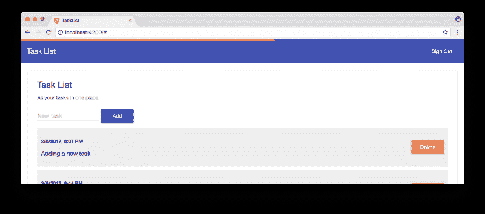

### GitHub 页面上线

我们的应用程序已经可以部署到生产环境中了。我们有一个保存所有用户任务的持久层。我们有一个无服务器的 REST API，接受`GET`、`POST`和`DELETE`请求来操作任务。我们有 Auth0 提供的安全性。我们有一个好看的单页应用界面。唯一缺少的是存放静态(HTML、CSS 和 JavaScript)文件的地方。

这正是 [GitHub Pages 为](https://pages.github.com/)提供的。使用它很简单。我们只需要创建一个存储库，并将我们的工作推送到一个名为`gh-pages`的分支。这个分支应该只包含我们的产品包。

要创建 GitHub 资源库，请访问 [GitHub](https://github.com/) ，登录(如果您没有帐户，请注册)并选择*创建新资源库*选项。创建新的存储库，将其命名为*任务列表*。请注意，如果您选择另一个名称，您将不得不调整稍后运行的`ng build`命令的`base-href`参数。

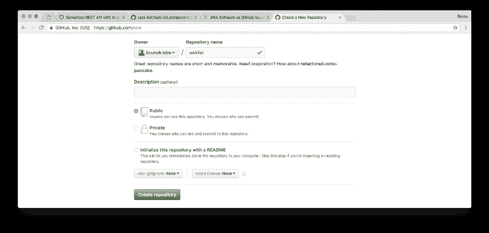

现在，我们必须将这个存储库作为远程添加到我们的应用程序中。当我们用 Angular CLI 创建我们的项目时，它已经附带了 [Git](https://git-scm.com/) 。我们只需添加这个遥控器，提交我们所有的更改并推送到它的主服务器:

```
# adds new repo as a remote
git remote add origin git@github.com:YOUR-USERNAME/YOUR-REPO.git

# commits our code
git add .
git commit -m "Task List Angular app with a secure serverless REST API."

# push work to new repo
git push origin master
```

有了安全的代码，我们现在可以开始*上线*任务了。这里需要两步。第一个是为生产准备代码并打包。Angular CLI 再次派上了用场。为此，我们只需发出`ng build --prod --base-href=/task-list/`。注意，我们必须将`base-href`设置为与我们的 GitHub 资源库完全相同的名称，否则我们的应用程序将无法加载所有的资源，它将无法工作。

第二步以前是由 Angular CLI 处理的，但是[这个命令在最新版本](https://github.com/angular/angular-cli/pull/4385)中被删除了，所以我们需要第三方工具来帮助我们。还好有一个非常好用的叫`angular-cli-ghpages`。安装它的问题`npm install -g angular-cli-ghpages`。之后，我们只需执行`angular-cli-ghpages`(没错，没有任何参数)，瞧。我们的应用已经在 GitHub 页面上运行了。

**重要**:不要忘记更新你的 Auth0 账户上的*允许回拨网址*。允许的 URL 列表必须包含我们的应用程序公开的 URL。这应该是类似`[https://brunokrebs.github.io/task-list/](https://brunokrebs.github.io/task-list/.)` [的东西。](https://brunokrebs.github.io/task-list/.)


### 结论

正如我们所看到的，当我们选择正确的工具时，很容易取得伟大的成就。我们什么都没有开始，只有一个开发任务列表应用程序的想法，并设法毫不费力地创建并发布到互联网上。

我们甚至不必担心构建、支持和保护服务器来托管我们的 web 应用程序或数据库。如果我们必须自己管理这些任务，我们将花费更多的时间，并且对我们的应用程序的安全性、容错性和可扩展性没有信心。

而这仅仅是开始。将我们自己从所有这些问题中解放出来，使我们能够 100%地专注于我们的想法和使我们的应用程序独一无二的东西。

> 我喜欢阅读和写作关于开发的文章，主要是 JavaScript 和 Java。如果你想与我分享一些东西，或者想保持关注，你可以通过 [Twitter](https://twitter.com/brunoskrebs/) 联系我。此外，请随意在这里或我的任何文章中添加任何评论。