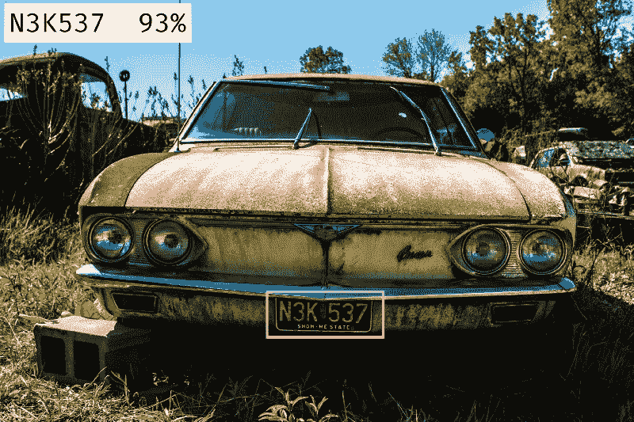
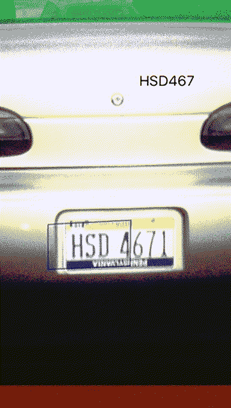
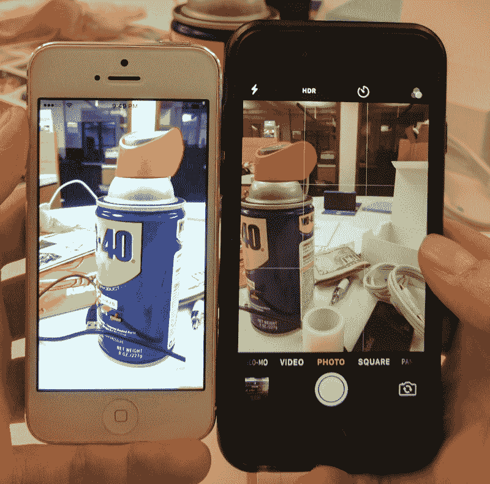

# React Native 中的车牌识别

> 原文：<https://www.freecodecamp.org/news/license-plate-recognition-in-react-native-b4f790d3a160/>

作者:山姆·科尔科斯

# React Native 中的车牌识别

Image courtesy of Unsplash

今天，我们在 [CarDash](https://www.cardash.com) 发布了`[react-native-openalpr](https://github.com/cardash/react-native-openalpr)`，这是一个开源的 React 原生包，用于使用 [OpenALPR](https://github.com/openalpr/openalpr) 进行自动车牌识别(截至 2017 年 2 月仅限 iOS)。

说够了。下面是[示例应用](https://github.com/cardash/react-native-openalpr/tree/master/Example)(包含在回购中)的 GIF 图:

### 如何在你的 React 原生应用中使用它

按照[文档](https://github.com/cardash/react-native-openalpr)中的说明进行安装。安装完成后，从`react-native-openalpr`导入`Camera`并将其添加到 React 本地项目中。

您可以在[文档](https://github.com/cardash/react-native-openalpr#options)中找到选项的完整列表，但是最重要的选项是`onPlateRecognized`，它返回一个`plate`和一个`confidence`百分比。一旦您识别出一个牌照，您就可以在这个函数中存放您想要做的事情的逻辑。

在上面的例子中，当`confidence`高于 90%时，`this.state.plate`被设置为输入板，然后显示给用户。如果您对结果满意，您可以在这里关闭相机并调度 Redux 操作。

### 我们如何构建这个包

这个包是使用 [OpenALPR](https://github.com/openalpr/openalpr) 和相关的 [iOS 编译](https://github.com/twelve17/openalpr-ios)构建的。相机功能的搭建基于流行的`[react-native-camera](https://github.com/lwansbrough/react-native-camera)`包。

OpenALPR 接受静态图像或图像流，因为从流中识别图像更酷，所以我们决定采用这种方法。不幸的是，现有的 React 原生相机库都不能轻松访问图像流，所以我们必须自己构建它。

由于我们是通过一种算法(OpenALPR)来运行图像流的，所以我们需要了解该算法在基本层面上是如何工作的，这样我们就可以优化我们提供给它的图像。

该算法可以拍摄任何图像，但当它接收到图像时，它会运行一些预处理。所以，如果你想提高性能，你需要最小化算法需要运行的操作数量。

#### 图像质量

OpenCV 和 OpenALPR 中的算法做的一件事是对图像进行降采样(降低质量)。基本的边缘检测不需要高分辨率。事实上，高分辨率往往是边缘检测的敌人，因为它会引入噪声。下采样起到了模糊的作用，并且去除了不必要的细节。

知道算法已经开始对图像进行下采样，您可以通过传入已经是低分辨率的图像来优化您的输入数据。当您请求视频帧(帧缓冲)时，您可以定义想要接收的分辨率。在 iOS 中，您可以通过访问预置来实现这一点。`AVSessionPreset`是你给`AVFoundation`框架的一个参数，给你对相机的低级访问。

大多数人默认使用高分辨率图像，但既然你知道算法无论如何都是下采样的，你可以让 iPhone 摄像头在没有计算开销的情况下完成所有工作，而不是在事后处理大量内存的图像转换。

#### 像素

该算法做的另一件事是将图像转换为灰度，因为边缘检测算法在灰度彩色平面中工作得最好。

如果想巧妙一点，可以选择非标准像素格式。通常你的图像以`RGBA`的形式返回，其中 R 是红色，G 是绿色，B 是蓝色，A 是 alpha(不透明度)。如果您使用 Illustrator 或印刷材料，您可能还会看到`CMYK`(青色、洋红色、黄色和浅黄色)。

以`RGBA`为例，每个像素由 0–4 个字节表示。为了从`RGBA`获得灰度图像，你需要取`RGB`分量的平均值，这对应于 3 次读取、3 次乘法和 2 次加法来获得灰度。

输入`Y'CbCr`，其中`Y'`为亮度，`Cb`和`Cr`为颜色。

> y’是[亮度](https://en.wikipedia.org/wiki/Luma_(video))分量，CB 和 CR 是蓝差和红差[色度](https://en.wikipedia.org/wiki/Chrominance)分量。-维基百科

在`Y'CbCr`中，数据被不同地编码。y 质数(`Y'`)实际上与你从上面的`RGB`计算中得到的灰度信息相同，但是不需要计算步骤。因此，如果指定这种像素类型，就可以节省一些处理器时间。

据我们所知，这是获取数据输入的最有效方式，这样就不需要进行预处理。

#### 方向

尽管此时您可以接收优化的图像，但您仍然需要处理方向问题。任何 OCR(光学字符识别)算法都需要知道哪个方向是向上的，因为当字母颠倒或倾斜时，它们就失去了意义。

iPhone 拍摄图像的原生方式是在横向模式下，home 键在右侧，所以为了让我们的算法在纵向模式下工作，你必须识别方向并旋转图像。幸运的是，有一种有效的方法可以做到这一点，OpenCV 提供了一种旋转图像的有效方法。

#### 坐标映射

最后一部分是在一个被识别的车牌周围画一个矩形。当您在纵向模式下使用本机相机时，它会在相机输出周围放置一个信箱。如果你试图让相机全屏，它会拉伸图像以填充可用空间。这被称为“视频重力”

在下图中，你可以看到左边的手机是全屏的，这导致 WD-40 的罐子看起来比右边的相机略大，右边的相机是信箱式的。

Left camera is experiencing video gravity

那么，考虑到孔径比、视频纵横比和视频重力，如何将盘子的坐标从图像空间(坐标系)映射到屏幕坐标系呢？

方法是首先映射坐标，将`0,0`作为左上角，将`1,1`作为右下角。如果方向不是右侧有 home 键的横向模式，你需要稍微计算一下。然后你用 iOS 给我们的魔法方法把这些坐标映射到屏幕坐标系上:`pointForCaptureDevicePointOfInterest`

该方法获取图像坐标空间中的归一化坐标，并将其映射到屏幕空间中的坐标。它会自动为你考虑重力和其他一切因素。

就这样结束了。

### 贡献者

*   埃文·罗森菲尔德-埃文是鳄梨山的创始人和 CarDash 的技术顾问。
*   [您的名字在此] -如果您愿意投稿，请向我们发送 pull 请求——尤其是如果您是一名对构建我们的 Android 功能感兴趣的 Java 开发人员？。

Sam Corcos 是 CarDash 的联合创始人，这是一家提供全方位服务的汽车礼宾服务提供商，旨在消除汽车服务、保养和维护的麻烦。他也是[学凤凰](http://learnphoenix.io)的作者，[视线地图](http://sightlinemaps.com)的首席开发者和创始人。