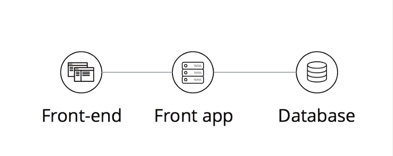
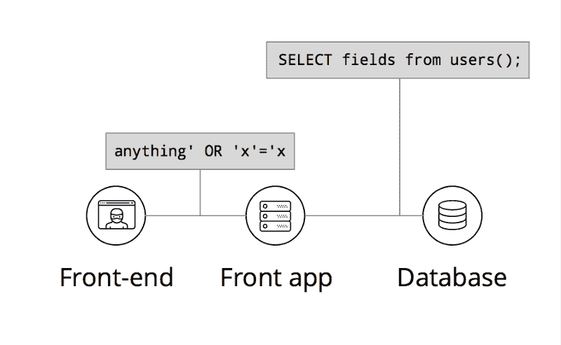
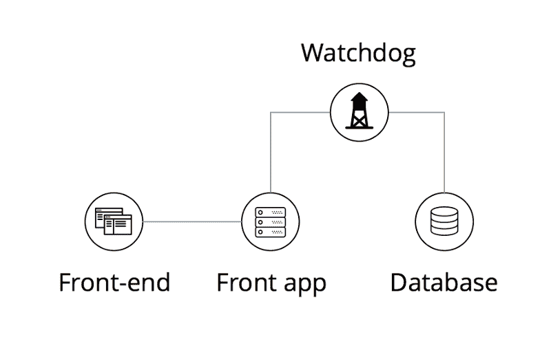

# 如何防止数据库泄漏和注入

> 原文：<https://www.freecodecamp.org/news/preventing-leaks-and-injections-in-your-database-be3743af7614/>

哥萨克实验室开发故事

# 如何防止数据库泄漏和注入

大多数网络和移动应用都有一个包含某种数据库的后端。您的前端使用来自后端的数据，并收集新数据反馈到您的数据库中。

黑客通常会针对您的数据库进行恶意攻击，试图窃取或修改敏感信息。但是大多数后端都得到了很好的保护，唯一可用于恶意操作的攻击媒介是通过您的前端本身。

Your modern app layout, clean and simple

有许多保护数据的传统技术。它们中的大多数会损害您的性能，同时也会限制您的数据的保护范围。

这篇文章是关于其他东西的——我们在开源数据库保护套件 [Acra](https://www.cossacklabs.com/acra/) 中用来检测入侵者的一些有趣的技术。

### 前端受到攻击！

无论在您的前端和系统的其余部分之间有什么样的身份验证和加密，您都必须信任您的前端，让它传入数据。您的前端使用正确的身份验证参数发送的任何请求，您的数据库都必须提供服务。

但是，如果您的前端应用程序以一种攻击者能够改变执行或数据请求流的方式暴露出来，该怎么办呢？

How about forgetting to filter quotes?

如果您信任您的应用程序及其凭证，您将为它的所有请求提供服务，不管它们有多恶意。

#### 让我们介绍一个看门狗

Now, all traffic passes through the Watchdog node

Watchdog 是一个网络代理服务器，位于应用程序和数据库之间，控制数据流。如果应用背后的基础设施没有被破坏，只有前端受到攻击，攻击者获得他们想要的数据的唯一方法就是通过这个看门狗发送格式错误的请求。

但是除了执行访问策略之外，它还可以过滤正确的请求，拒绝明显恶意的请求。

那么，这样一个看门狗代理做什么呢？它试图检测异常和所有对应用程序流来说不典型的大规模选择。然后，根据威胁级别，它或者关闭数据库访问，或者生成通知事件进行监控。

喜欢这个主意吗？Acra 就是这样一个看门狗，它还提供加密服务，专注于有选择地、灵活地保护您存储的数据中的敏感部分。

#### 我们应该检测哪种不良请求？

SQL 注入的典型负载:

*   插入，以认证数据为目标
*   选择*
*   命令执行
*   授予权利
*   拒绝服务攻击
*   将有效负载转义到数据库端执行的典型签名

### 检测方法

检测听起来很简单——我们只需查看通过 Watchdog 的流量，并将其与某种规则进行匹配。但是 SQL 注入并不总是简单的带有预定签名的二进制字节数组，这很容易发现。您可以使用不同的方法来有效地扫描数据库请求流量:

#### **查询模板**

一种简单、灵活的检测可疑行为的方法是将 SQL 请求与一些模式列表进行匹配。为您的特定数据流创建一个包含大多数典型攻击媒介的列表需要一些努力。然后，您必须将查询与该列表进行匹配。但这是在早期大规模发现大多数简单尝试的有效方法。

#### **毒药记录**

用于防止`SELECT *`类型注入的经典设计，poison record 是一种检测对数据库的大量请求的方法。自己设计数据库请求——或者至少列举 ORM 生成的请求——可以让您了解哪些包含敏感数据的表永远不会通过全扫描请求进行访问。您可以在这个表中存储一个特殊的记录，一个标记，当它通过看门狗时，触发警报。

#### **查询枚举**

> —让我们试试这种注射方式……
> —嗯，不，不起作用
> —那种逃避魔法引号的方式呢？

大多数寻找和利用漏洞的过程都依赖于尝试-失败-再次尝试的循环，在这个循环中，攻击者会生成大量的无效查询。其中一些将包含典型的签名，但总的来说，它们将增加对数据库的错误查询的数量。

虽然检测这些签名很难，但是检测数据库中突然增加的空/语法错误响应是相当容易的。

我们现在正在追求的一个有趣的挑战是能够通过机器学习训练的分类器来检测异常(与常规请求流相比)行为。

#### 如果一个**攻击者发起了一个与正常应用程序行为没有区别的攻击，该怎么办？**

如果攻击者能够对常规数据流进行逆向工程，并以一种你无法从正常应用程序行为中区分出来的方式模拟它，他们将能够绕过你的看门狗。

### 进一步阅读

我推荐阅读这三篇关于数据库防御中的经典和现代模式的文章:

[**哥萨克实验室/经典后端安全设计模式**](https://www.cossacklabs.com/classic-backend-security-designs.html)
[*在现代客户端-服务器应用中，大部分敏感数据都存储在…*www.cossacklabs.com](https://www.cossacklabs.com/classic-backend-security-designs.html)[**哥萨克实验室/现代应用安全密钥管理 101**](https://www.cossacklabs.com/key-management-101.html)
[*经常被忽视，远不如量子计算机破解陷门功能那样被大肆宣传 管理密钥实际上是…*www.cossacklabs.com](https://www.cossacklabs.com/key-management-101.html)[**哥萨克实验室/ 12 和 1 想法如何增强后端数据安全**](https://www.cossacklabs.com/backend-data-security-modern-ideas.html)
[*之前，我们已经讨论了后端数据安全中的经典设计模式，然后讨论了密钥管理目标和…*www.cossacklabs.com](https://www.cossacklabs.com/backend-data-security-modern-ideas.html)

感谢阅读。