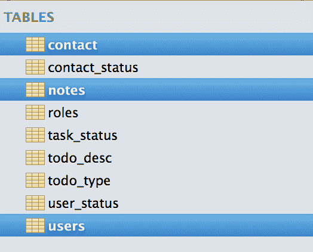
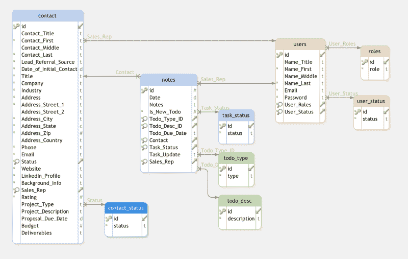
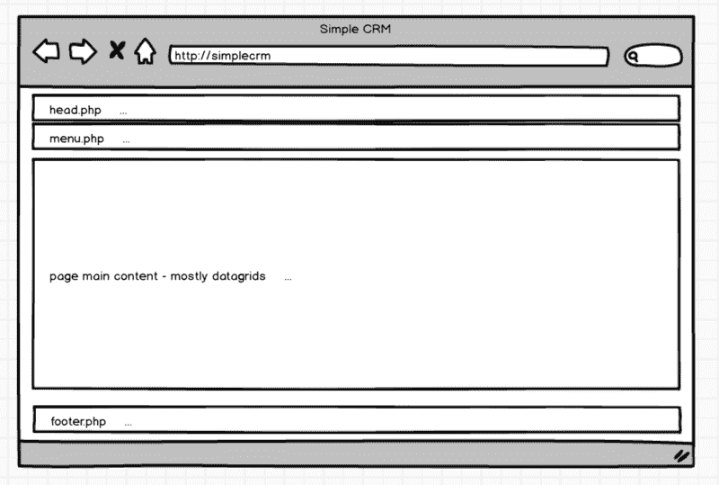
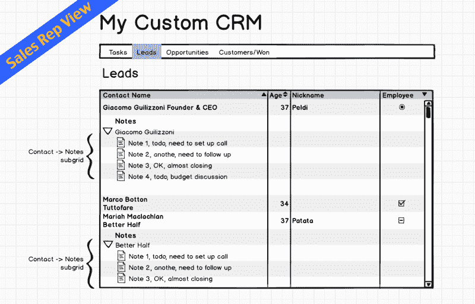
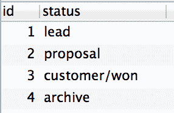
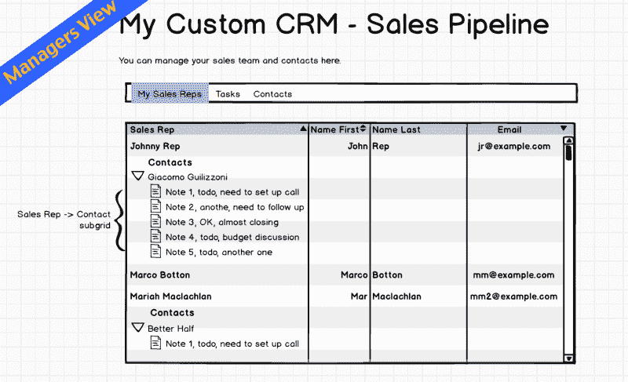
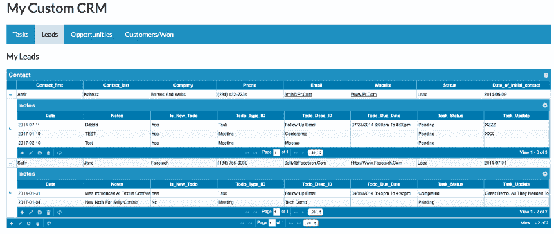
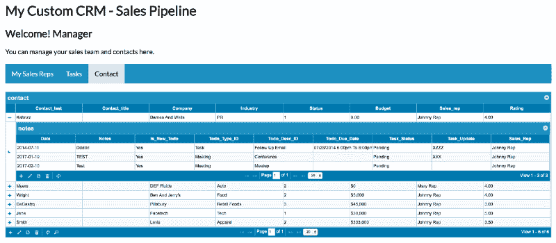

# 用 PHP 和 MySQL 从头开始构建一个简单的 CRM

> 原文：<https://www.freecodecamp.org/news/building-a-simple-crm-from-scratch-in-php-58fef061b075/>

作者理查德

# 用 PHP 和 MySQL 从头开始构建一个简单的 CRM


Photo by [Mike Kononov](http://unsplash.com/photos/lFv0V3_2H6s?utm_source=unsplash&utm_medium=referral&utm_content=creditCopyText) on [Unsplash](https://unsplash.com/?utm_source=unsplash&utm_medium=referral&utm_content=creditCopyText)

客户关系管理(CRM)是一个在客户和公司之间通过不同渠道管理整个客户生命周期的客户互动和数据的系统。在本教程中，我们将使用 PHP 构建一个自定义 CRM，销售团队可以使用它在整个销售周期中跟踪客户。

我们将为销售人员创建一个简单的 CRM 系统，以便:

*   访问他们的任务
*   查看他们的销售线索
*   为每个潜在顾客创建新任务
*   创造新的机会
*   完成销售

销售经理将能够:

*   管理所有客户
*   管理销售团队
*   查看当前销售活动

[下载演示文件](https://github.com/phpcontrols/phpgrid-custom-crm)

### CRM 的构建模块

以下是 CRM 的基本组件列表:

*   **销售线索**:初次接触
*   **账户**:与你做生意的公司的信息
*   **联系人**:关于你认识和一起工作的人的信息。通常，一个帐户有许多联系人
*   **机会**:合格的销售线索
*   **活动**:任务、会议、电话、电子邮件和任何其他可以让你与客户互动的活动
*   **销售**:你的销售团队
*   仪表板:CRM 仪表板不仅仅是赏心悦目。他们应该提供关键信息的概览，并提供深入了解更多细节的链接。
*   **登录**:销售人员和经理在系统中的角色不同。经理可以访问报告和销售渠道信息。


### 系统需求

*   PHP 5.3+，
*   MySQL 或 MariaDB
*   [phpGrid](http://phpgrid.com/)

### 创建 CRM 数据库

我们将从创建自定义 CRM 数据库开始。我们将使用的主要表格有:

*   **联系人** —包含基本客户数据
*   **备注** —保存销售人员从联系人处收集的信息。
*   **用户** —销售人员信息



**Contact** 表包含基本的客户信息，包括姓名、公司地址、项目信息等等。

**Notes** 表存储所有销售活动信息，如会议和电话。

**Users** 表保存系统用户的登录信息，如用户名和密码。用户也可以有角色，如销售或经理。

所有其他的表都是[查找表](https://www.quora.com/In-database-what-are-lookup-tables)来连接到三个主要的关系数据库表。

*   **contact_status** —包含联系状态，如销售线索和机会。每一个都代表典型销售周期中的一个不同阶段
*   **task_status** —任务状态可以是待定或已完成
*   **用户状态** —销售人员可以是活动的，也可以是不活动的
*   **todo_type** —任务或会议的任务类型
*   **todo_desc** —任务的描述，如跟进邮件、电话和会议等。
*   **角色** —用户可以是销售代表或经理

#### 完整的数据库模式图

数据库模式是表示逻辑视图的结构，例如表、视图或整个数据库的主键和外键。数据库模式包括实体以及它们之间的关系。

在关系数据库中，每个表都有一个主键是一个好习惯。主键是每条记录的唯一标识符。它可以是社会保险号(SSN)、车辆识别号(VIN)或自动递增号。这是在向表中插入新记录时生成的唯一编号。

下面是我们简单的 CRM 的数据库图。每个表中的键符号代表表主键。放大镜表示链接数据库中另一个表的外键。有时我们称之为“查找”表。



#### install.sql

一旦你理解了数据库表的结构，在`db`文件夹中找到“install.sql”脚本，并使用 Mysql 工具如 [MySQL Workbench](http://www.mysql.com/products/workbench/) 或 [Sequel Pro](https://www.sequelpro.com/) 来运行 SQL 脚本。它应该创建一个名为`custom_crm`的新关系数据库及其数据库表。

### ZenBase 的一个旁注

```
The CRM application is also one of the many application templates readily available at ZenBase (built on the top of phpGrid) for anyone — with or without coding skills — to use and customize for their own needs.
```

### 设置 phpGrid


我们的 CRM 包含许多数据网格。datagrid 是一个类似电子表格的数据表，它显示代表数据库表中的记录和字段的行和列。数据网格使最终用户能够读写网页上的数据库表。我们可以使用来自 [phpGrid](http://phpgrid.com/) 的 datagrid 工具。我们使用一个工具，而不是从头开始构建它们，因为开发数据网格通常是乏味且容易出错的。datagrid 库将为我们处理所有内部数据库 **CRUD(创建、移除、更新和删除)**操作，用很少的代码获得更好更快的结果。要安装 phpGrid，请按照下列步骤操作:

1.  解压缩 phpGrid 下载文件。
2.  将 phpGrid 文件夹上传到`phpGrid`文件夹。
3.  通过配置`conf.php`文件完成安装。

在我们开始编码之前，我们必须在 phpGrid 配置文件`conf.php`中指定数据库信息。以下是数据库连接设置的示例:

*   **PHPGRID_DB_HOSTNAME** — web 服务器 IP 或主机名
*   **PHPGRID_DB_USERNAME** —数据库用户名
*   **PHPGRID_DB_PASSWORD** —数据库密码
*   **PHPGRID_DB_NAME** —我们 CRM 的数据库名称
*   **PHPGRID_DB_TYPE** —数据库的类型
*   **PHPGRID_DB_CHARSET** —在 MySQL 中总是“utf8”

要了解更多关于配置 phpGrid 的信息，请查看 [phpGrid 完整安装指南](http://phpgrid.com/documentation/installation/)。

### 页面模板



在我们开始构建 CRM 的第一个页面之前，制作可重用的页面项目(如页眉和页脚)是一个很好的实践。

该页面将包括一个标题，菜单，主体和页脚。我们将从创建一个可重用的页面模板开始。

### head.php

这是一个基本的 HTML5 模板头。它包括一个到自定义样式表的链接，该样式表将在后面的步骤中创建。

### menu.php


注意`$_GET['currentPage']`的用法。每个页面将设置一个值，该值将在顶部菜单栏上突出显示当前页面的名称。

在 style.css 中包含以下代码，用于菜单样式(缩小)。它会将上面的无序列表转换成一个菜单。

### footer.php

简单的结束体和 html 标签。

### 完整的页面模板

这是完整的页面模板。主要内容会放在`Section Title`之后。

### CRM 主页


你还和我在一起吗？很好！我们现在终于可以开发我们的 CRM 的第一页。

我们面向销售团队成员的 CRM 有四个页面:

*   **任务**
*   **导联**
*   **机遇**
*   **客户/赢得**

每页显示典型销售周期中的不同阶段。

### 销售人员页面设计模型

这是我们为销售人员设计的 CRM 模型。



### 任务页面

当销售团队成员登录时，他看到的第一页是当前任务列表。

您可能还记得，我们的 Notes 表保存了所有的销售活动信息。我们可以创建一个数据网格，并使用 phpGrid 从 Notes 表中填充它。

任务页面的主要内容是一个数据网格。下面两行将给出当前销售人员的任务列表。

*   第一行创建了一个 phpGrid 对象，传递 SELECT SQL 语句、它的主键— `ID`，然后传递数据库表的名称—`notes`。
*   第二行也是最后一行调用 [display()](http://phpgrid.com/documentation/display/) 函数在屏幕上呈现数据网格。查看[基本数据网格演示](http://phpgrid.com/example/example-1-a-basic-php-datagrid-2/)了解更多细节。

### 销售线索页面

销售线索页面包含销售人员负责的当前销售线索列表。每个销售线索可以有一个或多个注释。为此，我们将使用 [phpGrid 主-细节](http://phpgrid.com/example/master-detail-grid/)特性。

我们还需要使用 [set_query_filter](http://phpgrid.com/documentation/set_query_filterwhere/) ()来仅显示销售线索`Status = 1`，并且仅针对当前销售人员。

#### 联系状态表



### 机会页面

一旦销售线索得到确认，它就变成了一个机会。“Opportunities”页面类似于“Leads”页面。唯一不同的是 set_query_filter 中过滤后的状态码是`Status = 2`。

### 客户/成功页面

客户/韩元有`Status = 3`。与销售线索和业务机会类似，客户/赢得客户也可以有注释。

对于销售人员来说，这就是我们简单的 CRM 的全部内容。

### 经理仪表板


Photo by [Eaters Collective](http://unsplash.com/photos/rS1GogPLVHk?utm_source=unsplash&utm_medium=referral&utm_content=creditCopyText) on [Unsplash](https://unsplash.com/?utm_source=unsplash&utm_medium=referral&utm_content=creditCopyText)

销售经理将有权访问销售渠道中的所有记录，并能够管理销售团队和客户数据。

我们将有一个类似于 [phpGrid 选项卡式网格演示](http://phpgrid.com/example/tabbed-datagrid/)的选项卡式菜单的单一网页。

### 经理仪表板设计模型

#### 我的销售代表



### 主要内容

每个选项卡代表 CRM 数据库中的一个表。`$_GET['gn']`将存储表名。它根据传递的表名动态生成 datagrid。

将 jQueryUI 标签与 phpGrid 集成起来非常容易。更多信息请参考 phpGrid [选项卡式网格演示](http://phpgrid.com/example/tabbed-datagrid/)。

### 我的销售代表页面

由于销售经理需要快速找到销售人员的合作伙伴，我们添加了一个从 contact 表填充的细节网格`$sdg`,并与主网格链接。

`sales_rep`是`contact`表中连接到`id`的键，该键是`users`表中的外键。记住`users`商店我们所有销售人员的信息。

### 截屏

#### CRM —销售屏幕



#### CRM —经理屏幕



### 现场演示

[CRM 销售代表屏幕](http://phpdatagrid.com/apps/phpgrid-custom-crm/sales/tasks.php) | [CRM 经理屏幕](http://phpdatagrid.com/apps/phpgrid-custom-crm/managers/pipeline.php)

### 需要编写更少的代码？

如果你是编程新手，还不熟悉编码，你可能想看看构建在 phpGrid 之上的 [**ZenBase**](https://getzenbase.com/) 。客户关系管理只是 ZenBase 上众多应用程序模板中的一个，任何人都可以使用这些模板*，不管有没有*编码技能，都可以根据自己的需求进行使用和定制。

### GitHub 上的完整源代码

[**PHP controls/PHP grid-Custom-crm**](https://github.com/phpcontrols/phpgrid-custom-crm)
[*PHP grid-Custom-crm-自定义 CRM 演示-学习用 PHP 和 MySQL 为自己构建一个自定义 CRM，一个销售团队可以……*github.com](https://github.com/phpcontrols/phpgrid-custom-crm)

### 感谢阅读。如果你喜欢这篇文章，请点击那个按钮。帮助其他人找到它，并在 Twitter 上关注我。

