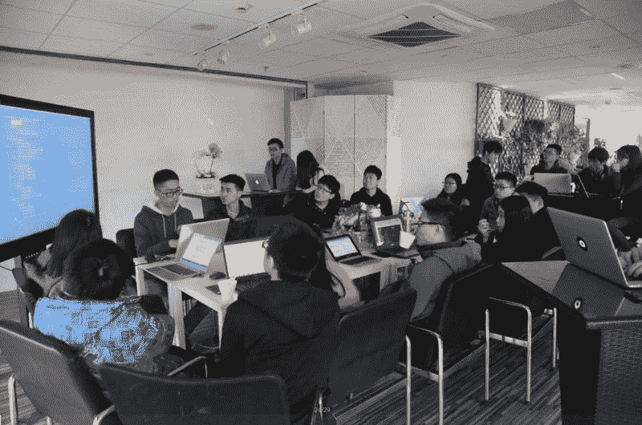

# 当你只有 14 岁的时候，制作并销售一个聊天机器人是什么感觉

> 原文：<https://www.freecodecamp.org/news/what-its-like-to-build-and-market-a-chatbot-when-you-re-only-14-years-old-74207aa1df54/>

这里有三个值得你花时间的链接:

1.  当你只有 14 岁的时候，开发并销售一个聊天机器人是什么感觉
2.  亚马逊 S3 已关闭。它正在影响 freeCodeCamp、Medium、Quora、Imgur 和许多其他网站
3.  从科技公司的女性领导者身上学到的经验( [7 分钟阅读](http://bit.ly/2l8EJra)

### 想到这一天:

> “如果你把秘密透露给了风，你就不应该责怪风把秘密透露给了树。”—卡里·纪伯伦

### 今日趣事:

### 今日学习小组:

[广州自由码营](http://bit.ly/2mkYFrc)

编码快乐！

–昆西·拉森，自由代码营的老师