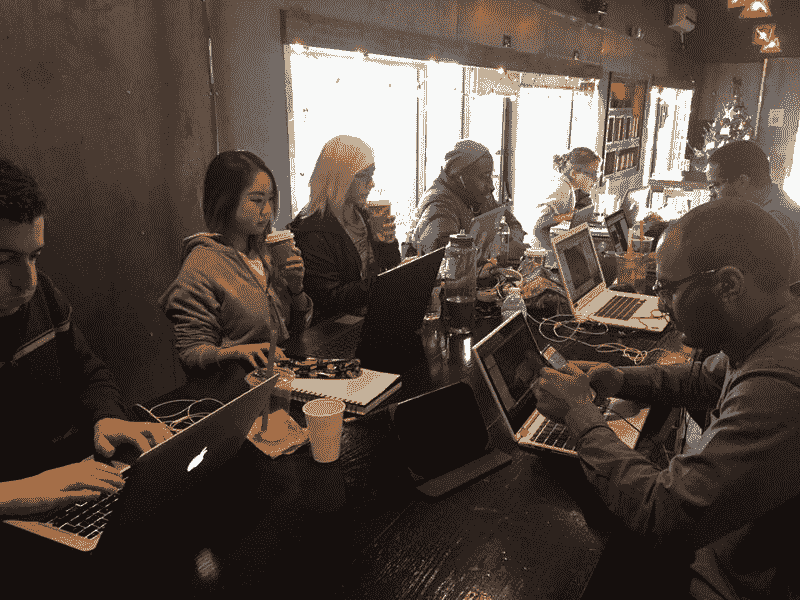
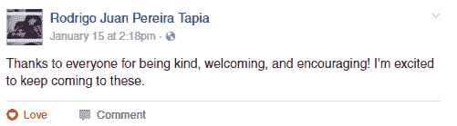

# 为什么你一定要加入 freeCodeCamp 的学习小组

> 原文：<https://www.freecodecamp.org/news/why-you-need-to-get-involved-with-free-code-camps-facebook-groups-6b573bcf1b39/>

弗雷德里克·伊格尔

# 为什么你一定要加入 freeCodeCamp 的学习小组

One of the weekly meetings of our freeCodeCamp Silver Spring, Maryland study group.

我写这篇文章是希望说服你利用 freeCodeCamp 提供的一个惊人的机会——一个可以让你的开发者之旅变得不同的机会。

我目前在一家名为 [Inflectra](https://www.inflectra.com/) 的软件公司担任开发人员。从我家通勤只要 15 分钟。我喜欢办公室的环境。人们很友好，乐于助人。这项工作令人满意。我在很短的时间里学到了很多。我从未想过我会如此幸运地找到一个离家这么近的机会，**，这都要感谢 freeCodeCamp 的当地学习小组。**

对于那些不知道的人来说，露营者可以通过加入 freeCodeCamp 团体在他们当地的城镇聚会。全世界有数百个这样的组织。如果你在自己的镇上没有看到一个团体，你甚至可以建立自己的团体。[链接](https://forum.freecodecamp.com/t/freecodecamp-city-based-local-groups/19574)

If you live on Earth, chances are there’s a group in your area

这些团体使任何人都能够在他们当地创建一个活跃的社区，在那里所有年龄和水平的营员可以相互成长和相互支持。这真是一件美妙的事情，也是我最喜欢的自由代码营的一部分。

我是本地小组的管理员，我在本地的泡泡茶餐厅主持每周一次的代码聚会。下面是其中一个例子:

在我们的聚会上，露营者通常会带来他们自己的项目，并与团队的其他成员分享。我们还解决了团队项目，比如一起学习 Git 和 GitHub。我们定期计划一起参观其他本地编码活动。

这些聚会已经把学习编程变成了一个社交活动，这是一个人的编程之旅中经常缺失的元素。

下面是一位会员在第一次参加聚会后的评论:

我最初的意图只是在继续提高我的 JavaScript 技能的同时，与我所在地区的露营者见面并聊天。我没想到我会遇到这么多有趣而优秀的人。以下是几个例子:

*   我当地音乐商店的一位音乐家，通过他的一次网上约会发现了代码。
*   一名高级信息技术专业人员，一个 2 周大的儿子的新父亲，他最近致力于通过代码从事创造性的工作。
*   一个遛狗的人通过 C 和 JavaScript 重新发现了他对学习的热爱
*   我所在的州立大学的一名 22 岁的大三学生，已经主修计算机科学，但渴望了解更多在大学里经常被忽视的 web 开发方面的知识。

其中一名成员是一名在当地软件公司 Inflectra 工作的开发人员，他和妻子还经营着一个拥有 7 万名订户的 YouTube 频道，作为一项业余爱好。在我们当地咖啡店的几次小组会议后，他邀请我与 Inflectra 的员工见面，然后他们给了我与他们一起工作的机会。

我已经在 Inflectra 工作了两个月，这是我工作生涯中最愉快的经历。我以前的工作是每天开 90 分钟的车——这份工作与我希望从事的工作类型不太相符。我从没想过这么神奇的东西就在街上。我所在的当地团队对我目前和未来的职业前景产生了巨大的影响。

希望我已经让你了解了当地的免费代码营团体有多棒。然而，我想指出一些重要的事情。我所在的本地小组最初非常不活跃。只是在我和我的朋友开始积极参与脸书小组后，我们才开始看到它的好处。也许该由你来激发最初的参与。把为社区做贡献作为第一要务会带来最好的体验。

以下是一些你可以采取的行动，让当地社区参与进来:

1.  分享你正在学习和工作的内容。人们喜欢看到别人的进步。这有助于他们联系自己的个人旅程，提醒他们在努力中并不孤独。
2.  共享本地代码事件。也许在你的学校、工作场所或社区有一个只有你知道的地方准则活动。在小组中分享它可以让人们获得他们甚至没有意识到的机会。我经常分享只在 meetup.com 发布的活动。
3.  我个人最喜欢的是:为团队举办自己的活动。专门为小组创建聚会可以实现一定程度的点对点参与和交流，这是你在常规的“专业人士 1 小时讲座”类型的活动中无法获得的。这就是促使我为 Inflectra 工作的一系列事件的根本原因。

关于团队参与，最后说一句:不要因为在你的本地团队发帖时缺乏大的初始响应而气馁。例如，我所在的小组有 200 名成员，但只有 5-10 人定期参加小组聚会。好消息是，这些人足够开始建设一个伟大的当地社区。

让我们尽自己的一份力量，让我们的家乡成为学习代码的好地方！感谢阅读！

链接: [freeCodecamp 的群目录](https://forum.freecodecamp.com/t/freecodecamp-city-based-local-groups/19574)