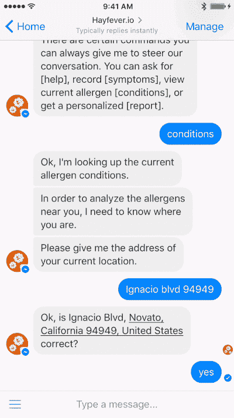
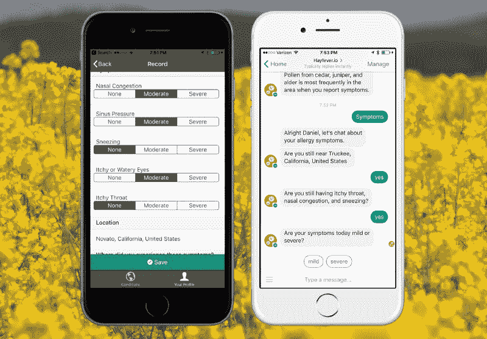

# 为什么我把我的应用程序转换成聊天机器人

> 原文：<https://www.freecodecamp.org/news/why-i-converted-my-app-to-a-chatbot-96355596725c/>

丹尼尔·泰瑞斯

# 我把我的手机应用程序变成了聊天机器人。原因如下。

不到一年前，我开始寻求更好地了解我的季节性过敏。为了支持这个探索，我花了几个周末写了一个名为 Hayfever 的 iOS 和 Android 应用程序。有了这个应用程序，我可以记录我的症状，它会收集该地区过敏原的数据。我的伟大想法是，如果有足够多的人使用该应用程序记录症状，我们就可以处理这些数字，并开始从趋势中学习。

早期用户喜欢花粉热背后的想法。尽管如此，下载量并不多。在查看了这些选项后，我决定放弃传统的应用程序界面，改用对话式界面，并将 Hayfever 转换成聊天机器人。这篇文章解释了引导我走上这条道路的原因。

Hayfever as a chatbot on Facebook Messenger

### 分析趋势

我并不完全惊讶于花粉热在获取下载方面遇到的困难。在应用商店中有一些排名很好的竞争应用。其中大部分是由试图销售 OTC 过敏药物的公司生产的。我怀疑他们背后的真正动机。但是这些大公司有很多广告预算来推广他们的应用。

除此之外，行业中的一些趋势使得独立开发者的工作变得更加困难。2016 年 9 月， [Recode](http://www.recode.net/2016/9/16/12933780/average-app-downloads-per-month-comscore) 报告称，“半数美国智能手机用户每月下载的应用为零。”这也不是一个新趋势，因为自 2014 年以来，我们已经看到[类似的数字](https://qz.com/253618/most-smartphone-users-download-zero-apps-per-month/)。

这并不意味着人们不再使用应用程序。事实上，在其年终回顾中，App Annie 表示 2016 年美国花在应用上的时间增长了 25%以上。但是故事不止于此。消费者花在智能手机上的时间超过了[84%](https://techcrunch.com/2015/06/22/consumers-spend-85-of-time-on-smartphones-in-apps-but-only-5-apps-see-heavy-use/),仅使用他们从应用商店安装的五个非本地应用。**总之，消费者正在使用移动应用，但主要是少数公司的现有应用。**

事实上，根据 Sensor Tower 的数据，2016 年第三季度，iOS 应用下载量排名前五的是 Pokémon GO、优步、Facebook Messenger、WhatsApp 和脸书。其中三个属于同一家公司，你可能会注意到前五名中有两个是消息应用。同样，App Annie [报告](http://venturebeat.com/2017/01/17/app-annie-worldwide-app-downloads-grew-15-and-revenue-soared-40-in-2016/)称，2016 年 iOS 和 Google play 上下载量排名前五的应用是脸书、WhatsApp Messenger、Facebook Messenger、Instagram 和 Snapchat。

以下是我们从这些数据中了解到的情况的总结:

1.  我们知道，人们花费大量时间在手机上使用应用程序。
2.  我们知道，人们大多使用大约五个非原生应用程序。
3.  我们知道应用下载量反映了这种模式。普通用户每月下载的新应用为零。
4.  在人们下载的应用程序中，精选的几个占据了大部分安装量。
5.  在 2016 年下载量最高的应用中，大约一半是即时通讯平台。

我愿意推测，如果用户不必下载一个新的应用程序来使用一项服务，那么**更容易获得一个用户。我也愿意推测，**用户更有可能继续使用集成到他们已经使用的应用程序中的服务。最后，我敢打赌，越来越多的**人愿意在信息平台上与机器人**聊天。****

### 适应趋势

在研究了上述趋势后，我很清楚，花粉热在第一年的缓慢采用并非侥幸。这就是目前移动 app 开发环境的现实。然而，我仍然相信花粉热解决了一个真正的问题，并提供了一个有价值的服务。毕竟在美国有 5000 万鼻过敏症患者，而且人数还在上升。所以经过一番考虑，我能够提出三个前进的选择:

1.  把钱和时间花在付费下载和增长计划上。
2.  在应用程序中引入病毒成分，以鼓励有机增长。
3.  支点，减少安装摩擦，去已经有用户的地方。

我购买广告和付费下载的预算非常有限。花粉热是一个附带项目，我不能把钱投入其中。虽然我很想引入一个病毒组件，但我还没能想出一个好的挂钩。因此，当我从一个纯粹的用户获取角度来看这个问题时，将花粉热转化为聊天机器人似乎是一个有前途的选择。但用户获取只是拼图的第一块。为了留住这些用户，他们对对话式用户界面的体验必须是积极的。

### 反对对话式用户界面的论点

也有一些反对聊天机器人和对话式用户界面的观点。尽管 2016 年有大量的宣传，但还没有任何突破性的聊天机器人成功。还没有任何东西能与《口袋妖怪 GO》的规模相提并论。事实上，按需经济最成功的应用程序似乎表明，对话式用户界面不如设计良好的图形用户界面有用。2016 年下载量最高的应用之一优步就是一个完美的例子。优步向我们展示了数百万用户宁愿点击手机上的按钮，也不愿打电话给出租车公司和调度员交谈。

此外，用户的位置可能是许多移动应用程序的关键信息。使用传统的移动应用程序，只要用户授予权限，应用程序就可以访问用户的当前位置。这种对位置的持久访问对大多数聊天机器人开发者来说还不可用。在 Facebook Messenger 上，聊天机器人可以请求用户的位置，但每次需要时都必须这样做。这对花粉热来说是件大事。当用户记录症状时，位置对于查找该区域的过敏原至关重要。目前，无法直接访问位置是反对将花粉热转化为聊天机器人的最有力的理由。

最后，开发聊天机器人应用程序需要不同于传统移动应用程序的技能。我发现自己花在撰写文案上的时间比花在应用程序上的时间还要多。一个人必须写一个脚本，这不是大多数开发人员乐意做的事情。此外，用于编写、编辑和测试聊天机器人交互的工具很难找到。我会写一篇关于我用来创建聊天机器人的工具的后续文章。

### 聊天机器人能做好什么

当一项技术被大肆宣传时，热切的开发人员会尝试使用该技术来解决各种问题。对于对话式用户界面来说，现在还是早期。我们还没有真正看到最佳实践的出现。但是有几件事情对话式用户界面可以做得很好，非常适合像 Hayfever 这样的应用程序。

过去，我用几个应用程序来记录信息，比如我在吃什么，我在做什么锻炼，或者我感觉如何。我对其中大多数的体验是，与 GUI 的交互可能是乏味和枯燥的。这意味着我厌倦了，不再写日志。对话式用户界面可以为平淡的交互增加一点个性。代替在表格上打勾，我可以有一种和同情我的朋友或医生讨论我的症状的感觉。聊天机器人可以在我症状糟糕的日子里表达关切，提供建议或补救措施，并在我的症状消退时传达快乐。

GUI 还面临着在屏幕上显示大量可能选项的挑战。这可能会让用户不知所措和分心。我承认，在设计数据输入表单和隐藏不必要的功能方面，一个更有才华的设计师会比我做得更好。但那绝对是一门艺术，而不是微不足道的技能。有了对话式用户界面，**可以更容易地根据当前用户的历史和对话进程只提出相关的问题**。这是一个平衡的行为，因为引导用户通过无休止的是/否问题也不是一个好的体验。我发现，一旦花粉热对我的症状历史有了一点了解，事情不会有太大的变化，记录变得令人愉快。

Left (before): a form-like GUI for logging allergy symptoms. Right (after): a conversational UI for logging allergy symptoms.

最后，聊天机器人可以非常自然地处理重新参与。对于花粉热，知道某人没有出现症状和知道他们有一样重要。但是当一个人没有症状时，记录并不是最重要的。聊天机器人可以发送自然语言提示，比如，“昨天你报告了轻度过敏症状。你还打喷嚏吗？”传统应用可以通过推送通知做到这一点，但不会增加复杂性。首先，您的用户必须允许推送通知通过。其次，当用户点击通知时，应用程序必须导航到数据输入流程中的正确点。使用聊天机器人，用户在打开消息客户端后，直接进入对话的那个点。

### 总结

在过去的几个月里，我一直在寻找一种方法来更好地采用我写的一个应用程序，让人们记录和分析过敏症状。我查阅的数据显示，用户并不经常在手机上安装新应用。正在安装的一些顶级应用是消息应用。所以我在 Facebook Messenger 上把花粉热转换成了一个[聊天机器人。我发现创建一个聊天机器人需要我使用一些不同的技能，尤其是文案。我还发现聊天机器人对于依赖用户当前位置的用例来说并不理想。但是对话式用户界面能够简化重复的数据输入。这也使得日志信息更有吸引力。我将在这个过敏季节发现聊天机器人版本的花粉热是否比应用程序版本得到更多的使用。](https://m.me/292464074487244)

如果你喜欢这个，并希望我写更多关于我的聊天机器人经历，请点击？下面。