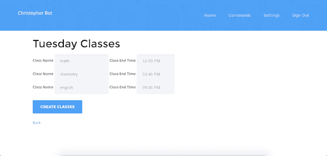
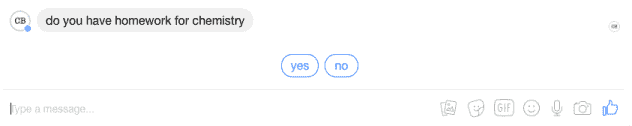
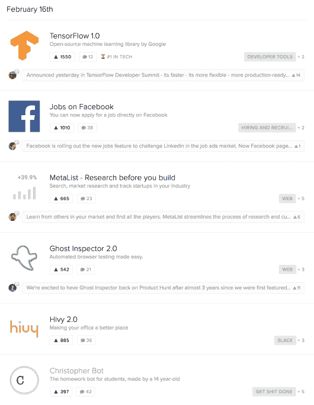
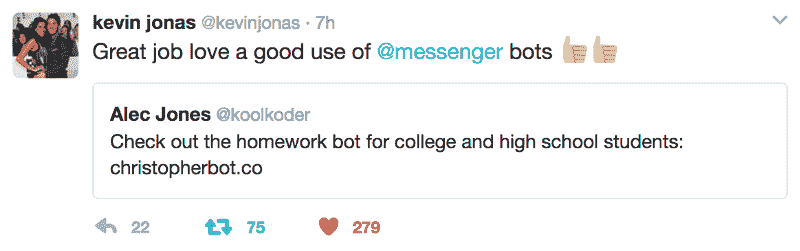
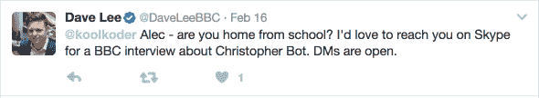
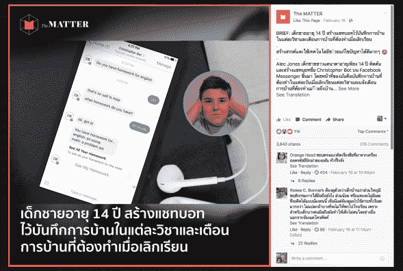

# 当你只有 14 岁的时候，制作并销售一个聊天机器人是什么感觉

> 原文：<https://www.freecodecamp.org/news/the-ups-and-downs-of-building-and-marketing-a-chat-bot-when-youre-14-8a072830b43c/>

亚历克·琼斯

# 当你只有 14 岁的时候，制作并销售一个聊天机器人是什么感觉

我将告诉你我在编写一个流行的 Facebook Messenger 机器人时学到的一切，以及我疯狂营销它的第一周(其中包括来自**乔纳斯兄弟**之一的推文，在**泰国**、**T5、**T7**BBC**的采访**。******

### 事实证明，制造有用的东西比听起来要困难得多

像许多软件开发人员一样，我创造有用东西的使命始于决定 [**解决我自己的问题**](https://gettingreal.37signals.com/ch02_Whats_Your_Problem.php) *。*

我的问题是:我总是忘记晚上要完成的作业。

在八年级的时候，有很多个早上我不得不很早就去学校完成作业。

我知道这在我剩下的 4 年高中生活中是行不通的，因为我不可能每天早上 6:30 准时出现在学校完成数学作业。☹️

所以我决定造一个聊天机器人，它会在每节课结束时提示我，让我告诉它我布置了什么作业。我希望许多其他学生也在为同样的问题而奋斗。

为什么是聊天机器人？当然，现在有很多关于机器人的讨论，但主要是因为**学生从来不会远离他们的智能手机**(特别是在课堂上)…他们已经熟悉了发短信。？

我开始用短信制作聊天机器人，但我很快发现从美国的短信服务(如 Twilio)发送短信是有成本的。即使我使用加拿大的电话号码，在其他国家使用我的机器人也会非常昂贵。

但是脸书信使是免费的。

在 6 年级和 7 年级，我已经学习了相当多的 PHP，并且创建了一些简单的 web 应用程序。但是使用 Facebook Messenger 构建聊天机器人是全新的，我认为这将是学习 Ruby on Rails 的一个很好的机会。

我还必须学习 Facebook Messenger 的 API，以及如何创建一个后台登录网站来管理学生的课程和时间。仅这两件事就涉及到一个陡峭的学习曲线，但是我认为没有什么比把一个想法变成世界各地的学生都可以使用的东西更令人兴奋和满足的了。

### “是个男孩！”

在我开始开发我的聊天机器人近 9 个月后，克里斯托弗·机器人诞生了。

我并没有全职打造他。在暑假(不允许带笔记本电脑)、*学校*、足球、*学校*和几个令人压抑的“从头再来的时刻”之间，没有那么多绵延的**不间断的编码时间**。

即使偶尔有开发时间的爆发，CB(我喜欢这样称呼他)也只是我希望的那样。他是一个可靠但有点厚脸皮的 Facebook 信使机器人，致力于帮助学生。

他是这样工作的…

在你给 CB 发了一条初始信息并安排好你的课程表后，他会在每节课快结束时给你发短信，问你是否有家庭作业。每天结束时，CB 会**给你发一份你需要完成的作业**的整齐清单。

简单又有用。

我认为他工作得很好，因为他消除了学生记下东西的需要。CB 替他们记住了。

当你去度假时，你可以暂停 CB，他会要求你选择一个日期来恢复消息。如果你课后忘了告诉他作业的事，你可以晚点再告诉他。

没有一堆复杂的命令。因为很多学生整天都把手机放在口袋里，所以克里斯托弗·博特总是和他们在一起。

有趣的事实:克里斯托弗是艾伦·图灵在二战中给破解了[谜码](https://en.wikipedia.org/wiki/Enigma_machine)的机器起的名字，这也是我给我的机器人*取名克里斯托弗*的原因。

### 设计一个用户友好的机器人甚至比提出最初的想法更难

对我来说，CB 最重要的部分是他完美的“记忆”。他记得给学生发短信，而不是反过来。

简单的问题和简单的答案让对话进行得更快。克里斯托弗·波特可能不是最聪明的机器人，但他知道如何抓住要点。？

为了让 CB 完成大部分工作，他需要有学生班级的信息。获取这些信息**需要一个网络表单**。

我认为，如果用户不得不在每一天的课上一遍又一遍地输入同样的东西，他们可能会感到厌烦或分心(或者两者都有)并离开。所以为了更快地进行，我决定**基于学生前一天输入的班级数据创建一个自动填写表格**。

因此，用户输入他们周一的课程，然后当他们继续为周二创建相同的课程时，数据已经在表单中了——准备好按原样接受或调整。对于大多数学生来说，输入班级数据只需不到 30 秒的时间。？

我也希望与克里斯托弗·博特的对话能够快速进行，因为课间时间不多。

Bitmojis 和 gif 可能很酷，但我希望对话简洁明了，这样学生就不必花太多时间和 Christopher Bot 交谈。

所以我的下一个主要设计决定是添加 Messenger **“快速回复”**。

这些小按钮就在键盘上方，所以用户不必输入完整的回答。使用“是”和“否”的固定回答可以节省用户的时间，而且**还可以控制一组回答**，这样我就不用担心人们会回答“是”、“不”、“不”等等。？

最后，我希望克里斯托弗·博特感觉“像人类”，但不要假装自己是人类。为了做到这一点，我模仿真实对话的方式，为大多数自动回复添加了输入延迟。

如果 CB 在不到 1 毫秒的时间内作出响应，一些用户可能甚至没有意识到一条新消息已经发送出去了…这发生得太快了。

打字延迟是 Facebook Messenger 的一个很好的附加功能——这是几个帮助机器人感觉更像人类的智能工具之一，但**没有试图欺骗人们**。

### 说真的，有多少个时区？

开发 Christopher Bot 的最大挑战之一是处理世界各地的时区。我对概念的把握已经足够好了，但整理 24+时区的上课时间和课文需要更深入的理解。

上课时间都存储在用户的当地时区，每次 CB 给用户发短信，都是基于同一个当地时区。

很简单，但是 Christopher Bot(即服务器)“生活”在一个时区。

因此，当 CB 检查数据库以决定是否在那一刻发送文本时，他必须首先检查服务器时间是否与用户时区中的课程结束时间*匹配。*

我发现处理这种混乱局面的最好方法是将所有时间转换为****【UTC】**。然后，我所要做的就是将 UTC 偏移量(UTC +/-)存储在学生的下课时间旁边，以确保一切都按顺序排列。**

### **主页模板是有史以来最好的发明(一旦你了解它们)**

**当用户访问 https://www.christopherbot.co/时，他们会看到一个漂亮的主页。不过，这不是我设计的。**

**我不是 HTML/CSS 专家，所以我决定**购买一个引导模板**来整合到我的应用程序中。**

**我认为设置它只需要三个简单的步骤:**

1.  **购买模板**
2.  **将不同的部分添加到我的目录中**
3.  **不用担心，我有一个非常性感的网站**

**我错了。*所以*错了！**

**“驱动”Christopher Bot 的应用程序是基于 Ruby on Rails 构建的。**

**问题是我的引导模板不知道我在使用 Ruby on Rails。**

**所以我花了几天时间学习 Rails 如何使用 Javascript 文件、引用图像等等。大约一个星期后，我终于让它正常工作了。图像正在加载，一切看起来都很美。**

**但是我开始注意到一些问题。Javascript 图标动画太多了。**

**导航条坏了。**

**最大的问题是，浏览器的**滚动功能被改变了**，使得页面在 Chrome 上滚动太快——而在 Safari 和 Firefox 上根本没有！**

**浏览器之间的差异让我很沮丧…以至于我想把我的显示器扔出我的卧室窗户…我决定最好解决这个问题，而不是向我的父母解释我的显示器是如何突然“失踪”的。**

**很明显，Javascript 是我最大的问题，我尝试了一种极端的方法来解决它。**

**我从我的应用程序中删除了模板中的所有 Javascript 代码。我以为东西会摔得到处都是，结果却发现事情正好相反，这让我很震惊。**

**不仅滚动速度和跨浏览器问题得到了修复，导航也是如此，恼人的视觉效果也消失了。**

**我不敢相信我试图打破它，却修好了一切。**

**试图毁掉你的应用并不是解决编码问题的好办法。但是我意识到有些结果是完全出乎意料的。我尝试了一些感觉希望渺茫的事情，它教会了我，在放弃之前，你应该尝试一切。**

### **一个用户和计数…？**

**你如何让一个聊天机器人从一个用户增长到很多很多用户？最好是通过口口相传。甚至可能*病毒式口碑*。**

**人们总是对他们的朋友正在使用的新事物感到好奇。我希望学生们看到他们的朋友使用 Christopher Bot，并询问这是什么。是有机的，也是免费营销(完美，既然我没钱做 PPC 广告！).**

**我在 CB 里建了一个**分享按钮**来帮助事情向前发展。使用 1 周后，Christopher Bot 礼貌地要求用户在脸书上分享 Christopher Bot。用户只需点击链接，就可以轻松地与朋友分享 CB。**

**但在 2 月初只有少数几个朋友使用 Christopher Bot 的情况下，我需要找到一种方法来获得更多的曝光。**

### **欢迎来到互联网的首页**

**在试图大规模推广 CB 之前，我需要从我的目标受众那里获得一些额外的反馈。**

**高中生和大学生都在哪里网游？事实证明，在网上找到大型的高中生社区相当困难，但 Reddit **是找到大学生的好地方**。**

**我向几个特定大学的子 reddits 发帖，从我的家乡不列颠哥伦比亚省的一对夫妇开始——征求对一般概念的反馈，以及克里斯托弗·博特是否适用于大学生。**

**总的来说，Reddit 用户很有帮助，分享了他们的观点，并提供了关于高中和大学之间“家庭作业”差异的有用反馈。**

**但是也有一群怀疑论者坚持认为我不是 14 岁的孩子…**

**这里有一个来自**真正怀疑者的评论:****

**“做一个‘小企业家’是一个很好的营销策略。这个 14 岁的孩子？他实际上是一个年长的男性，但他伪装成一个年轻的男孩来吸引每个人。看到一个小孩能够做这么多事情是美丽的，有吸引力的，每个人都觉得有动力去支持那个小孩，仅仅因为他很好……很小。”**

**另一封来自认为**我是绝望的营销者的人:****

**“这肯定不是这个孩子做的，肯定是由一个有丰富经验的人推动和推销的。就像他们甚至有先见之明，在 URL 中放了一个“ref=reddit”标记。他们在为他们的分析发送垃圾邮件。”**

**所以一个 14 岁的人不知道如何创建一个简单的 URL 参数？嘘。**

### **击中大时代:产品狩猎和凯文·乔纳斯**

**我 2 月份的首要目标是启动[产品搜索](https://www.producthunt.com/)，在我父亲在他的脸书账户上发布了一条关于 Christopher Bot 的消息后，我收到了来自 [Metalab](http://metalab.co/) (以及 Dribbble 和 Designer News)的 Andrew Wilkinson 的消息……他好心地提出在 2 月 16 日“搜索”CB(感谢 Andrew)。安德鲁也住在维多利亚！**

**午夜过后不久，Andrew 在 Product Hunt 上发布了 CB，当时我正在熟睡(不是真正的*)。***

***对我来说不幸的是，来自谷歌和脸书的全新产品也在那天发布。？***

***即使在激烈的竞争中， **CB 仍然获得了 300 多张投票**，大量鼓励的评论，并在当天的比赛中获得了第六名。？***

******

***观看 CB 的产品搜索非常有趣，它教会了我很多关于企业家世界的知识——包括在人们面前展示一些东西的重要性。***

***像凯文·乔纳斯这样的人。？***

***部分原因可能是因为我的年龄，但我想凯文·乔纳斯那天在推特上向他的 510 万粉丝发布了关于 CB 的消息。)因为他看到了它会对其他同学有用。***

******

***另一个人在寻找产品时注意到了 CB…[BBC 新闻](http://www.bbc.com/news)记者戴夫·李。***

### ***我对 BBC 新闻的激动人心又有点吓人的采访***

***周四——产品搜寻发布日 BBC 新闻的戴夫·李联系我，让我写一篇关于 CB 的文章:***

******

***星期五下午，我和爸爸通过 Skype 和戴夫在一起，分享了我的整个故事。打电话之前我非常紧张，但是戴夫让我放松下来。***

***戴夫告诉我们，周五他会一直写这篇文章到深夜，但当我半夜上床睡觉时，文章还没有播出。但第二天早上，我首先查看了 Christopher Bot 的注册……一夜之间就有 1000 多个新账户。***

***[**文章被直播。**](http://www.bbc.com/news/technology-39013950)***

***随着 1，000 个新帐户的出现，出现了一堆错误报告和几十个新功能请求。我不得不离开营销模式**进入全面支持模式**。***

***仅仅 72 小时后，戴夫·李给我父亲发了一封电子邮件:***

***“亚历克问我，我们的文章有多少读者，我告诉他，我们认为 50 万个 uniques 是一篇成功的文章。我很高兴地说，自从上周六发布以来，关于克里斯托弗·博特的文章已经有了 100 万次独特的观看。”***

### ***嘣！在泰国迅速传播***

***据脸书分析公司称，大量新账户来自英国(鉴于 BBC 的文章，这是有道理的)。***

***但是有一个国家的新账户正在超过英国:泰国。***

***什么？！？！***

***然后 CB 的一个新用户发邮件给我说:***

******

***有人在泰国向脸书发布了关于克里斯托弗·博特的简介。***

***是的，那是**11000 个赞**…3800 条分享……和 205 条评论(我一条也看不懂——甚至是有谷歌翻译的*)。****

### ***克里斯托弗·博特的下一步是什么***

***构建 Christopher Bot 对我来说是一次很好的经历，让我了解了机器人以及如何让机器人的交互为用户服务。***

***除了调整课程安排(新用户的普遍要求)，我前进的目标是提高 CB 的会话技能。***

***我希望他能够“理解”得更多，这样他就能更好地帮助学生。我希望他能够理解更多的反应变化，以及识别拼写错误，如“文本工作”或“我的测验的标准”。***

***克里斯托弗·博特总是可以变得更聪明。***

***我正在考虑开发的一个新功能是“家庭作业分析”——例如，追踪哪些班级的家庭作业最多。Christopher Bot 每天都会收集大量数据(无论是单独的还是综合的)，如果能与用户分享他所学到的东西，那一定会很酷。***

***我在创建和营销 Christopher Bot 的过程中获得了很多乐趣——在这个过程中，起起伏伏比跌宕起伏多得多。***

***我希望将来他能带我去更有趣的地方。***

***如果你已经做到这一步，并且喜欢我的故事，我会真诚地感谢你点击**推荐按钮**。？***