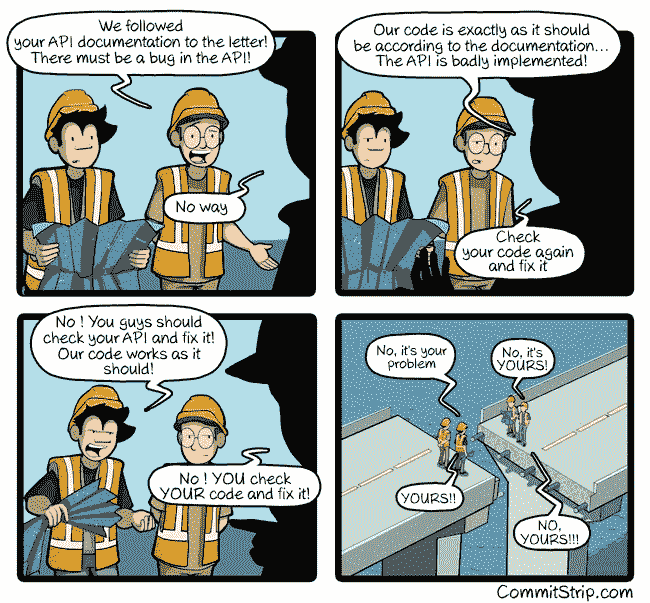
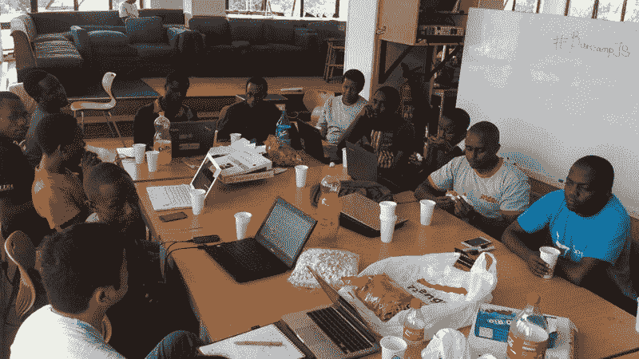

# 几个月来，Cloudflare 一直在从数千家主要网站泄露 HTTPS 数据

> 原文：<https://www.freecodecamp.org/news/cloudflare-has-been-leaking-https-data-from-thousands-of-major-websites-for-months-e1d03d02c610/>

这里有三个值得你花时间的链接:

1.  数月来，Cloudflare 一直在从数千家主要网站泄露 HTTPS 数据。freeCodeCamp 使用 CloudFlare，但不使用易受攻击的产品，因此您与我们的数据(实际上只是您的电子邮件地址和 BCrypt 加密的密码)不会受到影响。这是 Cloudflare 工程师对这个 bug 的事后分析( [13 分钟阅读](http://bit.ly/2li1gy5))
2.  脸书的人工智能机器( [20 分钟阅读](http://bit.ly/2lE0yfz))
3.  经过 9，223，372，036，854，775，808 次尝试后，谷歌创造了第一次 SHA-1 碰撞，证明加密方案不再安全( [4 分钟读取](http://bit.ly/2lSjKc5))

额外收获:一个人工智能正在学习如何在超级粉碎兄弟混战中击败最好的人类玩家

### 想到这一天:

> 任何优秀的安全工程师的口头禅都是:“安全不是产品，而是过程。“不仅仅是在系统中设计强大的加密技术；它正在设计整个系统，以便所有的安全措施，包括加密技术，能够协同工作。”—布鲁斯·施奈尔

### 今日趣事:

网络漫画作者 [CommitStrip](http://bit.ly/2lBZ3Qv)

### 今日学习小组:

[内罗毕自由代码营](http://bit.ly/2mfV2mr)

编码快乐！

–昆西·拉森，自由代码营的老师