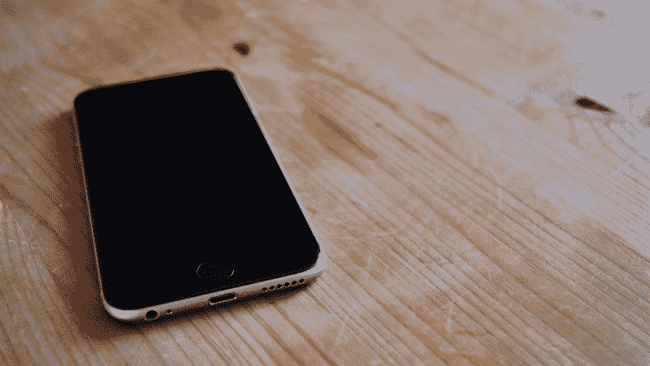
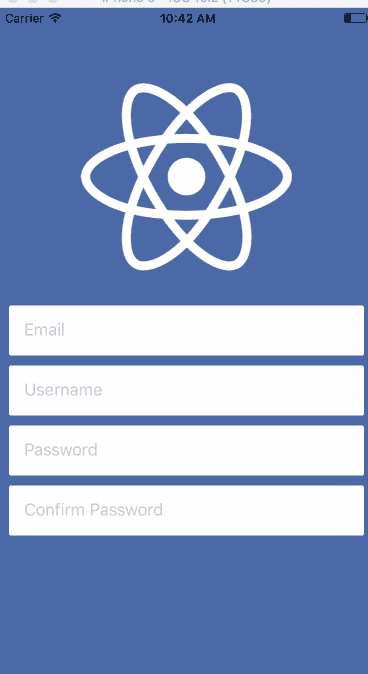
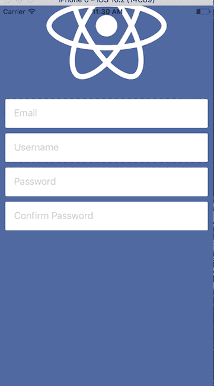
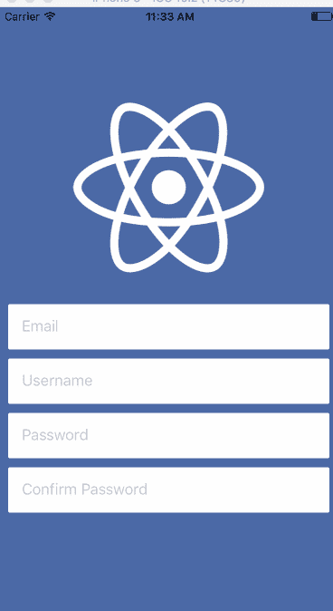
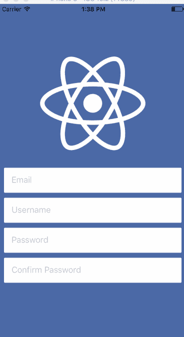

# 如何让你的 React 原生 app 在键盘弹出时优雅响应

> 原文：<https://www.freecodecamp.org/news/how-to-make-your-react-native-app-respond-gracefully-when-the-keyboard-pops-up-7442c1535580/>

作者斯潘塞·卡利

# 如何让你的 React 原生 app 在键盘弹出时优雅响应



当你使用 React 原生应用时，一个常见的问题是当你聚焦于它们时，键盘会弹出并隐藏文本输入。大概是这样的:


有几种方法可以避免这种情况。有些简单，有些不那么简单。有的可以定制，有的不能。今天我将向你展示在 React Native 中避免键盘的 3 种不同方法。

> 我已经把这个教程[的所有源代码放到了 Github](https://github.com/spencercarli/react-native-keyboard-avoidance-examples) 上。

#### 键盘回避视图

最简单也最容易安装的解决方案是[键盘避免视图](https://facebook.github.io/react-native/docs/keyboardavoidingview.html)。这是一个核心组件，但它的功能也很简单。

您可以使用[基本代码](https://gist.github.com/spencercarli/8acb7208090f759b0fc2fda3394796f1)，它的键盘覆盖了输入，然后更新它，使输入不再被覆盖。你要做的第一件事是用`KeyboardAvoidingView`替换容器`View`，然后给它添加一个`behavior`道具。如果你看一下文档，你会发现它接受 3 个不同的值——*高度，填充，位置*。我发现*填充*以最可预测的方式工作。这就是我要用的。

```
import React from 'react';
import { View, TextInput, Image, KeyboardAvoidingView } from 'react-native';
import styles from './styles';
import logo from './logo.png';

const Demo = () => {
  return (
    <KeyboardAvoidingView
      style={styles.container}
      behavior="padding"
    >
      <Image source={logo} style={styles.logo} />
      <TextInput
        placeholder="Email"
        style={styles.input}
      />
      <TextInput
        placeholder="Username"
        style={styles.input}
      />
      <TextInput
        placeholder="Password"
        style={styles.input}
      />
      <TextInput
        placeholder="Confirm Password"
        style={styles.input}
      />
      <View style={{ height: 60 }} />
    </KeyboardAvoidingView>
  );
};

export default Demo;
```

KeyboardAvoidingView.js

这给了我们以下结果。它并不完美，但对于几乎任何工作来说，它都是相当好的。



需要注意的一点是，在第 30 行你会看到一个高度设置为 60px 的`View`。我发现键盘回避视图对最后一个元素不太适用，设置填充/边距也不起作用。因此，我添加了一个新元素，将所有东西“凸起”几个像素。

使用这个简单的实现时，顶部的图像被推出视图。我将在最后向您展示如何解决这个问题。

> *Android 用户:我发现这是最好/唯一的选择。通过将`android:windowSoftInputMode="adjustResize"`添加到 AndroidManifest.xml 中，操作系统将为您处理大部分工作，键盘避免视图将处理剩下的工作。[示例 AndroidManifest.xml](https://gist.github.com/spencercarli/e1b9575c1c8845c2c20b86415dfba3db#file-androidmanifest-xml-L23) 。这篇文章的其余部分可能对你不适用。*

#### 键盘感知滚动视图

下一个选项是[react-native-keyboard-aware-scroll-view](https://github.com/APSL/react-native-keyboard-aware-scroll-view)，它会给你带来很大的好处。在幕后，它使用 ScrollView 或 ListView 来处理一切(取决于您选择的组件)，这使得滚动交互非常无缝。这个包的另一个主要好处是它将滚动到焦点上的输入，这给用户一个很好的体验。

用法也很简单——你只需要换出容器`View`,再次从[基本代码](https://gist.github.com/spencercarli/8acb7208090f759b0fc2fda3394796f1)开始，并设置一些选项。下面是代码，我来描述一下。

```
import React from 'react';
import { View, TextInput, Image } from 'react-native';
import { KeyboardAwareScrollView } from 'react-native-keyboard-aware-scroll-view'
import styles from './styles';
import logo from './logo.png';

const Demo = () => {
  return (
    <KeyboardAwareScrollView
      style={{ backgroundColor: '#4c69a5' }}
      resetScrollToCoords={{ x: 0, y: 0 }}
      contentContainerStyle={styles.container}
      scrollEnabled={false}
    >
        <Image source={logo} style={styles.logo} />
        <TextInput
          placeholder="Email"
          style={styles.input}
        />
        <TextInput
          placeholder="Username"
          style={styles.input}
        />
        <TextInput
          placeholder="Password"
          style={styles.input}
        />
        <TextInput
          placeholder="Confirm Password"
          style={styles.input}
        />
    </KeyboardAwareScrollView>
  );
};

export default Demo;
```

KeyboardAwareScrollView.js

首先你要设置 ScrollView 的 *backgroundColor* ，这样(如果你要重新启用滚动)背景颜色总是相同的。接下来你要告诉组件默认的位置，这样一旦键盘关闭，它就回到那个位置——通过省略这个属性，视图可能会在关闭键盘后停留在顶部，就像这样。



在*resetscrolltocords*prop 之后，你设置 *contentContainerStyle —* 这实质上替换了你之前拥有的包含`View`样式。我要做的最后一件事是从用户交互中禁用 scrollview。这对于您的 UI 来说可能并不总是有意义的(比如一个用户正在编辑许多 profile 字段的界面),但是对于这个界面来说，允许用户手动滚动并没有多大意义，因为没有什么可以滚动的。

将这些道具组合在一起，你会得到下面的结果，这个效果非常好。



#### 键盘模块

这是迄今为止最需要手动操作的选项，但也给了您最大的控制权。您将使用动画库来帮助进行流畅的交互，就像您之前看到的那样。

React 本地站点上没有记录的键盘模块允许您监听设备发出的键盘事件。您将使用的事件是 *keyboardWillShow* 和 *keyboardWillHide* ，它们返回动画将花费的时间长度和键盘的结束位置(以及其他信息)。

> 如果你在 Android 上，你会想用 keyboardDidShow 和 keyboardDidHide 来代替。

当发出 *keyboardWillShow* 事件时，你将设置一个动画变量到键盘的最终高度，并让它在与键盘滑动动画相同的持续时间内产生动画。然后，使用这个动画值设置容器底部的填充，使所有内容向上凸起。

一会儿我会展示代码，但是做我上面描述的事情会给我们留下这种体验。


这次我想改变这个形象。为此，您将使用一个动画值来管理图像的高度，您将在键盘打开时调整该高度。这是代码。

```
import React, { Component } from 'react';
import { View, TextInput, Image, Animated, Keyboard } from 'react-native';
import styles, { IMAGE_HEIGHT, IMAGE_HEIGHT_SMALL} from './styles';
import logo from './logo.png';

class Demo extends Component {
  constructor(props) {
    super(props);

    this.keyboardHeight = new Animated.Value(0);
    this.imageHeight = new Animated.Value(IMAGE_HEIGHT);
  }

  componentWillMount () {
    this.keyboardWillShowSub = Keyboard.addListener('keyboardWillShow', this.keyboardWillShow);
    this.keyboardWillHideSub = Keyboard.addListener('keyboardWillHide', this.keyboardWillHide);
  }

  componentWillUnmount() {
    this.keyboardWillShowSub.remove();
    this.keyboardWillHideSub.remove();
  }

  keyboardWillShow = (event) => {
    Animated.parallel([
      Animated.timing(this.keyboardHeight, {
        duration: event.duration,
        toValue: event.endCoordinates.height,
      }),
      Animated.timing(this.imageHeight, {
        duration: event.duration,
        toValue: IMAGE_HEIGHT_SMALL,
      }),
    ]).start();
  };

  keyboardWillHide = (event) => {
    Animated.parallel([
      Animated.timing(this.keyboardHeight, {
        duration: event.duration,
        toValue: 0,
      }),
      Animated.timing(this.imageHeight, {
        duration: event.duration,
        toValue: IMAGE_HEIGHT,
      }),
    ]).start();
  };

  render() {
    return (
      <Animated.View style={[styles.container, { paddingBottom: this.keyboardHeight }]}>
        <Animated.Image source={logo} style={[styles.logo, { height: this.imageHeight }]} />
        <TextInput
          placeholder="Email"
          style={styles.input}
        />
        <TextInput
          placeholder="Username"
          style={styles.input}
        />
        <TextInput
          placeholder="Password"
          style={styles.input}
        />
        <TextInput
          placeholder="Confirm Password"
          style={styles.input}
        />
      </Animated.View>
    );
  }
};

export default Demo;
```

KeyboardModule.js

它肯定比其他任何解决方案都有更多的优点。你使用的不是普通的`View`或`Image`，而是一个`Animated.View`和`Animated.Image`，这样就可以利用动画值。有趣的部分在于*键盘会显示*和*键盘会隐藏*功能，其中动画值正在变化。

这里发生的是两个动画值并行变化，然后被用来驱动 UI。留给你这个。


这是相当多的代码，但它相当光滑。你有很多选择，你可以做什么，可以真正定制互动到你的心的内容。

#### 组合选项

如果你想节省一些代码，你可以结合几个选项，这就是我倾向于做的。例如，通过结合选项 1 和 3，你只需要担心管理和动画图像的高度。

代码并不比选项 3 的源代码少多少，但是随着 UI 复杂性的增加，它可以帮你一点忙。

```
import React, { Component } from 'react';
import { View, TextInput, Image, Animated, Keyboard, KeyboardAvoidingView } from 'react-native';
import styles, { IMAGE_HEIGHT, IMAGE_HEIGHT_SMALL } from './styles';
import logo from './logo.png';

class Demo extends Component {
  constructor(props) {
    super(props);

    this.imageHeight = new Animated.Value(IMAGE_HEIGHT);
  }

  componentWillMount () {
    this.keyboardWillShowSub = Keyboard.addListener('keyboardWillShow', this.keyboardWillShow);
    this.keyboardWillHideSub = Keyboard.addListener('keyboardWillHide', this.keyboardWillHide);
  }

  componentWillUnmount() {
    this.keyboardWillShowSub.remove();
    this.keyboardWillHideSub.remove();
  }

  keyboardWillShow = (event) => {
    Animated.timing(this.imageHeight, {
      duration: event.duration,
      toValue: IMAGE_HEIGHT_SMALL,
    }).start();
  };

  keyboardWillHide = (event) => {
    Animated.timing(this.imageHeight, {
      duration: event.duration,
      toValue: IMAGE_HEIGHT,
    }).start();
  };

  render() {
    return (
      <KeyboardAvoidingView
        style={styles.container}
        behavior="padding"
      >
          <Animated.Image source={logo} style={[styles.logo, { height: this.imageHeight }]} />
          <TextInput
            placeholder="Email"
            style={styles.input}
          />
          <TextInput
            placeholder="Username"
            style={styles.input}
          />
          <TextInput
            placeholder="Password"
            style={styles.input}
          />
          <TextInput
            placeholder="Confirm Password"
            style={styles.input}
          />
      </KeyboardAvoidingView>
    );
  }
};

export default Demo;
```

Combo.js



每种实现都有它的优点和缺点——考虑到你想要的用户体验，你必须选择最合适的一种。

> 您有兴趣了解更多关于使用 React Native 构建高质量移动应用程序的信息吗？[报名参加我的免费 React 本土课程](http://learn.handlebarlabs.com/p/react-native-basics-build-a-currency-converter)！