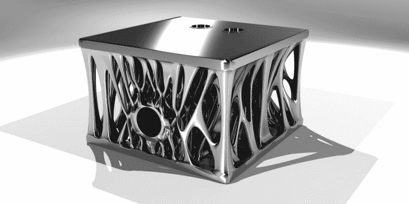

# 内部堆栈溢出的激进导航栏重新设计

> 原文：<https://www.freecodecamp.org/news/inside-stack-overflows-radical-navigation-bar-redesign-8b67476c3783/>

这里有三个值得你花时间的链接:

1.  内部堆栈溢出的激进导航栏重新设计( [7 分钟阅读](http://bit.ly/2lpmfkX))
2.  我如何构建了一个赢得 2016 年 Azure 机器学习奖的游戏( [5 分钟阅读](http://bit.ly/2mcqFKg))
3.  D3 和画布分 3 步( [22 分钟读取](http://bit.ly/2lvryOj))

额外收获:马克·库班在推特上发布了我的自动化文章后，美国发行量最大的报纸《今日美国》写了这篇文章

### 想到这一天:

> “有一个古老的故事，讲的是一个人希望他的电脑像他的电话一样容易使用。这个愿望实现了，因为我不再知道如何使用我的电话。”—比雅尼·斯特劳斯特鲁普(C++的创始人)

### 每日一图:

由[深度学习生成设计](http://bit.ly/2loYgSU)算法创建的轻型发动机缸体。

### 今日学习小组:

布达佩斯自由代码营

编码快乐！

–昆西·拉森，自由代码营的老师