# 更多关于 Flexbox 的工作原理——用大的、彩色的、动画 gif 解释

> 原文：<https://www.freecodecamp.org/news/even-more-about-how-flexbox-works-explained-in-big-colorful-animated-gifs-a5a74812b053/>

斯科特·多姆斯

# 更多关于 Flexbox 的工作原理——用大的、彩色的、动画 gif 解释

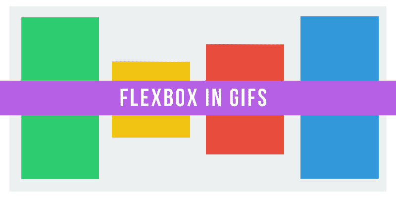

[上次](https://medium.freecodecamp.com/an-animated-guide-to-flexbox-d280cf6afc35#.xdqa0my2e)我们从基本的 Flexbox 属性开始:flex-direction、justify-content、align-items 和 align-self。

这些命令对于创建基本布局非常有用。但是一旦你开始用 Flexbox 构建网页，你需要更深入地挖掘它的潜力。

现在，让我们深入了解 Flexbox 的规模，以及如何利用它来构建适应性强且美观的布局。

### 属性#1:弹性基础

在[的上一篇文章](https://medium.freecodecamp.com/an-animated-guide-to-flexbox-d280cf6afc35#.xdqa0my2e)中，我们主要关注了适用于容器元素的属性。这一次，我们将专门检查应用于子元素的大小。

在我看来，我们的第一个属性是 Flexbox 教程中解释得最少的属性之一。

但是——别担心。其实挺直白的。

Flex-basis 在元素被其他 Flexbox 属性操作之前控制元素的默认大小*(稍后将详细介绍)。*

在下面的 GIF 中，这意味着它可以与 width 属性互换:

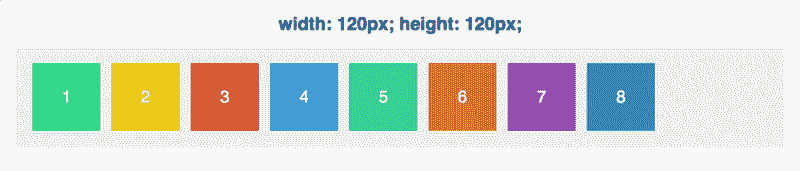

然而，让 flex-basis 与众不同的是，它符合我们优良的 ol' flex 轴:

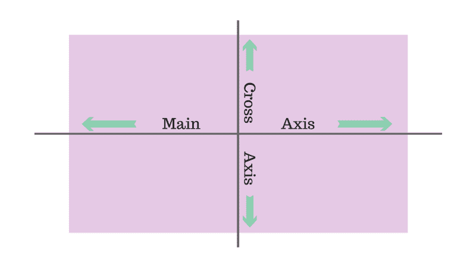

Flex-basis 影响元素在主轴上的尺寸*。*

让我们看看当我们保持 flex-basis 不变，但改变主轴方向时会发生什么:

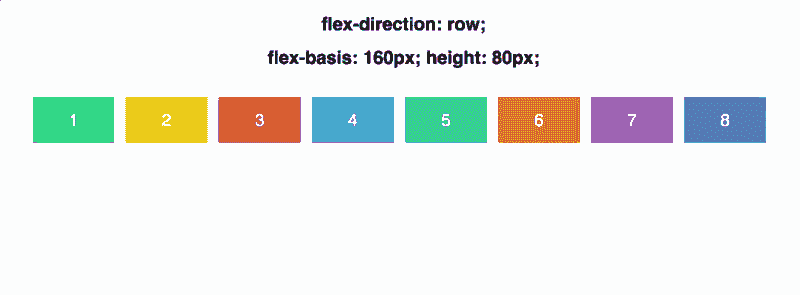

请注意，我们必须从手动设置高度切换到设置宽度。因此，根据弯曲方向，Flex-basis 交替确定宽度**或**高度。

### 特性 2:灵活增长

现在我们要变得更复杂一点。

首先，让我们将所有的正方形设置为相同的宽度，120 像素:

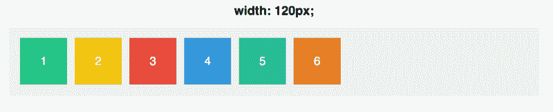

现在，当涉及到名为 **flex-grow** 的属性时，默认为 **0** 。这意味着方块不允许增长来占据容器中的空间。

那是什么意思？好吧，让我们试着将每个方块的 flex-grow 增加到 **1** :

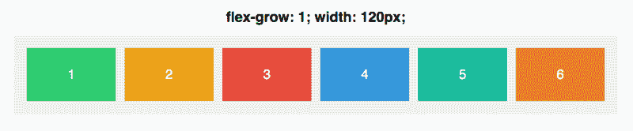

这些方块共同占据了容器的整个宽度，空间均匀分布在它们之间。*伸缩值覆盖宽度。*

然而，flex-grow 令人困惑的部分是其价值的实际含义。 **flex-grow: 1** 实际上意味着什么？

嗯，如果我们将每个方块的伸缩长度设置为 999，看起来会是这样:

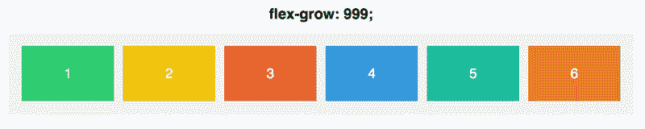

这……完全一样。

这是因为 flex-grow 不是一个绝对值，而是一个相对值。

重要的不是一个方块本身的伸缩值是多少，而是它与其他方块的关系。

如果我们将每个方块设置为 flex-grow: 1，然后调整方块#3 的 flex-grow，我们会看到变化:

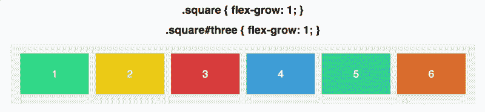

为了真正理解这里发生了什么，让我们快速地绕过一些(简单的)数学。

每个方块以 1 的伸缩值开始。如果我们把每个方块的伸缩长度加起来，我们的总数是 6。容器因此被分成 6 个独立的部分。每个方块会增长到填满容器中 1/6 的可用空间。

当我们将 Square #3 的 flex-grow 设置为 2 时，容器现在被分成了 **7** 个不同的部分，因为 flex-grow 属性的总数是 1 + 1 + 2 + 1 + 1 + 1。

然后，方块#3 得到该空间的 2/7，其余的得到 1/7。

当我们对 Square #3 使用 flex-grow: 3 时，容器被分成 8 个部分(1 + 1 + 3 + 1 + 1 + 1)，Square #3 得到 3/8，其余的得到 1/8。

诸如此类。

**Flex-grow 完全是关于比例的**。如果我们将每个正方形设置为 flex-grow: 4，将正方形#3 设置为 flex-grow: 12，我们将分别得到与 1 和 3 相同的结果:

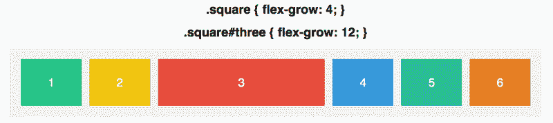

重要的是每个方块的伸缩与其他方块的伸缩成正比。

最后，请记住，就像 flex-basis 一样，flex-grow 适用于整个主轴。我们的正方形将只在宽度方向上增长，除非我们将伸缩方向设置为列。

### 特性#3:弹性收缩

Flex-shrink 与 flex-grow 相反，它决定了一个正方形可以收缩多少。

只有当元素必须收缩以适合它们的容器时，也就是当容器太小时，它才会起作用。

它的主要用途是指定要收缩哪些项目，不收缩哪些项目。默认情况下，每个方块的 flex-shrink 为 1，这意味着它会随着长方体的收缩而收缩。

让我们看看它的实际效果。在下面的 GIFS 中，正方形的伸缩值为 1，所以它们填充了容器，伸缩值为 1，所以它们被允许收缩。

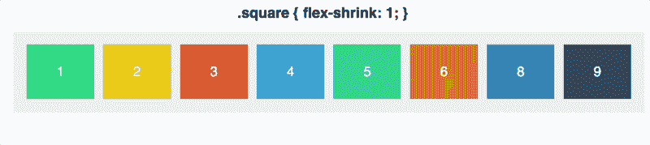

现在让我们将 3 号方块的伸缩设置为 0。它是禁止收缩的，所以当它增长到适合容器时，它拒绝下降到设定的 120 像素以下。

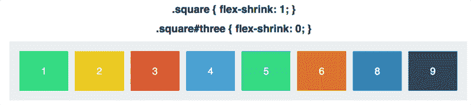

flex-shrink 的默认值是 1——这意味着你的元素会收缩，直到你告诉它们不要收缩！

再说一遍，伸缩是关于比例的。如果一个盒子的伸缩系数为 6，而其他盒子的伸缩系数为 2，那么随着空间的压缩，这个盒子的收缩速度将是其他盒子的 3 倍。

注意这里的措辞:3 倍伸缩的正方形会以 3 倍的速度收缩。这并不意味着它会收缩 1/3 的宽度。

一会儿，我们将深入探究事物收缩和增长的程度。但是首先，让我们去最后一个地方，把所有的东西放在一起。

### 特性 4:弹性

Flex 是 grow、shrink 和 basis 的简写，所有这些放在一起。

默认为 0(增长)1(收缩)和自动(基础)。

对于我们的最后一个例子，让我们简化到两个盒子。

以下是它们的属性:

```
.square#one {  flex: 2 1 300px;}
```

```
.square#two {  flex: 1 2 300px;}
```

两者具有相同的弹性基础。这意味着如果有足够的空间容纳它们(容器是 600 像素加上边距和填充空间)，它们的宽度都是 300 像素。

但是随着盒子的增长，Square 1(具有更高的 flex-grow)将以两倍的速度增长。随着盒子收缩，正方形 2(具有较高的弯曲收缩)将以两倍的速度收缩。

现在一起:

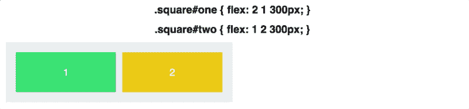

#### 事物如何收缩和生长

这可能会令人困惑:当正方形 1 增长时，它不会增长到正方形 2 的两倍大。同样，当方块 2 收缩时，它不会收缩到方块 1 的一半大小，即使伸缩比为 2 比 1。

不是它们的大小是 2 比 1 或 1 比 2。这是它们收缩和生长的速度。

#### 一点数学

容器的起始大小是 640 像素。在考虑了容器每边 20px 的填充后，这为两个正方形留出了足够的空间来恢复其 300px 的伸缩基数

当容器设置为 430 像素时，我们损失了**210 像素**的空间。伸缩为 1 的方块 1 丢失了 **70px** 。伸缩为 2 的方块 2 损失了 **140px** 。

当容器缩小到 340 像素时，我们就失去了 300 像素的空间。方格 1 输 **100px** ，方格 2 输 **200px** 。

损失的空间根据它们各自的伸缩比(2 比 1)进行分配。

flex-grow 也是如此。当容器增长到 940px 时，我们获得了 **300px** 的空间，方块 1 获得了额外的 **200px** ，方块 2 获得了额外的 **100px** 。

谈到弹性，比例是游戏的名字。

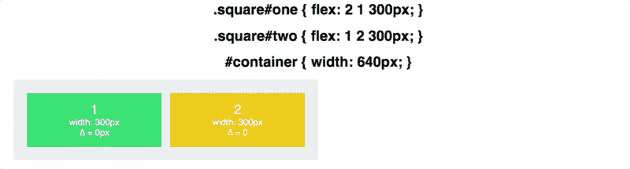

在上面的 GIF 中，您可以看到宽度是如何根据比率进行调整的，delta(∈)显示了与 flex-basis 的差异。

### 结论

最后总结一下:flex-basis 控制着一个元素在增长或收缩之前沿主轴的大小。Flex-grow 决定了它相对于同级元素的增长比例，而 flex-shrink 决定了它的收缩比例。

我们还有一些 Flexbox 属性要介绍——请在接下来的几周里密切关注。

非常感谢你的阅读！对这些文章的反应非常热烈。真的很感谢大家抽出时间阅读、回复、推荐、分享！

如果你想在类似的文章中看到对某个特定概念(Flexbox 或其他)的解释，请回复或发推特给我。您也可以在 [Twitter](https://twitter.com/scottdomes) 和 Medium 上关注我(点击下面的关注按钮)。