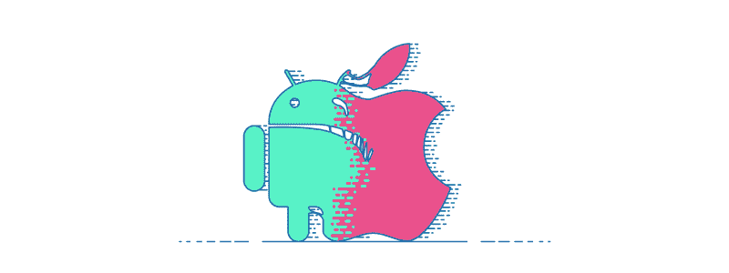
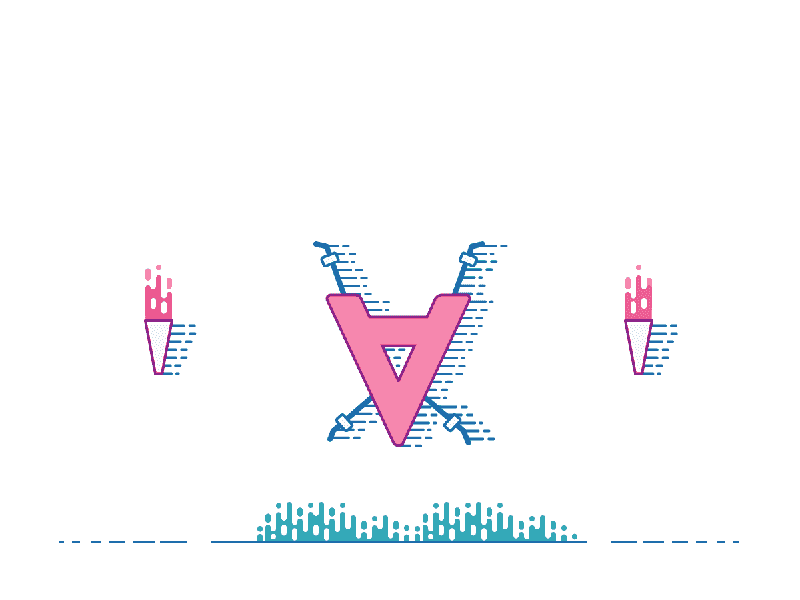
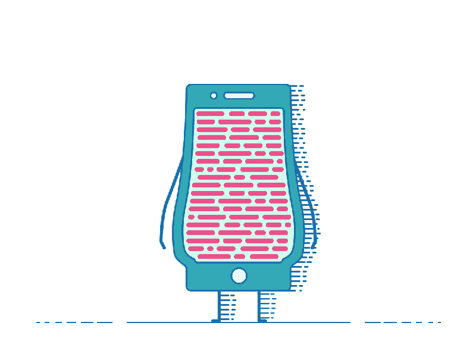
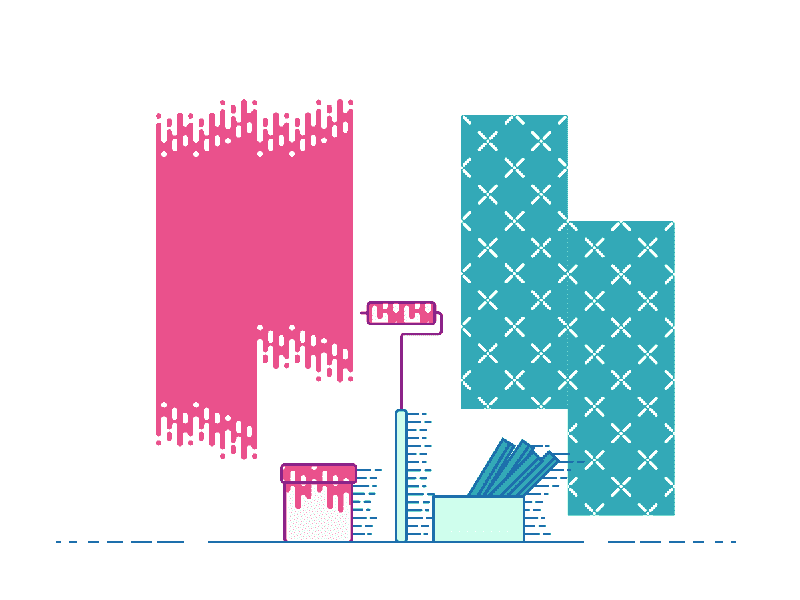
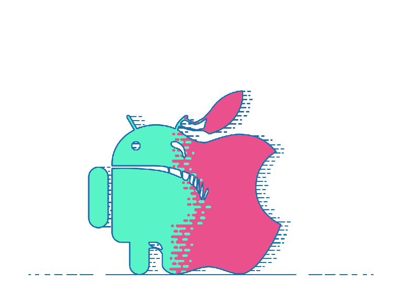
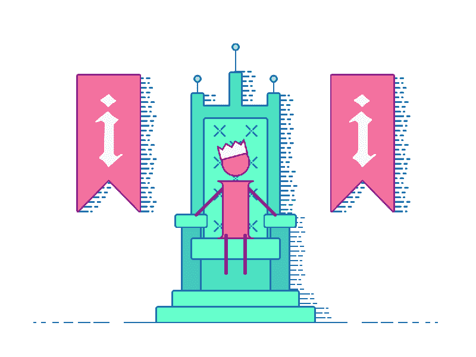
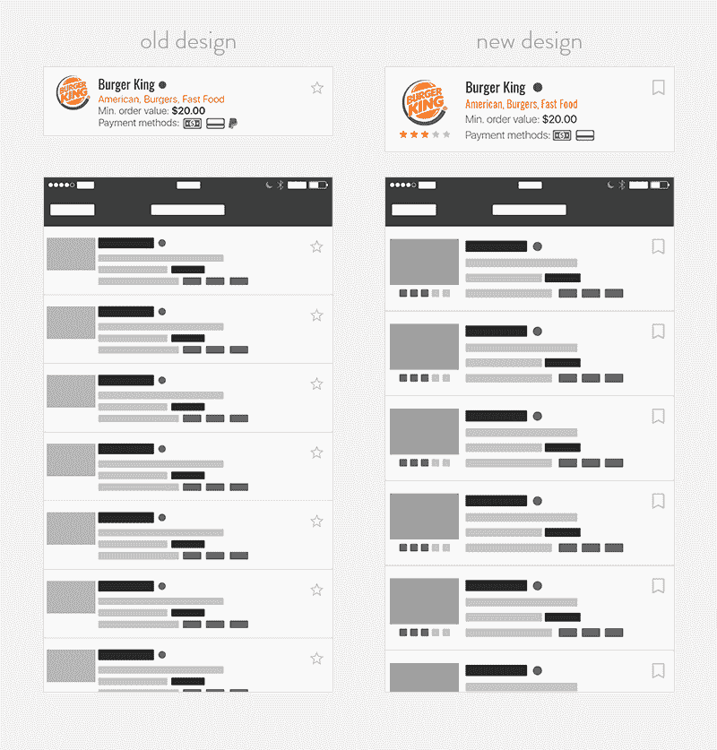
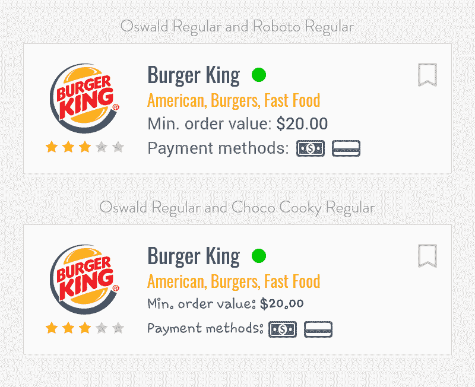
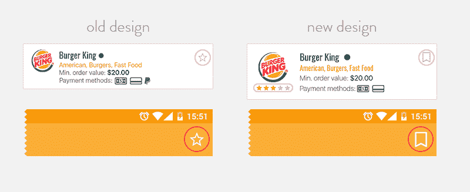

# 如何不完全破坏你的手机应用程序的用户界面

> 原文：<https://www.freecodecamp.org/news/how-to-not-utterly-ruin-your-mobile-apps-user-interface-8433cee6477d/>

卢克·科尼尔

# 如何不完全破坏你的手机应用程序的用户界面

设计一个优秀的用户界面没有一个通用的公式(如果你发现了一个，请告诉我)。但是我知道，如果你想开发一款优秀的应用，应该避免一些重大错误。

我见过所有经验水平的设计师犯的每一个错误。这并不可耻——一个好的 UI 设计是一个多方面的挑战，很容易忽略它的某些方面。

在 [All In Mobile](https://www.allinmobile.co/) ，我们经常为那些对自己的产品不满意、希望改善应用外观和感觉的客户重新设计应用。所以今天我要分享一些我观察到的主要禁忌。

当然，我致力于解决问题，而不仅仅是指出问题。因此，我将演示所有这 5 个主要的 UI 错误，然后向您展示重新设计的应用程序视图，以便您可以看到您的团队如何修复它们。

### UI 错误 1:滥用字体

让我们从系统字体系列开始。

比如旧金山是 iOS 的系统字体，安卓有 Roboto。它们都很容易阅读，而且非常相似。

系统字体可以用吗？是的，肯定的。这是一个安全可靠的选择。但是请记住，三星手机允许你改变默认字体。如果手机用户切换到虫火谷 Cooky 字体，你设计精美的应用程序会在瞬间被扼杀。

您也可以选择更复杂的解决方案，并选择自定义字体。如果你走这条路，请记住:少即是多。

可能有很多很棒的字体，但是要合理。字体应该增加用户体验。太多的类型、尺寸或颜色会使事情复杂化。

如果你选择自定义字体，保持简单和连贯。仅在需要时添加自定义字体，并且自定义字体实际上可以改进您的应用程序。为了拥有自定义字体而使用自定义字体并不是一个足够好的理由。

执照。几个月前，我们被要求重新设计一个时尚应用程序。在审查字体时，我们发现了两种商业字体，它们都没有更大的用途，也没有许可证。这个错误可能会让客户损失 2000 美元！字体是软件，并且总是被许可的。如果您将字体嵌入到移动应用程序中，请务必阅读许可和使用条款。不知道执照？[那就不要用字体](https://twitter.com/intent/tweet?text=%22Don%27t+know+the+license%3F+Then+don%27t+use+the+font.%22+https://www.allinmobile.co/know-how/app-ui-design-mistakes/%20via%20@AllinMobileapps)。

### UI 错误 2:屏幕上太多

当手机非常小的时候，设计师面临着将必要的东西捆绑到屏幕上的问题。例如，iPhone 4 的分辨率为 640×960，分辨率为 2:3。随着超大手机(或平板手机)的出现，我们可以在屏幕上放更多的东西——更大的字体、更多的按钮和更花哨的设计。

警惕落入这个自由陷阱。多不等于多，所以要有选择性。每个额外的项目都必须由用户处理。明智地吸引他们的注意力，这样他们就可以轻松地浏览应用程序。如果屏幕上的内容太多，用户很容易迷失，不知道该做什么或点击哪里。使用设计将用户的注意力集中在重要的方面。你希望人们能以直观的方式直接访问重要内容。

### UI 错误 3:缺乏一致性

设计的时候要始终如一。不要向用户发出混淆的信号。如果你用一个元素做一个特定的动作，那就坚持下去。用户通过做某些动作来学习，如果他们遇到意想不到或模糊的动作，这真的会毁了他们的体验。

在大多数情况下，还要保持一致的布局。例如，使用相同的颜色和元素来创建重复的图案。使用风格指南来设定标准，这样你就可以在设计时保持正确的方向。

一致的布局有助于用户通过你的应用了解他们的方式，但你可以有一些例外，比如登录页面或其他专用屏幕。无论何时打破模式，请记住每个元素仍然需要组成一个整体。

### UI 错误 4:从 iOS 转移到 Android 1:1

在赫萝设计出现之前，从 iOS 到 Android 的 1:1 转换是有意义的。这是 Android 的第一个明智的主题，其结构、指导方针和导航与 iOS 不兼容。

为什么不直接从 iOS 转到 Android，反之亦然？它不节省你的时间和金钱吗？

嗯，它*可能*，但是[的最终目标是创造最好的用户体验](https://twitter.com/intent/tweet?text=%22the+ultimate+goal+is+to+create+the+best+user+experience%22+https://www.allinmobile.co/know-how/app-ui-design-mistakes/%20via%20@AllinMobileapps)，对吗？而且用户有习惯和喜好。他们无时无刻不在使用他们的手机，并且他们已经习惯了他们的手机的功能。因此，如果你的应用程序的行为与人们习惯的不同，他们就不太可能喜欢使用它。

Android 和 iOS 有他们自己的交互模式，如果你提供给他们一些他们不得不从头开始学习的东西，用户可能会不高兴。如果你从 iOS 转移到 Android(或者反过来)，你也可能在不同的设备上犯一致性错误。

不过，有个好消息——你的应用不需要在 iOS 和 Android 上看起来完全不同。试着为两个平台保留你的大部分视觉风格。以汽车租赁应用 Silvercar 为例。他们想出了自己的导航风格，但同时他们保持了移动操作系统之间的一致性。

### UI 错误 5:糟糕的信息层次

当你设计一个东西时，不管它是什么——一张名片，一个网站，一个应用程序——人们会以某种方式与之互动。你需要根据你所展示的信息的重要程度，基于人们与它互动的方式来计划和设计。

坐下来，想想你想展示的最重要的东西。一旦你知道你的优先事项，你就可以借助字体、颜色、大小、位置等来区分重要的事情。你需要考虑人们对你的产品做了什么——在理想和非理想的环境下——并相应地设计它。

### 实践中的错误和解决方案

现在，我们将向您展示所有这些错误在实践中的样子，以及如何修复它们。例如，我们将重新设计一个食品订购应用程序的视图列表。

一个拥有食品订购应用程序的客户决定添加对餐馆评级的选项，但以前的设计没有提供这样的解决方案。我们借此机会改进了一些东西。

以前的屏幕是在 iPhone 5 仍然占据更大市场份额的时候设计的。它有更小的单元格、更小的餐馆标志和更压缩的文本。当在新设备上观看时，屏幕上出现了太多的元素，使得阅读更加困难。

这就是我们介入并做出一些改变的地方:

如你所见，细胞之间的距离更远了。它们不再融合在一起，它们的信息看起来清晰得多。用户不会被屏幕上的项目数量淹没。

此外，信息的层次结构也得到了改善。现在，最重要的元素是标志。与阅读品牌名称相比，回访用户更有可能快速认出徽标。之前名字都在和 logo 打架。

另一个需要改进的元素是排版。我们用奥斯瓦尔德字体作为名字和标签。我们最初预计只有一行标签，但一些餐厅提供了非常丰富的服务，所以我们让自己能够适应尽可能多的标签。

我们还包括三星手机上的系统字体和虫火谷 Cooky 的 Android 版本的可视化。我们通过添加 Roboto 作为自定义字体解决了这个问题。

为了添加客户想要的评级部分，我们决定使用星号。酒店和米其林指南都用它，所以对我们来说很有意义。

但是有一个问题。在之前的设计中，我们用星星来标记最喜欢的餐馆。我们不能把这两个元素放在一起，因为那样会令人困惑。喜欢一家餐馆和它的评级没有任何关系，我们会对这两种行为使用相同的符号。我们不想不一致，也不想从一个版本到另一个版本改变一个符号的含义。最后，我们用一个屏幕通知用户已经添加了一个新功能来解决这个问题。

“设计不是科学——没有成功的神奇公式。”

即使你避免了这 5 个主要错误，当用户接触到它时，你设计的东西也可能会分崩离析。

你无法预测人们可能做的每一件事。这就是为什么你必须借助分析和其他工具来观察用户的行为和需求。然后，做出相应的反应，改进你的应用。设计应该是不断改进 UX。

永远不要固步自封，因为总有一些东西你可以设计得更好。