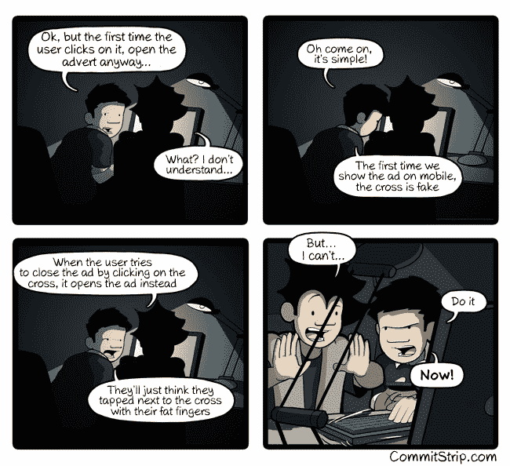

# 两名罗马尼亚开发商如何将他们的副业项目发展成每月 17，000 美元的业务

> 原文：<https://www.freecodecamp.org/news/how-two-romanian-developers-grew-their-side-project-into-a-17-000-month-business-27094610feb3/>

这里有三个值得你花时间的链接:

1.  我和我的朋友如何将我们的副业发展成每月 17，000 美元的生意
2.  React 的 JSX vs Vue 的模板:在前端摊牌( [7 分钟阅读](http://bit.ly/2m4esr7)
3.  来自比尔·盖茨、埃隆·马斯克和斯蒂芬·霍金的警告( [4 分钟阅读](http://bit.ly/2lwufB8)

### 想到这一天:

> “无论彩排中的演示多么巧妙，当你在现场观众面前演示时，完美演示的概率与观看人数成反比，与所涉及的金额成正比。”—马克·吉布斯

### 今日趣事:

由[提交的“编码的黑暗面”条](http://bit.ly/2l00PYM)

### 今日学习小组:

赫尔辛基自由代码营

编码快乐！

–昆西·拉森，自由代码营的老师