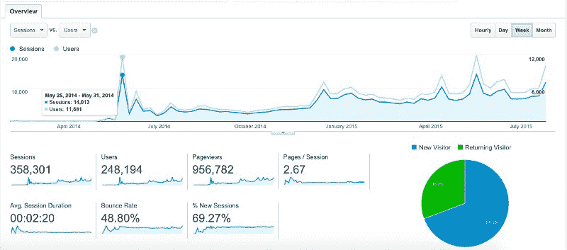
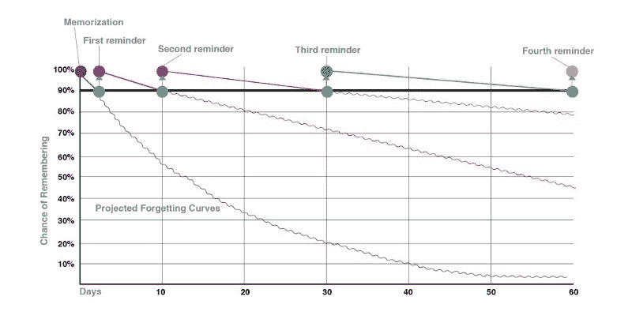
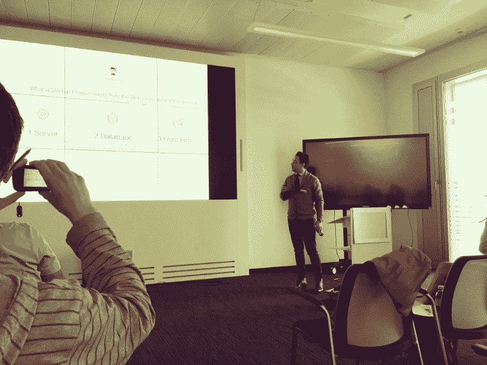
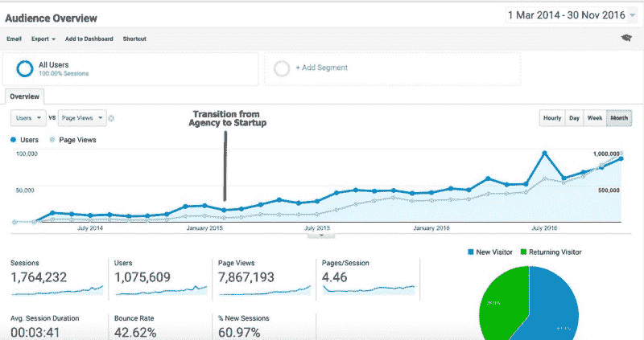
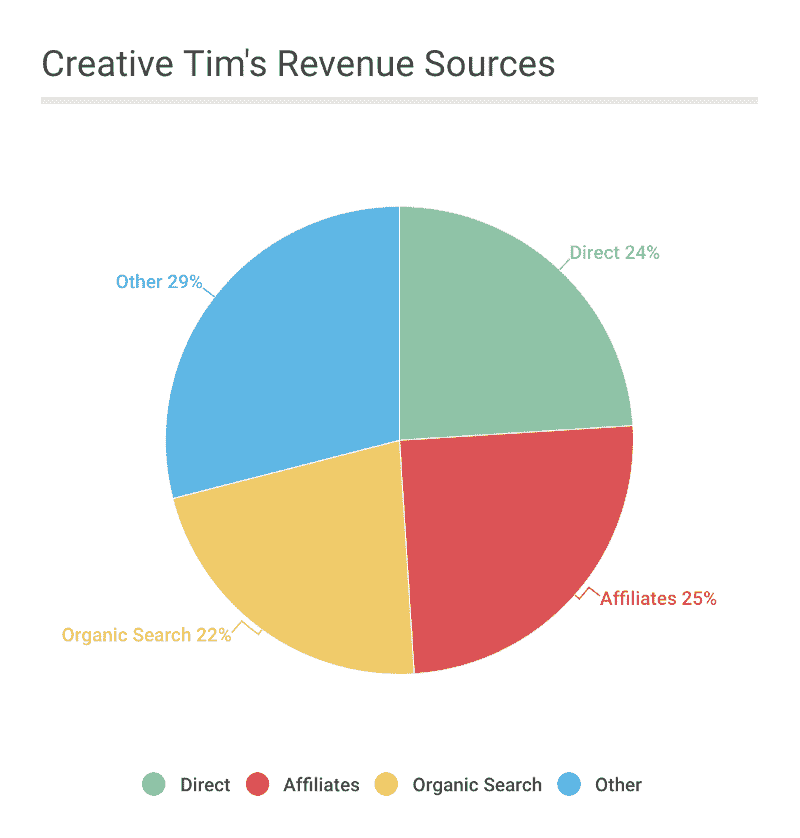
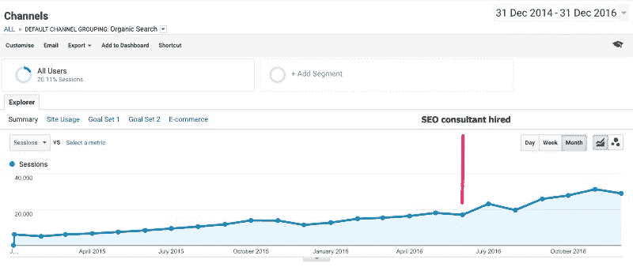
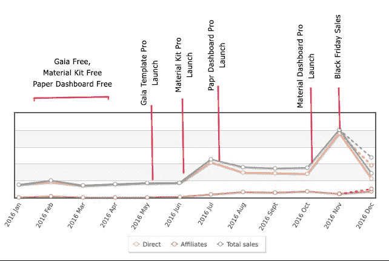

# 我和我的朋友如何将我们的副业发展成每月 17，000 美元的生意

> 原文：<https://www.freecodecamp.org/news/growing-a-side-project-into-a-17-000-month-business-46024d2aa87f/>

2014 年，我和我的朋友们开始着手打造最好的网页设计工具。我们构建了 [UI 套件](http://www.creative-tim.com/bootstrap-themes/ui-kit)、[管理仪表板](http://www.creative-tim.com/bootstrap-themes/admin-dashboard)、[模板](http://www.creative-tim.com/bootstrap-themes/free)和[插件](http://www.creative-tim.com/bootstrap-themes/components)。我们总是试图创造在开发过程中有帮助的产品，并且我们自己会使用这些产品为客户建立网站。

从收入的角度来看，如果我们不考虑黑色星期五的销售额(这是我们 2016 年 11 月销售额的两倍)，我们每月的总收入约为 22，000 美元。其中一部分用于支付我们附属公司的佣金、征收的增值税、支付供应商的税款和其他费用。我们最终每月净赚约 17，000 美元。

在这个案例研究中，我将分享我们是如何制造产品和发展业务的。您将会了解到:

1.  是什么激励我们开始创业，[创意 Tim](https://www.creative-tim.com/) ，以及我们如何打造我们最初的产品
2.  我们如何获得第一批用户
3.  我们过去发展的营销策略
4.  我们的商业模式如何运作
5.  我们收入来源背后的故事
6.  到目前为止，我们学到的最重要的经验

### 1.是什么促使我们开始创作创意 Tim，以及我们如何制作最初的产品

我们最初是在罗马尼亚的一个两人机构，没有第三方的资助。我们没有足够的现金来租一间办公室——甚至是一个共同工作空间的桌子——所以我们只是在星巴克工作。我们靠给客户打工勉强支付日常生活费用。

Creative Tim 是一个附带项目，我们认为它会对像我们这样的 web 开发人员有用。我们注意到，在与客户合作时，我们总是“重新发明轮子”，并为他们的网站一遍又一遍地创建相同的项目。所以我们想创建一些标准组件，比如登录和注册模式、日历、向导、页眉和页脚。

在几个月的时间里，我们致力于实现平台和一些免费赠品(除了代理工作之外)。一开始，我们没有任何推特粉丝、脸书粉丝或电子邮件订阅者。我们在各种设计论坛上发布了很多关于我们的赠品的东西，并且我们使用了“在 Twitter 上跟踪网络开发者”的技术来传播我们产品的信息。

### 2.我们如何获得第一批用户

起初，没有人真正理解我们想做什么。他们不了解我们通过帮助他们改善业务所能提供的价值。我们决定最好是创造一个更复杂的产品，帮助人们理解我们在做什么？

我们推出了 [Get Shit Done Kit](http://demos.creative-tim.com/get-shit-done/index.html) ，一个基于 [Bootstrap](http://getbootstrap.com/) 的 UI 套件。设计师新闻对[进行了专题报道，它相当受欢迎。我们从该来源获得了超过 11，000 名用户，这对我们的业务来说是一个巨大的突破。](https://www.designernews.co/stories/24249-get-shit-done-bootstrap3-ui-kit)

两周后，我们的初创公司[出现在产品搜索](https://www.producthunt.com/posts/creative-tim)上。这给了我们超过 5000 名用户的另一个高峰。之后情况稳定，我们从 0 用户/周，毕业到持续的 2000 到 3000 用户/周。

几个月后，受免费的 Get Shit Done Kit 成功的激励，我们发布了 GSDK 的高级版 [Get Shit Done Kit PRO](http://gsdk.creative-tim.com) ，有更多的组件和现成的示例页面。

最初，我们只做了几笔销售。该产品每周产生约 200 美元，这远远不足以维持我们的业务。与此同时，我们正在为我们的一个客户做一个网络项目。

然后在 12 月，我们在 [Bootstrap Expo](http://expo.getbootstrap.com/) 上发表了文章，这是最受欢迎的展示 Bootstrap 网站的画廊。这是我们业务的又一次重大突破。因为所有去 Bootstrap Expo 寻求灵感的人都已经知道 Bootstrap 或者以前与 Bootstrap 合作过，他们是我们业务的完美观众。

后来，我们发现在你的网站上获得流量并不足以与你的用户建立长期的关系，大多数人在第一次互动后就把我们忘得一干二净了。我们做了一些研究，发现了大多数营销人员可能已经知道的事情:人们会忘记那些没有被提醒的事情。然后，我们按照[遗忘曲线](https://en.wikipedia.org/wiki/Forgetting_curve)中的规则实现了“记住我们的邮件系统”。

我们想提醒我们的用户，我们仍然存在，我们是他们项目或他们客户项目的宝贵资源。

目前，我们按照以下时间表发送电子邮件:

1.  第一次下载 3 天后，我们会发送一封包含其他推荐产品的电子邮件。
2.  在第 10 天，我们发送电子邮件请求反馈，询问他们是否需要帮助。
3.  在第 15 天，我们提醒他们可以升级到专业版。
4.  在第 30 天，我们再次要求他们提供反馈，并提议在我们的画廊和社交媒体上推广他们的作品。
5.  我们在第 60 天发出最后的提醒。

### 3.我们过去发展的营销策略

我们的大部分营销策略包括向不同的社区提交我们的内容，如 Reddit、Product Hunt、Designer News、Hacker News 和 GitHub。在我们的领域中工作良好的一些重要的子编辑器包括 [/r/web_design](https://www.reddit.com/r/web_design) 、 [/r/html5](https://www.reddit.com/r/html5) 、 [/r/frontend](https://www.reddit.com/r/frontend) 和 [/r/webdev](https://www.reddit.com/r/webdev) 。

我们还支付了几次 100-200 美元的简讯活动。尽管投资回报率与我们的投资额相当，但这些活动并没有达到预期。(也许这只是在我们的情况下，这是无利可图的，对其他人来说效果更好。)

然后我们花了 400 美元买了 Get Shit Done Kit PRO，让它出现在 [Sidebar.io](http://sidebar.io/) 时事通讯上，这是由 [Sacha Greif](https://www.freecodecamp.org/news/growing-a-side-project-into-a-17-000-month-business-46024d2aa87f/undefined) 制作的 5 个最佳设计链接的精选列表。对我们来说，这是一份非常有益的简讯，产生了大约 1，500 美元的销售额。

然后我们从 [eWebDesign](https://ewebdesign.com/giveaway-quality-bootstrap-components) 购买了“评论+简讯”套餐(550 美元)。大约有 5000 名用户参与了赠品活动，总销售额为 2800 美元。

我们还考虑了不同的地方，在那里我们可以找到可以使用我们产品的 web 开发人员，我们意识到黑客马拉松正是我们所需要的。

Presenting how our tools can help during the Hackathon

随后，我们开始与组织黑客马拉松的人交谈，向他们提供我们“优质产品”的免费许可证。我们在世界各地的不同城市赞助了 20 多场黑客马拉松(你可以在这里查看)。

所有的开发者都很高兴获得免费许可，这让我们很高兴，我们可以帮助他们更快地创建更好的项目，他们也发现了我们是谁，所以这是一个双赢的局面。

至关重要的是，亲自参加一些黑客马拉松也给了我们很多关于开发人员如何使用我们的产品以及我们如何改进它们以使它们更加用户友好的信息。

2015 年 3 月，我们完成了代理合同，从“**代理模式**切换到“**启动模式**有了一些银行存款和几个月的销售额，我们的团队开始全职工作。当我们把所有东西放在一起并不断推出新产品时，我们的流量和收入来源增加了。

### 4.商业模式如何运作

我们意识到 Creative Tim 的最佳商业模式是[免费增值](https://en.wikipedia.org/wiki/Freemium):我们创建高质量的免费服务，帮助 web 开发人员建立伟大的网站，然后发布这些免费服务的专业版本，其中包含更多的元素、部分、插件和示例页面。

目前，我们有 8 个高级产品，每个都有自己的赠品。它们的价格从 19 美元到 599 美元不等，取决于许可证和存档类型(HTML，HTML + PSD，HTML + Sketch)。这些免费赠品出现在不同的社区、博客帖子、时事通讯和社交网站上——它们驱动着我们所有的流量。

> 我们的商业模式:创造高质量的免费品，帮助网站开发者建立伟大的网站，然后发布包含更多元素的免费品的专业版。？？

基本的想法是，这些免费赠品总是出现在这些大社区的前 10 名名单上。前 10 名中的每个帖子(取决于社区的规模)在一天内都会给我们带来 1000 到 15000 个目标用户。你可以想象，如果你想做一个定期有针对性的营销活动，这将花费多少。？

一些例子:

*   纸质工具包— [在 Reddit 上获得 380 张赞成票](https://www.reddit.com/r/webdev/comments/3kwb16/paper_kit_bootstrap_ui_kit_ps_the_examples_are)
*   材料套件— [在 Reddit 上获得 560 张赞成票](https://www.reddit.com/r/web_design/comments/4t6qcv/material_kit_a_badass_bootstrap_ui_kit_based_on)
*   轻型自举仪表板 Angular — [在 Reddit 上获得 210 次投票](https://www.reddit.com/r/web_design/comments/5ihjco/bootstrap_dashboard_for_angular_2_free_admin)
*   材料套件— [黑客新闻](https://news.ycombinator.com/item?id=12099876)上的 180 个 uvpotes(峰值位置 9，一天内有超过 14，000 个用户访问我们的网站)
*   材料套件— [860 张产品搜寻投票](https://www.producthunt.com/tech/material-kit)
*   等等…你明白了吗

### 5.我们收入来源背后的故事

#### **直接产品销售**

这里是我们网站上的常规销售额，约占我们总销售额的 24%。这还不包括[大捆](http://www.creative-tim.com/product/buy/bundle)。

这个大捆绑包是什么，我们是如何创建它的？我们注意到一些用户正在下载我们所有的免费产品。(我所说的全部，实际上是指他们创建帐户后大约 2-3 分钟内的全部。)我们还注意到，我们的一些客户购买了所有的优质产品。

因此，我们决定测试一款名为“**大礼包**”的新产品，它可以让您以巨大的折扣(超过 60%)访问我们的所有产品。这个大包裹每个月大约有 6-8 次购买。由于这个大捆绑包的价格是个人许可 299 美元(而不是 500 美元),开发者许可 669 美元(而不是 2127 美元),这是一个很好的收入来源，对于为多个客户使用我们产品的网站设计者和代理商来说是一笔大交易。这是双赢的局面。

#### **关联公司销售额**

我们创建了一个代销商网络，我们的代销商非常高兴，因为他们从每笔交易中获得 50%的利润。比如我们最重要的一个从属关系就是通过一个非常流行的 GitHub Repo 来完成的:[Bootstrap Material Design](http://fezvrasta.github.io/bootstrap-material-design)(GitHub 上 17000+星)。目前，分支机构约占我们总收入的 25%。

#### **有机搜索(SEO)**

我们看到，我们也从 SEO 中获得了大约 22%的收入。所以我们决定在搜索引擎优化上投入更多，我们请来了一位搜索引擎优化顾问，我们每月付给他 500 美元来提高我们的产品在谷歌的排名。

#### **其他收入**

我们每月收入的剩余部分来自脸书、推特和我们的时事通讯。以下是我们的收入如何随着时间的推移而发展，以及一些具有历史意义的重要时刻，因此您可以理解为什么它在几个月内有所增长:

以下是我们烧钱的方式:

### 6.到目前为止，我们学到的最重要的经验是

#### ***这听起来很老套，但是拥有一个伟大的产品是至关重要的。***

许多创始人真的很难推销和出售人们不想要或不需要的东西。如果你的产品是垃圾，没有营销策略——也没有投资来源——可以让它长久存活。

目前，我们的产品被全球超过 134，000 名 web 开发人员使用。我们有来自微软、育碧、沃达丰、Orange、哈佛大学、斯坦福大学和政府机构的人下载并使用它们作为不同的内部工具，我们已经赞助了来自 14 个国家的 20 多个全球黑客马拉松。

#### ***别指望成为下一个脸书。试着解决一个真正的问题。***

在当时，我们发展的每一步似乎都是自然而然的事情。回顾我们的进化，我们不会改变任何东西。但是有了我们所学到的一切，第二次我们肯定可以做得更快。

我们总是根据客户的反馈来创造和改进我们的产品，这是发展业务的最佳方式。你个人喜欢什么并不重要——你需要确保为真正的客户解决真正的问题。

#### ***念，念，念。***

在过去的三年里，我读的书比我一生中读过的都多，这让我感觉很棒。以下是我最喜欢的几本书，推荐给大家:

*   [如何赢得朋友并影响他人——戴尔·卡内基](https://www.amazon.com/How-Friends-Influence-People-Revised/dp/067142517X/)
*   [零比一——彼得·泰尔](https://www.amazon.com/Zero-One-Notes-Startups-Future-ebook/dp/B00J6YBOFQ/)
*   本·霍洛维茨
*   [成功法则——拿破仑·希尔](https://www.amazon.com/Law-Success-Napoleon-Hill-ebook/dp/B004J8HV74/)
*   [思考致富——拿破仑·希尔](https://www.amazon.com/Think-Grow-Rich-Napoleon-Hill/dp/1514698137/)
*   [从优秀到卓越——吉姆·科林斯](https://www.amazon.com/Good-Great-Some-Companies-Others/dp/0066620996/)
*   [精益创业——埃里克·里斯](https://www.amazon.com/Lean-Startup-Entrepreneurs-Continuous-Innovation/dp/0307887898)
*   [魅力神话——奥利维亚·福克斯·卡班](https://www.amazon.com/Charisma-Myth-Science-Personal-Magnetism/dp/1591845947/)
*   [精益分析:使用数据更快地建立更好的创业公司——Alistair Croll](https://www.amazon.com/Lean-Analytics-Better-Startup-Faster/dp/1449335675/)

> 我真的认为秘密武器是交付优秀的产品，结合优秀的用户体验和优秀的客户支持。

我们做出的最好的决定是把我们的客户放在第一排，并确保他们收到一个很棒的 UI 套件/仪表板，真正解决他们的问题。引导我们走完了整个旅程。我们的秘密武器是我们提供优秀的产品，结合优秀的用户体验和优秀的客户支持。

#### ***一切皆有可能*** 。

我们生活在这样一个世界里，任何人都可以成为他们想成为的任何人，只要他们愿意投入必要的时间。我说的是时间，不是金钱，因为我们都有时间。我想推荐两本书讨论这个问题:Jonas ridderstrle 和 Kjell Nordstrom 的《卡拉 Capitalism》和彼得·泰尔(PayPal 联合创始人)的《零比一》和《T2》。

在这一点上，没有限制。你可以去地球上的任何地方，你可以通过社交媒体联系任何你想联系的人。今天，一个普通人比一个小国的总统更有影响力。想想那些拥有数百万粉丝的 Instagram 账号。如果我——一个来自罗马尼亚的普通人——能在 2.5 年内建立一个盈利的企业，赚到我国最低月工资的 60 倍，那么，伙计，一切皆有可能。

### 感谢阅读！如果您有反馈或建议，可以在这里找到我:

*   官方网站:[http://www.creative-tim.com](http://www.creative-tim.com/?utm_source=indie-hackers)
*   我们的博客:[http://blog.creative-tim.com](http://blog.creative-tim.com/?utm_source=indie-hackers)
*   电子邮件:[alex@creative-tim.com](mailto:alex@creative-tim.com)
*   https://www.facebook.com/axelut
*   推特:[https://twitter.com/axelut](https://twitter.com/axelut)

另外，[这是我对 IndieHackers 的采访](https://www.indiehackers.com/businesses/creative-tim)，我的这篇文章就是基于此。

我希望这能激励你自己创业。如果你有任何问题，请给我留言，我很乐意帮助你！