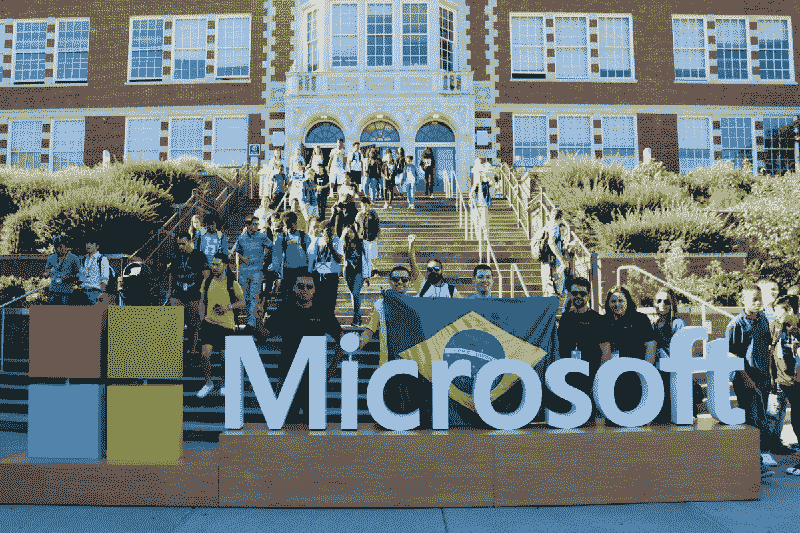
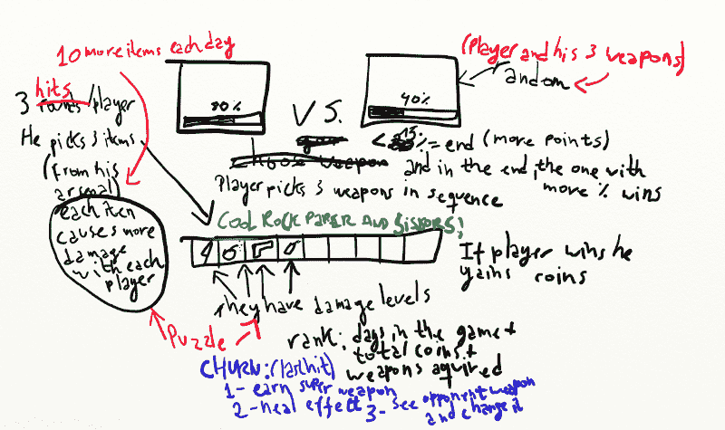
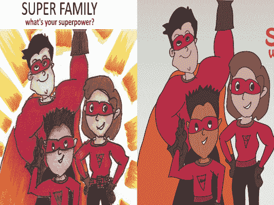

# 我是如何构建一个赢得 2016 年 Azure 机器学习奖的游戏的

> 原文：<https://www.freecodecamp.org/news/how-i-won-the-azure-machine-learning-award-418ff35c6e4d/>

作者德博拉·梅斯基塔

# 我是如何构建一个赢得 2016 年 Azure 机器学习奖的游戏的

Me and the brazilian team in the Quincy Jones Performing Arts Center at Seattle’s Garfield High School

每年，微软都会举办[想象杯](https://compete.imagine.microsoft.com/pt-br/category/0?skillLevel=0)。年轻的开发人员经常称之为“[技术奥林匹克](https://en.wikipedia.org/wiki/Imagine_Cup)，并认为这是与软件设计相关的顶级竞赛之一。因此，它吸引了来自世界各地的许多年轻参与者，他们合作解决一些世界上最棘手的挑战。

2016 年，他们举办了 [Hello Cloud 机器学习奖](https://compete.imagine.microsoft.com/pt-br/competition/17554)，获奖者是根据质量、创造力和他们使用 Azure Machine Learning Studio 的有效性从所有参赛作品中选出的。

我参加了比赛，以了解更多关于机器学习的知识，并最终成为挑战的获胜者之一。首先让我感兴趣的是比赛的焦点:**利用机器学习建立创造性和发明性的系统**。

当用户停止使用某种商品或服务(在这种情况下，是游戏)时，我们称之为“流失”基于过去的玩家历史，或一段时间内类似玩家的数据，我们可以创建一个机器学习模型来预测玩家最有可能何时退出。

在比赛的第一部分，我们必须在 Azure ML Studio 中构建、训练、评分和评估一个模型。然后我们让他们提供一个基本的游戏，把它连接到 Azure ML 服务，并发布到网络上。

This was my first Game Design Document (more on that latter)

让玩家放弃游戏的一个关键因素是游戏的难度。如果太容易，游戏会变得无聊，如果太难，会打击用户继续玩下去的动力。

我决定在游戏中使用石头剪刀布的动态。为了在游戏中获得新的超能力，玩家(数学专业的学生)必须解决一些数学方程(这些方程就像格斗游戏中的攻击一样)。

根据每个玩家的数据，我们可以调整数学方程的难度，以保持他们玩游戏的积极性。我们还可以确定哪种方程给孩子带来了更多的麻烦(减法？乘法？).这是一个帮助老师和所有参与学习过程的人的绝佳机会。

#### 原则 1:专注于与众不同

在比赛中我能确定的一件事是:**专注于与众不同，而不仅仅是专注于做得更好**。我们不知道确切的参赛者数量，但根据我们在西雅图听到的情况，比赛有近 1000 名参赛者。评委要评价的比赛太多了。你必须尽你所能从那么大的人群中脱颖而出。

我敢打赌，当你读到“不同”这个词时，你的第一个想法是“太好了，现在我不得不凭空想出一些又大又奇怪的东西。”别担心，事实并非如此。因为还有一件事我很确定:**想要与众不同，你只需要专注于做你自己**。我知道这听起来很俗气，但让我们详细说明一下。

> “做你自己；其他人都已经有人了。”― [**王尔德**](https://www.goodreads.com/author/show/3565.Oscar_Wilde)

你就是你，对吗？世界上没有其他人有过你的经历，做过你做的每一件事，感受过你的每一种感受。就是这样，你只要用*这个*就不一样了(还有原创)。现在让我们回到我在比赛中的表现。

我及时为比赛买了我的第一台 Wacom 平板电脑，老实说，我只是在找借口使用它。我喜欢在其他领域冒险，我知道这是我与众不同的地方。所以我决定工作，改变游戏的资产。

The asset they gave us and the asset I created (hey, I'm not an illustrator ok, take it easy)

#### 原则 2:从你知道的开始

在比赛中，我们首先必须遵循一个指南。只有在那之后，我们才能开始创造我们自己的游戏版本。这是设计我们项目(和附带项目)工作流程的一个很好的方法:**总是找到一种方法使开始阶段变得容易**。

我第一次听到这个建议是在《像程序员一样思考》一书中。这对编程来说是正确的，但对我们生活的其他方面来说也是正确的。

> 举例来说，一旦你把问题分成几个部分，继续完成你已经知道如何编码的任何部分。拥有一个可行的部分解决方案可能会对问题的其余部分有所启发。此外，正如你可能已经注意到的，**解决问题的一个常见主题是取得有益的进展，以建立你最终将完成任务的信心**。从你所知道的开始，**你建立了信心和朝着目标前进的动力**。― [V](https://www.goodreads.com/author/show/3565.Oscar_Wilde) 。安东·斯普尔[像程序员一样思考](https://www.nostarch.com/thinklikeaprogrammer)

说实话:编程很难。在比赛期间，我有过一些沮丧的时刻，但看到我的第一个预测模型运行，看到游戏的各个部分开始一起工作，这些事情让我继续前进。确保你能从一开始就看到项目的进展。

#### 原则 3:适应

这是赢得比赛的关键因素，因为没有它，我的参赛作品甚至不会被提交。**时间是有限的来源**。每个人都知道这一点，但这是我们必须时刻提醒自己的事情——尤其是我们程序员。

如果你看一下我上面的游戏设计文档，你会发现我对这个游戏的第一个想法有很多特点。例如，我们有玩家的等级，他们可以收集的物品，治疗效果等等。随着最后期限的临近，我意识到我没有时间去执行所有的想法。所以我不得不思考:在游戏中我应该拥有什么东西来确保完成我的目标？答案是数学方程和石头剪子布动力学，这就是我实现的。

给出如何适应的指示并不容易，因为每种情况都是不同的。但是你应该知道，在这个过程中，你将不得不做出选择。你的主要精力应该是按时完成任务，这样你就可以在竞赛中真正地竞争。

嗯，你现在可能知道了，我的项目是挑战的两个获胜者之一(耶！).我赢得了想象杯世界总决赛之旅，并与微软数据平台产品的成员进行了指导会议。

通过这个项目，我终于找到了我的主要职业目标:**设计机器学习系统，让人类做他们关心的事情**。