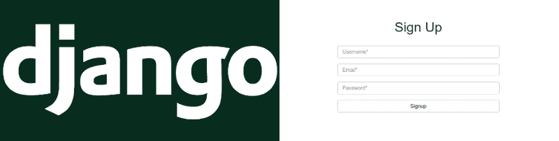

# 如何在 Python Django 中处理用户认证

> 原文：<https://www.freecodecamp.org/news/user-authentication-in-django-bae3a387f77d/>

穆罕默德·苏卜汉·汗

# 如何在 Python Django 中处理用户认证



在本教程中，我将展示如何在 Django 中进行用户登录、注销和注册。我在这里描述的所有代码都在这个 GitHub [库](https://github.com/khansubhan95/Django-User-Auth)中。本教程将使用 Python 2.7 和 Django 1.9。

### 项目安装和结构

首先，从终端运行以下命令:

```
django-admin startproject src
cd src
python manage.py startapp mysite
python manage.py migrate
```

简而言之，这四个命令创建一个名为 src 的新 Django 项目，进入该项目，在 src 项目中创建一个新的应用程序 mysite，然后为名为 db.sqlite3 的项目创建一个 SQLite 数据库。

```
INSTALLED_APPS = [
    'src',
    'django.contrib.admin',
    'django.contrib.auth',
    ...
]
```

在 mysite 应用程序中创建一个名为 templates 的目录。然后在 mysite/templates 中创建另外两个名为“registration”和“mysite”的目录。

另外，我将引用存储在这两个目录中的模板，使用 registration/{template_name}和 mysite/{template_name}。

您的项目结构最终应该是这样的:

```
.
|-- db.sqlite3
|-- manage.py
|-- mysite
|   |-- admin.py
|   |-- apps.py
|   |-- __init__.py
|   |-- migrations
|   |   `-- __init__.py
|   |-- models.py
|   |-- templates
|   |   |-- mysite
|   |   `-- registration
|   |-- tests.py
|   `-- views.py
`-- src
    |-- __init__.py
    |-- settings.py
    |-- urls.py
    `-- wsgi.py
```

您可能已经能够理解 mysite 中的模板的用途(例如，mysite 中定义的视图)。我们很快就会谈到注册的重要性。

此外，我们需要用户来测试我们的网站。您可以通过创建超级用户(`python manage.py createsuperuser`)来实现这一点。但是不要担心——本教程描述的所有内容也可以适用于普通用户，无需任何更改。出于本教程的目的，您可以创建普通用户，方法是创建一个超级用户，运行开发服务器(`python manage.py runserver`)，导航到 localhost:8000/admin，导航到 users，然后创建一个新用户。

### 处理登录

根据文档，Django 提供了[视图](https://docs.djangoproject.com/en/1.10/topics/auth/default/#all-authentication-views)来处理用户认证方法，如登录、注销和密码恢复。这让我们省去了为处理这些事情而定义自己的观点的麻烦。此外，这些视图是可配置的，包含在 django.contrib.auth.views 中，我们将按如下方式导入:

```
from django.contrib.auth import views as auth_views
```

我们希望登录页面在用户进入/登录时打开。要使用[登录](https://docs.djangoproject.com/en/1.10/topics/auth/default/#django.contrib.auth.views.login)视图，请在 src/urls.py 中添加以下内容

```
url(r'^login/$', auth_views.login),
```

默认情况下，视图呈现 registration/login.html 中的模板。

我们的 registration/login.html 包括以下简单的 html 表单:

```
<!DOCTYPE html>
<html>

<head>
    <title>Login</title>
</head>

<body>
    <form method="POST">
        
        <p>
            <label>Username</label>
            <input type="text" name="username">
        </p>
        <p>
            <label>Password</label>
            <input type="password" name="password">
        </p>
        <button type="submit">Login</button>
    </form>
</body>

</html>
```

不想用 registration/login.html？通过在 urlpattern 中给定 python 字典作为第三个参数，以' template_name '作为键，以模板的位置作为值，可以指定使用什么样的模板。如果您想使用 mysite/login_user.html 作为模板:

```
url(r'^login/$', auth_views.login, {'template_name': 'mysite/login_user.html'})
```

此外，你也可以使用视图的其他参数，以非常相似的方式。有关参数的完整列表，请参考[文档](https://docs.djangoproject.com/en/1.10/topics/auth/default/#django.contrib.auth.views.login)。

当用户点击提交按钮时，登录视图为我们处理登录。用户登录后，我们可以通过在 src/settings.py 中指定 LOGIN_REDIRECT_URL 来定义页面应该重定向到哪里，默认情况下，如果登录失败，我们将被重定向到/login。

```
LOGIN_REDIRECT_URL = '/'
```

现在运行开发服务器(`python manage.py runserver`)并导航到 localhost:8000/login/。输入示例超级用户的用户凭据。如果登录成功，您将被重定向到。否则，您将被重定向到/login。

即使您登录成功，您也会被重定向到/并看到一个错误。这将会发生，因为我们还没有为它定义一个`urlpattern`。

### 处理注销

接下来，我们希望用户在导航到/logout 时注销。我们可以将与登录相同的类比扩展到注销，通过将以下 urlpattern 附加到 src/settings.py 来访问对应于[注销](https://docs.djangoproject.com/en/1.10/topics/auth/default/#django.contrib.auth.views.logout)的视图

```
url(r'^logout/$', auth_views.logout)
```

默认情况下，logout 视图呈现 registration/logged_out.html 模板。下面是一个简单的注销模板:

```
<!DOCTYPE html>
<html>

<head>
    <title></title>
</head>

<body>
    You have successfully logged out.
    <a href="/">Home</a>
</body>

</html>
```

与登录一样，您可以通过包含一个带有' template_name '键的对象并将模板的位置作为值来更改模板的位置。

### 签约雇用

我们希望我们的用户通过导航到/register 来注册我们的网站。在这样做之前，让我们清理一下这个项目。首先，我们想要一个`urlpattern`作为我们的主页/。为此，我们将使用 mysite 应用程序，因此在 src/urls.py 中添加以下内容

```
url(r'^', include('mysite.urls'))
```

现在我们需要在 mysite/urls.py 中包含/的`urlpattern`,所以在其中包含下面的`urlpattern`(在导入相关库之后)

```
from django.conf.urls import url, include
from django.contrib import admin
from .views import home, register

urlpatterns = [
    url(r'^$', home),
    url(r'^register/', register),
]
```

这里的`home`是指/的视图，`register`是指办理注册的视图。为了创建用户注册表单，我们将使用 Django 的内置表单。为此，创建一个 mysite/forms.py 文件并包含以下内容:

```
from django import forms

class UserRegistrationForm(forms.Form):
    username = forms.CharField(
        required = True,
        label = 'Username',
        max_length = 32
    )
    email = forms.CharField(
        required = True,
        label = 'Email',
        max_length = 32,
    )
    password = forms.CharField(
        required = True,
        label = 'Password',
        max_length = 32,
        widget = forms.PasswordInput()
    )
```

首先，我们导入表单库，创建从`forms.Form`继承而来的`UserRegistrationForm`。我们希望我们的表单有 3 个字段:`username`、`email`、`password`，变量赋值就是这样做的。`forms.CharField`表示由字符组成的字段。参数`required`、`max_length`和`label`指定一个字段是否是必需的，它的最大长度，以及字段的标签。`password`中的小部件参数表明`password`是一个“密码”类型的输入

我们希望用户能够查看表单，如果他们去/注册，以及填写并提交它。这些对应于/register 上的 GET 和 POST 请求。因此，我们在 mysite/views.py 中包含以下内容:

```
from django.shortcuts import render
from django.contrib.auth.models import User
from django.contrib.auth import authenticate, login
from django.http import HttpResponseRedirect
from django import forms
from .forms import UserRegistrationForm

# Create your views here.

def home(request):
    return render(request, 'mysite/home.html')

def register(request):
    if request.method == 'POST':
        form = UserRegistrationForm(request.POST)
        if form.is_valid():
            userObj = form.cleaned_data
            username = userObj['username']
            email =  userObj['email']
            password =  userObj['password']
            if not (User.objects.filter(username=username).exists() or User.objects.filter(email=email).exists()):
                User.objects.create_user(username, email, password)
                user = authenticate(username = username, password = password)
                login(request, user)
                return HttpResponseRedirect('/')    
            else:
                raise forms.ValidationError('Looks like a username with that email or password already exists')

    else:
        form = UserRegistrationForm()

    return render(request, 'mysite/register.html', {'form' : form})
```

home 视图被定义为呈现 src/home.html 模板，如下所示:

```
<!DOCTYPE html>
<html>

<head>
    <title>Home</title>
</head>

<body>
    
    <p>hello</p>
    <p>welcome {{ user.username }}</p>
    <p><a href="/logout">Logout</a></p>
    
    <p><a href="/login">Login</a></p>
    <p><a href="/register">Register</a></p>
    
</body>

</html>
```

我们使用 user.is_authenticated 检查用户是否登录，并显示我们的欢迎文本以及用户名(使用`user.username`)和注销链接。如果没有，我们将显示登录和注册的链接。

对于 register 视图，我们检查请求方法是否是 POST。如果不是，那么我们将表单指定为`UserRegistrationForm`并通过将它作为参数传递给 mysite/register.html 模板来呈现它:

```
<!DOCTYPE html>
<html>

<head>
    <title></title>
</head>

<body>
    <form method="POST">
         {{ form.as_p }}
        <button type="submit">Submit</button>
    </form>
</body>

</html>
```

然后使用`form.as_p`呈现作为输入传递给注册视图的表单。当用户单击 submit 按钮时，会发送一个 POST 请求。我们使用表单变量获取表单数据。

接下来我们检查表单数据是否有效(通过`[is_valid()](https://docs.djangoproject.com/en/1.10/ref/forms/api/#django.forms.Form.is_valid)`)。如果是，我们创建一个`userObj`字典，通过将`[cleaned_data](https://docs.djangoproject.com/en/1.10/ref/forms/api/#django.forms.Form.cleaned_data)`应用于表单并从中提取`username`、`email`和`password`来得到这个字典。

if 条件检查数据库中是否存在具有相同用户名和电子邮件地址的用户。如果是这样，我们创建一个新用户，使用同一个用户登录并重定向到/。否则，我们会抛出一个错误，指出这样的用户已经存在。

如果您遇到困难，或者想了解更多信息，这里有一些相关文档:

*   [用户认证](https://docs.djangoproject.com/en/1.10/topics/auth/default/)
*   [表格](https://docs.djangoproject.com/en/1.10/topics/forms/)

如果你想给我关于本教程的反馈，请联系我。

如果你喜欢这篇文章，请♡并分享它:)