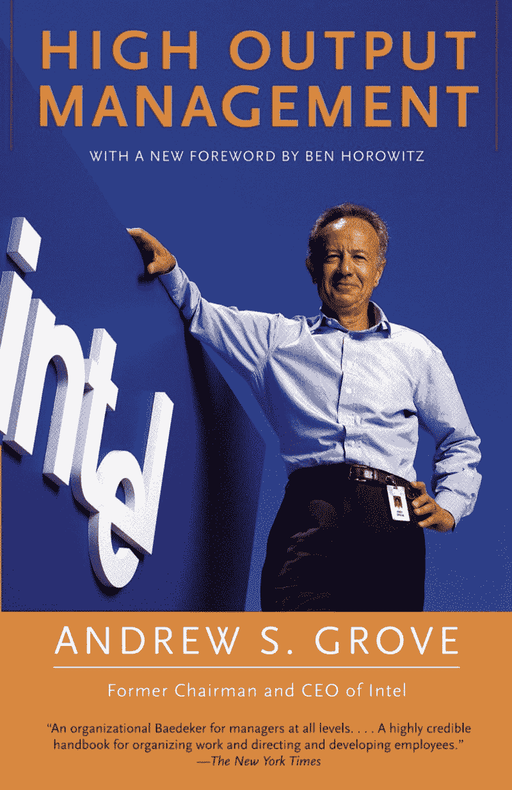

# 如何利用安迪·格罗夫的高杠杆活动加快你的发展？

> 原文：<https://www.freecodecamp.org/news/speed-up-your-development-by-using-andy-groves-high-leverage-activities-39137c4de7ce/>

吉多·施密茨

# 如何利用安迪·格罗夫的高杠杆活动加快你的发展？

[photo credit](https://unsplash.com)

您在不断地构建新特性、修复新错误和改进现有代码。这样下去，你的待办事项清单会变得如此之长，以至于你不知道下一步该做什么。

> "有这么多的人如此努力工作，却收效甚微。"

> —英特尔前首席执行官安迪·格罗夫

在这篇文章中，我将向你展示杠杆的*力量，以及如何使用它来改善你的决策过程。我将从《T2》这本书里引用一些例子，这本书是已故的工程界传奇人物安迪·格罗夫自己写的。*

这将帮助你摆脱重复性的工作，把时间投入到能产生更大影响的任务中，从而提高你的工作效率。

### 安迪·格罗夫所说的“杠杆”是什么意思？

你可以通过问一个简单的问题来定义杠杆。一项任务每投入一次时间将产生的价值或影响是否值得花时间？这就像投入努力的投资回报。

> 时间是你最有限的资源，所以确保你把时间花在正确的活动上。

不管你是谁，在你职业生涯的某个阶段，有比时间更多的工作要做。这意味着你需要开始优先考虑你的工作。

每天结束时，你应该花时间反思，并寻找第二天可以做得更好的事情。没有反思，你可能会花很多时间去做现在不重要的事情。

#### **如何提高你的杠杆率**

假设你每天早上花 20 分钟检查你的邮箱，结果却删除了大部分垃圾邮件。这是一项重复且耗时的任务。你可以投资一些时间来配置智能收件箱，将所有垃圾邮件从你的电子邮件中过滤掉，从而增加你的优势。这可以将你阅读邮箱的时间减少 50%。

配置这些智能收件箱最多需要一个小时。不错的投资，对吧？你每周节省了 50 分钟，你可以花在真正值得你花时间的事情上。这相当于每年 2600 分钟，相当于一个完整的工作周。

[The Lever Effect](https://en.wikipedia.org/wiki/Lever)

你的杠杆只能通过三种方式增加:

1.  减少完成某项活动所需的时间
2.  增加特定活动的产出
3.  将你的注意力转移到高杠杆的活动上

这三种方式很自然地转化为三个问题，你可以问自己关于你正在从事的任何活动:

1.  我如何在更短的时间内完成这项活动？
2.  我如何增加这项活动产生的价值？
3.  有没有其他我可以花时间去做的能产生更多价值的事情？

假设你安排了一个一小时的会议。你如何提高会议的影响力？

1.  首先问问自己这个会议是否真的有必要。是否可以用一个简单的松散讨论来代替，这样你就可以着手下一个大的产品特性了？
2.  将会议缩短到半小时，这样你就可以更专注于主题，从而消除占满分配时间的诱惑。相信我，这听起来很可怕，但实际上很有效。由于时间会给你带来额外的压力，会议的焦点会增加。
3.  准备一份你想讨论的关键主题的议程。这也会提高你的工作效率，并确保你专注于正确的事情。

开发任务呢？

比方说，您花费了大量时间来解决来自生产环境的 bug。不要只是解决那些 bug，试着想想如何缩短你忙于解决它们的时间。例如，这可以通过转移到更高杠杆的活动来解决，比如增加您的测试覆盖率，或者投资时间来改进您的部署工作流。当你在高速开发一个产品时，这是至关重要的。

当你成功地缩短了一项活动所需的时间，你会更有效地利用这段时间。

因此，下次你坐下来处理一项常规任务时，问问自己如何在每次任务中获得更多的杠杆作用。

你提高生产力的秘诀是什么？请在评论中告诉我。哦，每周五我都会通过我的[时事通讯](https://www.getrevue.co/profile/guidsen)发出四篇**高质量**的文章，这些文章都与工程和产品开发有关。

*感谢阅读。单击？下面，所以其他人会看到这篇文章在媒体上。感谢阅读。*

