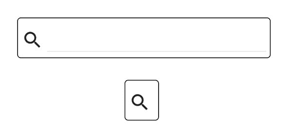
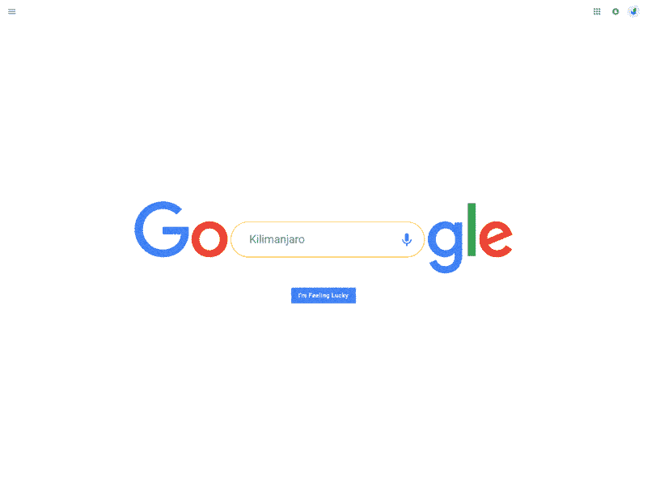
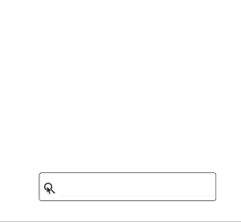
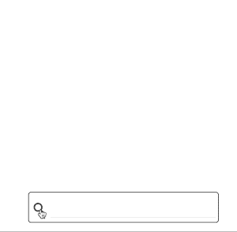
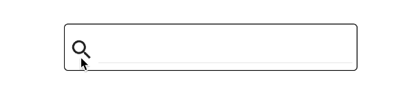

# 如何在 React 中构建动画微交互

> 原文：<https://www.freecodecamp.org/news/how-to-build-animated-microinteractions-in-react-aab1cb9fe7c8/>

微交互引导用户通过你的应用程序。它们强化了你的用户体验并带来愉悦。

你可能已经在[运球](https://dribbble.com/search?q=microinteraction)或[密码笔](https://codepen.io/search/pens?q=microinteraction&limit=all&type=type-pens)上见过一些巧妙的微操作例子。但是您知道如何构建自己的类似 UI 小部件库吗？

在本文中，我将使用脸书流行的面向组件的 UI 框架 [React](https://facebook.github.io/react/) 来关注动画微交互。我将为搜索框构建三个交互:

*   打开和关闭文本框
*   移动到屏幕顶部
*   摇动(表示有错误)


我将使用几个不同的实现:

*   [CSS 转换](https://developer.mozilla.org/en-US/docs/Web/CSS/CSS_Transitions/Using_CSS_transitions)
*   [反应-运动](https://github.com/chenglou/react-motion)
*   [反应动画](https://github.com/FormidableLabs/react-animations)

这里有一个[现场演示](https://search-animation.firebaseapp.com)和[驱动它的代码](https://github.com/csepulv/search-box-animation)。

> 这是几篇关于高阶(HOC)和无状态功能组件的文章之一。第一篇[帖子](https://hackernoon.com/code-reuse-using-higher-order-hoc-and-stateless-functional-components-in-react-and-react-native-6eeb503c665)是关于 React 和 React Native 中的代码重用，通过这些技术。

### 什么是微交互？

丹·萨弗(这本书的作者)给了我们这个[的定义](http://microinteractions.com/what-is-a-microinteraction/):“微交互包含围绕一个用例的产品时刻——它们有一个主要任务。”

例子可能更清楚。有些微交互无处不在，比如当鼠标悬停在一个链接上时光标会改变，或者当你切换到静音模式时手机会振动。其他的，比如一个商品被添加到购物车中，还不太常见。

#### 我为什么要关心微交互？

微交互可以提供反馈，让你的应用令人难忘。当用户有如此多的应用选择时，更好的微交互可能是你应该建立的老套的更好的捕鼠器。

但我不是 UX 设计师。所以我建议阅读尼克·巴比奇在 T2 的帖子。

### 入门指南

我将使用 [create-react-app](https://github.com/facebookincubator/create-react-app) 来引导 react 应用程序，但是任何 React 设置方法都可以。另外，我喜欢[材质-UI](http://www.material-ui.com/#/) ，所以我也要导入它。(这个选择是任意的——您可以使用另一个小部件库或者手动设置元素的样式。)

```
create-react-app search-box-animation
cd search-box-animation
npm install --save material-ui react-tap-event-plugin
```

#### 组件:一个简单的搜索框

我将创建一个简单的搜索框。它将包含两个元素:一个搜索图标按钮和一个文本框。我将为搜索框创建一个无状态的功能组件。(无状态功能组件是渲染 React 组件的功能，不维护状态，即使用`setState`。你可以在这个[教程](https://hackernoon.com/react-stateless-functional-components-nine-wins-you-might-have-overlooked-997b0d933dbc#.673o1dbcj)或者我之前的[帖子](https://hackernoon.com/code-reuse-using-higher-order-hoc-and-stateless-functional-components-in-react-and-react-native-6eeb503c665#c825)里了解更多。)

`SearchBox.js`

```
import React from 'react';
import {TextField, IconButton} from 'material-ui'
import SearchIcon from 'material-ui/svg-icons/action/search';
const SearchBox = ({isOpen, onClick}) => {
    const baseStyles = {
        open: {
            width: 300,
        },
        closed: {
            width: 0,
        },
        smallIcon: {
            width: 30,
            height: 30
        },
        icon: {
            width: 40,
            height: 40,
            padding: 5,
            top: 10
        },
        frame: {
            border: 'solid 1px black',
            borderRadius: 5
        }
    };
const textStyle = isOpen ? baseStyles.open : baseStyles.closed;
const divStyle = Object.assign({}, textStyle, baseStyles.frame);
    divStyle.width += baseStyles.icon.width + 5;
return (
        <div style={divStyle}>
            <IconButton iconStyle={baseStyles.smallIcon} style={baseStyles.icon} onClick={() => onClick()}>
                <SearchIcon />
            </IconButton>
            <TextField name='search' style={textStyle}/>
        </div>
    );
};
export  default SearchBox; 
```

(稍后我会使用`onClick`回调。)

`isOpen`道具设置`SearchBox`打开或关闭渲染。



isOpen=true / isOpen=false

### 使用高阶组件来分离关注点

例如，我可以将`SearchBox`改为一个常规组件，并添加当点击时打开和关闭文本框的代码。

但是我更喜欢把动画和搜索框的核心目的分开。搜索框显示/捕获一个查询值，并将该查询提交给其他控制器。这是一个主观的设计决策，但是它有实际的好处:我可以在另一个用户输入组件中重用微交互逻辑。

[高阶组件](https://facebook.github.io/react/docs/higher-order-components.html) (HOC)是返回新组件的函数。该组件包装了一个或多个组件并添加了功能。我将创建一个特设来向`SearchBox`添加打开/关闭行为。

创建`expanding-animation.js`

```
import React, {Component} from 'react';
const makeExpanding = (Target) => {
    return class extends Component {
        constructor(props) {
            super(props);
            this.state = {isOpen: false};
        }

        onClick = () => {
            this.setState({isOpen: !this.state.isOpen});
        };

        render() {
            return (
                <Target {...this.props}
                        isOpen={this.state.isOpen}
                        onClick={this.onClick}
                />
            );
        }
    }
};
export default makeExpanding;
```

更新`App.js`如下:

```
import React, {Component} from 'react';
import MuiThemeProvider from 'material-ui/styles/MuiThemeProvider';

// (Make material-ui happy)
// Needed for onTouchTap
// http://stackoverflow.com/a/34015469/988941
import injectTapEventPlugin from 'react-tap-event-plugin';
injectTapEventPlugin();

import SearchBox from './SearchBox'
import makeExpanding from './expanding-animation';

const ExpandingSearchBox = makeExpanding(SearchBox);

class App extends Component {
    render() {
        //https://css-tricks.com/quick-css-trick-how-to-center-an-object-exactly-in-the-center/
        const style = {
            position: 'fixed',
            top: '50%',
            left: '50%',
            transform: 'translate(-50%, -50%)',
        };

        return (
            <MuiThemeProvider>
                <div style={style}>
                    <ExpandingSearchBox/>
                </div>
            </MuiThemeProvider>
        );
    }
}
export default App; 
```

如果你运行`npm start`，你会有一个搜索图标，你可以点击它来打开和关闭文本框。

它的工作，但打开和关闭是不和谐的。一个动画可以平滑效果。

### 动画片

有三种制作动画的通用方法。

1.  CSS 过渡
2.  CSS 动画
3.  快速重复渲染元素以模拟运动(手动关键帧)

[CSS 转换](http://www.w3schools.com/css/css3_transitions.asp)在一段时间内改变一个属性值(比如宽度)。变化不一定是线性的；您可以指定用于更改值的函数。

CSS 动画改变元素的样式(比如大小、颜色和位置)。每个增量样式都是一个关键帧。您可以创建一个关键帧序列来获得想要的效果。

两种 CSS 策略都重复渲染元素来模拟运动。您可以自己进行计算，即选项(3)。一些 Javascript 动画框架使用这种方法来管理计算。(我将在后面的示例中使用 react-motion。)

我将在下面的例子中使用所有这些技术，但是我将从 CSS 过渡开始。

#### 展开搜索框

扩展文本框动画需要一个 CSS 属性:`transition`

将`expanding-animation.js`更改如下:

```
import React, {Component} from 'react';
const animationStyle = {
    transition: 'width 0.75s cubic-bezier(0.000, 0.795, 0.000, 1.000)'
};
const makeExpanding = (Target) => {
    return class extends Component {
        constructor(props) {
            super(props);
            this.state = {isOpen: false};
        }

        onClick = () => {
            this.setState({isOpen: !this.state.isOpen});
        };

        render() {
            return (
                <Target {...this.props}
                        isOpen={this.state.isOpen}
                        onClick={this.onClick}
                        additionalStyles={{text: animationStyle, frame: animationStyle}}/>
            );
        }
    }
};
export default makeExpanding;
```

查看第 21 行中的更改，`additionalStyles`，`SearchBox`会将该样式与下面第 29 行和第 31 行中的现有样式合并。(一会儿我会回到第 2 行的过渡 CSS 属性。)

更新`SearchBox.js`

```
import React from 'react';
import {TextField, IconButton} from 'material-ui'
import SearchIcon from 'material-ui/svg-icons/action/search';
const SearchBox = ({isOpen, onClick, additionalStyles}) => {
    const baseStyles = {
        open: {
            width: 300,
        },
        closed: {
            width: 0,
        },
        smallIcon: {
            width: 30,
            height: 30
        },
        icon: {
            width: 40,
            height: 40,
            padding: 5,
            top: 10
        },
        frame: {
            border: 'solid 1px black',
            borderRadius: 5
        }
    };

    let textStyle = isOpen ? baseStyles.open : baseStyles.closed;
    textStyle = Object.assign(textStyle, additionalStyles ? additionalStyles.text : {});

    const divStyle = Object.assign({}, textStyle, baseStyles.frame, additionalStyles ? additionalStyles.frame : {});
    divStyle.width += baseStyles.icon.width + 5;

    return (
        <div style={divStyle}>
            <IconButton iconStyle={baseStyles.smallIcon} style={baseStyles.icon} onClick={() => onClick()}>
                <SearchIcon />
            </IconButton>
            <TextField name='search' style={textStyle}/>
        </div>
    );
};
export  default SearchBox; 
```

合并样式后，动画将生效。


CSS transition: width

结果是文本框宽度平滑扩展，呈现出打开时的外观。CSS `transition`属性对此进行控制(来自`expanding-animation.js`中的第 2 行)。

```
transition: 'width 0.75s cubic-bezier(0.000, 0.795, 0.000, 1.000)'
```

我鼓励你阅读 CSS 转换属性的[文档](http://www.w3schools.com/css/css3_transitions.asp)，因为有各种各样的选项。在该示例中，有三个参数:

1.  要更改的属性:`width`
2.  过渡持续时间:`0.75s`
3.  控制定时的功能:`cubic-bezier(0.000, 0.795, 0.000, 1.000)’`

当我选择`cubic-bezier`作为函数时，`linear`或`ease`也在其他选项中。有一些交互式工具可以帮助你选择这些值，比如这个[三次贝塞尔生成器](http://cubic-bezier.com/)。

#### 移动搜索框

看看下面这个我在运球上找到的概念动画:



[https://dribbble.com/shots/2751256-Google-Search](https://dribbble.com/shots/2751256-Google-Search)

互动中有多个元素；但是我想把重点放在搜索框移动到屏幕顶部。

我可以用 CSS 转换来移动我简陋的搜索框。创建新的特设，`move-up-animation.js`

```
 import React, {Component} from 'react';
const animationStyle = {
    transform: 'translateY(-150px)',
    transition: 'transform 1s ease'
};
const makeMoveUp = (Target) => {
    return class extends Component {
        constructor(props) {
            super(props);
            this.state = {moveTop: false};
        }

        onClick = () => {
            this.setState({moveTop: !this.state.moveTop});
        };

        render() {
            return (
                <Target isOpen={true}
                        onClick={this.onClick}
                        additionalStyles={{text: {}, frame: this.state.moveTop ? animationStyle : {}}}/>
            );
        }
    }
};
export default makeMoveUp;
view rawmove-up-animation.js hosted with ❤ by GitHub
```

这类似于`makeExpanding` HOC 函数，除了翻译(上移)。此外，动画样式仅适用于外部框架(`div`)。

更新`App.js`，

```
 import React, {Component} from 'react';
import MuiThemeProvider from 'material-ui/styles/MuiThemeProvider';

// (Make material-ui happy)
// Needed for onTouchTap
// http://stackoverflow.com/a/34015469/988941
import injectTapEventPlugin from 'react-tap-event-plugin';
injectTapEventPlugin();

import SearchBox from './SearchBox'
import makeMoveUp from './move-up-animation';
const MoveUpSearchBox = makeMoveUp(SearchBox);
class App extends Component {
    render() {
        //https://css-tricks.com/quick-css-trick-how-to-center-an-object-exactly-in-the-center/
        const style = {
            position: 'fixed',
            top: '50%',
            left: '50%',
            transform: 'translate(-50%, -50%)',
        };

        return (
            <MuiThemeProvider>
                <div style={style}>
                    <MoveUpSearchBox/>
                </div>
            </MuiThemeProvider>
        );
    }
}
export default App;
view rawApp.js-2 hosted with ❤ by GitHub
```

你应该看看



CSS transition. transform: translateY

也许你想要一个有弹性的效果。你可以使用[反作用运动](https://github.com/chenglou/react-motion)。这是一个流行的 React 库，使用 spring dynamics 来控制动画。(很好的介绍，由[纳什维尔](https://www.freecodecamp.org/news/how-to-build-animated-microinteractions-in-react-aab1cb9fe7c8/undefined)，这里是。)

```
npm install --save react-motion
```

创建`spring-up-animation.js`

```
 import React, {Component} from 'react';
import {Motion, spring, presets} from 'react-motion'
const makeSpringUp = (Target) => {
    return class extends Component {
        constructor(props) {
            super(props);
            this.state = {moveTop: false};
        }

        onClick = () => {
            this.setState({moveTop: !this.state.moveTop});
        };

        render() {
            const style = {
                translateY: this.state.moveTop ? spring(-150, presets.wobbly) : spring(0)
            };
            return (
                <Motion style={style}>
                    {({translateY}) => (
                        <Target isOpen={true}
                                onClick={this.onClick}
                                additionalStyles={{
                                    text: {},
                                    frame: {
                                        transform: `translateY(${translateY}px)`
                                    }
                                }}/>
                    )}
                </Motion>
            );
        }
    }
};
export default makeSpringUp;
view rawspring-up-animation.js hosted with ❤ by GitHub
```

由于这不是一个反应运动教程，我将简要总结这是如何工作的。React-motion 用自己的组件`Motion`包装动画组件`Target`。(还有其他反作用组件，如`[TransitionMotion](https://github.com/chenglou/react-motion#transitionmotion-)`和`[Staggered Motion](https://github.com/chenglou/react-motion#staggeredmotion-)`。)

反作用运动使用弹簧动力学插值一系列中间值。它将值作为样式提供给动画组件。这种风格决定了动画中的视觉过渡。

下图显示了结果(用摇摆的弹簧来突出效果)。



react-motion spring dynamics

您可以使用反应运动来获得一系列效果。例如，您可以将文本框更改为像弹簧一样展开。

(`spring-up-animation.js`和`move-up-animation.js`有相同的`onClick`状态逻辑，所以我重构了共有部分。这里的[是](https://github.com/csepulv/search-box-animation/blob/master/src/move-up-animations.js)的详细情况。)

#### 摇动搜索框

我想向用户提供关于错误查询的反馈。你可以使用错误信息，但是我想做一些更异想天开的事情:摇动搜索框。

我可以使用 react-motion，但我想看看另一种技术:关键帧动画。

[React-animations](https://github.com/FormidableLabs/react-animations/) 是一个关键帧动画的 React 库。它将 CSS 关键帧注入到 DOM 样式表中。(其他例子只使用了内嵌样式。)

```
npm install --save react-animations
```

我还需要一个库，像[镭](https://github.com/FormidableLabs/radium)或[阿芙罗狄蒂](https://github.com/Khan/aphrodite)，来处理 CSS 样式表注入。我选择了阿芙罗狄蒂，因为我以前用过它。

```
npm install --save aphrodite
```

创建另一个特设，`shake-animation.js`

```
import React, {Component} from 'react';
import {headShake} from 'react-animations';
import {StyleSheet, css} from 'aphrodite';
const styles = StyleSheet.create({
    headShake: {
        animationName: headShake,
        animationDuration: '1s'
    }
});
const makeValidationErrorAnimation = (Target) => {
    return class extends Component {
        constructor(props) {
            super(props);
            this.state = {shouldShake: false};
        }

        onClick = () => {
            this.setState({shouldShake: true}, () => {
                const self = this;
                setTimeout(() => self.setState({shouldShake: false}), 1000);
            });
        };

        render() {
            return (
                <Target isOpen={true}
                        onClick={this.onClick}
                        additionalStyles={{text: {}, frame: {}}}
                        frameClass={this.state.shouldShake ? css(styles.headShake) : ''}/>
            );
        }
    }
};
export default makeValidationErrorAnimation; 
```

有几个关键部分。第 4 行使用 Aphrodite 为 react-animations 效果创建样式表。第 29 行为`Target`上的动画设置 CSS 类。(这需要对`SearchBox`做一点调整来使用 CSS 类。看看`SearchBox.js`的[源](https://github.com/csepulv/search-box-animation/blob/master/src/SearchBox.js)中`frameClass`的用法。)第 17 行的`onClick`处理程序更复杂。

#### 重新启动动画

我想对每个验证错误(或使用的任何触发器)进行“摇头”。但是由于动画是 CSS 类，我不能简单的再设置同一个类；这不会有任何影响。这篇 CSS 技巧[帖子](https://css-tricks.com/restart-css-animation/)概述了几个选项。最简单的是删除 CSS 动画类的超时。当你再次添加它(对于一个新事件)，你会看到“摇头”。



react-animations (uses keyframes, CSS animation)

### 把它放在一起:组成一个复杂的组件

我为不同的动画创建了几个 hoc。但是，您也可以将 hoc 链接起来，创建一个复合组件。它会在点击时打开文本框，并在错误输入时抖动。

首先，您需要对`SearchBox`做一些修改

```
import React from 'react';
import {TextField, IconButton} from 'material-ui'
import SearchIcon from 'material-ui/svg-icons/action/search';
const baseStyles = {
    open: {
        width: 300,
    },
    closed: {
        width: 0,
    },
    smallIcon: {
        width: 30,
        height: 30
    },
    icon: {
        width: 40,
        height: 40,
        padding: 5,
        top: 10
    },
    frame: {
        border: 'solid 1px black',
        borderRadius: 5
    }
};
const SearchBox = ({isOpen, query, onClick, onSubmit, onQueryUpdate, additionalStyles, frameClass}) => {
    const handleKeyDown = (event) => {
        const ENTER_KEY = 13;
        if (event.keyCode === ENTER_KEY) {
            event.preventDefault();
            onSubmit();
        }
    };
    let textStyle = isOpen ? baseStyles.open : baseStyles.closed;
    textStyle = Object.assign(textStyle, additionalStyles ? additionalStyles.text : {});
    const divStyle = Object.assign({}, textStyle, baseStyles.frame, additionalStyles ? additionalStyles.frame : {});
    divStyle.width += baseStyles.icon.width + 5;
    return (
        <div style={divStyle} className={frameClass ? frameClass : ''}>
            <IconButton iconStyle={baseStyles.smallIcon} style={baseStyles.icon} onClick={() => onClick()}>
                <SearchIcon />
            </IconButton>
            <TextField name='search'
                       style={textStyle}
                       value={query}
                       onKeyDown={handleKeyDown}
                       onChange={(event, value) => onQueryUpdate(value)}/>
        </div>
    );
};
export  default SearchBox; 
```

`SearchBox`现在是一个[控制的组件](https://facebook.github.io/react/docs/forms.html)(使用 React 管理文本框输入值的奇特术语)。它还提供了一个回调函数`onSubmit`，用于提交搜索查询(当用户按下 *Enter* 键时)。

还需要换`shake-animation.js`。点击搜索图标应该不会引起震动。相反，我希望另一个组件来确定何时“摇动”。这将验证逻辑从控制动画的代码中分离出来。

`startShake`是重置动画的标志。但这是实现细节。它应该作为内部状态封装在`makeShakeAnimation` HOC 中。

```
import React, {Component} from 'react';
import {headShake} from 'react-animations';
import {StyleSheet, css} from 'aphrodite';
const styles = StyleSheet.create({
    headShake: {
        animationName: headShake,
        animationDuration: '1s'
    }
});
const makeShakeAnimation = (Target) => {
    return class extends Component {
        constructor(props) {
            super(props);
            this.state = {startShake: props.shouldShake};
        }

        componentWillReceiveProps(nextProps) {
            this.setState({startShake: nextProps.shouldShake}, () => {
                const self = this;
                setTimeout(() => self.setState({startShake: false}), 1000);
            });
            //https://css-tricks.com/restart-css-animation/ for discussion on restart
        }

        render() {
            return (
                <Target {...this.props}
                        frameClass={this.state.startShake ? css(styles.headShake) : ''}/>
            );
        }
    }
};
export default makeShakeAnimation;
```

`startShake`依赖于`shouldShake`。我可以使用[componentWillReceiveProps](https://facebook.github.io/react/docs/react-component.html#componentwillreceiveprops)来响应道具更改。(它的父组件，验证组件，提供了这些道具。)所以我把之前的`onClick`逻辑移到了`componentWillReceiveProps`。

第 27 行中的更改`{...this.props}`，将所有属性传递给包装的组件`Target`。(我需要类似地改变`expanding-animation.js`中的`render`方法。详细内容在这里。)

我现在可以添加一个组件来控制何时摇动。

创建`search-box-controller.js`

```
import React, {Component} from 'react';

import makeExpanding from './expanding-animation';
import makeShakingAnimation from './shake-animation';

const makeAnimatedValidationSearchBox = (Target) => {
    const WrappedComponent = makeShakingAnimation(makeExpanding(Target));

    return class extends Component {
        constructor(props) {
            super(props);
            this.state = {query: '', hasError: false};
        }

        onQueryUpdate = (value) => {
            this.setState({query: value, hasError:false});
        };

        onSubmit = () => {
            this.setState({hasError: true});
        };

        render() {
            return (
                <WrappedComponent
                    onQueryUpdate={this.onQueryUpdate}
                    query={this.state.query}
                    onSubmit={this.onSubmit}
                    shouldShake={this.state.hasError}
                />
            );
        }
    }
};

export default makeAnimatedValidationSearchBox;
```

这是另一个特设。它没有可视元素，但它控制包装组件的逻辑行为。丹·阿布拉莫夫有一篇很好的[文章](https://medium.com/@dan_abramov/smart-and-dumb-components-7ca2f9a7c7d0#.2660qau6m)解释了这种分离。)在这种情况下，所有查询都是错误的，但是在实际的应用程序中，我会验证查询并连接到 API。

最后，我想强调的是`makeAnimatedValidationSearchBox`是一个链接了另外两个 HOC 的特设。

```
const WrappedComponent =makeShakingAnimation(makeExpanding(Target));
```

`App.js`又一个小更新

```
import React, {Component} from 'react';
import MuiThemeProvider from 'material-ui/styles/MuiThemeProvider';

// (Make material-ui happy)
// Needed for onTouchTap
// http://stackoverflow.com/a/34015469/988941
import injectTapEventPlugin from 'react-tap-event-plugin';
injectTapEventPlugin();
import SearchBox from './SearchBox'

import makeAnimatedValidationSearchBox from './search-box-controller';
const AnimatedSearchBox = makeAnimatedValidationSearchBox(SearchBox);

class App extends Component {
    render() {
        //https://css-tricks.com/quick-css-trick-how-to-center-an-object-exactly-in-the-center/
        const style = {
            position: 'fixed',
            top: '50%',
            left: '50%',
            transform: 'translate(-50%, -50%)',
        };
        return (
            <MuiThemeProvider>
                <div style={style}>
                    <AnimatedSearchBox/>
                </div>
            </MuiThemeProvider>
        );
    }
}
export default App;
```

(第 12 行使用新的 HOC)

并执行`run npm start`


a compound component, made from chaining three HOCs

我已经创建了一个使用多个微交互的复合组件。它们是可重用的和离散的。

### 包扎

我已经尝试了每一种方法:CSS 过渡，反应-运动和反应-动画。我希望您可以选择一种方法，但是很难将一种方法应用于所有用例。幸运的是，您可以混合搭配库和技术。您可以将细节封装在可重用的 hoc 中。

您可能想看看像[重新组合](https://github.com/acdlite/recompose)这样的库，它们使得临时创建更加容易。

这个项目的 GitHub repo 在这里是。

请♡这篇文章，并关注我未来的故事。感谢阅读。