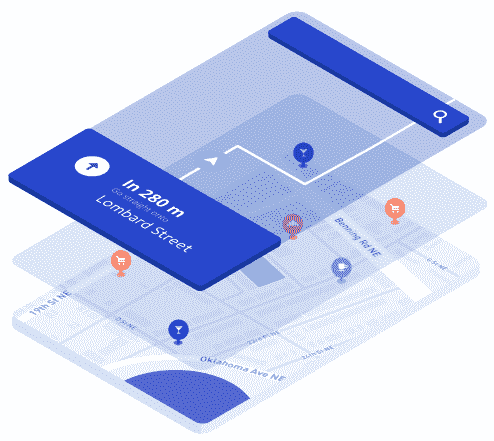
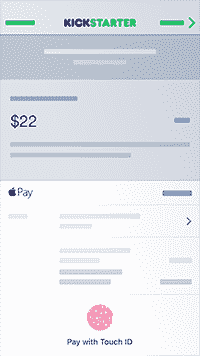

# 我们想要即时的满足——我们如何实现呢？

> 原文：<https://www.freecodecamp.org/news/we-want-instant-gratification-how-do-we-deliver-it-ce3c4067a9ac/>

乔·汉森

# 你的用户渴望即时满足。那你怎么给他们呢？

我们想要，十分钟前就想要了。

我们希望它没有摩擦，没有障碍，最重要的是，不与人类交谈。如果我们没有得到它，我们会感到焦虑。这种感觉已经悄悄进入我们的日常生活。

列表条优于长格式是有原因的。我们现在就要所有的信息。如果 YouTube 视频包含 30 秒的广告，我们甚至不会去看，这是有原因的。我们现在就要那个视频。当我们的优步或我们的清真鸡拼盘晚了，或者我们无法实时跟踪司机，我们失去了它。

为什么？它深深植根于人类的心灵之中。正如尼尔·帕特尔所说:

> 在大多数心理学模型中，人们被认为是按照“快乐原则”行事的。快乐原则基本上是迫使人类满足其需求、欲望和欲望的驱动力。这些需求、欲望和欲望可以像呼吸、饮食一样是基本的需求。但它们可能像对 iPhone 6 或其他酷新产品的“需求”一样复杂。

### 超越人类精神，进入商业领域

如果还没有，企业正开始转向即时满足，这种情绪来自于当用户在各个垂直行业和行业都需要时被交付的服务或信息。

当用户请求时，交付数据、产品或体验。

以按需经济为例。大众拥有智能手机和应用程序。因此，技术的可获得性使得按需经济成为我们日常运作方式的附属品。

只需按一下按钮，你就可以让别人为你做任何事情。洗衣服。送你的杂货。从学校接你的孩子。带你的狗出去拉屎。按需经济在全球范围内彻底改变了城市中心和农村地区。随着新的应用程序涌入市场，解决对生活来说既微不足道又至关重要的问题，这种情况只会越来越多。

Me, hailing a fake Uber

按需经济只是由即时满足感驱动的企业的一个例子，但它不仅仅是在短时间内提供商品或服务。它超越了这一点。它是关于当用户请求时，交付**某物**(比如一次经历或一点信息)。

这是巨大的。物联网的承诺之一是从设备到其他设备或最终用户的即时数据传输。如果你的门被锁上了，你的洒水器漏水了，或者你的宝宝在哭了，你可以马上知道。简而言之，现在和未来的成功企业都建立在即时满足的感觉上。

下一个问题是，企业将如何交付它，未来会怎样？

### 驱动即时满足感的底层技术

提供即时满足感不是一件容易的事情，需要结合多种底层技术，尤其是在扩展应用程序或服务时。然而，随着技术的进步和更多玩家的加入，游戏变得越来越容易，也越来越有创新性。

有三个主要部分——用户界面/UX、无服务器基础设施和流媒体。用户将与什么交互，我们如何向他们提供体验？

#### UI/UX

一个漂亮且易于操作的用户界面，它为用户创造的体验是即时满足的驱动力。为 web、移动和物联网应用程序构建交互式 UI/UX 的创新、漂亮的 API 和平台大量涌现。更好的是，最好的那些与其他 API 和平台配合得很好，创造了交互功能的完美和谐。这些 API 和平台是用户消费和渴望更多的东西。

在看 UI 方面，以 [Mapbox](https://www.mapbox.com/products/) 为例。Mapbox 是一个非常灵活的地图平台，不仅提供了漂亮的“像素完美的矢量地图”，还提供了一系列地图和地理定位 API，用于导航、地理哈希、地理编码等。开发者触手可及的是一个强大的、可扩展的解决方案，就像他们的主页一样*制作让你感动的地图*。

Mapbox makes mapping APIs to empower developers to make maps that move you (was that a mouthful?)

不像 Mapbox 那么吸引人，但同样重要的是，源源不断的 API 和服务增强了用户体验。你可能不知道他们在那里(如果你不知道，那意味着他们做得很好)。这些服务为一小部分用户体验提供动力，并专注于此。

Stripe 每年处理数十亿美元的交易，并提供各种各样的在线支付 API。条纹是当你走出你的优步或 Lyft，你的车费支付的原因。你的食物配送也包括在内。

Paying for stuff has never been easier

一个无缝的用户体验，一个令人愉快的用户界面，来满足即时的满足感，是几十个交互 API、服务和平台的结果。有些你看到了，有些你没看到，但都有助于即时满足。

#### 实时流/数据推送

没有好的数据，漂亮的用户界面什么都不是。我所说的好数据是指当用户需要数据时，将数据放在需要的地方。它是将一切结合在一起的粘合剂，也是传递即时满足感的手段——即时。

Lots and lots of messages being sent incredibly fast

其核心是，通过数据中心从一个地方到另一个地方发送和接收小数据包(最常见的是 JSON)。值得注意的是，数据流是双向的，而不是单向的，因此数据可以在任意数量的发布者和任意数量的订阅者之间无缝流动，反之亦然。您可以将其分为两种类型的实时交互:

**流式传输:**数据变化时的即时实时传输。这可能是司机或包裹的地理坐标流，并在实时更新的地图上发布位置数据，以推送通知或网络警报的形式确认订单或购买证明的警报，或者物联网传感器上的更新天气读数。

**数据推送:**向任意数量的用户发送一条消息。这可能是用户之间发送聊天信息或触发设备动作，例如通过移动应用程序打开连接的灯泡。

数据流和数据推送是即时满足的核心。用户渴望随着数据的变化而更新数据，而这些协议及其背后的基础设施就是传递数据的工具。

有开源和托管的解决方案可以做到这一点。主要的区别在于，使用开源选项，您得到了核心协议，但是您负责服务器、故障转移、设备支持、安全性等等。一些例子包括 [WebSockets、REST、](https://www.pubnub.com/blog/2015-01-05-websockets-vs-rest-api-understanding-the-difference/)和 [Socket。IO](http://socket.io/) 。

托管解决方案提供了数据流协议(在某些情况下，还提供了额外的实时功能)，但也在幕后处理基础设施。一些例子包括[推杆](https://www.pubnub.com?utm_source=Syndication&utm_medium=Medium&utm_campaign=SYN-CY17-Q1-Medium-February-16)和[推杆](https://pusher.com/)。

#### (无服务器)基础设施

It’s not that you don’t NEED servers. It’s that you don’t have to THINK about those servers.

即时满足引擎的基础设施是一切的基础。是云提供商和数据中心。它是日志记录、供应、路由、负载平衡开发、部署以及其间的一切。其中最重要的是安全性和可靠性。如今，这是对任何地方的应用程序的期望。

这其中的一个关键方面是它的可负担性，这也是为什么如此多的按需公司能够突然出现并扰乱市场。像 Amazon EC2 这样的服务允许你租用服务器，并且只为你使用的服务付费。这似乎是显而易见的，但这为公司提供了大大小小的企业级服务器，无论其公司规模如何，都是经济实惠的。

这也是导致服务器兴起的原因，这本身有点用词不当，但最近已经成为热门话题。无服务器不是不再需要服务器，而是开发人员不必担心服务器，因为他们可以将所有这些外包给第三方，专注于开发，而不是系统操作。因此，我们的团队能够以极小的速度构建全球可扩展的应用，而无需在基础架构上投入人力和资源。

### 展望未来——人工智能

虽然仍处于早期，但人工智能的日益普及，以及它如何增强即时满足感，肯定会成为一个大玩家。现在，我们已经有了易于访问的人工智能，它可以充当个人助理，通过电子邮件协调会议，因此用户不必玩电子邮件标签，等待数小时或数天来安排会议。

HAL 9000 is here to help you buy new shoes, not kill you.

但人工智能将继续发展，成为按需经济的核心部分，并提供即时满足。IBM Watson 正在推出几十种易于访问的创新 API，用于在几秒钟内处理输入并交付输出。例如，沃森可以[分析用户情绪的对话，并做出相应的回应](https://hackernoon.com/3-ways-to-level-up-your-chat-app-with-ibm-watson-d60513d6d71d#.49otsskcp)。

在简单但需要终端用户等待的任务中，将人类排除在循环之外，将是一个巨大的进步。先期待聊天机器人和虚拟助手，还有更高级的 AI 服务(亚马逊无人机有人吗？)再往前走。

所以问题是，接下来我们会即时交付什么？