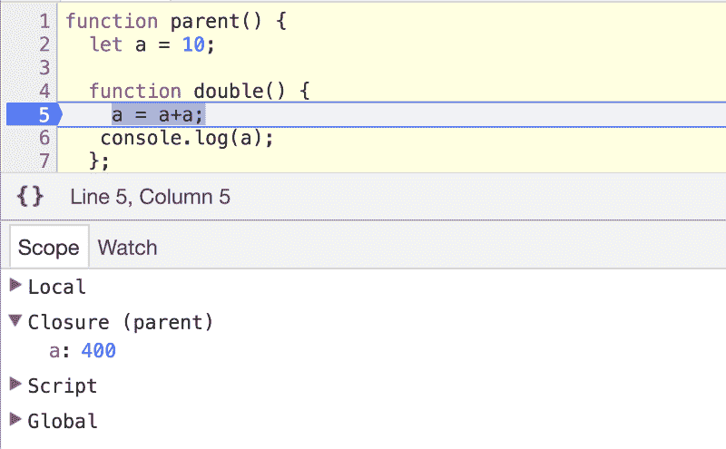

# 什么是 JavaScript 闭包？请用简单的英语。

> 原文：<https://www.freecodecamp.org/news/whats-a-javascript-closure-in-plain-english-please-6a1fc1d2ff1c/>

JavaScript 中的每个函数都有一个闭包。这是 JavaScript 语言最酷的特性之一。因为没有闭包，就很难实现像回调或事件处理程序这样的通用结构。

每当你定义一个函数时，你就创建了一个闭包。然后当您执行函数时，它们的闭包使它们能够访问它们作用域内的数据。

这有点像当一辆汽车被制造(定义)时，它带有一些功能，如`start`、`accelerate`、`decelerate`。这些汽车功能由驾驶员在每次操作汽车时执行。这些函数的闭包由汽车本身定义，它们*关闭它们需要操作的*变量。

让我们将这个类比缩小到`accelerate`函数。功能定义发生在汽车制造时:

```
function accelerate(force) {
  // Is the car started?
  // Do we have fuel?
  // Are we in traction control mode?
  // Many other checks...
  // If all good, burn more fuel depending on 
  // the force variable (how hard we’re pressing the gas pedal)
}
```

每当驾驶员踩下油门踏板，这些功能就会被执行。注意这个函数需要访问很多变量来运行，包括它自己的`force`变量。但更重要的是，它需要由其他汽车功能控制的其范围之外的变量。这就是`accelerate`函数的闭包(我们从汽车本身得到的)派上用场的地方。

下面是`accelerate`函数的闭包对`accelerate`函数本身的承诺:

> 好的`*accelerate*`，当你被执行时，你可以访问你的`*force*`变量，你可以访问`*isCarStarted*`变量，你也可以访问`*fuelLevel*`变量和`*isTractionControlOn*`变量。您还可以控制我们发送给引擎的`*currentFuelSupply*`变量。

注意，闭包没有给`accelerate`函数*这些变量的固定*值，而是给*权限*在执行加速函数时访问这些值。

闭包与[函数作用域](https://edgecoders.com/function-scopes-and-block-scopes-in-javascript-25bbd7f293d7#.juf2mvr1i)密切相关，所以理解这些作用域如何工作将有助于你理解闭包。简而言之，理解作用域最重要的事情是，当你*执行*一个函数时，一个私有函数作用域被创建并用于执行该函数的过程。

然后，当您从函数内部执行函数时，这些函数作用域会被嵌套(您会一直这样做)。

闭包是在你*定义*一个函数的时候创建的——而不是在你执行它的时候。然后，每次执行该函数时，它已经定义好的闭包会让它访问周围所有可用的函数作用域。

在某种程度上，您可以认为作用域是临时的(全局作用域是唯一的例外)，而您可以认为闭包本身是永久的。



A closure as reported in Chrome devtools

要真正理解闭包及其在 JavaScript 中的作用，首先需要理解一些关于 JavaScript 函数及其作用域的简单概念。

在我们开始之前，请注意，我还为此创建了一个交互式实验室，您可以通过这里的[进行操作。](https://jscomplete.com/what-are-closures-in-javascript)

### 1-通过值引用分配函数

当你把一个函数放入这样的变量中时:

```
function sayHello() {
  console.log("hello");
};
var func = sayHello;
```

你在给变量`func`赋值一个对函数`sayHello` *的引用，而不是*的副本。在这里，`func`只是`sayHello`的别名。您在别名上做的任何事情实际上都是在原始函数上做的。例如:

```
func.answer = 42;
console.log(sayHello.answer); // prints 42
```

属性`answer`被直接设置在`func` 上，并使用`sayHello`读取，这是有效的。

您也可以通过执行`func`别名来执行`sayHello`:

```
func() // prints "hello"
```

### 2-作用域具有生存期

当您调用一个函数时，您会在该函数的执行过程中创建一个作用域。那么这个范围就消失了。

当您第二次调用该函数时，您在第二次执行期间创建了一个新的不同的范围。然后第二个范围也消失了。

```
function printA() {
  console.log(answer);
  var answer = 1;
};
printA(); // this creates a scope which gets discarded right after
printA(); // this creates a new different scope which also gets discarded right after;
```

上例中创建的这两个范围是不同的。这里的变量`answer`根本不在它们之间共享。

每个函数作用域都有一个生存期。它们被创造出来，然后马上被丢弃。唯一的例外是全局范围，只要应用程序还在运行，它就不会消失。

### 3-闭包跨越多个作用域

#### 当你定义一个函数时，会产生一个闭包

与作用域不同，闭包是在定义函数时创建的，而不是在执行函数时创建的。在执行了那个函数之后，闭包也不会消失。

您可以在函数定义和执行之后很久访问闭包中的数据。

闭包包含了定义的函数可以访问的所有东西。这意味着已定义函数的作用域，以及全局作用域和已定义函数作用域之间的所有嵌套作用域加上全局作用域本身。

```
var G = 'G';
// Define a function and create a closure
function functionA() {
  var A = 'A'

  // Define a function and create a closure
  function functionB() {
    var B = 'B'
    console.log(A, B, G);
  }

  functionB();  // prints A, B, G
  // functionB closure does not get discarded
  A = 42;
  functionB();  // prints 42, B, G
}
functionA();
```

当我们在这里定义`functionB`时，它创建的闭包将允许我们访问`functionB`的范围加上`functionA`的范围加上全局范围。

每次执行`functionB`，我们都可以通过它之前创建的闭包来访问变量`B`、`A`和`G` 。然而，闭包并没有给我们这些变量的副本，而是给了我们对它们的引用。因此，举例来说，如果变量`A`的值在`functionB`闭包创建后的某个时刻发生了变化，当我们在那之后执行`functionB`时，我们将会看到新的值，而不是旧的值。对`functionB`的第二次调用打印`42, B, G` ，因为变量`A`的值被更改为 42，闭包给了我们一个对`A`的引用，而不是副本。

#### 不要混淆闭包和作用域

闭包与作用域混淆是很常见的，所以我们要确保不要这样做。

```
// scope: global
var a = 1;
void function one() {
  // scope: one
  // closure: [one, global]
  var b = 2;

  void function two() {
    // scope: two
    // closure: [two, one, global]
    var c = 3;

    void function three() {
      // scope: three
      // closure: [three, two, one, global]
      var d = 4;
      console.log(a + b + c + d); // prints 10
    }();
  }();  
}();
```

在上面的简单例子中，我们有三个函数，它们都被定义并被立即调用，所以它们都创建了作用域和闭包。

作用范围`one()`是它的身体。它的闭包让我们可以访问它的作用域和全局作用域。

作用范围`two()`是它的身体。它的闭包让我们可以访问它的作用域加上函数的作用域`one()`加上全局作用域

类似地，函数`three()`的闭包让我们可以访问示例中的所有作用域。这就是为什么我们能够访问函数`three()`中的所有变量。

但是作用域和闭包之间的关系并不总是这样简单。当函数的定义和调用发生在不同的范围时，情况就不同了。让我用一个例子来解释一下:

```
var v = 1;
var f1 = function () {
  console.log(v);
}
var f2 = function() {
  var v = 2;
  f1(); // Will this print 1 or 2?
};
f2();
```

你认为上面的例子会打印出什么？代码很简单，`f1()`打印出`v`的值，它在全局范围内是 1，但是我们在`f2()`内执行`f1()`，它有一个不同的`v`，它等于 2。然后我们执行`f2()`。

这段代码会打印 1 还是 2？

如果你想说 2，你会感到惊讶。这段代码实际上将打印 1。原因是，作用域和闭包是不同的。`console.log`行将使用`f1()`的闭包，这是在我们定义`f1()`时创建的，这意味着`f1()`的闭包只允许我们访问`f1()`加上全局范围。我们执行`f1()`的范围不会影响闭包。事实上，`f1()`的关闭根本不会让我们进入`f2()`的作用域。如果您删除全局`v`变量并执行这段代码，您将得到一个引用错误:

```
var f1 = function () {
  console.log(v);
}
var f2 = function() {
  var v = 2;
  f1(); // ReferenceError: v is not defined
};
f2();
```

理解和记住这一点非常重要。

### 4 —闭包具有读写权限

因为闭包给了我们对作用域中变量的引用，所以它们给我们的访问意味着读和写，而不仅仅是读。

看一下这个例子:

```
function outer() {
  let a = 42;
function inner() {
    a = 43;
  }
inner();
  console.log(a);
}
outer();
```

这里的`inner()`函数，在定义时，创建了一个闭包，让我们可以访问变量`a`。我们可以读取并修改那个变量，如果我们真的修改了它，我们将会修改`outer()`范围内的实际的`a`变量。

这段代码将打印出 *43* ，因为我们使用了`inner()`函数闭包来修改`outer()`函数变量。

这就是为什么我们可以在任何地方改变全局变量。所有闭包都给了我们对所有全局变量的读写权限。

### 5 —闭包可以共享作用域

因为闭包让我们在定义函数时可以访问嵌套的作用域，所以当我们在同一个作用域中定义多个函数时，这个作用域在所有创建的闭包之间共享，当然，正因为如此，全局作用域总是在所有闭包之间共享。

```
function parent() {
  let a = 10;

  function double() {
    a = a+a;
   console.log(a);
  };

  function square() {
    a = a*a;
   console.log(a);
  }

  return { double, square }
}
let { double, square } = parent();
double(); // prints 20
square(); // prints 400
double(); // prints 800
```

在上面的例子中，我们有一个变量`a`设置为 10 的`parent()`函数。我们在这个`parent()`函数的作用域中定义了两个函数，`double()`和`square()`。为`double()`和`square()`创建的闭包都共享`parent()` *函数*的范围。因为`double()`和`square()`都改变了`a`的值，所以当我们执行最后 3 行时，我们将`a`加倍(使`a` = 20)，然后将加倍的值平方(使`a` = 400)，然后将平方的值加倍(使`a` = 800)。

### 最后一次测试

现在让我们检查一下到目前为止你对闭包的理解。在执行下面的代码之前，试着猜测它会打印出什么:

```
let a = 1;
const function1 = function() {
  console.log(a);
  a = 2
}
a = 3;
const function2 = function() {
  console.log(a);
}
function1();
function2();
```

我希望你理解对了，我希望这些简单的概念能帮助你真正理解函数闭包在 JavaScript 中的重要作用。

感谢阅读。

学习 React 还是 Node？签出我的图书:

*   [通过构建游戏学习 react . js](http://amzn.to/2peYJZj)
*   [Node.js 超越基础](http://amzn.to/2FYfYru)