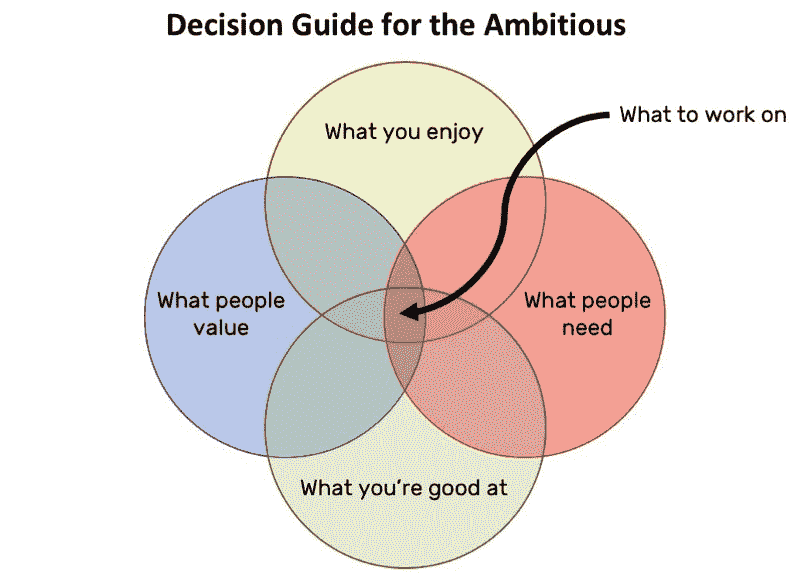

# 我再也不会把手机带上国际航班了。你也不应该。

> 原文：<https://www.freecodecamp.org/news/ill-never-bring-my-phone-on-an-international-flight-again-neither-should-you-1f3f9004f4a2/>

这里有三个值得你花时间的链接:

1.  我再也不会把手机带上国际航班了。你也不应该。( [7 分钟读数](http://bit.ly/2kPxOBI))
2.  “我简直想黑掉我的心脏。但我不能。”来自 OSCON 会场的采访，最大的开源大会( [78 分钟聆听](http://bit.ly/2lghPgv))
3.  观看 Ewa 在她视频博客的最新一集上构建 GitHub 战斗应用( [10 分钟观看](http://bit.ly/2ktw3Xs))

### 想到这一天:

> “我们应该像对待武器级钚一样对待个人电子数据——它是危险的、持久的，一旦泄露就无法挽回。”—科利·多克托罗

### 每日一图:

大卫·惠特克的图片

### 今日学习小组:

北京自由代码营

编码快乐！

–昆西·拉森，自由代码营的老师