# 2017 年初你肯定想尝试的 25 个新 Android 库

> 原文：<https://www.freecodecamp.org/news/25-new-android-libraries-which-you-definitely-want-to-try-at-the-beginning-of-2017-45878d5408c0/>

作者:米哈尔·比亚拉斯

# 2017 年初你绝对想尝试的 25 个 Android 库

这是 2017 年 1 月和 2 月发布的 25 个最佳安卓库**列表。**所有这些都值得一试——它们没有排名顺序。我们开始吧！

1.  [**洛蒂**](https://github.com/airbnb/lottie-android)
    这是一个用 [Bodymovin](https://github.com/bodymovin/bodymovin) (用于将动画导出到 SVG/Canvas/HTML + JavaScript 的 After Effects 插件)解析 [Adobe After Effects](http://www.adobe.com/products/aftereffects.html) 导出为 JSON 的动画并在手机上原生渲染的库。
    在[谷歌 Play 商店](https://play.google.com/store/apps/details?id=com.airbnb.lottie)中也有一个示例应用程序。
    主演这个库的 7500 多名 Github 用户不会错！

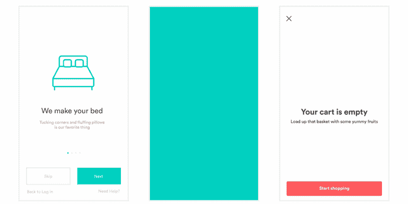

[**Airbnb/Lottie-android**](https://github.com/airbnb/lottie-android)
[*Lottie-Android-在 Android 和 iOS 上原生渲染效果动画后*github.com](https://github.com/airbnb/lottie-android)

2. [**烤面包机**](https://github.com/GrenderG/Toasty)
这是一个用于创建定制`Toasts`的库。正如作者对 lib 的描述，它是:

> “普通的烤面包，但是用了类固醇。”

你可以在下面找到截图和库的链接。

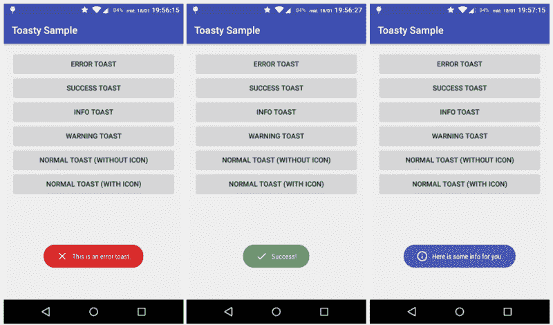

[**GrenderG/Toasty**](https://github.com/GrenderG/Toasty)
[*Toasty——通常的烤面包，但是用类固醇？克*ithub.com](https://github.com/GrenderG/Toasty)

3.[**StyleableToast**](https://github.com/Muddz/StyleableToast)这是另一个用于`Toasts`定制的库。它补充说:

> *“各种风格选项让您的应用程序和用户体验有一点点额外的独特感觉！通过代码或 styles.xml 来设计您的吐司！”*

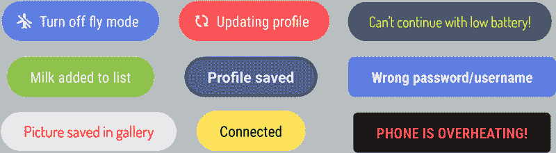

[**Muddz/StyleableToast**](https://github.com/Muddz/StyleableToast)
[*StyleableToast——一个将标准 Android toast 提升到一个新水平的库，具有多种样式选项……*github.com](https://github.com/Muddz/StyleableToast)

4. [**Store**](https://github.com/NYTimes/Store)
Store 是一个异步数据加载和缓存的库。根据文件:

> Store 是一个类，它简化了应用程序中数据的获取、解析、存储和检索。存储类似于[存储库模式](https://msdn.microsoft.com/en-us/library/ff649690.aspx)，同时公开一个用 RxJava 构建的反应式 API，该 API 遵循单向数据流。”

文档非常全面，库肯定值得一试。您可以检查许多流程，如数据请求、缓存和解析。

[**NYTimes/Store**](https://github.com/NYTimes/Store)
[*Store-Android 库用于异步数据加载和缓存*github.com](https://github.com/NYTimes/Store)

5. [**预览 seekbar**](https://github.com/rubensousa/PreviewSeekBar)如果你使用 Google Play 电影，你可能已经注意到了这部带有电影预览的伟大动画`SeekBar`。原来，Rúben Sousa 将它实现为一个开源库。下面的 gif 很好地展示了它的功能。如果你的应用程序是一个电影播放器，你一定要试试！

[**Ruben Sousa/PreviewSeekBar**](https://github.com/rubensousa/PreviewSeekBar)
[*PreviewSeekBar——一个适合显示某事物预览的 SeekBar。如 Google Play 电影中所见。*github.com](https://github.com/rubensousa/PreviewSeekBar)

6. [**Chuck**](https://github.com/jgilfelt/chuck)
如果您使用 [OkHttp](http://square.github.io/okhttp/) ，这是一个帮助拦截并持久保存应用程序内部所有 Http 请求和响应的库。它还提供了一个 UI 来检查它们的内容。

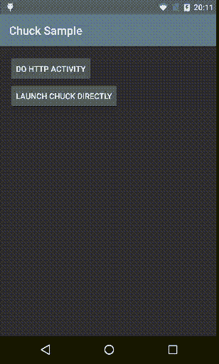

[**jgilfelt/chuck**](https://github.com/jgilfelt/chuck)
[*chuck-一款针对 Android OkHttp 客户端的应用内 HTTP 检测器*github.com](https://github.com/jgilfelt/chuck)

7.[**CoordinatorTabLayout**](https://github.com/hugeterry/CoordinatorTabLayout)
CoordinatorTabLayout 是快速实现`TabLayout`和`CoordinatorLayout`组合的自定义复合控件。
你可以在下面的 gif 上查看它是如何工作的:

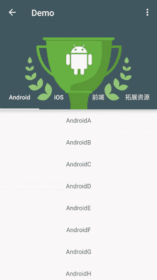

[**hugetery/coordinator blayout**](https://github.com/hugeterry/CoordinatorTabLayout)
[*【coordinator blayout——tablelayout 和 CoordinatorLayout 的组合。/TabLayout 和坐标布局相结合的折叠控件*github.com](https://github.com/hugeterry/CoordinatorTabLayout)

8. [**拳击**](https://github.com/Bilibili/boxing)
拳击是一个多媒体选择器，使用它您可以:

*   选择您的图像(单个或多个图像)
*   预览和裁剪图像。

它还支持 gif、视频选择、图像压缩和自定义 UI，如下图所示:

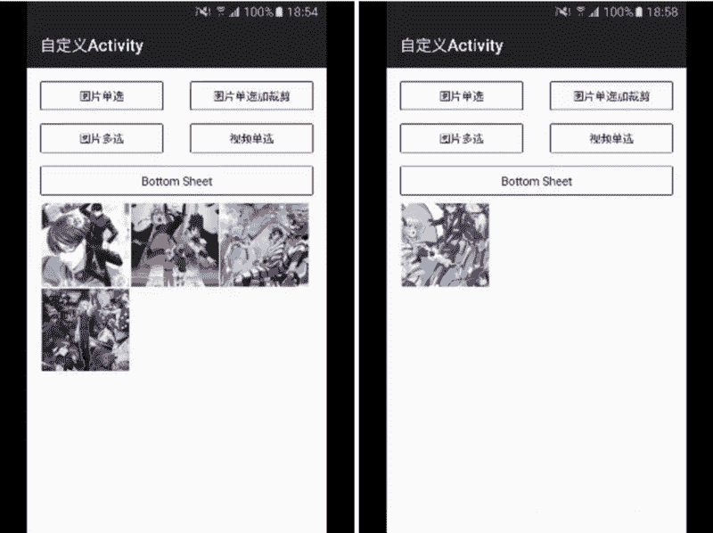

[**哔哩哔哩/拳击**](https://github.com/Bilibili/boxing)
[*拳击-基于 MVP 模式的 Android 多媒体选择器。*github.com](https://github.com/Bilibili/boxing)

9.[**excel panel**](https://github.com/zhouchaoyuan/excelPanel)这是一个二维的`RecyclerView`。它不仅可以加载历史数据，还可以加载未来数据。

[**周朝元/excel panel**](https://github.com/zhouchaoyuan/excelPanel)
[*excel panel-一个安卓的二维 RecyclerView。不仅可以加载历史数据，还可以加载未来……*github.com](https://github.com/zhouchaoyuan/excelPanel)

10. **另一个实现为`RecyclerView`专用于显示素材的横式日历视图。**

**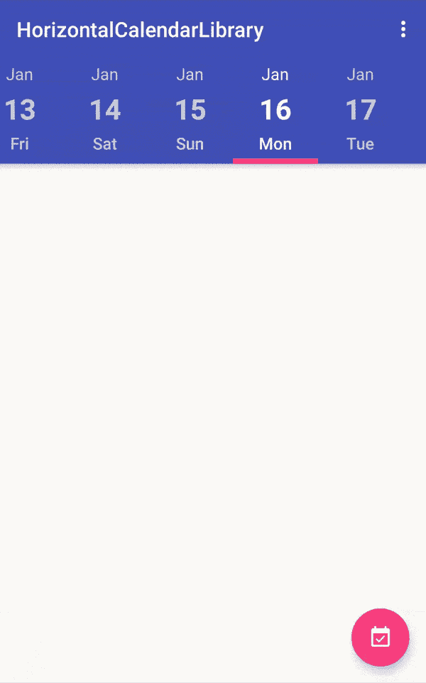**

**[**Mulham-Raee/horizontal calendar**](https://github.com/Mulham-Raee/HorizontalCalendar)
[*horizontal calendar——一个基于 RecyclerView 的 Android 素材横式日历视图*github.com](https://github.com/Mulham-Raee/HorizontalCalendar)**

**11.[**camera fragment**](https://github.com/florent37/CameraFragment)
camera fragment 是一个`Fragment`的实现，它允许您轻松地将相机功能集成到您的应用程序中。据其*自述*:**

> ***"CameraFragment 直接预览摄像机视图，并提供一个简单的 API 来捕获或管理设备。您可以设置自己的布局，并使用 CameraFragment 控制摄像机。***

****

**[**florent 37/CameraFragment**](https://github.com/florent37/CameraFragment)
[*CameraFragment——一个简单易集成的安卓相机片段*github.com](https://github.com/florent37/CameraFragment)**

**12. [**AwesomeBar**](https://github.com/florent37/AwesomeBar)
这是来自 [Florent Champigny](https://www.freecodecamp.org/news/25-new-android-libraries-which-you-definitely-want-to-try-at-the-beginning-of-2017-45878d5408c0/undefined) 的又一伟大实现。这是一个顶栏设计的新方法(我们从`ActionBar/Toolbar`实现中得知)，结合`DrawerLayout`，灵感来自 Weekz 的 [Gmail 移动。你可以在下面查看它是如何工作的:](https://material.uplabs.com/posts/gmail-mobile-concept)**

**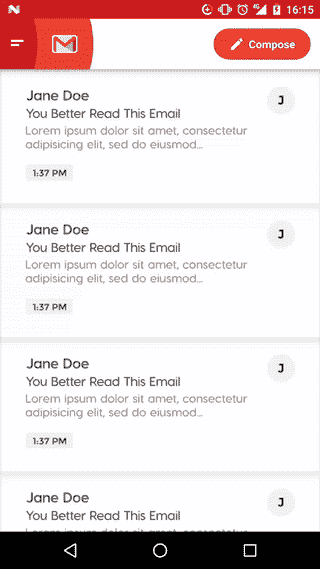**

**[**florent 37/AwesomeBar**](https://github.com/florent37/AwesomeBar)
[*AwesomeBar——刚刚美了*github.com](https://github.com/florent37/AwesomeBar)**

**13.[**ArcNavigationView**](https://github.com/rom4ek/ArcNavigationView)
这是 Android 设计支持库中`NavigationView`的一个实现，引入了弯曲边缘。**

**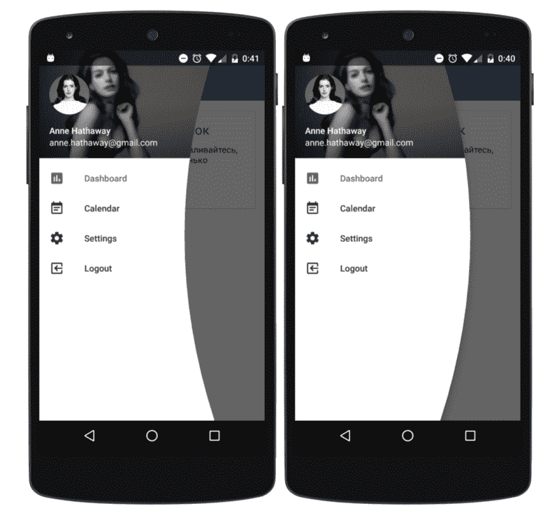**

**[**rom4ek/ArcNavigationView**](https://github.com/rom4ek/ArcNavigationView)
[*ArcNavigationView-用材质概念创建 NavigationDrawer 的另一种方法*github.com](https://github.com/rom4ek/ArcNavigationView)**

**14.[**shimmercyclerview**](https://github.com/sharish/ShimmerRecyclerView)
这是一个自定义的`RecyclerView`实现，用 shimmer 视图来表示视图正在加载。`RecyclerView`也有一个内置的适配器，以控制微光外观。**

****

**[**sharish/shimmerrecreview**](https://github.com/sharish/ShimmerRecyclerView)
[*通过在 GitHub 上创建账号为 shimmerrecreview 开发做贡献。*github.com](https://github.com/sharish/ShimmerRecyclerView)**

**15.[**Android-switch icon**](https://github.com/zagum/Android-SwitchIcon)**

> **“一个谷歌启动器风格的切换(启用/禁用)图标实现。”**

**这个库扩展了`AppCompatImageView`，允许你使用`app:srcCompat`属性将任何图标(矢量或图像)设置为`SwitchIconView`。**

**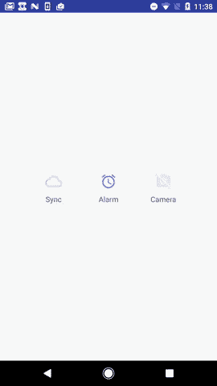**

**[**zagum/Android-switch icon**](https://github.com/zagum/Android-SwitchIcon)
[*Android-switch icon-Google launcher 风格实现的开关(启用/禁用)图标*github.com](https://github.com/zagum/Android-SwitchIcon)**

**16. [**CounterFab**](https://github.com/andremion/CounterFab)
这个库是一个`FloatingActionButton`子类，在右上角显示一个计数器徽章。你可以从 Google Play 下载一个[演示应用](https://play.google.com/store/apps/details?id=com.andremion.counterfab.sample)。**

**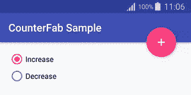**

**[**Andre mion/counter fab**](https://github.com/andremion/CounterFab)
[*counter fab——一个浮动的 ActionButton 子类，在右上角显示一个计数器徽章*github.com](https://github.com/andremion/CounterFab)**

**17.[**FadingTextView**](https://github.com/rosenpin/FadingTextView)
这个库允许你让一个`TextView`每隔几秒自动改变它的内容。**

****

**[**Rosen pin/FadingTextView**](https://github.com/rosenpin/FadingTextView)
[*FadingTextView——每隔几秒自动改变内容的 textview*github.com](https://github.com/rosenpin/FadingTextView)**

**18. [**大桥**](https://github.com/afollestad/bridge)**

> ***“Bridge 是一个简单但功能强大的 Android HTTP 联网库。它具有流畅的可链接 API，由 Java/Android 的`URLConnection`类提供支持，以实现最大的兼容性和速度。”***

**这个库有非常全面的文档，绝对值得一看。**

**[**afollestad/bridge**](https://github.com/afollestad/bridge)
[*bridge——一个简单但功能强大的 Android HTTP 联网库。它有一个流畅的可链接 API，由 Java…*github.com](https://github.com/afollestad/bridge)提供支持**

**19. [**Ason**](https://github.com/afollestad/ason)
它是从[艾丹·福勒斯塔德](https://twitter.com/afollestad)开始的第二个库。它的主要思想是简化与 JSON 的交互。图书馆:**

> **“也使序列化(反序列化)变得不那么痛苦。”**

**文档也很不错。你可以在这里查看:**

**[**afollestad/ASON**](https://github.com/afollestad/ason)
[*ASON-JSON 在 Java 中轻松搞定！*github.com](https://github.com/afollestad/ason)**

**20. [**ObjectBox**](https://github.com/greenrobot/ObjectBox)
我想大多数人都知道 [greenrobot](http://greenrobot.org/) 。如果没有，他们开发了[绿岛](https://github.com/greenrobot/greenDAO)和 [EventBus](https://github.com/greenrobot/EventBus) 。现在，是时候为关注性能的对象创建新的数据库了。正如绿色机器人声称的那样，**

> ***" **性能**是我们创建 ObjectBox 的首要原因。之前，我们为 Android 和 SQLite 创建了最快的对象/关系映射器(ORM)greenDAO。自 2011 年首次发布以来，我们对对象持久性以及 SQLite 带来的性能限制有了更多的了解。我们意识到，为了显著提高移动性能，我们需要深入核心，构建一个专为对象设计的数据库。”***

****

**你可以在这里阅读更多相关信息[。请考虑到 ObjectBox 目前处于测试阶段(版本 0.9.7)。](http://greenrobot.org/announcement/introducing-objectbox-beta/)**

**[**green robot/object box**](https://github.com/greenrobot/ObjectBox)
[*object box 是对象的超高速移动数据库*github.com](https://github.com/greenrobot/ObjectBox)**

**21. **本库流程图:****

> *****"当没有足够的空间时，允许子视图流向下一行。*
> *子视图之间的间距可以通过 FlowLayout 计算，这样视图就可以均匀放置了。”*****

****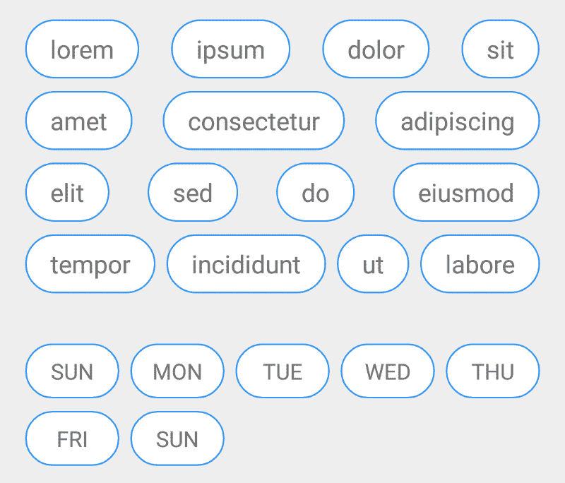****

****请注意，这仍处于早期发展阶段。****

****[**nex3z/FlowLayout**](https://github.com/nex3z/FlowLayout)
[*FlowLayout——一个自动调整间距的 Android 流程布局。*github.com](https://github.com/nex3z/FlowLayout)****

****22. [**非官方 Google Actions Java SDK**](https://github.com/frogermcs/Google-Actions-Java-SDK)
这是来自 [Mirek Stanek](https://www.freecodecamp.org/news/25-new-android-libraries-which-you-definitely-want-to-try-at-the-beginning-of-2017-45878d5408c0/undefined) 的波兰口音。因为官方的 Google Actions SDK 是用 Node.js 编写的，所以他介绍了自己原生用 Java 编写的非官方版本。根据*自述:*****

> *****“Google Actions Java SDK 是基于官方 Node.js 库构建的，但不是它的镜像副本。目标是使其完全兼容助理平台的[对话协议](https://developers.google.com/actions/reference/conversation)*****

****[**frogermcs/Google-Actions-Java-SDK**](https://github.com/frogermcs/Google-Actions-Java-SDK)
[*Google-Actions-Java-SDK-非官方的 Google Actions Java SDK -面向 Android 工程师和所有 Java 爱好者*github.com](https://github.com/frogermcs/Google-Actions-Java-SDK)****

****23. [**可穿戴回复**](https://github.com/klinker24/wearable-reply)
2017 年 2 月 9 日谷歌发布了全新的 [Android Wear 2.0](https://android-developers.googleblog.com/2017/02/AndroidWear2.html) 。Luke Klinker 发现了一个缺失的 API 并发布了这个操作系统的库。它:****

> *****”允许快速简单的文本输入，无论是通过语音、键盘还是录音应答。缺失的 API 现在可用了！”*****

********

****[**klinker 24/wearable-reply**](https://github.com/klinker24/wearable-reply)
[*wearable-reply-简化 Android Wear 2.0 的文本输入，通过语音，键盘，或者录音响应。*github.com](https://github.com/klinker24/wearable-reply)****

****24. [**酥饼**](https://github.com/MatthiasRobbers/shortbread)
这是一个库:****

> *****为标注了`@Shortcut`的活动和方法生成 [app 快捷方式](https://developer.android.com/guide/topics/ui/shortcuts.html)。无需接触清单，创建 XML 文件或使用快捷方式管理器。只需对您希望快捷方式调用的代码进行注释。*****

****目前，它的版本是 1.0.0。****

****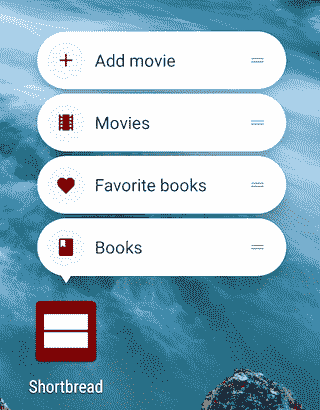****

****[**Matthias robbers/shortbread**](https://github.com/MatthiasRobbers/shortbread)
[*shortbread——从快捷方式注释生成 app 快捷方式的安卓库*github.com](https://github.com/MatthiasRobbers/shortbread)****

****25. [**素材关于**](https://github.com/jrvansuita/MaterialAbout)
这个库帮你准备一个*关于我*的画面，把你介绍给你的用户。****

********

****[**jrvansuita/material about**](https://github.com/jrvansuita/MaterialAbout)
[*material about——这是一个关于在你的 Android 应用上使用的屏幕的材质设计。开发人员简介和申请…*github.com](https://github.com/jrvansuita/MaterialAbout)****

****就是这样。我希望你喜欢我的列表。如果你知道任何伟大的图书馆，这是在今年*1 月或 2 月*发布的，我没有提到它，请在评论中告诉我。****

****如果你喜欢我的文章，请别忘了点击？？？去推荐给别人？？？。****

****此外，要获得关于我的新文章和故事的通知，请在[媒体](https://medium.com/@mmbialas)和[推特](https://twitter.com/mmbialas)上关注我。你也可以在 [LinkedIn](https://www.linkedin.com/in/mmbialas) 上找到我。干杯！****