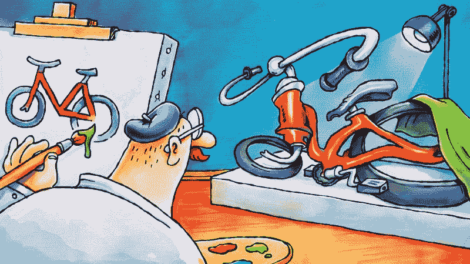
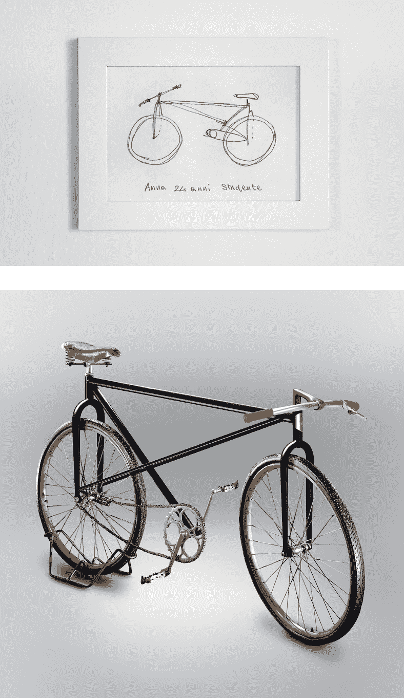
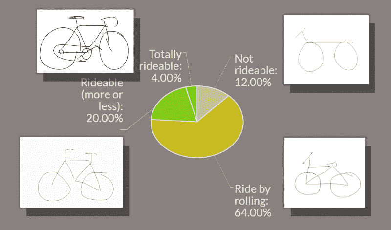
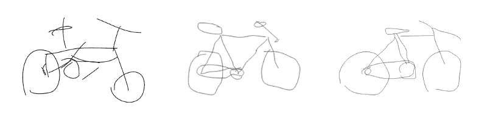
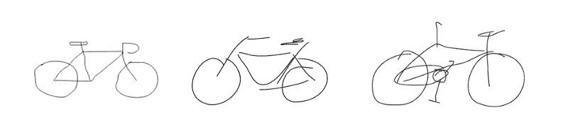
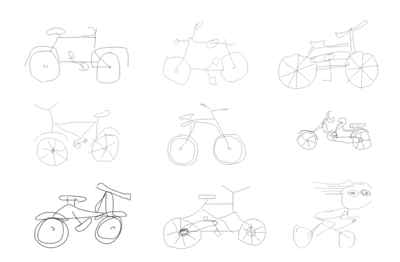

# 为什么你永远不应该请开发商来修理你的自行车

> 原文：<https://www.freecodecamp.org/news/why-you-shouldnt-ask-a-developer-to-fix-your-bike-336be286fc37/>

by Andrew Burmistrov

# 为什么你永远不应该请开发商来修理你的自行车

我曾经做过系统管理员。我整天都在修理电脑，做备份，恢复突然变得非常重要的被删除的电子邮件。但有时我会收到奇怪的请求。就像修微波炉一样。或者在女洗手间换灯泡。有一天，有人甚至问我是否擅长搅拌机。

这是人们看待技术人员的方式。是的，我们知道东西:我们的东西。有时，我们也会自欺欺人地认为自己擅长其他与技术相关的东西。但并非所有与科技相关的东西都是我们的。以自行车为例。

如果你想修理自行车，你必须知道它是如何工作的。如果你知道它是如何工作的，你可以很容易地**画**一辆自行车。大多数人相信他们知道自行车是如何工作的。然而，如果你让他们画一辆自行车，他们的画可能是这样的:

科学家称之为知识的错觉。我们的大脑更容易让我们相信我们知道一些事情，而不是让我们承认我们不知道。《国家地理》制作了一整集关于这个现象，其中 **90%的参与者不真实地画自行车。**

在他著名的项目 [Velocipedia](https://www.behance.net/gallery/35437979/Velocipedia) 中，Gianluca Gimini 将它推进了一步。他让不同的人画一辆自行车，然后根据他们的草图创建 3D 模型:

所以，90%的人不知道自行车是怎么操作的。然而……

在前面提到的两个例子中(国家地理和 Velocipedia 项目)，参与者都是具有一般知识的人(许多是学生)。没有具体标准。这是我幸运的地方。

最近我们一直在训练一个[神经网络](http://ai.icons8.com/)，它的唯一目的是识别人们描绘的图标。我们给我们的用户数据库发了一封电子邮件，要求我们的客户画各种各样的东西:汽车、房子、垃圾箱……和自行车。

我们的观众包括:

我们要求画自行车的人中有一半是开发者。现在问题来了:**90%的自行车仍然是不现实的吗，或者考虑到一半的观众是开发者，会有什么改善吗？**

### 概观

我请我的朋友，一位工程师和狂热的自行车爱好者(告诉你我很幸运)帮我分析 200 幅自行车画，然后我们把它们分成 4 个不同的类别:

**不可骑:**这通常是两个轮子和一个框架的非常原始的图画，以完全防止轮子滚动的方式附着。

**滚动骑:**这些自行车可以滚动，但不能转弯。或者，有时，被坐在上面。所以这些自行车是为那些没有时间坐的直爽的人准备的。

**可骑(或多或少):**这些都是小问题，比如没有踏板/链条或框架的冗余结构。

完全可骑:人们真的知道他们在画什么。

总体来说，76%的图纸是不现实的，而不是 90%。

> 开发人员绘制实际上更容易骑的自行车。

然而，在我们得出结论之前，有几个重要因素可能会影响这个数字。

### 施工图与准备图

在请我的工程师朋友帮忙分析图纸之前，我让他画了一张。毫无准备，没有收到任何提示。事情是这样的:

看看他是如何不使用一些为元素准备的心理捷径，而是构造自行车的。是**施工图**。

线条可能会不规则，比例可能会乱，但那不重要。你会看到这些自行车也是由:

另一方面，我们的观众中有相当多的设计师(~30%)。他们的画非常精确。

这些是**准备好的图纸**。幸运的是，所有的画中只有很小一部分看起来像是准备好的。所以我可以总结两件事:

*   它对总体数字没有太大影响
*   我们 30%的观众是设计师，但只有一小部分图纸是准备好的。我想没有多少设计师能够凭记忆画出一辆自行车。对了，从这个[实验](https://icons8.com/articles/how-good-are-designers-at-following-references-a-fiverr-experiment/)来看，就算给他们一个参考，也不一定够。

### 其他因素

这里还有几个因素在起作用:

#### 这是一个不受控制的实验

绘画不受时间限制，也没有观察者——人们可以在谷歌上查找参考。但是从不同寻常的自行车的数量来看，没有几辆这样做。即使有机会，人们仍然喜欢发明:

> “一个设计师不可能在 100 年的时间里发明这么多新的自行车设计。这也是我如此敬畏地看待这个系列的原因。”——**吉安卢卡·吉米尼，速度媒体**

### 国家

自行车在一些国家比在其他国家更受欢迎。但是我们的五大交通国家中只有一个(日本)在[名单上](http://top10hell.com/top-10-countries-with-most-bicycles-per-capita/)。我很想看看荷兰人有多擅长画自行车，那里的自行车比蒙古军队中的马还多。

### 结论

考虑到所有提到的因素——加上统计错误——开发者中不真实地画自行车的人数比一般人低 5%—10%。

然而，这是一个很大的延伸，因为有太多的因素在起作用，例如自行车在过去几年中的普遍普及，性别特征( [92%的开发人员是男性](http://fusion.net/story/115998/survey-says-92-percent-of-software-developers-are-men/))。是的，我愿意认为开发人员足够精明，可以画出逼真的自行车，但是这些数字还不足以戏剧性地得出这样的结论。

所以我会像开头一样结束这篇文章。用我自己的例子。

我修理了数百台电脑，配置了许多网络设备。我一生中从未修理过一辆自行车。

所以看了几百张自行车的图纸，决定自己画一张。不是复制它，而是在我的脑海中从头开始构建它。没有参照物和思维捷径。

这是:

虽然我已经拥有六辆自行车，但我从来没有机会修理，也没有动力去修理。我弄乱了车架。我的自行车不能转向。

我不是说技术人员不能修理东西。我确实相信技术人员是精明的，修理自行车比从一个框架迁移到另一个框架更容易，同时用测试覆盖每一点代码。如果你有动力，一切皆有可能。

我是说你**不应该期望开发人员擅长修复其他东西**。所以如果你真的想让我帮你修自行车，试着给我点动力。纸杯蛋糕是个好的开始。

**关于作者**
[安德鲁](https://twitter.com/ABNovels)在 Icons8 开始做可用性专家，进行访谈和可用性调查。他非常想与我们的专业社区分享他的发现，并开始为我们的博客撰写有见地和有趣(有时两者都有)的故事。

*关注图标 8: [推特](https://twitter.com/icons_8) | [脸书](https://www.facebook.com/Icons8/) | [滴滴出行](https://dribbble.com/icons8)*