# 20 世纪 90 年代个人电脑是如何做广告的

> 原文：<https://www.freecodecamp.org/news/how-pcs-were-advertised-in-the-1990s-cdaee59f2555/>

伊利亚·佩斯托夫

# 20 世纪 90 年代个人电脑是如何做广告的

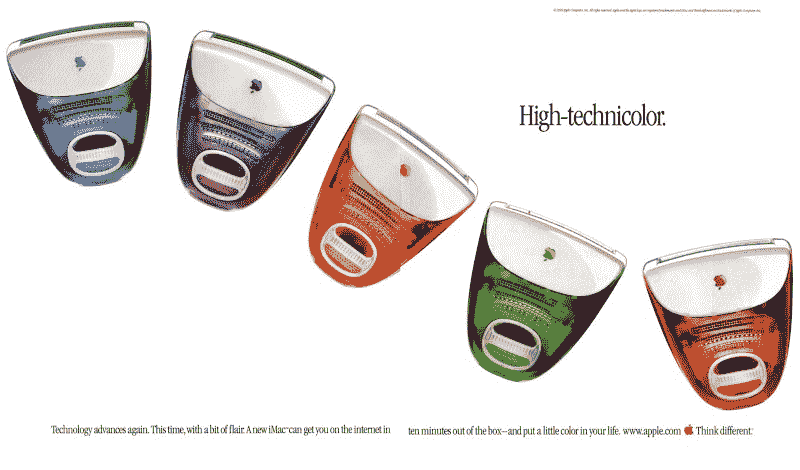

今天，硬盘很无聊。你可以花 50 美元买一个 1tb 的硬盘。但是在过去，当人们看到广告宣称有 10 兆硬盘时，他们会很兴奋。

为了证明这一点，我挖掘了一些复古的电脑广告，让你直接了解在智能手机、超极本和智能手表的现代时代之前，电脑是如何做广告的。

你再也不能以同样的方式看待你的小玩意了。

史蒂夫·乔布斯在 1985 年创立了 NeXT 公司。NeXTcube 工作站被铸造成类似立方体的形状，每边 12 英寸。它的黑色身体赋予了它一种特殊的风格，并专注于商业和科学领域的严峻挑战。它在 NeXTSTEP 操作系统的控制下工作。它是在 1990 年到 1993 年间生产和销售的。

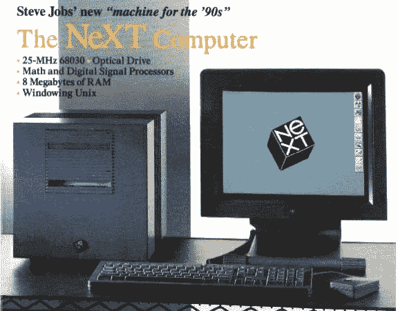

1990 年，Northgate Computer 的 PowerMax 386/33 上市销售。你可以邮购，甚至通过电子邮件订购。

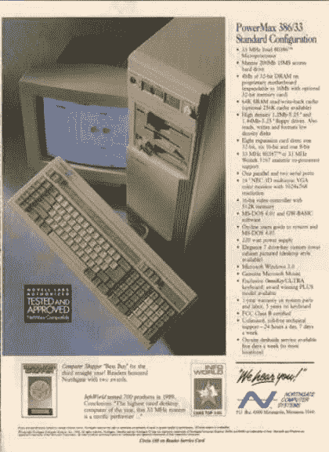

1991 年，微软发布了 Windows 3.0。正是通过这次发布，该公司通过其图形操作系统，使 IBM 兼容的个人电脑成为苹果 Macintosh 和 Commodore Amiga 的真正竞争对手。Windows 3.x 是 DOS 的系统插件。这是一个 1991 年的 Windows 3.0 或 Windows 3.1 电视广告:

康柏公司在 1990 年提出的“它只是工作得更好”:

CSS 实验室服务器—1990 年零等待的 486:

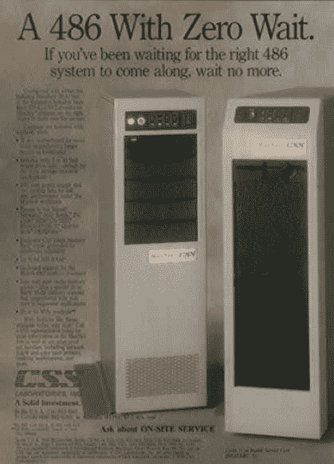

一篇关于电脑交互式平板电脑的文章:

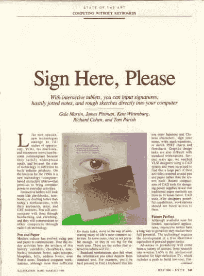

Xircom 的袖珍网络适配器:

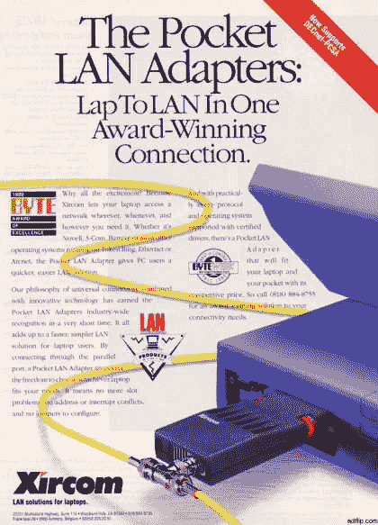

Lotus Magellan 2.0 软件的一个广告，该软件允许您搜索文档:

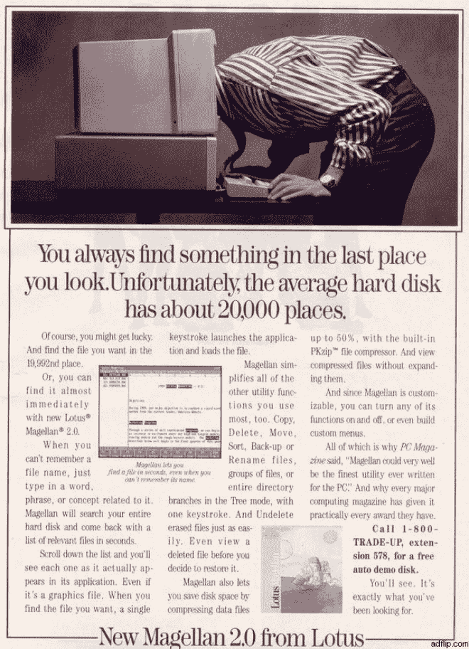

1990 年的罗技轨迹球广告。不要觉得自己是外星人。

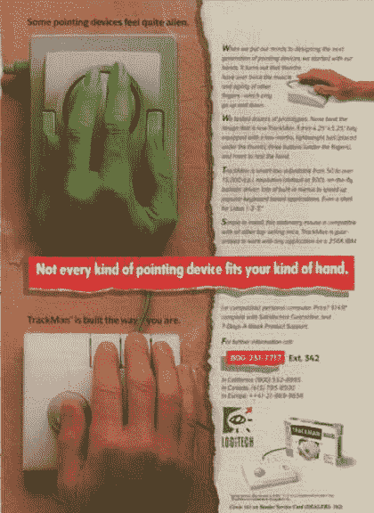

只需 50 美元，微软就能升级你的个人电脑，使你能够访问你电脑中的所有内存。

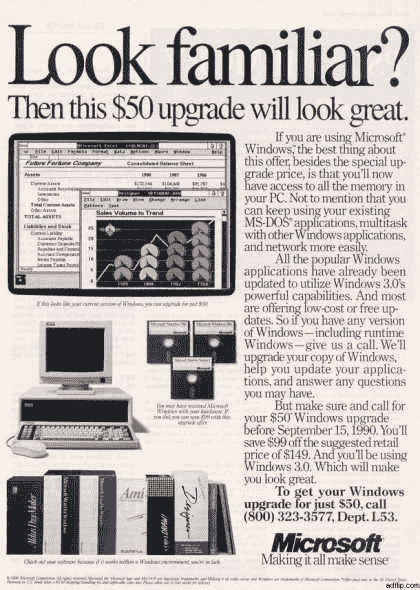

1992 年的一则戴尔广告:

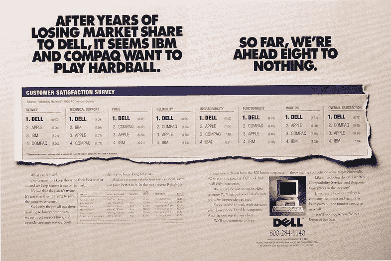

电路城宣传用信用卡购买电脑的机会:

Macintosh Performa 从 1992 年到 1997 年一直在销售:

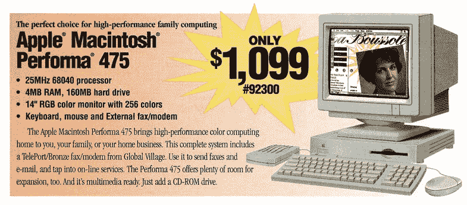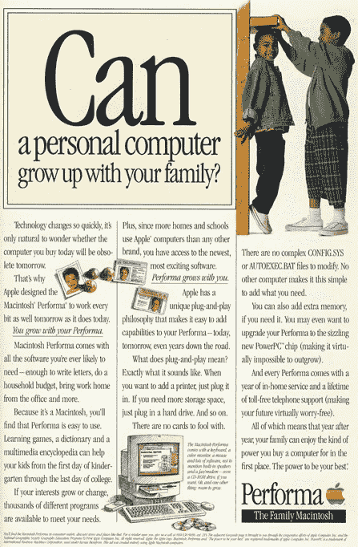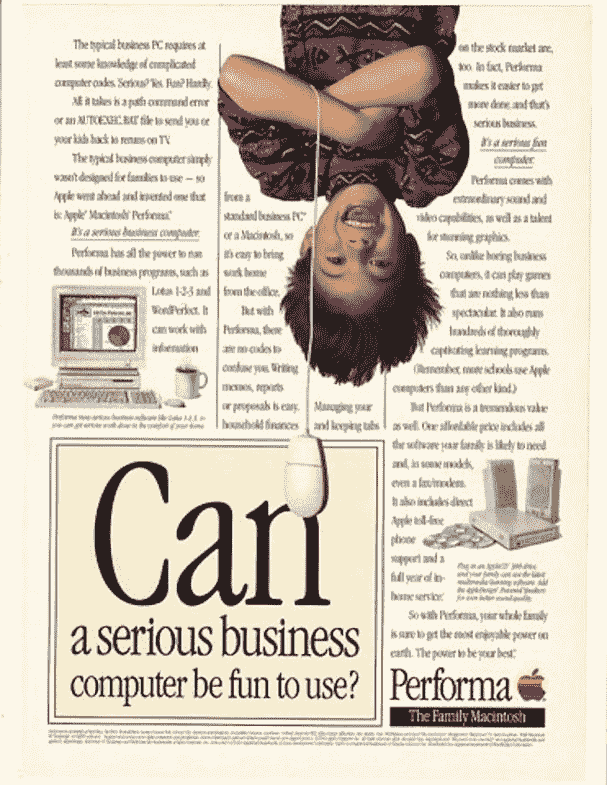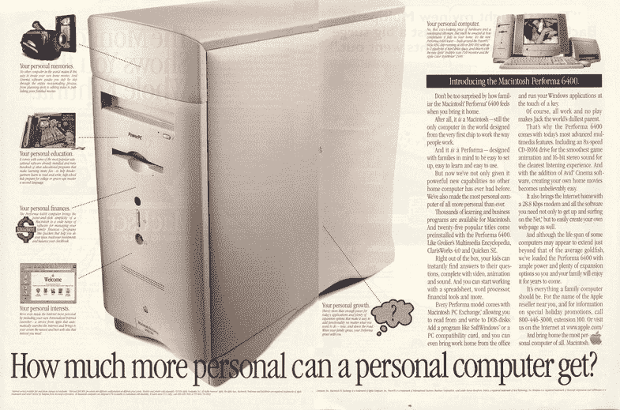

128 号准将的绝佳广告。但到 1994 年，该公司已经宣布破产。你可以在 [Commodore 的网站](http://www.commodore.ca/gallery/adverts_commodore/ads.htm)上找到更多广告。

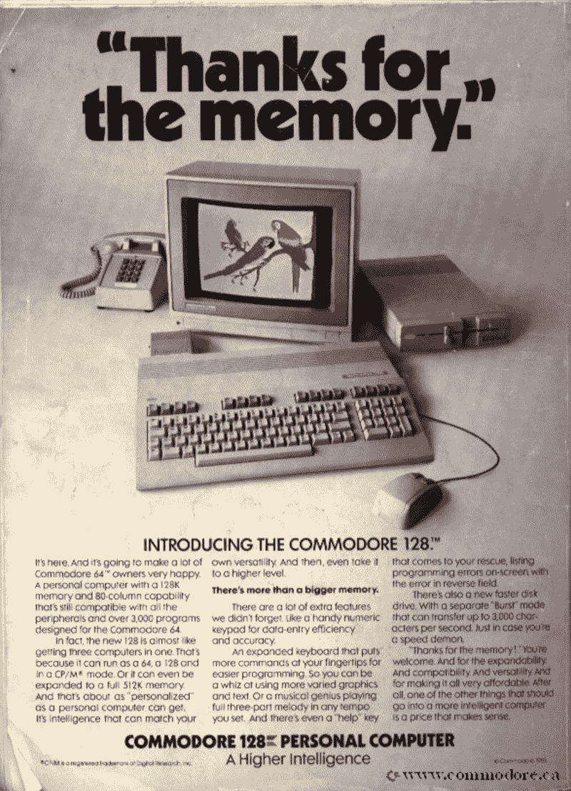

在 IBM，杰出的人不会固步自封。

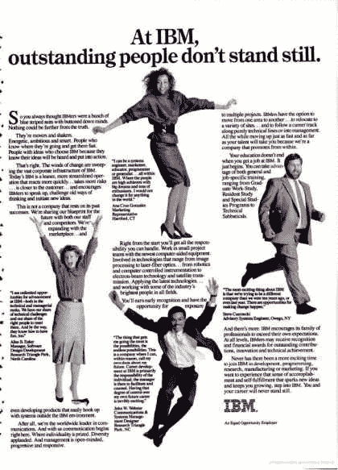

1993 年的一则 IBM PS/1 广告，主角是西奥多·罗斯福:

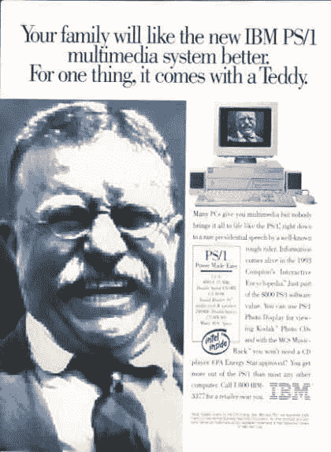

Radio Shack 在 1993 年宣传 486 PC:

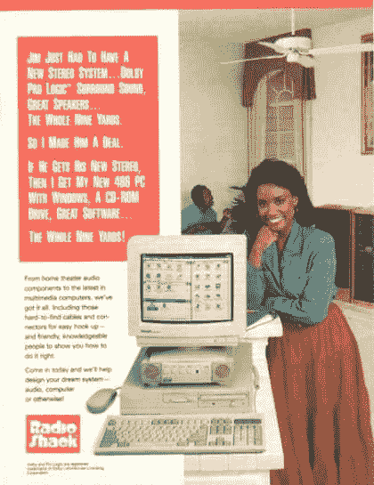

根据 Dataquest 的统计，1996 年，个人电脑行业又是一个丰收年，单位出货量达到 5970 万台，比去年增长 24.7%。康柏继续稳步上升，成为全球市场的领导者，与 1994 年相比，出货量增加了 120 多万部。IBM 出货量 480 万台，从苹果手中夺回第二名的位置。

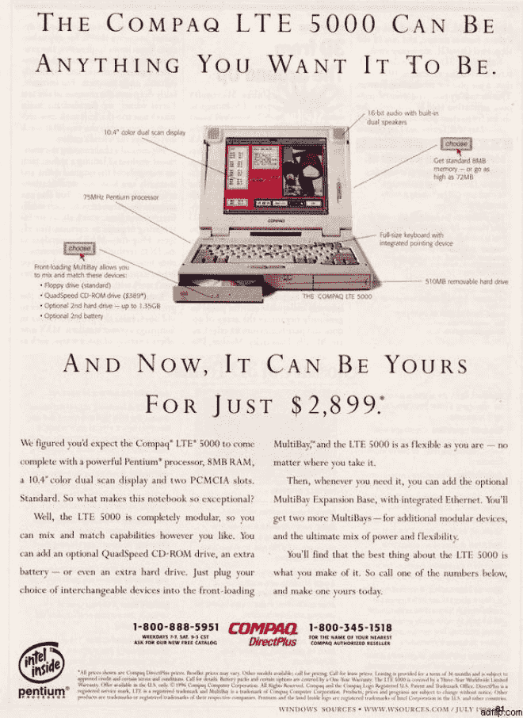

1997 年的苹果电脑:

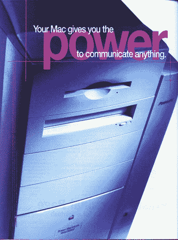

1999 年的一台苹果 Apple Power Mac G4 电脑:

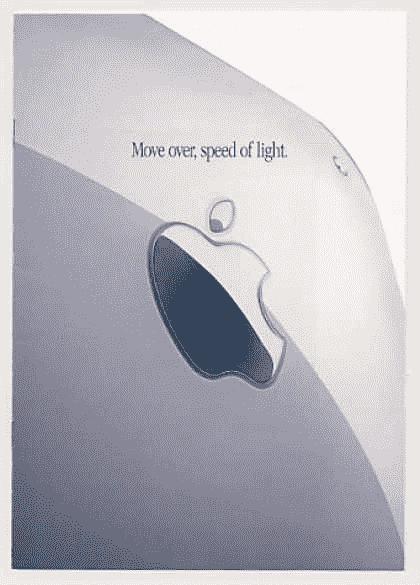

感谢阅读。您可能还会对其他一些文章感兴趣:

[**过去 150 年绝对最差的技术预测**](https://medium.freecodecamp.com/worst-tech-predictions-of-the-past-100-years-c18654211375)
[*科学家、工程师和实业家之间有一个悠久的传统。每年新年，他们都会制作…*medium.freecodecamp.com](https://medium.freecodecamp.com/worst-tech-predictions-of-the-past-100-years-c18654211375)[**改变世界的计算机简史**](http://www.makeuseof.com/tag/a-brief-history-of-computers-that-changed-the-world/)
[*你可以花上几年时间钻研计算机的历史。有无数的发明，无数关于它们的书籍……*www.makeuseof.com](http://www.makeuseof.com/tag/a-brief-history-of-computers-that-changed-the-world/)[**那些工作已经一去不复返了。让我们为下一步做好准备。**](https://medium.freecodecamp.com/we-cant-bring-back-the-old-manufacturing-jobs-12214a0ab057)
[*“将军总是打最后一仗。”——一句二战老话*medium.freecodecamp.com](https://medium.freecodecamp.com/we-cant-bring-back-the-old-manufacturing-jobs-12214a0ab057)