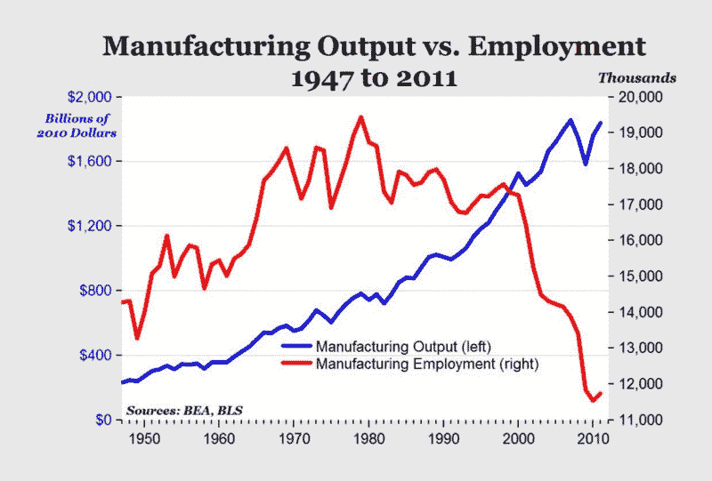
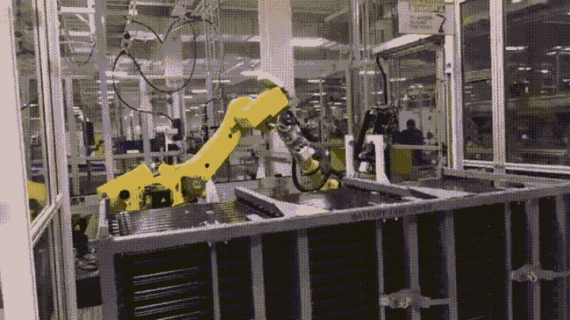

# 那些工作已经一去不复返了。让我们为下一步做好准备。

> 原文：<https://www.freecodecamp.org/news/we-cant-bring-back-the-old-manufacturing-jobs-12214a0ab057/>

> “将军们总是打最后一仗。”——一句二战时的老话

制造业工作是美国二战后经济奇迹的重要组成部分。

20 世纪 80 年代初，2000 万美国人在工厂工作，组装汽车和电器等消费品。

那之后发生了什么？

这里有两种说法。较短的故事弧线是关于全球化的。美国公司将所有旧的制造业工作转移到相对贫穷的国家，这些国家仍然拥有良好的教育体系(比如中国)。

这是大多数人在意识到截至 2017 年，普通高中毕业生不再能够凭借单一收入拥有一套住房和养家糊口时想到的故事。

但是还有第二种说法——可以追溯到几个世纪前，1794 年艾利·惠特尼获得轧棉机专利。这个故事的情节更加复杂，还有很多曲折尚未展开。事情大概是这样的:技术不断地让每个工人比以前更有效率。

当一个工人——在机器人大军的帮助下——可以完成过去需要 100 个工人才能完成的工作时，你不再需要 100 个工人了。你只需要一个。

这是美国制造业在过去 70 年的真实故事，用一张图表展示出来:

Input (human workers) keeps going down. Output keeps going up.

机器人不仅提高了美国等富裕国家的生产率。它们也开始影响像中国这样的国家。

### 机器制造机器

The robots in a [Tesla factory](https://electrek.co/2016/07/31/tesla-gigafactory-robots-machines-battery-factory/) move around so fast that they’re encased in glass to protect human workers from them.

东莞——一个靠近香港的城市，基本上是世界制造业之都——最近推出了他们的第一家自动化工厂。

常颖精密技术公司生产手机零件。它有 60 个机械臂，在 10 条生产线上工作，每天 24 小时，每周 7 天。每条生产线有 3 名工人监控机器人。

在这些新机器人到来之前，工厂需要 650 名工人才能运转。现在只需要 30。

自从这家工厂解雇了 95%的工人，把制造的任务交给机器后，次品率下降了 400%，总产量增加了近两倍。

更多的生产，更少的人。

这是中国大规模自动化计划的一部分，其双重目标是在提高制成品质量的同时降低成本。

请记住，我们不是在谈论美国，那里的制造业工人平均每小时挣 20 美元。我们谈论的是中国，那里工厂工人的平均工资接近每小时 2 美元。

这意味着，如果美国制造商像在中国那样认真对待成本削减，他们可以花 10 倍于中国的钱让每个工人实现自动化。

换句话说，不管制造发生在哪个国家，它的大部分物理“建造”部分将由机器人完成只是一个时间问题。

但是，无论如何，制造业的物理“构建”部分从来就没有那么有利可图。

iPhone 背面的文字写道:“由加州苹果公司设计。在中国组装。”尽管这可能是为了淡化手机是“中国制造”的事实，但这仍然是很重要的一点。因为 iPhone 的大部分价值确实是在加州通过硬件和软件的设计过程创造出来的。

为了说明这一点，这里有一个快速的突击测验:当苹果公司销售一部 iPhone 时，销售总收入的百分之几流向了制造这部 iPhone 的中国劳动力？

答案是:不到百分之二。

没错——你每花一美元买一部 iPhone，就有大约两便士花在中国组装它的工厂里。这些收入的绝大部分都回到了美国。

每当一些政客谈论“带回好的制造业工作岗位”时，那就是他们在谈论的:试图以几千个新工作岗位的形式将那 2%带回美国。只有在政府大量补贴的帮助下才会存在的工作，一旦政府停止支付这些补贴，这些工作就会消失。

而且这一成本还没有开始考虑补贴一个行业的全部副作用。

### **真实案例研究:2002 年美国钢铁工业**

2002 年，美国钢铁的价格被更便宜的中国钢铁压低。我们试图通过对外国钢铁征收关税来维持美国钢铁工业的生存。

最终，[超过 200，000 名在钢铁行业以外工作的人失去了工作](http://www.tradepartnership.com/pdf_files/2002jobstudy.pdf),原因是我们人为抬高的钢铁价格对宏观经济产生了影响。这意味着失去非钢铁行业工作的人数超过了当时整个美国钢铁行业的就业人数(187，000 人)。

换句话说，纳税人花了数十亿美元来破坏工作，这样他们就可以保留更少的工作——危险和低技能的工作——不可避免地离开这个国家。总之，再过几年。

从这些苦难中走出来的好消息是，我们发现了一条更好的前进道路。

> "我滑向冰球将要去的地方，而不是它已经去过的地方."—韦恩·格雷兹基

我们没有试图带回已经被机器自动化的制造业工作，而是有机会填补数十万没有被自动化的美国空缺职位。这些工作包括告诉那些机器做什么。编程工作。

我们可以用政客们浪费在试图恢复那些本来将不复存在的旧的制造业工作上的钱来资助这个机会。

### 教师，而不是关税

工厂产出的绝大部分价值并不是由工厂本身产生的。它是由坐在办公室电脑前的人们产生的，并且越来越多地出现在他们自己的家里。

这些人告诉机器做什么。我们国家面临的真正问题是这些人不够多。

现在，有成千上万的职位空缺给那些知道如何编码的人。

苹果、脸书、微软、谷歌和数以千计的其他雇主每年花费 5000 美元的费用，仅仅是为了把一名外国工程师带到美国来填补 T2 六位数工资的开发人员职位。这些公司这样做并不是为了节约成本。他们这样做是因为没有足够多的美国人拥有合适的技能。

因此，这里有一个简单的方法，我们可以改善我们的经济，帮助人们获得更多的就业机会:每当一个政治家提到“带回那些好的旧的制造业工作岗位”时，我们应该告诉那个政治家，“嘿，为什么我们不培训人们来填补那些从一开始就没有离开我们国家的好的工程工作岗位呢？”

这里有一些具体的步骤，我们可以迫使政治家们采取，这将有助于我们让更多合格的美国人进入这些良好的工程岗位:

1.  帮助有经验的教师接受新技能的再培训，支付他们从公立大学获得计算机科学和软件工程的高级学位。然后赞助这些老师在软件公司的暑期实习，这样他们可以在这个领域学到更多。
2.  在高中优先考虑技术教育，而不是把它当作事后的想法。要求每个高中生每天至少花一个小时学习编程，就像他们每天花一个小时学习英语一样。如果管理人员不愿意降低法语等科目的优先级，该怎么办？好吧，那就把上学时间延长一个小时。编程是非常重要的。
3.  为计算机科学或软件工程专业的学生提供优惠的经济资助。
4.  利用我们国家庞大的成人教育基础设施——包括社区大学——来帮助忙碌的成年人在晚上和周末学习编程。

我们需要的所有人员和基础设施都已经到位。我们只需要调整经济激励措施，如果我们让他们相信这是当务之急，我们的政府完全有权力这么做。

从长远来看，这比试图补贴政客们不断向我们兜售的过时、低附加值的国内制造业要便宜得多。

所以下一次，当一个政客试图用“工作”作为给一些公司一大笔纳税人的钱的理由时，告诉他们你知道这是怎么回事。告诉他们，中国可以保留那些昨日的低技能工作。相反，让我们为当今的高技能工作培训更多的人。

我只写编程和技术。如果你在推特上关注我，我不会浪费你的时间。？