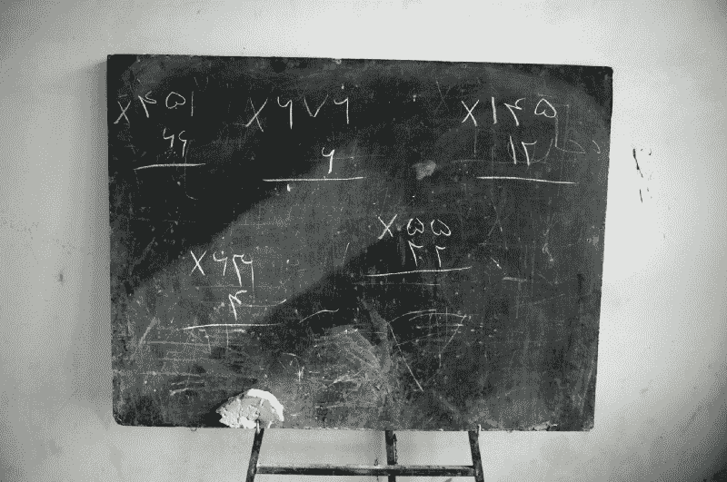
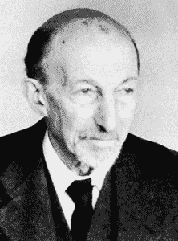
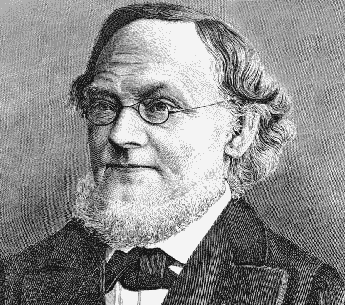
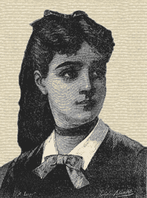
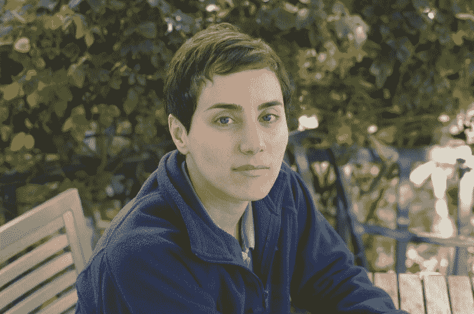
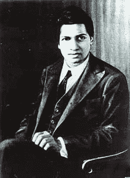

# 数学天才是脆弱的。我们需要停止摧毁它。

> 原文：<https://www.freecodecamp.org/news/mathematical-genius-is-fragile-society-needs-to-stop-destroying-it-5fdf3f08336e/>

朱奈德·穆贝

# 数学天才是脆弱的。我们需要停止摧毁它。

#### 几乎从未有过的数学传奇

Math on a chalk board in Afghanistan

数学*天才*被误解。“天才”这个词让人产生嫉妒的感觉。它描绘了一幅预先确定的真正掌握了一门学科的少数人的图画。一辆*选了几辆*。

然而，这并不是预先决定的。我们每个人都有数学天赋。大多数人只是还不知道而已。那是因为天才是脆弱的。如果你不拥抱天才，不小心呵护它，它就会溜走，留下的只是我们本可以成为的数学家的黯淡景象。

如果你粗略地浏览一下数学史，你会发现天才脆弱且易变的本质。这个领域的许多传奇人物——他们的才能和成就是无可争议的——很容易被历史遗忘。他们的故事应该成为今天教育工作者的警示。

### **从班级倒数第一到数学民俗**

雅克·哈达玛是法国数学家，擅长数论。在证明素数定理(粗略地说，证明素数通过数轴变得不那么常见)的过程中，哈达玛确立了他在数学民间传说中的地位。

令人惊讶的是，在五年级之前，他的算术在班上是最后一名。几乎不是神童的标志。你想知道是什么魔力让他沦落到“班上最后一名”的令人清醒的地位——很可能是一种测试，与今天弥漫在学校数学中的狭隘的测试一样。

Jacques Hadamard — no longer last in his class

在提供反馈和诊断学生的学习需求方面，测试可以起到非常有用的作用。但是作为学生能力的生硬标签，它们可能是毁灭性的。哈达玛获胜了，但是面对这些残酷的、草率的判决，有多少其他小学生放弃了生活？

### **放弃花园学习线性代数**

我们父母宣称的希望和信念可能是开启我们天赋的钥匙，也可能是扼杀我们天赋的钥匙。线性代数的创始人之一赫尔曼·格拉斯曼(Hermann Grassmann)在他成长的学校时代并不出色。格拉斯曼的父亲——也是学校老师之一——建议他的儿子完全放弃数学。在他父亲看来，格拉斯曼的职业是园丁。出于对我的植物学爱好者朋友们的尊重，格拉斯曼很好地尊重了他的智慧。

Hermann Grassmann — gardening's loss was the gain of mathematics

### 女性是最好的数学家

索菲·热尔曼面临着另一种阻力。这位早熟的少女在她父亲的家庭图书馆的书架上发现了数学。杰曼的承诺简直不可思议。她甚至自学了拉丁文和希腊文来接触所有的文本。

> 日耳曼只面临一个问题——这是十八世纪的欧洲，在那里，女性参与数学是不礼貌的。

杰曼的父母甚至禁止她学习。他们甚至拿走她的灯和衣服，劝阻她不要看书。

她坚持读牛顿和欧拉的作品，一直读到深夜，裹在被子里，点着偷来的蜡烛，这是她唯一的一丝光亮。一天早上，杰曼的父母发现她通宵看书后，终于松口了。干得也不错——她对数论的贡献被证明是至关重要的。

Sophie Germain — persistence personified

杰曼用化名白先生来掩饰她的身份。她的才华使她与数学家王子卡尔·弗里德里希·高斯通信，后者后来在发现杰曼的真实性别时表示钦佩和惊讶。

索菲·热尔曼故事中最令人清醒的一面是，它在今天也同样容易上演。数学方面的性别差距仍然没有解决，在早期教育中，女孩落后于男孩。这种趋势一直延续到[女性在 STEM 学位和职业中的代表性不足](http://edition.cnn.com/2016/10/12/health/female-scientists-engineers-math-gender-gap/)。

性别差异是文化上的，而不是生理上的。当[老师对女生的期望](https://www.tes.com/news/school-news/breaking-news/teachers-underrate-girls-maths)较低的时候，[男生对数学表现出更好的态度](http://www.livescience.com/17429-math-gender-differences-myths.html)也就不足为奇了。

> 如果索菲·热尔曼今天还活着，她在数学界会比在十八世纪的欧洲更受欢迎吗？

玛丽亚姆·米尔扎哈尼给了我们充满希望的理由。2014 年，这位斯坦福大学教授成为第一位获得菲尔兹奖的女性；所有数学领域的最高荣誉(我们相当于诺贝尔奖，或者，如果你喜欢，奥斯卡)。

你不需要理解 Mirzakhani 的工作(除非你是黎曼曲面方面的专家，对此感激不尽)就能理解它的意义。

Maryam Mirzakhani — first female recipient of the Field’s Medal

米尔札哈尼打破了性别刻板印象。作为一名伊朗人，她可能还要面对来自特朗普政府的其他威胁。看起来，即使在 2017 年，我们出生的国家也深刻地塑造了我们的人生机遇。

> 不是所有的天才都生来机会均等。

### **从默默无闻中走出来**

斯里尼瓦瑟·拉马努金是“天才”一词的缩影对于数学家来说，他是一个真正的白手起家的故事。Ramanujan 出生并成长于 19 世纪末的印度农村，几乎没有机会发展他的原始数学技能。他利用手头的硬壳文物工作。有一次，他遇到了一本原始的、过时的教科书，并从这本简单的手稿中推导出了深奥的数学定理——其中许多是他那个时代最优秀的数学家所不知道的。

Srinivasa Ramanujan in optimistic mood

Ramanujan 把他的手稿送到了英国，在那里除了剑桥大学三一学院著名的数学教授 GH Hardy 之外，所有人都拒绝了他的手稿。甚至哈代也准备放弃 Ramanujan 的作品，直到他意识到他所读的东西的非凡深度。哈迪邀请 Ramanujan 去剑桥。这两个人结成了最不可能的联盟。尽管他的生命因疾病而缩短，Ramanujan 作为数学伟人的遗产是稳固的。

> Ramanujan 的才华得到了实现，这要归功于一次与教科书的偶遇和一位剑桥教授的信仰飞跃。还有多少 Ramanujan 在默默无闻的煎熬？

世界上有 7000 万失学儿童。那是七千万盏毫无希望的明灯熄灭了。并不是说现代学校教育是机遇的避风港。[社会经济成就仍然与教育成果密切相关](https://www.oecd.org/pisa/keyfindings/pisa-2012-results-volume-II.pdf)。如果没有质量的支撑，受教育的机会就没有什么价值。

### **触手可及的天才**

世界比以往任何时候都更需要数学家。然而，历史障碍——从父母的期望和性别刻板印象到仇外心理和贫困——一直持续到今天。少数数学家可能通过顽强的坚持、纯粹的运气或神的干预而获胜。要不是他们的胜利，数百万人可能会死去。天才从来都不是理所当然的。

社会的价值观对孩子们的数学成绩有着不可估量的影响。是我们的信念和选择让数学天才如此脆弱。

我们手边有一个全球数学天才的人才库。我们不能让他们溜走。

我是一名研究数学家，后来成为教育家，致力于数学、教育和创新的结合。

*在 [Twitter](https://twitter.com/fjmubeen) 或 [LinkedIn](https://uk.linkedin.com/in/junaidmubeen) 上打招呼。*

*如果你喜欢这篇文章，你可能想看看我的以下作品:*

[**这四个画面驱散了我们一直以来对数学教育的误解**](https://mystudentvoices.com/these-four-visuals-dispel-the-myths-weve-been-about-maths-education-66d279ddf32d)
[*南希和利亚姆的案例*mystudentvoices.com](https://mystudentvoices.com/these-four-visuals-dispel-the-myths-weve-been-about-maths-education-66d279ddf32d)[**教育技术的文化问题**](https://medium.com/synapse/edtech-s-culture-problem-c6e37e6cbba2)
[*教育天生就是文化的。我们学习的方式是由我们的环境、经历和信仰体系塑造的。*medium.com](https://medium.com/synapse/edtech-s-culture-problem-c6e37e6cbba2)[**数学没有历史是没有灵魂的**](https://hackernoon.com/mathematics-without-history-is-soulless-978436602fa4)
[*π古往今来*hackernoon.com](https://hackernoon.com/mathematics-without-history-is-soulless-978436602fa4)