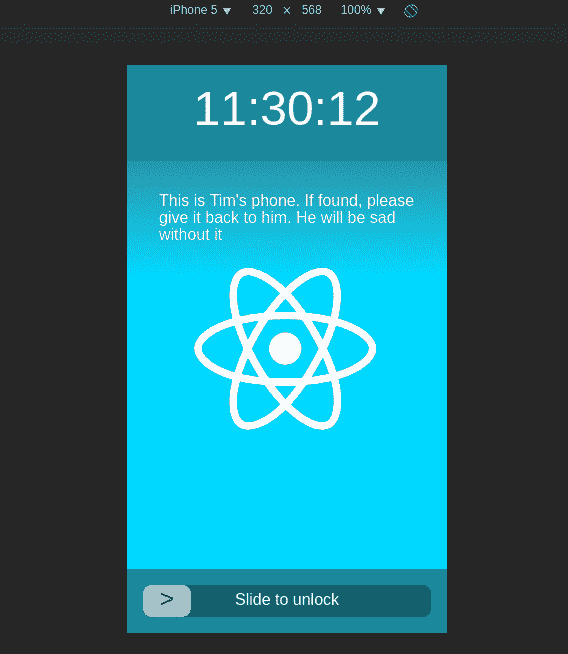

# 测试 React 组件的正确方法

> 原文：<https://www.freecodecamp.org/news/the-right-way-to-test-react-components-548a4736ab22/>

莉莉·斯科特

# 测试 React 组件的正确方法


关于测试 React 组件的“正确”方法，现在有很多困惑。你应该手写所有的测试，还是只使用快照，或者两者兼而有之？该不该测试道具？状态？样式/布局？

我不认为有一个“正确”的方法，但我发现了一些对我非常有效的模式和技巧，我想和大家分享一下。

***更新 2019 年 2 月*** *:这篇帖子描述了一种对 React 组件进行单元测试的方法。随着时间的推移，我发现我从集成测试中获得的价值比单元测试更多，所以**我个人不再应用这种方法**。*

*如果你想为你的 React 应用编写集成测试，**我强烈推荐 [Cypress](https://www.cypress.io/) ，这是我现在使用的。***

然而，你仍然会发现这篇文章是有用的——思考这篇文章中描述的方法将会帮助你用更清晰的契约编写更可重用的组件。

### 背景:我们将测试的应用程序

假设您想要测试一个`LockScreen`组件，它的行为类似于手机的锁屏。它:

*   显示当前时间
*   可以显示用户定义的消息
*   可以显示用户自定义的背景图像
*   底部有一个滑动解锁部件

它看起来像这样:



你可以在这里试用[，在 GitHub](https://suchipi.github.io/react-testing-example-lockscreen) 上查看代码[。](https://github.com/suchipi/react-testing-example-lockscreen)

下面是顶层`App`组件的代码:

如你所见，`LockScreen`得到了三个道具:`wallpaperPath`、`userInfoMessage`和`onUnlocked`。

以下是`LockScreen`的代码:

`LockScreen`引入了一些其他组件，但是因为我们只测试了`LockScreen`，所以现在让我们把注意力集中在它上面。

### 组件合同

为了测试`LockScreen`，你必须先了解它的**契约**是什么。理解组件的契约是测试 React 组件最重要的部分。契约定义了组件的预期行为，以及关于其使用的合理假设。没有明确的契约，你的组件可能很难理解。编写测试是正式定义组件契约的好方法。

每个 React 组件至少有一个对其契约的定义有贡献的东西:

*   **它呈现什么**(可能什么都没有)

此外，大多数组件合同也会受到以下因素的影响:

*   **支撑组件接收**
*   组件持有的(如果有的话)的**状态**
*   当**用户与**交互时，组件做什么(通过点击、拖动、键盘输入等)

影响组件合同的一些不太常见的因素有:

*   组件在中呈现的**上下文**
*   当你在组件的实例上调用**方法时组件做什么(公共引用接口)**
*   作为组件生命周期的一部分出现的副作用(componentDidMount、componentWillUnmount 等)

要找到您的组件的合同，请自问如下问题:

*   我的组件呈现什么？
*   我的组件在不同的环境下会呈现不同的东西吗？
*   当我传递一个函数作为道具时，我的组件用它做什么？它是调用它，还是把它交给另一个组件？如果它调用它，它用什么调用它？
*   当用户与我的组件交互时，会发生什么？

### 寻找锁屏合同

让我们浏览一下`LockScreen`的`render`方法，并在它的行为可能不同的地方添加注释。你将寻找 ternaries、if 语句和 switch 语句作为我们的线索。这将有助于我们找到合同中的变化。

我们已经了解了描述`LockScreen`合同的三个约束条件:

*   如果传递了一个`wallpaperPath`属性，组件呈现的最外层包装`div`应该在其内联样式中有一个`background-image` CSS 属性，设置为`wallpaperPath`的值，包装在`url(...)`中。
*   如果传递了一个`userInfoMessage` prop，它应该作为子对象传递给一个`TopOverlay`，后者应该使用一组特定的内联样式来呈现。
*   如果一个`userInfoMessage`道具是*没有*通过，就要渲染*没有* `TopOverlay`。

您还可以找到一些始终成立的契约约束:

*   一个`div`总是被渲染，它包含了其他的一切。它有一套特殊的内联样式。
*   一个`ClockDisplay`总是被渲染。它不接受任何道具。
*   一个`SlideToUnlock`总是被渲染。它接收传递的`onUnlocked`属性的值作为它的`onSlide`属性，不管它是否被定义。

组件的`propTypes`也是寻找其契约线索的好地方。以下是我注意到的更多限制:

*   `wallpaperPath`预计是一个字符串，并且是可选的。
*   `userInfoMessage`预计是一个字符串，并且是可选的。
*   `onUnlocked`预计是一个函数，并且是可选的。

这是我们组件合同的良好起点。在这个组件的契约中可能有更多的约束，在生产代码中，您可能希望找到尽可能多的约束，但是对于这个示例来说，让我们只处理这些约束。如果您发现额外的约束，您可以随时添加测试。

### 有什么值得测试的？

让我们检查一下找到的合同:

*   `wallpaperPath`预计是一个字符串，并且是可选的。
*   `userInfoMessage`预计是一个字符串，并且是可选的。
*   `onUnlocked`预计是一个函数，并且是可选的。
*   一个`div`总是被渲染，它包含了其他的一切。它有一套特殊的内联样式。
*   一个`ClockDisplay`总是被渲染。它不接受任何道具。
*   一个`SlideToUnlock`总是被渲染。它接收传递的`onUnlocked`属性的值作为它的`onSlide`属性，不管它是否被定义。
*   如果传递了一个`wallpaperPath`属性，组件呈现的最外面的包装 div 应该在其内联样式中有一个`background-image` css 属性，设置为`wallpaperPath`的值，包装在`url(...)`中。
*   如果传递了一个`userInfoMessage` prop，它应该作为子对象传递给一个`TopOverlay`，后者应该使用一组特定的内联样式来呈现。
*   如果一个`userInfoMessage`道具是*没有*通过，就要渲染*没有* `TopOverlay`。

这些约束中有些值得测试，有些则不值得。这里有三条经验法则，我用它们来确定什么东西**不值得测试**:

1.  测试必须完全复制*应用程序代码吗？这会使它变脆。*
2.  *在测试中做断言会复制库代码已经覆盖的**行为吗？***
3.  *从局外人的角度来看，**这个细节很重要，还是仅仅是一个内部问题**？仅使用组件的公共 API 可以描述这种内部细节的效果吗？*

*这些只是经验法则，所以注意不要仅仅因为事情很难就用它们来证明不测试的正当性。通常，看起来很难测试的东西对测试来说是最重要的，因为测试中的代码对应用程序的其他部分做了很多假设。*

*让我们检查一下我们的约束，并使用这些经验法则来确定哪些需要被测试。这是前三个:*

*   *`wallpaperPath`预计是一个字符串，并且是可选的。*
*   *`userInfoMessage`预计是一个字符串，并且是可选的。*
*   *`onUnlocked`预计是一个函数，并且是可选的。*

*这些约束是 React 的`PropTypes`机制所关心的，所以围绕 prop 类型编写测试不符合规则#2(已经被库代码覆盖)。因此，**我不测试道具类型**。因为测试经常兼做文档，如果应用程序代码没有很好地记录预期的类型，我可能会决定测试一些不符合规则#2 的东西，但是`propTypes`已经很好了，并且可读。*

*下面是下一个约束:*

*   *一个`div`总是被渲染，它包含了其他的一切。它有一套特殊的内联样式。*

*这可以分解为三个约束条件:*

*   *一个`div`总是被渲染。*
*   *被渲染的`div`包含了所有其他被渲染的东西。*
*   *呈现的`div`有一组特定的内联样式。*

*我们分解成的前两个约束没有违反我们的任何经验法则，所以**我们将测试它们**。但是，我们再来看第三个。*

*忽略被另一个约束覆盖的背景图像属性，换行`div`具有以下样式:*

```
*`height: "100%",display: "flex",justifyContent: "space-between",flexDirection: "column",backgroundColor: "black",backgroundPosition: "center",backgroundSize: "cover",`*
```

*如果我们编写一个测试，测试 div 上的这些样式，我们必须准确地测试每个样式*和*的值，以便做出有用的断言。所以我们的断言可能是这样的:*

*   *环绕 div 的高度样式属性应该为 100%*
*   *包装 div 应该具有 flex 的显示样式属性*
*   *…对每个样式属性依此类推*

*即使我们使用类似于`[toMatchObjec](https://facebook.github.io/jest/docs/expect.html#tomatchobjectobject)t`的东西来保持测试的简洁，这也会在应用程序代码中复制相同的风格，并且是脆弱的。如果我们添加另一种风格，我们将不得不在测试中使用完全相同的代码。如果我们调整了一个样式，我们必须在测试中调整它，即使组件的行为可能没有改变。因此，这个约束不符合规则#1(重复应用程序代码；易碎)。出于这个原因，**我不测试内联样式，除非它们可以在运行时改变。***

*通常，如果您正在编写一个相当于“它做了它所做的事情”，或者“它确实做了这件事情，只是碰巧在应用程序代码中重复了”，那么这个测试要么是不必要的，要么是太宽泛了。*

*下面是接下来的两个约束:*

*   *一个`ClockDisplay`总是被渲染。它不接受任何道具。*
*   *一个`SlideToUnlock`总是被渲染。它接收传递的`onUnlocked`属性的值作为它的`onSlide`属性，不管它是否被定义。*

*这些可以分为:*

*   *一个`ClockDisplay`总是被渲染。*
*   *被渲染的`ClockDisplay`不接受任何道具。*
*   *一个`SlideToUnlock`总是被渲染。*
*   *当传递的`onUnlocked`属性被定义时，渲染的`SlideToUnlock`接收该属性的值作为其`onSlide`属性。*
*   *当传递的`onUnlocked`道具为`undefined`时，渲染的`SlideToUnlock`的`onSlide`道具也要设置为`undefined`。*

*这些约束分为两类:“某些复合组件被呈现”，以及“被呈现的组件接收这些道具”。**两者对测试**都非常重要，因为它们描述了你的组件如何与其他组件交互。我们将测试所有这些约束。*

*下一个约束是:*

*   *如果传递了一个`wallpaperPath`属性，组件呈现的最外面的包装 div 应该在其内联样式中有一个`background-image` css 属性，设置为`wallpaperPath`的值，包装在`url(...)`中。*

*您可能认为，因为这是一种内联样式，所以我们不需要测试它。但是，**因为`background-image`的值可以基于`wallpaperPath prop`而变化，所以需要测试。**如果我们不测试它，那么就不会围绕`wallpaperPath`道具的效果进行测试，它是这个组件的公共接口的一部分。你应该总是测试你的公共接口。*

*最后两个约束是:*

*   *如果传递了一个`userInfoMessage` prop，它应该作为子对象传递给一个`TopOverlay`，后者应该使用一组特定的内联样式来呈现。*
*   *如果一个`userInfoMessage`道具是*没有*通过，就要渲染*没有* `TopOverlay`。*

*这些可以分为:*

*   *如果一个`userInfoMessage`道具被传递，一个`TopOverlay`应该被渲染。*
*   *如果传递了一个`userInfoMessage`道具，它的值应该作为子元素传递给渲染的`TopOverlay.`*
*   *如果传递了一个`userInfoMessage`属性，那么呈现的`TopOverlay`应该用一组特定的内联样式来呈现。*
*   *如果一个`userInfoMessage`道具是*没有*通过，就要渲染*没有* `TopOverlay`。*

*第一个和第四个约束(a `TopOverlay`应该/不应该渲染)**描述了我们渲染的内容，所以我们将测试它们。***

*第二个约束验证了`TopOverlay`基于`userInfoMessage`的值接收特定的道具。**围绕渲染组件接收的道具编写测试很重要，所以我们将测试它。***

*第三个约束验证了`TopOverlay`接收了一个特定的道具，因此您可能认为我们应该测试它。但是，这个道具只是一些内联样式。断言属性被传递是重要的，但是断言内联样式是脆弱的，并且会重复应用程序代码(不符合规则 1)。因为测试通过的道具很重要，所以不清楚是否只看规则 1 就应该测试它；幸运的是，这就是为什么我有第三条规则。提醒一下，这是:*

> *从局外人的角度来看，**这个细节很重要，还是仅仅是一个内部问题**？仅使用组件的公共 API 可以描述这种内部细节的效果吗？*

*当我编写组件测试时，我尽可能只测试组件的公共 API(包括 API 对应用程序的副作用)。**该组件的确切布局不受该组件的公共 API 的影响；这是 CSS 引擎关心的问题。**因此，这个约束不符合规则 3。因为它不符合规则#1 和规则#3，**我们将不测试这个约束**，即使它验证了`TopOverlay`接收到一个道具，这通常是重要的。*

*很难确定是否应该测试最终约束。最终，由您来决定测试哪些部分是重要的；我使用的这些经验法则只是指导方针。*

*现在我们已经完成了所有的约束，并且知道我们要为哪些约束编写测试。他们在这里:*

*   *一个`div`总是被渲染。*
*   *被渲染的`div`包含了所有其他被渲染的东西。*
*   *一个`ClockDisplay`总是被渲染。*
*   *被渲染的`ClockDisplay`不接受任何道具。*
*   *一个`SlideToUnlock`总是被渲染。*
*   *当传递的`onUnlocked`属性被定义时，渲染的`SlideToUnlock`接收该属性的值作为其`onSlide`属性。*
*   *当传递的`onUnlocked`道具为`undefined`时，渲染的`SlideToUnlock`的`onSlide`道具也要设置为`undefined`。*
*   *如果传递了一个`wallpaperPath`属性，组件呈现的最外面的包装 div 应该在其内联样式中有一个`background-image` css 属性，设置为`wallpaperPath`的值，包装在`url(...)`中。*
*   *如果一个`userInfoMessage`道具被传递，一个`TopOverlay`应该被渲染。*
*   *如果传递了一个`userInfoMessage`道具，它的值应该作为子元素传递给渲染的`TopOverlay.`*
*   *如果一个`userInfoMessage`道具是*没有*通过，就要渲染*没有* `TopOverlay`。*

*通过检查我们的约束并对它们进行详细审查，我们将它们分解成多个更小的约束。**这太棒了！这将使编写我们的测试代码变得更加容易。***

### *设置一些测试样板*

*让我们开始为这个组件搭建一个测试。我将在测试中使用 [Jest](https://facebook.github.io/jest/) 和[酶](http://airbnb.io/enzyme/)。Jest [与 React](https://facebook.github.io/jest/docs/tutorial-react.html) 配合得很好，也是用 [create-react-app](https://github.com/facebookincubator/create-react-app) 创建的应用程序中包含的测试程序，所以你可能已经准备好使用它了。Enzyme 是一个成熟的 React 测试库，可在节点和浏览器中运行。*

*尽管我在测试中使用了 Jest 和 enzyme，但是您可以将这里的概念应用于几乎任何测试配置。*

*这是许多样板文件。让我解释一下我在这里设置了什么:*

*   *我为`props`和`mountedLockScreen`创建了`let`绑定，这样这些变量就可以用于`describe`函数中的所有内容。*
*   *我创建了一个`**lockScreen**` **函数**，它在`describe`函数中的任何地方都可用，它使用`mountedLockScreen`变量用当前的`props`对`mount`和`LockScreen`进行处理，或者返回已经装载的那个。这个函数返回一个酶`[ReactWrapper](http://airbnb.io/enzyme/docs/api/mount.html)`。我们将在每次测试中使用它。*
*   *我设置了一个`beforeEach`，在每次测试前重置`props`和`mountedLockScreen`变量。否则，来自一个测试的状态会泄漏到另一个测试中。通过在这里将`mountedLockScreen`设置为`undefined`，当下一次测试运行时，如果它调用`lockScreen`，一个新的`LockScreen`将用当前的`props`挂载。*

*这个样板文件看起来似乎只是为了测试一个组件，但是它让我们在安装组件之前逐步构建我们的道具，这将有助于保持我们的测试干燥。我在所有的组件测试中都使用它，我希望您会发现它很有用；随着我们编写测试用例，它的效用将变得更加明显。*

### *写测试！*

*让我们检查一下我们的约束列表，并为每个约束添加一个测试。每个测试都将被编写成可以插入到样板文件的`// All tests will go here`注释中。*

*   *一个`div`总是被渲染。*

*   *被渲染的`div`包含了所有其他被渲染的东西。*

*   *一个`ClockDisplay`总是被渲染。*

*   *被渲染的`ClockDisplay`不接受任何道具。*

*   *一个`SlideToUnlock`总是被渲染。*

*到目前为止，所有的约束都是*永远*为真的，所以他们的测试编写起来相对简单。然而，剩下的约束以“如果”和“当”这样的词开始。这些线索表明它们在有条件的情况下*为真，因此我们将`describe`与`beforeEach`配对来测试它们。这就是我们先前编写的所有测试样板派上用场的地方。**

*   *当传递的`onUnlocked`属性被定义时，渲染的`SlideToUnlock`接收该属性的值作为其`onSlide`属性。*
*   *当传递的`onUnlocked`道具为`undefined`时，渲染的`SlideToUnlock`的`onSlide`道具也要设置为`undefined`。*

*当我们需要描述只在特定条件下发生的行为时，我们可以`describe`那个条件，然后在那个`describe`中使用`beforeEach`来设置那个条件。*

*   *如果传递了一个`wallpaperPath`属性，组件呈现的最外面的包装 div 应该在其内联样式中有一个`background-image` CSS 属性，设置为`wallpaperPath`的值，包装在`url(...)`中。*

*   *如果一个`userInfoMessage`道具被传递，一个`TopOverlay`应该被渲染。*
*   *如果传递了一个`userInfoMessage`道具，它的值应该作为子元素传递给渲染的`TopOverlay.`*

*   *如果一个`userInfoMessage`道具是*没有*通过，就要渲染*没有* `TopOverlay`。*

*这是我们所有的限制！你可以在这里查看最终的测试文件[。](https://gist.github.com/suchipi/8f8d7de60e8e4ae48153db0c36133e63)*

### *“不是我的工作”*

*当看到本文开头的动画 gif 时，您可能已经预料到我们的测试用例最终会是这样的:*

*   *当用户将滑动解锁手柄拖动到最右侧时，将调用解锁回调*
*   *如果用户将滑动解锁手柄向右拖动一部分，然后释放它，手柄会以动画形式回到其原始位置*
*   *屏幕顶部的时钟应该总是显示当前时间*

*这种直觉是自然的。从应用程序的角度来看，这些是一些最引人注目的特性。*

*然而，我们最终没有为任何功能编写测试。为什么？他们是**而不是`LockScreen`T2 所关心的。***

*因为 React 组件是可重用的单元，所以单元测试非常适合它们。并且在单元测试时，**你应该只测试你的实际单元所关心的**。编写 React 组件测试时，只见树木不见森林。*

*这里有一个方便的备忘单，概述了大多数 React 组件的关注点:*

*   *我该如何处理收到的道具？*
*   *我渲染什么组件？我该向这些组件传递什么？*
*   *我有保存过什么东西吗？如果有，我在领取新道具的时候是否作废？我什么时候更新状态？*
*   *如果一个用户与我交互，或者一个子组件调用了我传递给它的回调，我该怎么办？*
*   *当我被骑的时候会发生什么吗？当我被卸载时？*

*上面描述的特性是`SlideToUnlock`和`ClockDisplay`所关心的，所以围绕这些特性的测试将会在那些组件的测试中进行，而不是在这里。*

### *摘要*

*我希望这些方法能够帮助您编写自己的 React 组件测试。总结一下:*

*   ***首先找到您的组件合同***
*   *决定哪些约束值得测试，哪些不值得*
*   *道具类型不值得测试*
*   *内联样式通常不值得测试*
*   *你渲染的组件和你给它们的道具对测试很重要*
*   *不要测试与你的组件无关的东西*

*如果你不同意或者觉得这篇文章有帮助，我很乐意在 twitter 上听听你的意见。让我们一起学习如何测试 React 组件！*

**尽管本文版权所有，但本文中的所有代码示例都可以在 MIT 许可下获得，可以在 GitHub 上的源代码库[中找到。](https://github.com/suchipi/react-testing-example-lockscreen)**