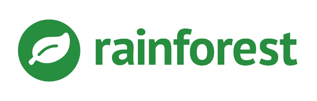
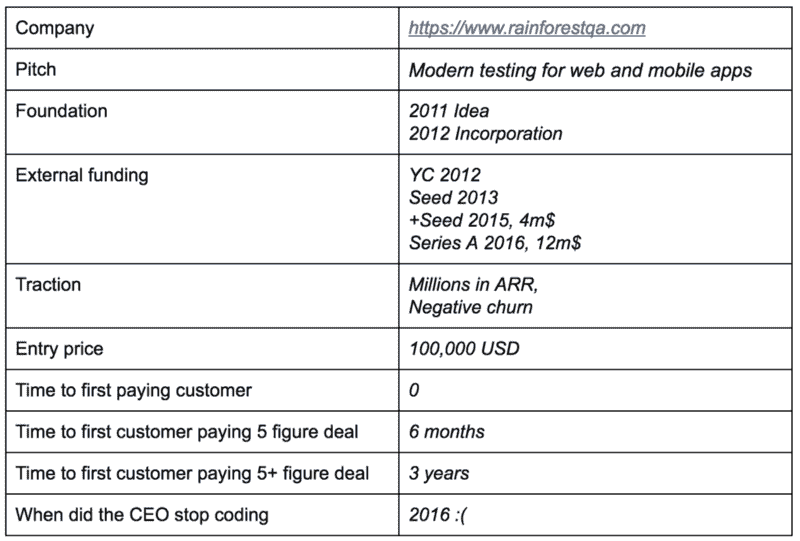
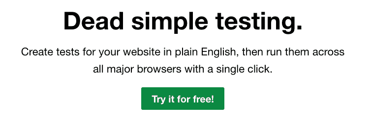
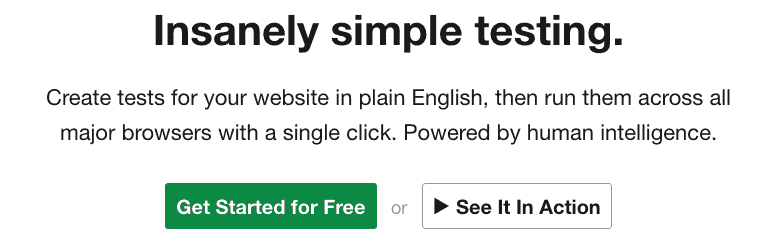
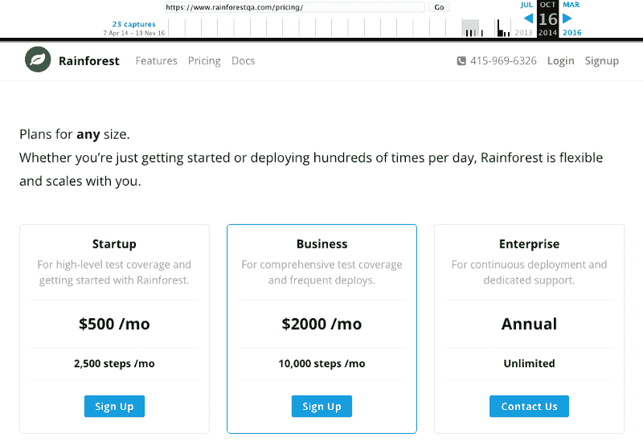
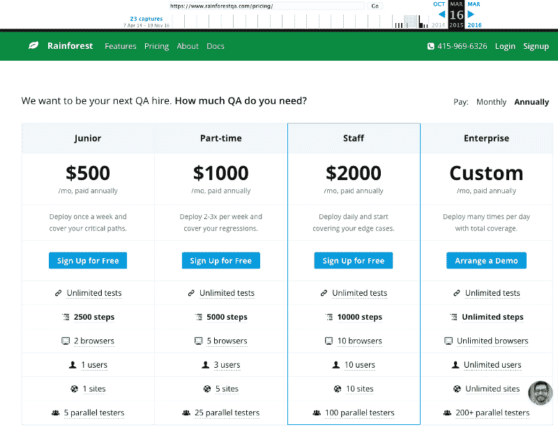
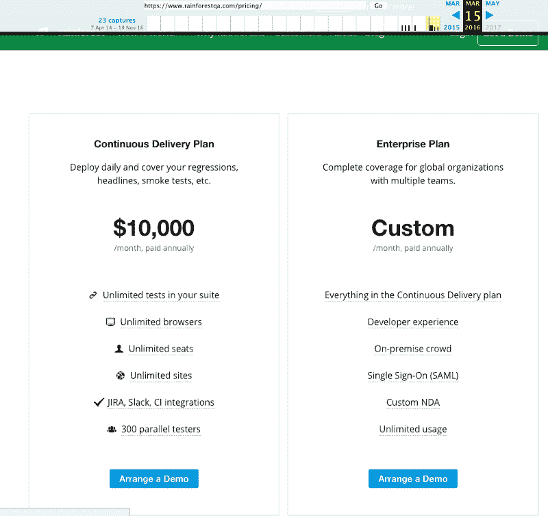
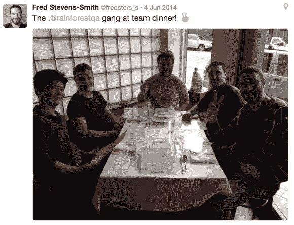

# …雨林的早期

> 原文：<https://www.freecodecamp.org/news/early-days-of-rainforestqa-f575252de144/>

罗德里戈·马丁内斯

# …雨林的早期

开发工具的市场看起来很大。越来越多的大公司在这个领域建立起来，而 Point Nine 很自豪地投资了其中的一些公司，如 T2 的 lgolia、T4 的 ontentful 和 S 的 qreen。

在这一系列采访中，我们将探索这些公司的早期。对于任何在这一领域创业(或有兴趣创业)的人来说，这里都有很有价值的见解。

这是我对 RainforestQA 首席执行官弗雷德·史蒂文斯-史密斯的第一次采访。

RainforestQA 旨在帮助公司进行质量保证和测试。他们是 Y-Combinator 2012 级的一部分，最近筹集了 1200 万美元的 A 轮融资，由 Bessemer Venture Partners 领投。如果你想了解更多关于他的旅程，请看这一集的 Flyover Labs。

#### 我:你能给我们讲讲雨林早期的情况吗？

弗雷德:最初我是一名设计师，决定创办一家科技公司。我的共同创始人是欧洲最早的 AWS 专家之一。因此，我们一起看到了一个在开发工具领域建立公司的好机会。

我们喜欢开发工具有几个原因:

*   业界显然需要提高开发人员的生产力——人们已经开始投资工具来提高效率。
*   这比试图开发下一个“酷”应用的风险要小，因为公司总是需要工具来帮助他们开发软件。我们认为建立一个核心的基础设施可以让我们分散风险。在淘金热中发财的人是卖铲子的。
*   我们观察了整个行业，发现这个领域几乎没有竞争对手。

我们被 YC 大学录取了，在经历了几次失败后，我们开始开发人们只愿意每月支付 10 美元的工具。因为，我们开始寻找机会来创造更多的价值，从而收取更多的费用。我们意识到，我们不想从市场的最底层开始建立一家公司，而是从更高的价位开始——以 1000 美元的 ACV 价格实现 100 毫米的 ARR 实在太难了。

当时，我们正在与 YC 公司进行大量的客户开发。例如，我们询问了 60 位创始人，“您有什么问题需要每月支付 1000 美元来解决？”不是每个人都回答了，但回答了的人将质量保证和测试视为棘手问题。

我们观察了竞争格局，发现在测试领域，大多数产品都很糟糕，是为了提高 QA 团队的工作效率而开发的，或者是为了让开发人员能说代码而开发的测试机器人。它们都不符合目的，我们觉得我们有一个与众不同的、潜在的令人兴奋的方法。

所以，经过 4 个支点，我们开始觉得我们对一些东西。

#### 你是如何将这个机会变成一项业务的？

在写一行代码之前，我们仔细研究了市场上所有的解决方案来做测试。我们的出发点是:未来是人工智能，但我们如何到达那里？有许多自动化测试工具，但是它们都不是很好，而且要花相当多的精力来准备它们。

由于我们的前提是建立人们愿意花大价钱购买的东西，我们开始向早期采用者收取每月 1k 的费用，以照顾他们的测试，甚至在拥有真正的产品之前。显然，过了一段时间，我们最终失去了除了一个以外的所有人。通过这样做，我们学到了很多东西。

> 做不可扩展的事情是计算初始产品市场适合度的核心。

我们开始手动为这 10 家公司进行测试，这是一个劳动密集型的过程。我们必须壮大我们的团队，以便能够处理更多的测试。同时，我们也看到了一些消费类创业公司(Homejoy、优步等。)利用群体以分布式的方式解决问题。我们的一个好朋友给我们指出了机械土耳其人的方向，我们再也没有回头。

#### 第一批顾客呢？

成为 YC 的一部分会给你带来很多好处。其中最重要的一点是，你是早期采用者中的一员。每个人都在为增长而优化，每个人都相互信任。因此，可能更容易获得这 10 个首批客户，因为我们在 YC 信任圈之内。也就是说，你可以用你自己的本地网络来复制这种方法，无论是合作空间、投资组合还是业内朋友。

我们所有的早期采用者都希望专注于增长和速度，而不是 QA。这是一种趋势的开始，这种趋势一直推动着我们的大部分业务。我们说服了前 10 个客户将他们的测试交给我们，而不是让他们的开发人员花时间测试。这是一个相当容易的推销——没有开发人员愿意花时间写测试，在 YC 项目结束时向数百名投资者推销的前景以一种有趣的方式将注意力集中在增长上。

我们没有过度设计我们的初始定价，我们每月 1000 美元的价格纯粹是一个门槛，以找到一个足够大的问题，让公司付给我们像样的钱。我们也很幸运，雨林质量保证的替代品往往是公司工资单上的一个人。而且那很贵！几乎是解决问题最昂贵的方法。

> 因此，与其他一些开发工具相比，我们的潜在客户更愿意向我们付费，因为其他开发工具的好处是生产率，而生产率往往更难量化。

相对来说，去一家公司说“看，你在考虑雇人做 QA。为什么不用一半的费用试试我们的服务呢？”

Working on different messages

#### 告诉我们你们的销售和营销策略。

正如我之前提到的，我们的第一批 10 个客户来自 YC。虽然我们最终除了一个之外都失去了，但在这个过程中我们学到了很多宝贵的经验。

最初，甚至现在，我们的大部分线索都来自推荐。我们的第一批客户开始在他们的朋友和网络中传播我们的产品。在旧金山的一个好处是不同公司的开发人员可以聚在一起。如果你创造了一个伟大的产品，他们会谈论它，消息会传出去。

我还应该指出，最初我们做了很多事情来获得 uniques，包括一些相对有争议的博客帖子，如 [MongoDB gotchas &如何避免它们](https://www.rainforestqa.com/blog/2012-11-05-mongodb-gotchas-and-how-to-avoid-them/)。这不是一个合适的内容营销策略，而是我们非常直言不讳地表达了我们的观点。这也带来了大量的线索。其中一篇文章，即使在今天，每天也有几千次访问。

在定价方面，我们测试了许多不同的东西。我们没有为价格优化做太多的研究，而是更喜欢做假设，并出去用前景测试它们。我们不怕价格变动。我看到许多人都在为此挣扎。

例如，我们推出了 99 美元/月。计划，因为它听起来不错，但我们很快发现，这吸引了错误的客户；那些顾客转得更快了，制造了更多的噪音。在这个世界上，我认为你需要有自己的观点，如果你错了，不要害怕尝试和改变它——我认为最糟糕的事情是拒绝接受观点。

在某个时候，我们看到在我们的早期采用者中，有一群人对我们的解决方案非常满意。我们看到他们更愿意承诺，付出更多，逗留更久。这群初创公司有一些共同点:创始人兼首席技术官都曾在大公司工作过。他们知道建立一个大型 QA &测试团队的痛苦，他们愿意尝试雨林。如果他们可以从第一天就忘记组建团队，那么他们就可以节省大量时间，将精力集中在其他地方。

这些类型的客户将我们与运营团队的成本进行了对比，我们很快意识到我们可以对雨林收取更多的费用。找出你的产品的替代品是很有价值的，因为它给了你一个定价范围。我们开始提高价格——实际上，我们在一年内几次将价格提高一倍，以测试人们愿意支付多少。

It was getting more expensive every month…

在我们的测试阶段幸存下来的 YC 客户是第一个扩展到 6 位数交易的客户。当我们看到另一个客户进来，以每月 1k 的价格试用雨林几个月，然后跳到 6 位数的交易时，我们也感到惊讶。

同样，在这两种情况下，相同的概况:经验丰富的首席技术官。在这种情况下，运行一个政府机构的多产品项目，而不愿意建立一个 QA 团队。

在那之后，我们开始看到这是新客户的常见路径:他们用少量预算进行测试，然后迅速扩大规模。

**告诉我们你的角色和团队的演变**

我们最初的团队由所有技术人员组成。对于最初的雇佣，我们有一个非常简单的规则:我们寻找大型 OSS 项目的核心贡献者。当 00b 雇佣我们的第一个团队时，我们觉得在最糟糕的情况下，至少他们热爱编码，并且非常擅长编码。我们的前三名雇员是开发人员，他们都来自黑客新闻。这是一个优质候选人的惊人来源。它太棒了，我们最初的 30 名员工几乎都来自那里。

我应该把自己当成我们第一个非技术类的雇员，因为我有设计师的背景，但我们第一个真正的非技术类雇员都是销售人员。当我们开始完成一些销售时，我们雇佣了 4 名第一销售人员。是的，我说第一批销售人员是因为他们每个人都因为不同的原因失败了，我们花了一些时间来弄清楚我们的第一批销售人员应该是什么样子。

我们雇佣的最后一个人非常出色，最终成为了我们的销售副总裁。

营销方面也发生了类似的事情。我们雇佣了两个营销副总裁，结果都被解雇了。开发工具领域的营销最初是创始人的工作。开发商正试图将他们选择技术的风险降到最低，并对品牌的合法性非常感兴趣。他们需要知道你是谁，为什么你不会让他们失望，他们需要在技术上和道德上尊重你来试用你的产品。我不认为你可以在公司生命的早期雇佣一个人来做这件事。

当我们只有 11 个人的时候，我们雇佣了一个很棒的人:我们的办公室经理。如果我今天重新开始，我会聘用她作为公司的第二或第三个人。令人惊讶的是，她和她的团队为公司的运营付出了很多。她负责财务、运营、招聘等。你需要为这个角色找到一个合适的人选，而且要尽早。知道如何应对初创公司的混乱和不确定性的人。然后，你必须给他们任务的所有权，并允许他们管理他们的团队。

#### 对你来说，筹款是什么样的？

筹款是痛苦的。尤其是当你做你的第一家公司的时候，有很多鸡和蛋的对话。最初，我们筹集资金主要是因为 YC 的品牌。我们很幸运，有一些 YC 合伙人相信我们和我们的想法，这让我们开始了第一轮融资。

在后期阶段，指标开始变得更加重要，而且越来越难适应 10 倍风投寻找的模式。有一点我想说清楚:筹款很难。一直都是。那些说‘现在的种子泡沫很容易筹集资金’的人并没有筹集到资金。总是很难。

作为一个创始人，你觉得你控制了你的世界。你拥有自己的命运。但筹款是你几乎无法控制的少数领域之一。

相比之下，做销售也是不受你控制的。至少在你关闭了相当数量的客户后，你的过程变得更加可重复，你知道你的转换率。对于筹款，最大的问题是没有人说是或不是——这总是一个可能，这令人沮丧。但是你需要坚持下去，坚持努力，直到完成。那是你作为创始人的工作。让公司保持资本化。

#### 你对其他创建开发工具公司的创始人有什么建议？

1)从一开始就将 NPS 作为公司的驱动力。

当我们开始雨林的时候，我们非常固执己见。我们对未来有自己的看法，我们想让我们的客户跟随我们的观点。显然，这并不总是奏效。

我们应该从一开始就更加以客户为中心。这会让一切都变得容易得多，并减少过程中的摩擦。NPS 是实现这一目标的工具，我们很晚才开始衡量它。

今天，如果我重新开始，我们将发布的第二个功能将是 NPS 调查。

2)以创始人为中心的营销。

如前所述，不要在早期将这项任务外包给别人。冒险使用你的工具的开发人员想要了解你，想要信任你。

3)移至旧金山。

那是你的顾客所在的地方。在这里，引荐发生的临界质量存在。管理人才的数量是无与伦比的。找到能让你的公司更上一层楼的优秀副总裁极其困难，但至少在硅谷，你有一群候选人可供选择。

你最自豪的是什么？

在经历了几次早期的误招后，我们作为一个团队坐下来，审视一下我们重视的东西，以及对我们来说什么是重要的。我们观察了我们团队中的人，并试图总结我们的共同点，哪些对我们有用，哪些对我们被解雇的人没用。我们把它缩小到以下三个价值观，它们现在是我们的文化基础:不废话，充满激情，永远充满爱心。

定义你的价值观能让你通过雇佣合适的人来建立一种有凝聚力的文化。编辑文化的唯一工具就是招聘和解雇。通过确保你雇佣的每个人都体现一套共同的价值观，你就能建立一个多元化的公司，让每个人都能过得很好。我相信我们在雨林里已经做到了这一点，这也是我最引以为豪的。

你正在建立一个开发工具公司吗？我很乐意见面讨论！

请在 *[@DecodingVC](https://twitter.com/DecodingVC) 联系我。*