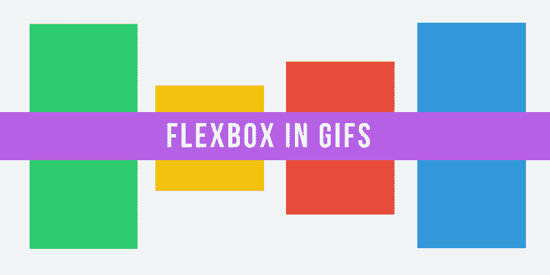
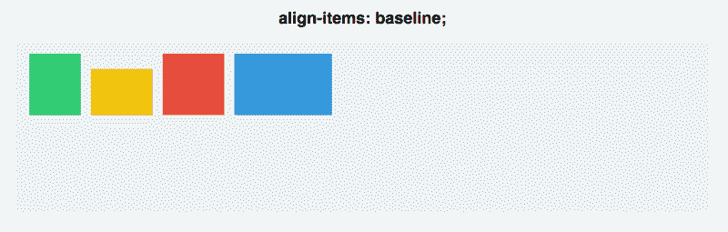

# Flexbox 如何工作——用大的、彩色的、动画 gif 解释

> 原文：<https://www.freecodecamp.org/news/an-animated-guide-to-flexbox-d280cf6afc35/>

斯科特·多姆斯

# Flexbox 如何工作——用大的、彩色的、动画 gif 解释



Flexbox 承诺将我们从普通 CSS 的弊端中拯救出来(比如垂直对齐)。

Flexbox 确实实现了这个目标。但是掌握它的新心智模式可能具有挑战性。

所以让我们用动画来看看 Flexbox 是如何工作的，这样我们就可以用它来构建更好的布局。

Flexbox 的基本原则是让布局灵活直观。

为了实现这一点，它让容器自己决定如何平均分配它们的子容器——包括它们的大小和它们之间的空间。

这在原则上听起来不错。但是让我们看看它实际上是什么样子的。

在本文中，我们将深入探讨 5 个最常见的 Flexbox 属性。我们将探索它们做什么，如何使用它们，以及它们的结果实际上是什么样子。

### 属性#1:显示:伸缩

这是我们的示例网页:


你有四个不同大小的彩色 div，放在一个灰色容器 div 中。截至目前，每个 div 都默认为`display: block`。因此，每个方块占据了其线条的全部宽度。

为了开始使用 Flexbox，您需要将**容器**变成 **flex 容器**。这很简单:

```
#container {  display: flex;}
```


没有太大的变化——你的 div 现在是内嵌显示的，但仅此而已。但在幕后，你做了一些有影响力的事情。你给了你的方块一个叫做*伸缩环境*的东西。

现在，您可以开始在该上下文中定位它们，这比传统的 CSS 要容易得多。

### 属性#2:弯曲方向

Flexbox 容器有两个轴:**一个主轴**和**一个横轴**，默认如下:


**默认情况下，项目沿主轴排列，从左到右**。这就是为什么一旦你应用了`display: flex`，你的方块默认为一条水平线。

`Flex-direction`不过，还是让你旋转主轴吧。

```
#container {  display: flex;  flex-direction: column;}
```


这里有一个重要的区别:`flex-direction: column`不在横轴上而在主轴上对齐方块。**它使主轴本身从水平走向垂直。**

还有几个其他的伸缩方向选项:*行反转*和*列反转。*


### 属性 3:调整内容

*Justify-content* 控制如何在**主轴上对齐项目。**

在这里，您将更深入地了解主轴/横轴的区别。首先，让我们回到 flex-direction: row。

```
#container {  display: flex;  flex-direction: row;  justify-content: flex-start;}
```

您有五个命令可以使用 *justify-content* :

1.  灵活启动
2.  挠性端
3.  中心
4.  间距
5.  周围空间


空间环绕和空间间隔是最不直观的。每个方块之间的间距相等，但它和容器之间的间距不相等。

Space-around 在正方形的两边放置了相等的空间缓冲——这意味着**最外面的正方形和容器之间的空间是两个正方形之间的空间的一半**(每个正方形贡献了不重叠的等量边距，从而使空间加倍)。

最后一点:记住**调整内容沿着主轴**工作，而**伸缩方向切换主轴**。这将是重要的，因为你移动到…

### 属性#4:对齐项目

如果你“得到”调整内容，对齐项目将是轻而易举的事。

由于对齐内容沿主轴工作，**对齐项目适用于横轴。**


让我们将*弯曲方向*重置为 row，这样我们的轴看起来和上面的图像一样。

然后，让我们深入研究 align-items 命令。

1.  灵活启动
2.  挠性端
3.  中心
4.  伸展
5.  基线

前三个与 *justify-content* 完全相同，所以这里没有什么特别的。

然而，接下来的两个有点不同。

您有 stretch 和 baseline，在 stretch 中，项目占据整个横轴，在 baseline 中，段落标签的底部对齐。


(注意，对于`align-items: stretch`，我必须将方块的高度设置为自动。否则，height 属性将覆盖拉伸。)

对于基线，请注意，如果您去掉段落标签，它会对齐正方形的底部，就像这样:



为了更好地演示主轴和横轴，让我们将“内容对齐”和“项目对齐”结合起来，看看两个“伸缩方向”命令的居中方式有何不同:


**对于 row，方块是沿着水平主轴设置的。对于圆柱，它们沿着垂直主轴下落。**

即使在两种情况下正方形都垂直和水平居中，这两者也是不可互换的！

### 特性 5:自我调整

*Align-self* 允许您手动操作一个特定元素的对齐。

它基本上覆盖了一个方块的 *align-items* 。所有的属性都是相同的，尽管它默认为*自动*，其中它跟随容器的*对齐项目*。

```
#container {  align-items: flex-start;}
```

```
.square#one {  align-self: center;}// Only this square will be centered.
```

让我们看看这是什么样子。您将对两个方块应用*自对齐*，对其余的应用`align-items: center`和`flex-direction: row`。


### 结论

尽管我们只是触及了 Flexbox 的表面，这些命令应该足以让您处理最基本的对齐——并垂直对齐您的心。

如果你想看更多的 GIF Flexbox 教程，或者如果这个教程对你有帮助，点击下面的绿色心脏或者留下评论。

感谢阅读！