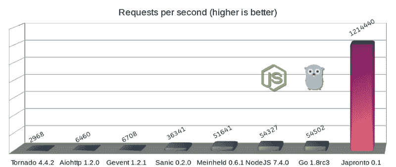
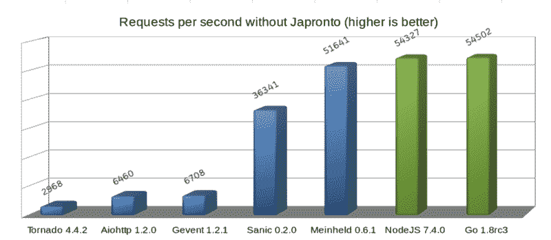
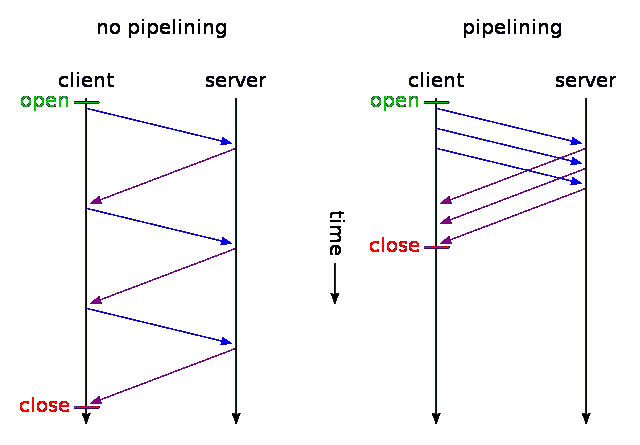
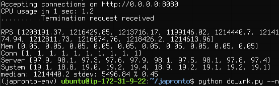
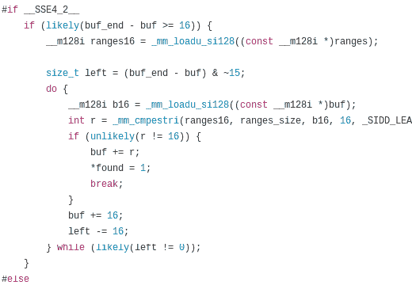

# 用 Python 每秒一百万次请求

> 原文：<https://www.freecodecamp.org/news/million-requests-per-second-with-python-95c137af319/>

保罗·彼得·拉多万

# 用 Python 每秒一百万次请求

用 Python 有可能达到每秒一百万次请求吗？可能直到最近才知道。

许多公司正在从 Python 迁移到其他编程语言，这样他们可以提高他们的操作性能并节省服务器价格，但实际上没有必要。Python 可能是这项工作的合适工具。

Python 社区最近做了很多关于性能的工作。CPython 3.6 通过新的字典实现提高了解释器的整体性能。由于引入了更快的调用约定和字典查找缓存，CPython 3.7 将会更快。

对于数字处理任务，您可以使用 PyPy 及其即时代码编译。您还可以运行 NumPy 的测试套件，它现在已经提高了与 C 扩展的整体兼容性。今年晚些时候，PyPy 有望达到 Python 3.5 的一致性。

所有这些伟大的工作激励我在 Python 被广泛使用的领域之一进行创新:web 和微服务开发。

### 进入日本对抗！

Japronto 是一个全新的微框架，为您的微服务需求量身定制。它的主要目标包括**快速**、**可扩展、**和**轻量级**。由于有了 **asyncio** ，它可以让你同时进行**同步**和**异步**编程。而且是无耻的**快**。甚至比 NodeJS 和 Go 还快。

Python micro-frameworks (blue), Dark side of force (green) and Japronto (purple)

**勘误表:**正如用户@heppu 指出的，如果写得更仔细，Go 的 stdlib HTTP 服务器可以比这张图显示的速度**快 12%**。此外，还有一个令人敬畏的**fast http**Go 服务器，在这个特定的基准测试中，它显然只比 Japronto 慢 18%**。厉害！详见[https://github.com/squeaky-pl/japronto/pull/12](https://github.com/squeaky-pl/japronto/pull/12)和[https://github.com/squeaky-pl/japronto/pull/14](https://github.com/squeaky-pl/japronto/pull/14)。**

我们还可以看到，Meinheld WSGI server 几乎与 NodeJS 和 Go 并驾齐驱。尽管其固有的模块化设计，但与前面四个异步 Python 解决方案相比，它是一个很好的表现者。所以不要相信任何说异步系统总是更快的人。它们几乎总是更加并发，但不仅仅如此。

我使用“Hello world！”执行了这个微基准测试应用程序，但它清楚地展示了许多解决方案的服务器框架开销。

这些结果是在具有 8 个 VCPUs 的 AWS c4.2xlarge 实例上获得的，该实例在圣保罗地区发布，采用默认共享租户和 HVM 虚拟化和磁存储。该机器运行的是 Ubuntu 16.04.1 LTS (Xenial Xerus)和 Linux 4 . 4 . 0–53 通用 x86_64 内核。操作系统报告至强 CPU E5–2666 v3 @ 2.90 GHz CPU。我用的是 Python 3.6，是我从它的源代码中新鲜编译出来的。

公平地说，所有的参赛选手(包括 Go)都在运行一个单工作进程。使用 [wrk](https://github.com/wg/wrk) 对服务器进行负载测试，1 个线程，100 个连接，每个连接 24 个同时(流水线)请求(2400 个请求的累积并行度)。

HTTP pipelining (image credit Wikipedia)

HTTP 管道在这里至关重要，因为它是 Japronto 在执行请求时考虑的优化之一。

大多数服务器执行来自流水线客户端的请求的方式与执行来自非流水线客户端的请求的方式相同。他们不会试图优化它。(事实上，Sanic 和 Meinheld 还会悄悄地丢弃来自管道客户端的请求，这违反了 HTTP 1.1 协议。)

简而言之，管道技术是一种客户端在通过同一 TCP 连接发送后续请求之前不需要等待响应的技术。为了确保通信的完整性，服务器按照接收请求的顺序发送回几个响应。

### 优化的血淋淋的细节

当许多小的 GET 请求被客户端流水线化在一起时，它们很有可能以一个 TCP 包的形式到达服务器端(多亏了 [Nagle 的算法](https://en.wikipedia.org/wiki/Nagle's_algorithm)，然后被一个**系统调用**的**读回**。

与在进程空间内移动内存相比，执行系统调用并将数据从内核空间移动到用户空间是一项非常昂贵的操作。这就是为什么尽可能少地执行必要的系统调用是很重要的。

当 Japronto 接收到数据并成功解析出几个请求时，它试图尽可能快地执行所有的请求，以正确的顺序粘回响应，然后**将**写回**一个系统调用**。事实上，由于[分散/聚集 IO](https://en.wikipedia.org/wiki/Vectored_I/O) 系统调用，内核可以帮助粘合部分，Japronto 还没有使用。

请注意，这并不总是可能的，因为一些请求可能需要太长时间，等待它们会不必要地增加延迟。

调优试探法时要小心，并考虑系统调用的成本和预期的请求完成时间。

Japronto gives a 1,214,440 RPS median of grouped continuous data, calculated as the 50th percentile, using interpolation.

除了延迟流水线客户端的写操作，代码还采用了其他一些技术。

[Japronto](https://github.com/squeaky-pl/japronto) 几乎完全是用 C 写的，解析器、协议、连接收割器、路由器、请求、响应对象都是用 C 扩展写的。

Japronto 努力延迟内部结构的 Python 副本的创建，直到被明确要求。例如，在视图中请求标题字典之前，不会创建它。之前已经标记了所有的标记边界，但是头键的规范化和几个 str 对象的创建是在第一次访问它们时完成的。

Japronto 依靠优秀的 picohttpparser C 库来解析状态行、消息头和 HTTP 消息体。Picohttpparser 直接使用现代带有 SSE4.2 扩展的 CPU 中的文本处理指令(几乎任何 10 年前的 x86_64 CPU 都有)来快速匹配 HTTP 令牌的边界。I/O 由超级棒的 uvloop 处理，它本身是 libuv 的包装器。在最底层，这是 epoll 系统调用的桥梁，提供读写就绪的异步通知。

Picohttpparser relies on SSE4.2 and CMPESTRI x86_64 intrinsic to do parsing

Python 是一种垃圾收集语言，因此在设计高性能系统时需要小心，以免不必要地增加垃圾收集器的压力。 [Japronto](https://github.com/squeaky-pl/japronto) 的内部设计试图避免引用周期，并根据需要尽可能少地进行分配/取消分配。它通过将一些对象预分配到所谓的竞技场来实现这一点。如果 Python 对象不再被引用，它还会尝试在将来的请求中重用它们，而不是丢弃它们。

所有分配都是以 4KB 的倍数完成的。内部结构经过精心布局，以便经常一起使用的数据在内存中足够接近，从而最大限度地降低缓存未命中的可能性。

Japronto 尽量不在缓冲区之间进行不必要的复制，并且就地执行许多操作。例如，在路由器过程中，它在匹配之前对路径进行百分解码。

### 开源贡献者，我需要你的帮助。

在过去的三个月里，我一直在持续地做日本料理，通常是在周末和正常工作日。这是唯一可能的，因为我从我的常规程序员工作中抽出时间，把我所有的精力都投入到这个项目中。

我想是时候和社区分享我的劳动成果了。

目前 [Japronto](https://github.com/squeaky-pl/japronto) 实现了一个非常可靠的特性集:

*   支持分块上传的 HTTP 1.x 实现
*   完全支持 HTTP 管道
*   通过可配置的收割器保持连接
*   支持同步和异步视图
*   基于分叉的主多工模型
*   支持变更时代码重载
*   简单路由

接下来我想研究一下 Websockets 和异步流 HTTP 响应。

在记录和测试方面有很多工作要做。如果你有兴趣帮忙，请直接在 Twitter 上联系我。这里是 [Japronto 的 GitHub 项目库](https://github.com/squeaky-pl/japronto)。

此外，如果你的公司正在寻找一个 Python 开发人员，他是一个性能狂人并且也做 DevOps，我很乐意听到这个消息。我会考虑全球范围内的职位。

### 最后的话

我在这里提到的所有技术实际上都不是 Python 特有的。它们可能被用于其他语言，比如 Ruby、JavaScript 甚至 PHP。我也对做这样的工作感兴趣，但遗憾的是，除非有人能资助，否则这不会发生。

我要感谢 Python 社区对性能工程的持续投资。也就是维克多·斯坦纳@维克多·斯坦纳，[稻田·直树](https://twitter.com/methane?lang=en)@甲烷和尤里·塞利万诺夫@1st1 以及整个 PyPy 团队。

为了对 Python 的热爱。