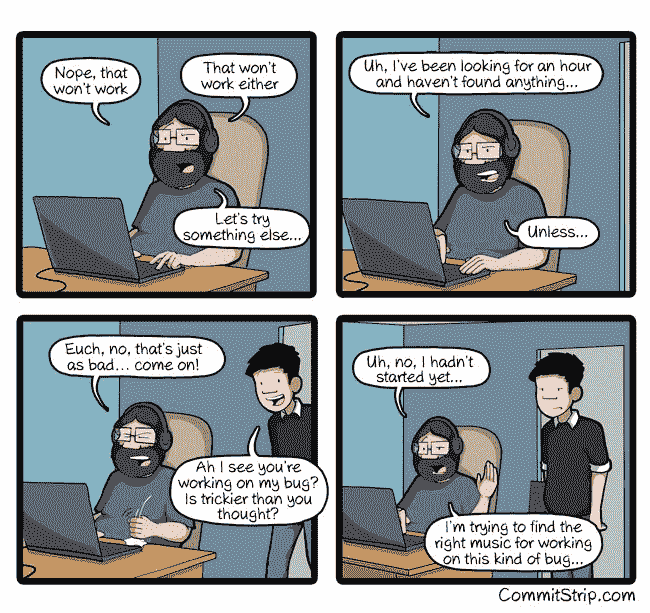

# 我们如何让我们 2 岁的开源项目走向 GitHub

> 原文：<https://www.freecodecamp.org/news/how-we-got-our-2-year-old-open-source-project-to-trend-on-github-8c25b0a6dfe9/>

这里有三个值得你花时间的链接:

1.  我们如何在短短 48 小时内让我们 2 岁的开源项目在 GitHub 上流行起来( [11 分钟阅读](http://bit.ly/2kjjzWg))
2.  数据工程师的崛起( [12 分钟阅读](http://bit.ly/2jvj1Ix))
3.  为什么你应该有自己的 Twitter 机器人，以及如何在 30 分钟内创建一个

奖金:创始人:一个反乌托邦的商业模拟器([可玩的浏览器游戏](http://bit.ly/2jNukg0)

### 想到这一天:

> “活了 100 岁，只能记住 3000 万字节，这太可笑了。你知道，比激光唱片少。人类的状况每一分钟都在变得越来越过时。”—马文·明斯基

### 今日趣事:

*漫画作者[CommitStrip](http://bit.ly/2jKGZ5X)*

编码快乐！

–昆西·拉森，自由代码营的老师