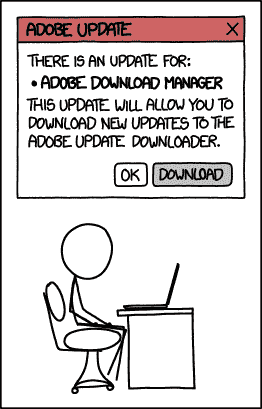
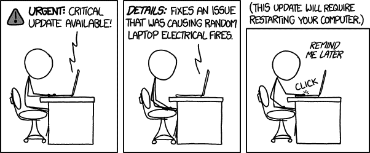
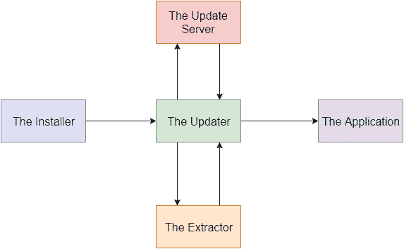
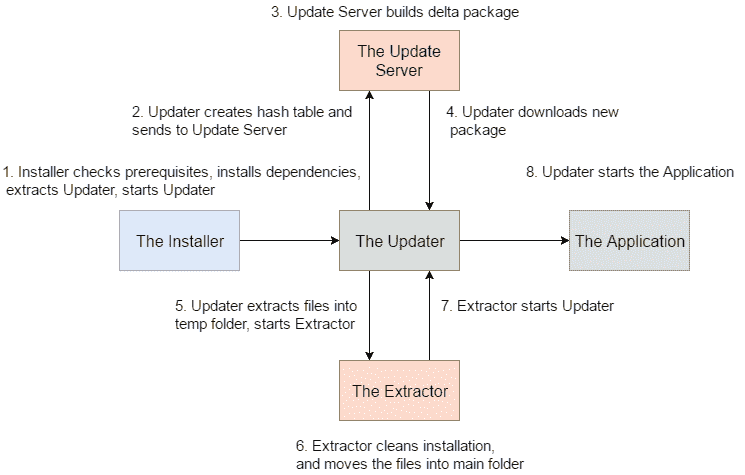

# 如何让你的用户真正更新你的应用

> 原文：<https://www.freecodecamp.org/news/the-architecture-of-an-intelligent-application-update-system-3fc2f27a4a2/>

杰克·索恩尼克

# 如何让你的用户真正更新你的应用



Image credit: [XKCD](https://xkcd.com/1197/)

软件开发周期在加速，web 也很好地支持了它。没有必要向用户发送新的二进制文件。他们只需访问您的站点，很快——他们就能立即获得最新、最好的代码版本。

但有些情况下，你的应用程序无法通过网络提供。有时你的用户需要你的应用程序运行，即使他们没有互联网接入。让我们面对现实吧——2017 年仍然有很多应用程序太耗费资源，无法在浏览器中运行。所以桌面应用程序不会消失。

也就是说，桌面应用程序的用户仍然希望与你的最新版本保持“同步”。他们想使用他们在你的开发博客上读到的很酷的新特性。

“没问题，”开发商说。“我将编译代码，将二进制文件插入安装程序，并将新版本发布到我的站点。然后用户可以下载我的最新版本。我会在推特上发布一个链接，或者把它包含在下周的邮件群发中，让他们知道。”

这是更新客户端的传统方式。对于 98%的本机桌面应用程序来说，这是可以的。对于您的用户来说，一切如常。它是抗错的，并且不需要开发人员做大量的工作。开发人员甚至可以在上下文菜单中加入“检查更新”项。您的应用程序可以 ping 您的网站以获取最新版本号，然后将您的用户重定向到该文件。

很明显，这种传统方式不够好。原因如下:

*   公告对于让用户使用你的下一个版本至关重要。
*   如果你的应用访问网络服务，开发者需要让它们向后兼容。
*   用户必须手动更新软件。这意味着时间、精力和注意力的丧失。
*   客户支持不想解决过时版本的问题。
*   用户经常从源代码以外的地方检索他们的软件。新版本的传播需要时间，而且永远不会到处都是最新的。
*   对于某些应用和游戏，每个用户运行完全相同的版本至关重要。

自动更新很难。当出现问题时，公司无时无刻不感到痛苦。

比如作为用户，我不知道 Slack 在更新的时候在做什么。我只知道，当它结束时，它经常告诉我，它仍然不是最新的。Chrome 总是失败，甚至不告诉我为什么。Windows Update 越来越好。

嗯，作为一名开发人员，我同情产品和维护产品的团队，因为更新如此困难有很多原因。



Image credit: [XKCD](https://xkcd.com/1328/)

*   如今，用户运行大量的操作系统和环境组合。
*   底层框架可能也需要从一个版本更新到下一个版本。
*   用户继续调整安全性和权限。
*   用户可能会忘记为他们的操作系统或应用程序本身安装更新。
*   更新系统本身需要更新怎么办？
*   随着部署变得越来越自动化，团队交付代码的速度越来越快，bug 和安全问题也发展得越来越快。

#### 更多的应用需要更好的更新系统。

这些更新系统通过为用户提供您的组织所能提供的最佳体验，增加了巨大的价值。

有很多可用的更新框架。一个流行的框架是松鼠。

如果你正在努力解决更新问题，我建议你在向你的团队推荐任何东西之前做好你的功课。值得注意的是，今天生产中的大部分现有系统都是定制的。这是因为这些系统给了开发者对他们代码的最大控制权。

#### 智能灵活的更新系统有几个特点:

*   下载“增量”的能力，即当前安装和新安装之间的差异。如果用户已经有了文件，就不需要下载了。
*   该系统可以自我更新和修复，并且可以在出现问题时恢复。
*   该系统可以检测操作系统上的现有框架。它可以下载和安装新的框架，而不需要用户自己去取。

一些架构依赖于服务。我在看你，谷歌和 Adobe。嗯，开发人员不应该依赖这些资源密集型的始终运行的后台进程，如果他们可以避免的话。

我将要描述的架构只是一种类型，但大多数都是一种变体，并且遵循相同的一般原则。展望未来，我将更加关注 Windows，但是这些基础知识也适用于其他操作系统。我将介绍更新系统组件背后的基本概念。



The update system components

### 安装人员

这是用户的初始入口点，也是整个过程开始的地方。这不是典型的 ClickOnce 或 Wix instalIer。它是一个单独的可执行文件。它做了几件重要的事情，令人惊讶的是它没有包含主应用程序。那它是做什么的？

1.  首先，它检查操作系统的兼容性。这台计算机能够运行该应用程序吗？
2.  它对框架的要求非常低。例如，在 Windows 上，这将是。NET 2.0 或者 3.0。这意味着如果用户没有及时更新，他们可以轻松打开安装程序。
3.  安装程序的可执行文件中嵌入了更新程序。不包含目标应用程序会使可执行文件变小。这对于发行来说非常好。用户点击下载按钮和打开安装程序之间的时间越短越好。
4.  安装程序为更新程序下载并安装任何必要的框架。这意味着访问微软的网站，检索。NET 安装程序，并使用静默参数来安装它。
5.  它创建整个应用程序环境将驻留的初始目录。具体在哪里？在 Windows 上，它是:

```
C:\Users\<Username>\AppData\Local\ 
```

为什么？在那里安装不需要管理员权限。这反过来使用户体验更好，并允许没有特权的用户仍然使用您的软件。除非有充分的理由，否则不要提示 UAC 并要求权限升级。

6.更新程序被提取到 AppData 中，如果需要创建快捷方式，它们将指向更新程序。

7.一旦完成，它就会启动更新程序。

### 更新程序

更新程序是整个系统中最重要的部分，因此得名。它是更新系统其余部分的中枢。

1.  首先，更新程序会清点其所在文件夹中的文件。它散列(MD5，SHA 等。)中的每一个文件，并将这些值存储在一个字典中。
2.  更新程序会将它所依赖的当前框架版本发送到更新服务器。这是为了更新服务器可以指示更新者在需要时获取新的框架版本。
3.  更新程序将发送文件/哈希字典，更新服务器将确定用户是否需要更新。如果没有，客户端可以继续运行应用程序。
4.  如果有可用的更新，更新程序将从更新服务器下载压缩文件。它将提取新文件夹中的内容。如果这是用户第一次打开更新程序，他们将收到一个包含应用程序的包。如果用户已经下载了一个旧的安装程序，这种方法可以确保不需要下载应用程序两次。
5.  更新程序启动提取器。

### 提取器

提取器的目的是使更新器本身可以更新。提取器甚至不需要接口。

1.  提取器执行任何必要的清理。
2.  它将文件从 extracted contents 文件夹移回应用程序所在的位置。
3.  提取器启动更新程序。

### 更新服务器

为什么不在 web 服务器上托管二进制文件，而不是构建一个专用的更新服务器应用程序？嗯，这是不可能的事情，如客户端框架检查与网络服务器，它将无法建立增量更新包。它还有助于确定是否需要维修。还可能存在需要处理的独特版本迁移情况。

1.  在服务器上，更新系统的所有组件都位于它可以访问的文件夹中。当它启动时，它为每个文件建立自己的散列字典。
2.  必要的依赖框架版本被设置为更新服务器上的配置设置。如果从更新程序发送的消息低于版本，它将指示更新程序下载并安装新的框架。
3.  当开发团队准备部署新版本时，他们会替换更新服务器清点的文件。他们刷新散列字典。
4.  还记得更新程序发送哈希字典的时候吗？更新服务器比较这两个字典，并确定客户端的过期文件。这就是它构建增量包的方式。
5.  它会压缩软件包，更新服务器会发送消息让更新程序开始下载。

下面是更新过程的流程图:



### 临终遗言

在这种设计中，更新程序是应用程序的入口点。然而，事实并非如此。构建更新系统时要问的一些问题:

*   你是问用户要不要更新，你是让它成为必需的，还是隐藏这个过程？
*   更新程序是否需要成为一个独立的组件？它可能会存在于应用程序本身中。
*   应用程序开始前有必要更新吗？也许它可以随着应用程序的运行而更新。

这些是开发者在开始设计之前应该考虑的问题。自动化应用程序更新正变得越来越流行，这是有充分理由的。这对用户来说更容易，也能更快地将开发人员的代码交到他们手中。作为一名工程师，努力让你的更新过程对你和你的用户更好。

感谢阅读！