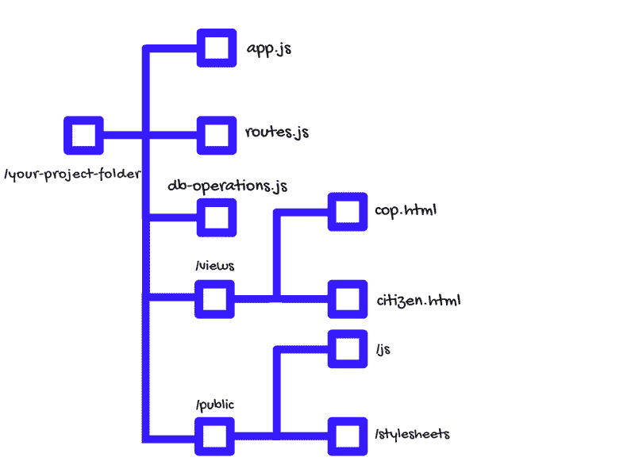
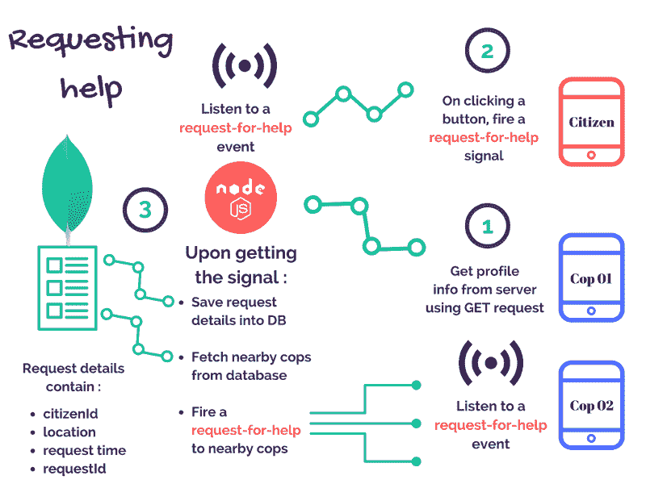
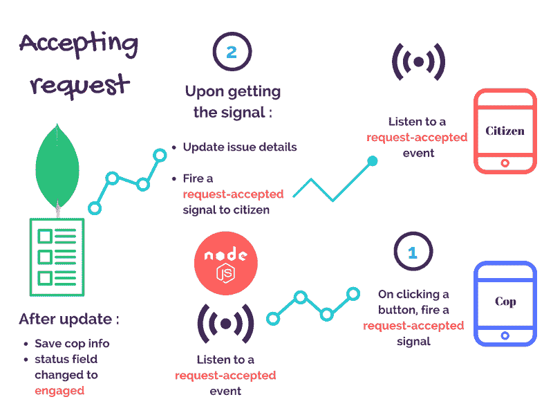
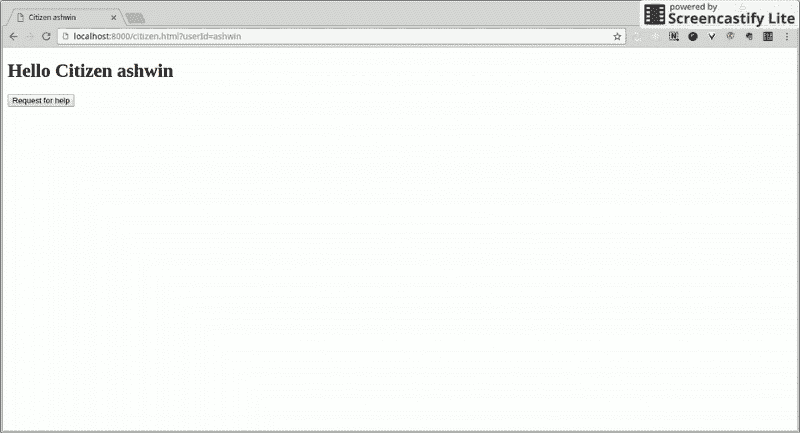
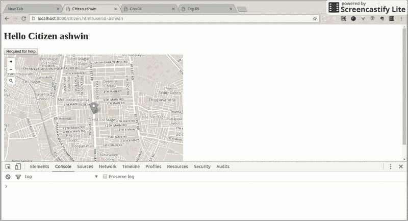
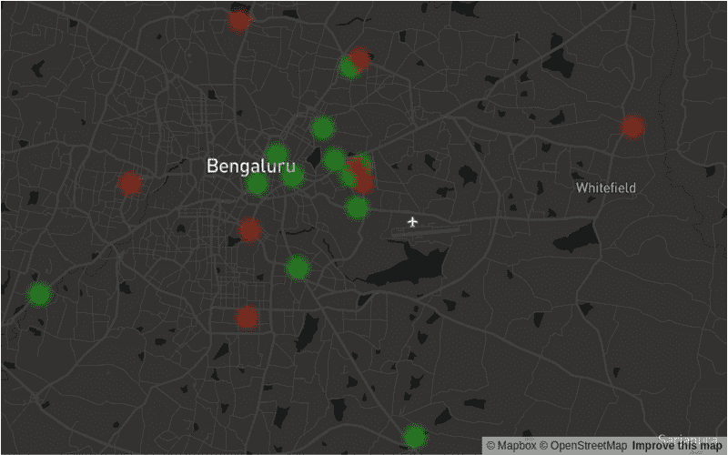

# 如何构建自己的优步 X 应用程序(第 2 部分)

> 原文：<https://www.freecodecamp.org/news/how-to-build-your-own-uber-for-x-app-part-2-8ba6ffa2573d/>

入选 [Mybridge](https://medium.mybridge.co/) 的【2017 年 1-2 月十大节点文章和[年度 50 大节点文章(v.2018)](https://medium.com/@Mybridge/learn-node-js-we-created-a-directory-of-top-articles-from-2017-783e809452dd)

* * *

> **更新:**在我的[科技博客](https://www.ashwinhariharan.tech/blog/how-to-build-your-own-uber-for-x-app-part-2/)上阅读这篇文章的更新版本。

* * *

欢迎来到这个系列的第 2 部分 ***构建你自己的优步 X 应用*** 。在第 1 部分中，您使用了一个市民警察应用程序的示例，并学习了如何获取位于给定的一对经纬度坐标附近的警察。在这一部分中，您将继续构建相同的应用程序，并学习实现这些功能:

*   使用网络套接字在警察和市民之间实时交换数据
*   使用地图显示市民和警察的位置细节
*   可视化犯罪数据

确保[通读第 1 部分](https://www.freecodecamp.org/news/how-to-build-your-own-uber-for-x-app-33237955e253/)并在继续本教程的其余部分之前尝试示例。

### 项目设置和文件夹组织



让我们分析一下上一部分中我们目前拥有的项目文件:

*   *app.js* 包含您的服务器设置和数据库配置。每次你需要启动服务器的时候，你可以在终端中输入 *node app.js* 来使用这个文件。
*   *routes.js* —您将使用这个文件来编写端点和处理程序
*   *db-operations* —在这里您将编写数据库操作
*   *视图*将包含您的 HTML 页面
*   *public* 将包含用于存储 JavaScripts、样式表和图像的子文件夹

如果你以前用过优步，你会知道它有面向司机的应用和面向乘客的应用。让我们尝试实现同样的功能——*citizen.html*将展示面向市民的应用程序，而*cop.html*将展示面向警察的应用程序。你将把这些文件保存在*视图*文件夹中。在你的文本编辑器中打开*citizen.html*并添加如下内容:

```
<!DOCTYPE html>
<html lang = "en">
<head>
    <meta charset="utf-8"/>
    <title>Citizen <%= userId %> </title>
</head>
<body data-userId="<%= userId %>">
    <h1>Hello Citizen <%= userId %></h1>
    <h4 id="notification"> 
        <!-- Some info will be displayed here-->
    </h4>
    <div id="map"> 
        <!-- We will load a map here later-->
    </div>
    <!--Load JavaScripts -->
</body>
</html>
```

对*cop.html*也重复这一步骤，但将单词*公民*替换为*警察*。

*data-userId* 是一个以前缀 *data-，*开头的属性，您可以使用它将一些信息存储为字符串，不一定需要可视化的表示。`<%= userId %>` 看起来是一个奇怪的语法，但是不要担心，我们的模板引擎知道在`*<%=*`和`%>`之间的任何东西都是一个变量，在页面被提供之前，它会在服务器端用变量 *userId* 代替实际值。随着你的进步，你会更好地理解这一点。

如果您还记得在前面的部分，您在 *app.js :* 中有这些行

```
app.set('views', 'views'); 
app.use(express.static('./public'));
app.set('view engine','html');
app.engine('html',consolidate.underscore);
```

第一行告诉您的应用程序，每当收到对特定页面的请求时，就在 *views* 文件夹中查找 HTML 文件。第二行设置文件夹，当页面加载到浏览器上时，样式表和 JavaScripts 等静态资产将从该文件夹中提供服务。接下来的两行告诉我们的应用程序使用*下划线*模板引擎解析我们的 html 文件。

既然目录结构已经设置好了，视图也准备好了，是时候开始实现特性了！在继续之前，记住以下几点会有所帮助:

*   在 HTML 文档中的*脚本*标签内编写 JS 代码。你可以选择把它写在一个*里面。js* 文件，在这种情况下，您应该将 js 文件保存在 */public/js* 文件夹中，并将其加载到您的页面中。确保首先加载库和其他依赖项！
*   如果您在浏览器中打开开发人员控制台来检查错误消息，以防出现问题，这将会很有帮助。也要注意终端输出。
*   在本教程中，*事件*和*信号*这两个词将会互换使用——两者的意思是一样的。

开始黑吧！

### 服务公民和警察网页

让我们渲染一下前往[*http://localhost:8000/citizen . html、*](http://localhost:8000/police.html,) 的市民页面和前往[*http://localhost:8000/cop . html*](http://localhost:8000/police.html,)的 COP 页面。为此，打开 *app.js* 并将这些行添加到 *mongoClient.connect* 的回调函数中:

```
app.get('/citizen.html', function(req, res){
    res.render('citizen.html',{
        userId: req.query.userId
    });
});

app.get('/cop.html', function(req, res){
    res.render('cop.html', {
        userId: req.query.userId
    });
});
```

保存你的文件，重启你的服务器，加载公民和警察页面*。*你应该在页面上看到**你好公民**。如果在 URL 中传递 *userId* 作为查询参数，例如—[*http://localhost:8000/citizen . html？userId = your name*](http://localhost:8000/citizen.html?userId=YOURNAME)*然后你会看到**你好公民 YOURNAME** 。这是因为您的模板引擎用您从查询参数传递的值替换了变量 *userId* ，并返回页面。*

### *为什么需要 web 套接字，它们是如何工作的？*

*自古以来，基于事件或信号的通信一直是传递消息的直观方式。最早的技术相当初级——像使用各种目的的火灾信号，主要是警告人们有危险。*

**

*几个世纪以来，更新更好的交流方式已经出现。计算机和互联网的出现引发了一些真正的创新——随着 OSI 模型、套接字编程和智能手机革命的发展，一对一的通信变得相当复杂。基本原理保持不变，但现在比点着火扔东西有趣多了。*

*使用套接字，你可以通过*事件、*或者换句话说*信号*来发送和接收信息。这种信号可以有不同的类型，如果有关各方知道“听”什么样的信号，那么就可以交换信息。*

#### *但是为什么不简单地使用 HTTP 请求呢？*

*我读过一篇关于 HTTP 请求和 web 套接字之间的差异的文章。它很短，所以你可以阅读它来更好地理解网络套接字的概念。*

*简而言之，GET 和 POST 等传统 HTTP 请求发起一个新的连接请求，然后在服务器发回响应后关闭连接。如果您试图使用 HTTP 构建一个实时应用程序，客户端将不得不定期发起请求来检查新信息(这些信息可能可用，也可能不可用)。这是因为服务器本身无法自己**推送**信息。*

*这是非常低效的——客户端会浪费资源，不断地中断服务器并说“*你好，我是 XYZ——让我们握手吧。你有新的东西给我吗？*”，服务器会像——*“嗨(握手)。不，我不知道。再见！”*一遍又一遍，也就是说连服务器都在浪费资源！*

*然而，Web 套接字在客户机和服务器之间创建了一个持久的连接。这样，客户端就不需要一直询问服务器，服务器可以在需要的时候**推送**信息。这种方法对于构建实时应用程序更有效。*

*Web-sockets 在所有主流浏览器中都有支持，但是对于少数不支持的浏览器，还有其他的后备选项/技术可以依赖，比如长轮询。这些回退技术和 Web Sockets APIs 在 Socket 中捆绑在一起。IO，所以你不必担心浏览器的兼容性。这里有一个关于堆栈溢出的[极好的答案](http://stackoverflow.com/a/12855533/3989925)，它比较了许多选项。*

### *集成插座。超正析象管(Image Orthicon)*

*让我们从将 Socket.io 与 express 服务器集成开始，并在 html 页面中加载 socket.io 的客户端库。您还将使用 jQuery——它不是 socket.io 工作所必需的，但是您的应用程序将需要它来发出 AJAX 请求和大量其他东西。所以继续，把这个写在两页上:*

```
*`<!-- Load socket.io client library -->
<script src="/socket.io/socket.io.js"></script>

<!-- Load JQuery from a CDN -->
<script type="text/javascript" src="https://cdnjs.cloudflare.com/ajax/libs/jquery/3.1.1/jquery.min.js"></script>

<!-- load libraries before your JS code
Write rest of your JS code here -->

<script type="text/javascript">
    var socket = io();

    //Fetch userId from the data-atribute of the body tag
    var userId = document.body.getAttribute("data-userId");

    /*Fire a 'join' event and send your userId to the server, to join a room - room-name will be the userId itself!
*/ 
    socket.emit('join', {userId: userId});

//Declare variables, this will be used later
    var requestDetails = {};
    var copDetails = {};
    var map, marker;

</script>`*
```

*第一个*脚本*标签加载 Socket。IO 的客户端库(一旦我们使用 socket.io server 服务页面)，它公开了一个全局 *io* 对象。您的应用程序将利用该对象向服务器发出事件/信号，并侦听来自服务器的事件。*

*现在你要把 *app.js* 改成使用 socket.io:*

```
*`var http = require("http");
var express = require("express");
var consolidate = require("consolidate"); //1
var _ = require("underscore");
var bodyParser = require('body-parser');

var routes = require('./routes'); //File that contains our endpoints
var mongoClient = require("mongodb").MongoClient;

var app = express();
app.use(bodyParser.urlencoded({
    extended: true,
}));

app.use(bodyParser.json({
    limit: '5mb'
}));

app.set('views', 'views'); //Set the folder-name from where you serve the html page. 
app.use(express.static('./public')); //setting the folder name (public) where all the static files like css, js, images etc are made available

app.set('view engine', 'html');
app.engine('html', consolidate.underscore); //Use underscore to parse templates when we do res.render

var server = http.Server(app);
var portNumber = 8000; //for locahost:8000

var io = require('socket.io')(server); //Creating a new socket.io instance by passing the HTTP server object

server.listen(portNumber, function() { //Runs the server on port 8000
    console.log('Server listening at port ' + portNumber);

    var url = 'mongodb://localhost:27017/myUberApp'; //Db name
    mongoClient.connect(url, function(err, db) { //a connection with the mongodb is established here.
        console.log("Connected to Database");

        app.get('/citizen.html', function(req, res) { //a request to /citizen.html will render our citizen.html page
            //Substitute the variable userId in citizen.html with the userId value extracted from query params of the request.
            res.render('citizen.html', {
                userId: req.query.userId
            });
        });

        app.get('/cop.html', function(req, res) {
            res.render('cop.html', {
                userId: req.query.userId
            });
        });

        io.on('connection', function(socket) { //Listen on the 'connection' event for incoming sockets
            console.log('A user just connected');

            socket.on('join', function(data) { //Listen to any join event from connected users
                socket.join(data.userId); //User joins a unique room/channel that's named after the userId 
                console.log("User joined room: " + data.userId);
            });

            routes.initialize(app, db, socket, io); //Pass socket and io objects that we could use at different parts of our app
        });
    });
});

/* 1\. Not all the template engines work uniformly with express, hence this library in js, (consolidate), is used to make the template engines work uniformly. Altough it doesn't have any 
modules of its own and any template engine to be used should be seprately installed!*/`*
```

*确保将 *routes.js* 中的 ***初始化*** 函数改为接受**四个**参数而不是两个，像这样— *函数初始化(app，db， **socket** ， **io** )* 。*

*如果您重启服务器并刷新您的页面，您将会看到消息*一个用户刚刚在您的终端中连接了*。一旦从连接的客户端接收到*加入*事件，服务器也会创建一个新房间，所以您会看到另一条打印的消息— *用户加入房间。*用[http://localhost:8000/COP . html 试试？userId=02](http://localhost:8000/citizen.html?userId=tyrion) ，您应该会得到类似的输出。*

*完美——现在您已经集成了 socket.io，可以开始构建应用程序的其余部分了。*

### *公民-警察交流:*

*整个过程可以大致分为两组特征:*

1.  *请求帮助并通知附近的警察*
2.  *接受请求并通知公民*

*让我们试着详细理解如何实现这些特性。*

#### *请求帮助并通知附近的警察:*

**

*   *首先在 *routes.js、*中创建一个端点 */cops/info* ，它将调用一个函数来获取一个警察的档案信息，并将结果以 JSON 的形式返回给客户端*

```
*`// GET request to '/cops/info?userId=02'
app.get('/cops/info', function(req, res){
    var userId = req.query.userId //extract userId from query params
    dbOperations.fetchCopDetails(db, userId, function(results){
        res.json({
            copDetails: results //return results to client
        });
    });
});`*
```

*   *接下来，您将在 *db-operations.js、*中编写函数 *fetchCopDetails* ，该函数接受一个 *db、*COP 的 *userId* 和一个回调函数的实例。该函数将使用 MongoDB 的[*findOne*](https://docs.mongodb.com/v3.2/reference/method/db.collection.findOne/)*查询从数据库中获取带有给定 *userId* 的 cop 信息，然后将结果返回给回调函数:**

```
**`function fetchCopDetails(db, userId, callback) {
    db.collection("policeData").findOne({
        userId: userId
    }, function(err, results) {
        if (err) {
            console.log(err);
        } else {
            callback({
                copId: results.userId,
                displayName: results.displayName,
                phone: results.phone,
                location: results.location
            });
        }
    });
}
exports.fetchCopDetails = fetchCopDetails;`**
```

*   ****内参*cop.html*:****

**现在您已经创建了端点，您可以使用 JQuery 的 AJAX 函数调用它来获取 cop 的概要信息，并在一个空的 *div id="copDetails"* 中显示它。您还将配置 cop 页面开始监听任何帮助请求:**

```
**`//First send a GET request using JQuery AJAX and get the cop's details and save it
$.ajax({
    url: "/cops/info?userId="+userId,
    type: "GET",
    dataType: "json",
    success: function(data){ //Once response is successful
        copDetails = data.copDetails; //Save the cop details
        copDetails.location = {
            address: copDetails.location.address,
            longitude: copDetails.location.coordinates[0],
            latitude: copDetails.location.coordinates[1] 
        };
        document.getElementById("copDetails").innerHTML = JSON.stringify(data.copDetails);
    },
    error: function(httpRequest, status, error){
        console.log(error);
    }
});

//Listen for a "request-for-help" event
socket.on("request-for-help", function(eventData){
    //Once request is received, do this:

    //Save request details
    requestDetails = eventData; //Contains info of citizen

    //display the data received from the event
    document.getElementById("notification").innerHTML = "Someone's being attacked by a wildling! \n" + JSON.stringify(requestDetails);
});`**
```

**如果重启服务器进入[*http://localhost:8000/COP . html？userId=02* ，](http://localhost:8000/cop.html?userId=02,)(在查询参数中传递一个已保存的 cop 的 userId)你会发现该 cop 的信息显示在页面上。你的警察页面也开始监听任何*求助*事件。**

#### ****内*citizen.html*****

**下一步是为公民创建一个按钮，在紧急情况下可以点击它。点击后，它会发出*求救*信号，该信号会将公民的信息传回服务器:**

```
**`<button onclick="requestForHelp()">
    Request for help
</button>`**
```

**在*脚本*标签中编写生成事件的处理程序:**

```
**`//Citizen's info
requestDetails = {
    citizenId: userId,
    location: {
        address: "Indiranagar, Bengaluru, Karnataka 560038, India",
        latitude: 12.9718915,
        longitude: 77.64115449999997
    }
}

//When button is clicked, fire request-for-help and send citizen's userId and location
function requestForHelp(){
    socket.emit("request-for-help", requestDetails);
}`**
```

*   **最后，服务器需要处理这个事件，如图所示。转到 *db-operations.js* 并创建一个新函数，该函数可用于在新表 *requestsData* 中保存请求细节:**

```
**`//Saves details like citizen’s location, time
function saveRequest(db, issueId, requestTime, location, citizenId, status, callback){

    db.collection('requestsData').insert({
        "_id": issueId,
        "requestTime": requestTime,
        "location": location,
        "citizenId": citizenId,
        "status": status
    }, function(err, results){
           if(err) {
               console.log(err);
           }else{
               callback(results);
           }
    });
}
exports.saveRequest = saveRequest;`**
```

***状态*字段将告知 cop 是否对请求做出了响应。最后，在 *routes.js 中，*将这个添加到*初始化*函数中:**

```
**`//Listen to a 'request-for-help' event from connected citizens
socket.on('request-for-help', function(eventData) {
    /*
        eventData contains userId and location
        1\. First save the request details inside a table requestsData
        2\. AFTER saving, fetch nearby cops from citizen’s location
        3\. Fire a request-for-help event to each of the cop’s room
    */

    var requestTime = new Date(); //Time of the request

    var ObjectID = require('mongodb').ObjectID;
    var requestId = new ObjectID; //Generate unique ID for the request

    //1\. First save the request details inside a table requestsData.
    //Convert latitude and longitude to [longitude, latitude]
    var location = {
        coordinates: [
            eventData.location.longitude,
            eventData.location.latitude
        ],
        address: eventData.location.address
    };
    dbOperations.saveRequest(db, requestId, requestTime, location, eventData.citizenId, 'waiting', function(results) {

        //2\. AFTER saving, fetch nearby cops from citizen’s location
        dbOperations.fetchNearestCops(db, location.coordinates, function(results) {
            eventData.requestId = requestId;
            //3\. After fetching nearest cops, fire a 'request-for-help' event to each of them
            for (var i = 0; i < results.length; i++) {
                io.sockets.in(results[i].userId).emit('request-for-help', eventData);
            }
        });
    });
});`**
```

**就这样，您已经构建了第一组特性！重启服务器，打开 4 个标签进行测试，一个是公民和警察页面 [01](http://localhost:8000/cop.html?userId=01) 、 [02](http://localhost:8000/cop.html?userId=02) 和 [03](http://localhost:8000/cop.html?userId=03) 。**

**一旦你按下帮助按钮，你会注意到 **cop 01** 没有收到请求，因为那个 cop 离市民的位置很远。然而 **cop 02** 和 **cop 03** 页面显示帮助请求。**

**太棒了，你设法发送了一个市民的请求，并通知了附近所有的警察！现在，对于第二组特征——这涉及到一旦警察接受请求就通知公民。**

#### **接受请求并通知公民**

****

#### ****内*cop.html*****

**cop 应该能够点击一个按钮来通知公民请求已经被接受。点击时，该按钮将触发一个*请求接受*事件，并将 cop 的信息发送回服务器:**

```
**`<button onclick="helpCitizen()">
    Help Citizen
</button>`**
```

**事件处理程序将如下所示:**

```
**`function helpCitizen(){
    //Fire a "request-accepted" event/signal and send relevant info back to server
    socket.emit("request-accepted", {
        requestDetails: requestDetails,
        copDetails: copDetails
    });
 }`**
```

#### ****内*citizen.html*****

**公民页面将开始监听来自服务器的任何*请求-接受的*事件。一旦它接收到信号，你可以在一个空的 *div* 中显示 cop 信息:**

```
**`//Listen for a "request-accepted" event
socket.on("request-accepted", function(eventData){
    copDetails = data; //Save cop details

   //Display Cop details
    document.getElementById("notification").innerHTML = "A cop is coming to your rescue! \n" + JSON.stringify(copDetails);
});`**
```

**现在服务器需要处理*请求被接受的*事件，如图所示。首先，您将在 *db-operations.js* 中编写一个函数，该函数将使用 cop 的*用户 Id* 更新数据库中的请求，并将*状态*字段从*等待*更改为*参与*:**

```
**`function updateRequest(db, requestId, copId, status, callback) {
    db.collection('requestsData').update({
        "_id": requestId //Perform update for the given requestId
    }, {
        $set: {
            "status": status, //Update status to 'engaged'
            "copId": copId  //save cop's userId
        }
    }, function(err, results) {
        if (err) {
            console.log(err);
        } else {
            callback("Issue updated")
        }
    });
}
exports.updateRequest = updateRequest;`**
```

**当服务器监听到一个*请求被接受的*事件时，它将使用上述函数保存请求细节，然后向市民发出一个*请求被接受的*事件。所以，请继续，把它写在您的 *routes.js* 文件中:**

```
**`//Listen to a 'request-accepted' event from connected cops
socket.on('request-accepted', function(eventData){

    //Convert string to MongoDb's ObjectId data-type
    var ObjectID = require('mongodb').ObjectID;
    var requestId = new ObjectID(eventData.requestDetails.requestId);
    //For the request with requestId, update request details
    dbOperations.updateRequest(db, requestId, eventData.copDetails.copId, 'engaged’, function(results){

       //Fire a 'request-accepted' event to the citizen and send cop details
    io.sockets.in(eventData.requestDetails.citizenId).emit('request-accepted', eventData.copDetails);
       });

 });`**
```

**太好了，您已经完成了第二组功能的构建！重启你的服务器，刷新你的页面，然后试试吧！**

****

#### **下一步是什么？**

**到目前为止，您可能已经很清楚了——公民页面会在每次点击帮助按钮时发送一个硬编码的位置值。类似地，所有样本点的位置信息早就已经输入到数据库中，并且是固定值。**

**然而，在现实世界中，公民和警察都没有固定的位置，因为他们一直在移动，因此您需要一种方法来测试这种行为！**

### **输入地图**

**有很多映射选项。谷歌地图 API 非常健壮，功能丰富。我个人也喜欢 Mapbox，它使用 OpenStreetMap 协议，这是最好的部分——它是开源的，可定制性很强！因此，让我们用它来构建你的应用程序的其余部分。**

#### **使用地图框 API**

*   **为了开始使用这些 API，您需要首先在 MapBox 上创建一个帐户，并在这里获得认证密钥*。*
    根据你的需求，Mapbox 提供了不同的[定价方案](https://www.mapbox.com/pricing/)来在你的应用中使用这些 APIs 目前免费的启动方案已经足够了。**
*   **接下来，您将使用脚本标签在两个页面中加载[*map box . js*](https://www.mapbox.com/mapbox.js/api/v2.4.0/)*库(当前版本 2.4.0)。它建立在[传单](http://leafletjs.com/)(另一个 JavaScript 库)之上。***

```
***`<script src="https://api.mapbox.com/mapbox.js/v2.4.0/mapbox.js"></script>`***
```

***您还将在 HTML 的 *head* 标签中加载 mapbox.js 使用的样式表:***

```
**`<link href="https://api.mapbox.com/mapbox.js/v2.4.0/mapbox.css" rel="stylesheet" />`**
```

**一旦你做到了这一点，是时候开始写逻辑了**

*   **首先，加载地图，并将其设置为默认显示某个位置**
*   **在地图上显示标记**
*   **使用 Mapbox 地理编码器 api 提供的自动完成功能。这允许您输入地点并从自动完成建议中进行选择。选择地点后，您可以提取地点信息，并对其进行任何操作。**

**leafle 在一个全局变量 *L.* 中公开了它所有的 API，因为 *mapbox.js* 是建立在 leafle 之上的，你将要使用的 API 也将在一个全局变量 *L* 中公开。**

*   ****在*citizen.html****——*用你的 JavaScript 写下这些**

```
**`L.mapbox.accessToken = "YOUR_API_KEY";

//Load the map and give it a default style
map = L.mapbox.map("map", "mapbox.streets");

//set it to a given lat-lng and zoom level
map.setView([12.9718915, 77.64115449999997], 9);

//Display a default marker
marker = L.marker([12.9718915, 77.64115449999997]).addTo(map);

//This will display an input box
map.addControl(L.mapbox.geocoderControl("mapbox.places", {
    autocomplete: true, //will suggest for places as you type
}).on("select", function(data){
    //This function runs when a place is selected

    //data contains the geocoding results
    console.log(data);

    //Do something with the results
    //Extract address and coordinates from the results and save it
    requestDetails.location = {
        address: data.feature["place_name"],
        latitude: data.feature.center[1],
        longitude: data.feature.center[0]
    };

    //Set the marker to new location
    marker.setLatLng( [data.feature.center[1], data.feature.center[0]]);
}));`**
```

**一旦您选择了一个地点，上面的代码就会提取地点信息，并更新位置细节，所以下次您单击 *help* 按钮时，您将发送新的位置和您的请求。**

**一旦点云接受请求，您可以使用自定义标记显示点云的位置。首先在 */public/images* 中保存[这张图片](https://github.com/booleanhunter/code-samples/blob/master/blog-posts/how-to-build-your-own-uber-for-x-app/public/images/police.png)，然后在*请求被接受*事件的事件处理程序中写下这段代码:**

```
**`//Show cop location on the map
L.marker([
    copDetails.location.latitude,
    copDetails.location.longitude
],{
    icon: L.icon({
        iconUrl: "/images/police.png", //image path
        iconSize: [60, 28] //in pixels
    })
}).addTo(map);`**
```

**就是这样！现在让我们在*cop.html*的 cop 页面上重复同样的操作。**

**您的警察页面使用 AJAX 从服务器获取警察的位置信息，因此您需要做的就是设置地图和标记来指向它。让我们在 AJAX 函数的 *success* 回调中编写这段代码:**

```
**`L.mapbox.accessToken = "YOUR_API_KEY";

//Load the map and give it a default style
map = L.mapbox.map("map", "mapbox.streets");

//set it to a cop's lat-lng and zoom level
map.setView( [copDetails.location.latitude, copDetails.location.longitude ], 9);

//Display a default marker
marker = L.marker([copDetails.location.latitude, copDetails.location.longitude]).addTo(map);

//This will display an input box
map.addControl(L.mapbox.geocoderControl("mapbox.places", {
    autocomplete: true, //will suggest for places as you type
}).on("select", function(data){
    //This function runs when a place is selected

    //data contains the geocoding results
    console.log(data);

    //Do something with the results

    //Set the marker to new location
    marker.setLatLng([
        data.feature.center[1],
        data.feature.center[0]
    ]);
}));`**
```

**一旦警察收到请求，你可以使用自定义标记显示市民的位置。[下载](https://github.com/booleanhunter/code-samples/blob/master/blog-posts/how-to-build-your-own-uber-for-x-app/public/images/citizen.png)标记图像并保存在 */public/images 中。*接下来，让我们编写您的*请求帮助*事件的事件处理程序中的逻辑:**

```
**`//Show citizen location on the map
L.marker([
    requestDetails.location.latitude,
    requestDetails.location.longitude
],{
    icon: L.icon({
       iconUrl: "/images/citizen.png",
       iconSize: [50,50]
    })
}).addTo(map);`**
```

**酷，让我们试试这个——打开 cop 页面 [04](http://localhost:8000/cop.html?userId=04) 、 [05](http://localhost:8000/cop.html?userId=05) 和 [06](http://localhost:8000/cop.html?userId=06) 。在公民页面中，输入“ *the forum bengaluru”，*选择第一个结果，并在您寻求帮助时观看应用程序的运行！**

****

### **数据可视化**

> **一图胜千言。**

**人们喜欢可视化数据。它帮助你更好地理解某个主题。例如，在公制中，我不太清楚一个十亿米到底有多大，但在我看到这张照片后，我对它有了更好的理解:**

**

[htwins.net/scale2/](http://htwins.net/scale2/)** 

**与计算机不同，人类不太容易理解电子表格上的数字——数据集越大，我们就越难识别其中任何有意义的模式。许多有意义的信息可能会被检测不到，原因很简单，因为人类的大脑没有经过训练，无法处理大量充满文本和数字的表格。**

**如果数据可以可视化，处理信息和识别模式就容易多了。有许多方法可以做到这一点，例如图表等。有几个库可以让你在屏幕上做这些事情。**

**在这一点上，我假设您可能已经使用了您的应用程序一点点，并在 MongoDB 中保存了帮助请求。如果没有，您可以[下载](https://raw.githubusercontent.com/booleanhunter/code-samples/master/blog-posts/how-to-build-your-own-uber-for-x-app/crime-data.json)数据集，然后通过在终端中键入以下内容将其导入到您的数据库中:**

```
**`mongoimport --db myUberApp --collection requestsData --drop --file ./path/to/jsonfile.json`**
```

**正如您已经知道的，保存的请求包含有用的信息，如*位置*细节、*状态*字段，它指示一个公民是否已经得到帮助，等等。非常适合使用这些信息在热图上显示犯罪数据！这里有一个来自 Mapbox 的[例子](https://www.mapbox.com/mapbox-gl-js/example/heatmap/)。**

**我将使用 [MapBox GL JS](https://www.mapbox.com/mapbox-gl-js/api/) —这是一个使用 WebGL 来帮助可视化地图中的数据并使它们非常具有交互性的库。它非常具有可定制性，包括颜色、过渡和照明等功能。以后可以随意尝试自己的风格！**

**对于热图功能，该库接受 GeoJSON 格式的数据集，然后在地图上绘制数据点。 **GeoJSON** 是一种对各种地理数据结构进行编码的格式。因此，您需要转换您保存的数据，以符合这种格式。**

**所以，这里有以下步骤:**

1.  **为您提供可视化服务的端点页面*data.html。***
2.  **接下来，让一个端点— */requests/info* 从 MongoDB 获取您的请求，将它们转换成 GeoJSON 格式并返回给客户端。**
3.  **创建一个页面*data.html*，加载可视化库和样式表。**
4.  **使用 AJAX 从 MongoDB 获取数据集并创建热图！**

#### **第一步:**

**打开 *app.js，*并编写此代码以提供可视化页面:**

```
**`app.get('/data.html', function(req, res) {
    res.render('data.html');
});`**
```

#### **第二步:**

**让我们在 *db-operations.js* 中编写一个函数，从您的 *requestsData* 表中获取所有结果:**

```
**`function fetchRequests(db, callback) {
    var collection = db.collection('requestsData');
    //Using stream to process potentially huge records
    var stream = collection.find({}, {
        requestTime: true,
        status: true,
        location: true
    }).stream();

    var requestsData = [];

    stream.on('data', function(request) {
        requestsData.push(request);
    });

    //Runs after results are fetched
    stream.on('end', function() {
        callback(requestsData);
    });
}
exports.fetchRequests = fetchRequests;`**
```

**在上面的代码中，您查询 *requestsData* 表以返回所有文档。您可以使用布尔值来指定在结果中包含和排除哪些字段——使用 *true* 来包含字段，使用 *false* 来排除字段。然后将结果返回给回调函数。**

**【GeoJSON 长什么样？**

**GeoJSON 中存储的信息具有以下格式:**

```
**`{
    type: "FeatureCollection",
    features: [
        {
             type: "Feature",
             geometry: {
                 type: "Point",
                 coordinates: [<longitude>, <latitude>]
             },
             properties: {
                 <field1>: <value1>,
                 <field2>: <value2>,
                        ...
             }
        }
        ...
    ]
}`**
```

**您需要将函数返回的每个对象转换成功能对象。*属性*字段可以保存可选的元数据，如*状态、请求时间、地址*等。您将在 *routes.js* 中编写句柄，该句柄将调用该函数，将其转换为 GeoJSON，然后将其返回:**

```
**`app.get('/requests/info', function(req, res){
    dbOperations.fetchRequests(db, function(results){
        var features = [];

        for(var i=0; i<results.length; i++){
            features.push({
                type: 'Feature',
                geometry: {
                    type: 'Point',
                    coordinates: results[i].location.coordinates
                },
                properties: {
                    status: results[i].status,
                    requestTime: results[i].requestTime,
                    address: results[i].location.address
                }
            });
        }
        var geoJsonData = {
            type: 'FeatureCollection',
            features: features
        }

        res.json(geoJsonData);
    });
});`**
```

#### **第三步:**

**在您的*视图*文件夹中创建一个页面*data.html*，并为可视化加载样式表和库:**

```
**`<!DOCTYPE html>
<html lang="en">

<head>
    <meta charset="utf-8" />
    <title>Visualize Data</title>
    <link href="https://api.tiles.mapbox.com/mapbox-gl-js/v0.26.0/mapbox-gl.css" rel="stylesheet" />
</head>

<body>

    <div id="map" style="width: 800px; height: 500px"> 
        <!--Load the map here -->
    </div>

    <!-- Load socket.io client library -->
    <script src="/socket.io/socket.io.js"></script>

    <!-- Load JQuery from a CDN -->
    <script type="text/javascript" src="https://cdnjs.cloudflare.com/ajax/libs/jquery/3.1.1/jquery.min.js"></script>

    <!-- Load Mapbox GL Library -->
    <script src="https://api.tiles.mapbox.com/mapbox-gl-js/v0.26.0/mapbox-gl.js"></script>

    <!-- load libraries before your JS code
    Write rest of your JS code here -->

    <script type="text/javascript">
        var socket = io();
        var map, marker;
        mapboxgl.accessToken = "YOUR_ACCESS_TOKEN";
    </script>
</body>
</html>`**
```

**现在，您将使用 AJAX 调用您的端点并获取 GeoJSON 数据:**

```
**`$.ajax({
    url: "/requests/info",
    type: "GET",
    dataType: "json",

    success: function(data) {
        console.log(data);
    }
    error: function(httpRequest, status, error) {
        console.log(error);
    }
});`**
```

**酷——保存代码，重启服务器，将浏览器指向[*http://localhost:8000/data . html*](http://localhost:8000/data.html)*。*您将在控制台中看到 AJAX 调用的结果。**

**现在，让我们用它来生成一个热图。在 AJAX 调用的 *success* 回调中写入以下内容:**

```
**`var map = new mapboxgl.Map({
    container: "map",
    style: "mapbox://styles/mapbox/dark-v9",
    center: [77.64115449999997, 12.9718915],
    zoom: 10
});

map.on("load", function() {

    //Add a new source from our GeoJSON data
    map.addSource("help-requests", {
       type: "geojson",
       data: data
    });

//we can specify different color and styling formats by adding different layers

    map.addLayer({
        "id": "help-requests",
        "type": "circle",
        "source": "help-requests",
        "paint": {
        //Apply a different color to different status fields
            "circle-color": {
                property: "status",
                type: "categorical",
                stops: [
                    //For waiting, show in red
                    ["waiting", "rgba(255,0,0,0.5)"],

                    //For engaged, show in green
                    ["engaged", "rgba(0,255,0,0.5)"]
                ]
            },
            "circle-radius": 20, //Radius of the circle
            "circle-blur": 1 //Amount of blur
        }
    });
});`**
```

**刷新您的页面，查看从您的数据集生成的酷炫热图！**

****

### **结论**

**如果你能走到这一步，恭喜你！希望本系列教程能让你了解如何轻松构建实时 web 应用程序——你现在需要的就是下一个好主意！**

**我相信你已经意识到你刚刚开发的应用程序还有很多地方需要改进。你可以试着给它添加更多的功能，让它变得更加“智能”，例如:**

*   **模拟一个移动中的警察和一个移动中的市民，他们不断地实时向对方发送位置更新，并更新地图上的标记图标。**
*   **一旦警察帮助了市民，将*状态*字段设置为*关闭*。然后，您可以分配不同的颜色，在热图上显示已关闭的问题。这样你就能了解警察在特定区域的工作效率。**
*   **建立一个市民和警察可以互相评价的评价系统。这样，市民和警察都不会滥用该系统，警察也可以获得绩效报告。**
*   **有一个看起来很酷的用户界面，像材料用户界面。**
*   **最后，有一个注册和登录机制！**

**使用 React 之类的库或 Angular 之类的框架可能有助于以健壮和可伸缩的方式实现特性。您还可以尝试使用像 D3.js 这样的图表库，以条形图、饼状图、折线图等形式可视化信息。**

**在某个时候，你可以在云托管服务提供商上部署你的应用程序，比如亚马逊网络服务或谷歌云平台，向人们展示你的成果，并让他们测试功能。这将是一个获得反馈和想法的好方法，谁知道呢——有一天你的应用程序可能会成为你的救星！**

****

### **感谢您的阅读。**

**如果对你有帮助，请推荐这个。如果你对本系列教程的任何方面有疑问，或者需要我的帮助来理解某些东西，请随时在 [tweet](https://twitter.com/booleanhunter) 或在这里留下评论[。我很想听听你的**优步换 X** 的想法！你也可以在我的科技博客](https://forum.booleanhunter.com/t/how-to-build-your-own-uber-for-x-app-part-2/17)中读到更多这样的文章。**

#### **这就是你一直在等待的，完整的[源代码](https://github.com/booleanhunter/how-to-build-your-own-uber-for-x-app)！**

**喜欢你读的书吗？你应该[订阅](https://www.freecodecamp.org/news/how-to-build-your-own-uber-for-x-app-part-2-8ba6ffa2573d/forum.booleanhunter.com)。我不会浪费你的时间。**

> **看看我的 Patreon 页面！
> [成为赞助人！](https://www.patreon.com/bePatron?u=20804433)**