# 为什么你应该有自己的 Twitter 机器人，以及如何在 30 分钟内创建一个

> 原文：<https://www.freecodecamp.org/news/easily-set-up-your-own-twitter-bot-4aeed5e61f7f/>

> **更新 20171102:** 自从这个故事最初在 2017 年 1 月发布以来，GitHub 上的存储库发生了一些变化，如果你打算继续关注，我建议将存储库`[README.md](https://github.com/spences10/twitter-bot-bootstrap/#twitter-bot-bootstrap)`与这个故事结合使用，以避免任何混淆。

Twitter 机器人能做的不仅仅是垃圾趋势标签，还能无情地跟踪用户。

以 [Twisst ISS alerts](https://twitter.com/twisst) 机器人为例，每当国际空间站(ISS)在你的位置可见时，它就会向你发送直接信息。

或者像[地震机器人](https://twitter.com/earthquakeBot)这样的公共服务机器人，它会在发生里氏 5.0 级以上的任何地震时发布推文。

当然还有一个会发诗歌的机器人，[poem.exe](https://twitter.com/poem_exe)，还有一个会转发你的推文的机器人，碰巧是一首[偶然的俳句](https://twitter.com/accidental575)。

我个人使用机器人通过喜欢和转发我感兴趣的主题来增强我的帐户。

[#100DaysOfCode](https://twitter.com/search?q=%23100DaysOfCode&src=savs) 社区挑战赛将祝贺您开始#100DaysOfCode 挑战赛，并在您达到特定里程碑时再次祝贺您。

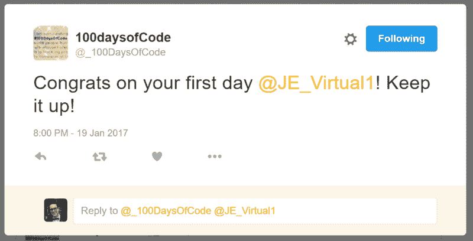

Bot user congratulate

如果它在一条包含#100DaysOfCode 标签的推文中检测到负面情绪(沮丧),它也会以鼓励的方式回复。

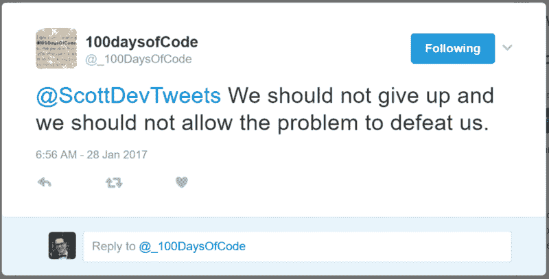

Bot sentiment detection

在求职面试中，我经常被问到的一个问题是“你从与技术打交道中获得了什么？”我总是回答“我喜欢自动完成重复的任务，这样可以节省时间，让我可以专注于其他事情。我喜欢为自己节省时间带来的成就感。”

就我的@ScottDevTweets 机器人而言，它通常是与关注我的另一个人进行对话的开场白。所以机器人可以发起对话，然后我可以从机器人停止的地方继续。

记住这一点，机器人的道德性取决于编写它的人。

如果你对你正在建造的机器人的道德有任何疑问，请查看 [botwiki](https://botwiki.org/bot-ethics) 的道德部分。

准备好开始了吗？好的。我们开始吧！

### 如何在 30 分钟内建立一个推特机器人

您将使用`twit`库来构建一个 Twitter 机器人。它会喜欢并转发你指定的任何内容。它还会给你的关注者回复一些精选的固定回复。

在开始计时之前，如果你还没有帐户，你需要设置一些帐户。

### 你需要什么

*   [推特](https://twitter.com/signup)
*   [云 9 IDE](https://c9.io/signup)
*   [Heroku](https://signup.heroku.com/)

### 步骤 1:建立一个 Twitter 应用程序

要么创建一个新的 Twitter 账户，要么使用你自己的账户[创建一个新的 Twitter 应用](https://apps.twitter.com/app/new)。

举个例子，我将配置我的旧的 [@DroidScott](https://twitter.com/droidscott) twitter 账户，这样你就可以继续关注了。

点击**创建您的 Twitter 应用程序**按钮之前，请务必将您的电话号码添加到您的 Twitter 帐户中。

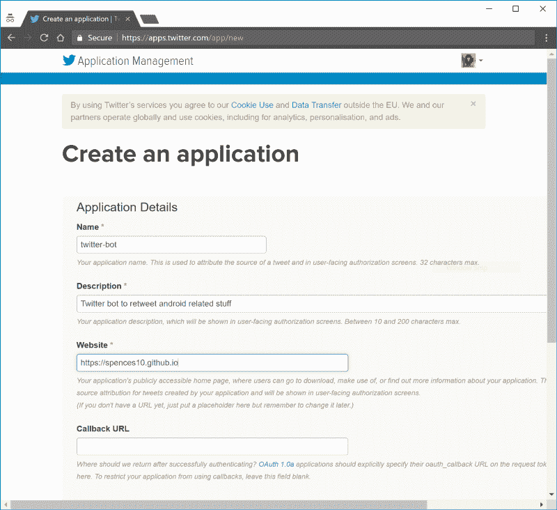

您现在应该在“应用程序管理”部分，您需要记下您的密钥。您应该已经有了“消费者密钥(API 密钥)”和“消费者秘密(API 秘密)”。

您需要滚动到页面底部，然后单击**创建我的访问令牌**以获取“访问令牌”和“访问令牌密码”,记下这四项，在设置机器人时您将需要它们。

### 步骤 2:设置您的开发环境

为此，我打算使用 [Cloud9](https://c9.io/) ，因为您可以在几分钟内启动并运行一个预制的 Node.js 环境。

请注意，如果您在某些地区选择使用 Heroku 和/或 Cloud9 IDE 来创建这些帐户(就像我在本指南中所做的那样),系统会提示您提供信用卡号码来创建这些帐户。

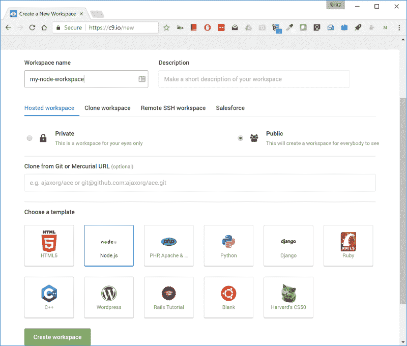

### 设置机器人

在项目树中删除示例项目文件`client`、`package.json`、`README.md`和`server.js`，你不需要它们，如果你愿意，你可以把它们留在那里。

在新的 Node.js c9 环境中，转到终端并输入:

```
git clone https://github.com/spences10/twitter-bot-bootstrap
```

#### 项目结构

环境项目树应该如下所示:

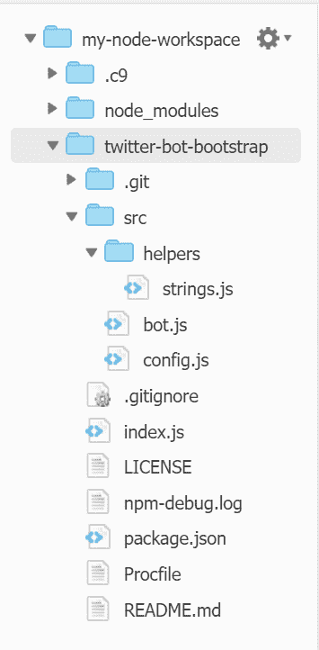

### 节点依赖性

在配置 bot 之前，我们需要安装依赖项，cd 到带有`cd tw*`的项目文件夹。这将把您从终端移动到`:~/workspace/twitter-bot-bootstrap (master) $`,输入:

```
npm install
```

这将安装`package.json`文件中列出的所有依赖项。

如果您得到任何错误，那么我建议从`package.json`文件开始一个接一个地安装依赖项，在最后使用相同的命令和包名:

下面是`package,json`文件中`dependencies`的一个例子:

```
"dependencies": {    "dotenv": "^4.0.0",    "twit": "^2.2.5",    "unique-random-array": "^1.0.0",    "unirest": "^0.5.1"  }
```

安装它们的 npm 命令如下:

```
npm install --save dotenv twit unique-random-array unirest
```

如果你得到任何`WARN`信息，比如`npm WARN package.json twitter-bot@1.0.0 No repository field`，这不会破坏机器人，所以可以忽略它。

现在，您可以配置机器人。从终端输入:

```
npm init
```

这将根据需要用您的详细信息配置`package.json`文件。如果你对默认设置满意，就一直按回车键。

现在您需要将您的 Twitter 密钥添加到`.env`文件中。只需在相应的字段中输入密钥，然后保存文件。

如果您在 c9 项目的文件结构中找不到`.env`文件，那么您需要启用`Show Hidden Files`选项。在文件视图中选择设置重心，然后勾选`Show Hidden Files`选项(如果尚未勾选的话)。

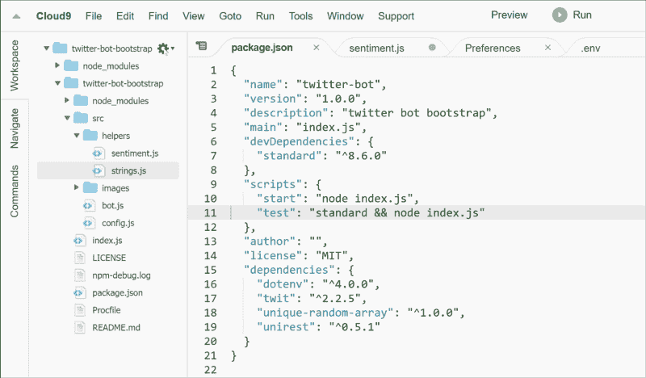

你可以在 https://market.mashape.com/vivekn/sentiment-3 的 T2 得到一个新的 API 密匙

看一下 gif，点击链接，注册或登录`mashape`，点击右边面板中的`node`并选择你的 API 密钥，它将出现在 gif 中突出显示的`<requir` ed >处。

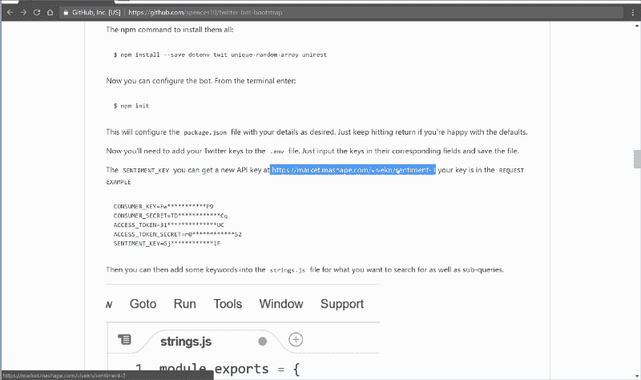

将您的 API 密钥和您的 Twitter API 密钥一起添加到`.env`文件中？

在这里，您应该添加您的 Twitter 帐户名称，以及您希望机器人运行 retweet 和收藏夹功能的频率(以分钟为单位)。

> *注意，`.env`项都没有引号`''`。*

```
CONSUMER_KEY=Fw***********P9CONSUMER_SECRET=TD************CqACCESS_TOKEN=31**************UCACCESS_TOKEN_SECRET=r0************S2SENTIMENT_KEY=Gj************lFTWITTER_USERNAME=DroidScottTWITTER_RETWEET_RATE=5TWITTER_FAVORITE_RATE=5
```

然后，您可以在`strings.js`文件中添加一些您想要搜索的关键字以及子查询。

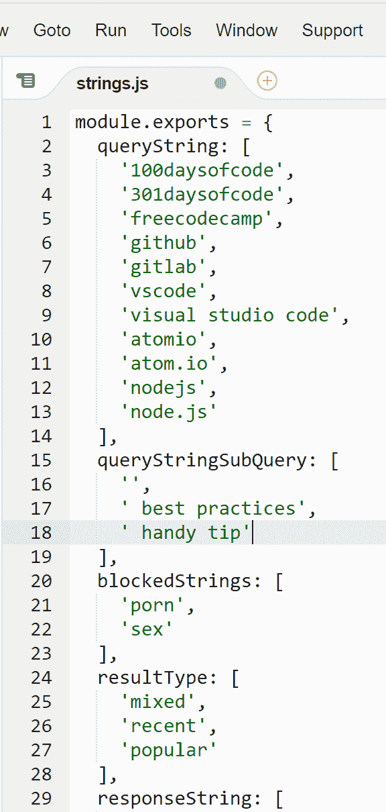

*add query and sub-query strings* *you can also update blocked strings to block more stuff*

当添加子查询字符串时，确保在字符串的开头留出一个空格，这样`' handy tip'`就可以作为`node.js handy tip`而不是`node.jshandy tip`连接到`'node.js'`上。

应该就是这样了，到终端输入`npm start`应该会得到一些输出:

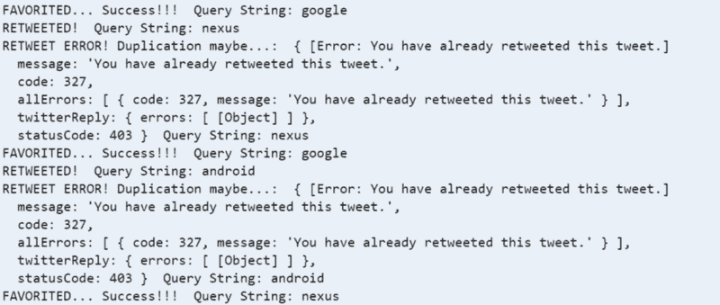

查看 Twitter 账户:


### 步骤 3:设置 Heroku

酷，现在我们有了一个可以在我们的开发环境中测试的机器人，但是我们不能把它留在那里，我们需要把它部署到 Heroku。

如果你还没有建立一个 [Heroku 账户](https://signup.heroku.com/)，然后从仪表盘右上角的下拉框中选择**创建一个新的应用**，在下一个屏幕中给你想要的应用命名，然后点击**创建应用**。

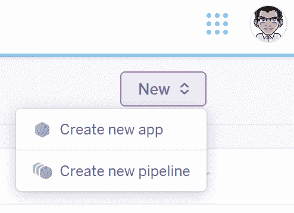

您将看到您的应用控制面板和部署方法说明。

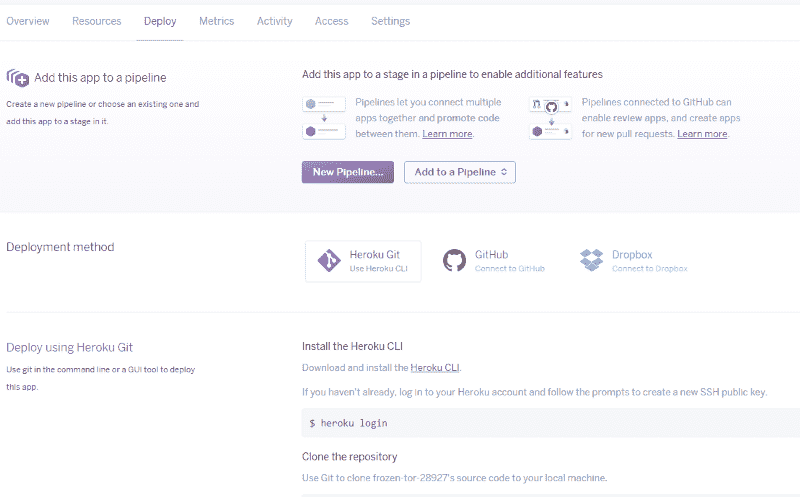

你的应用程序名称应该显示在你的仪表板顶部，当你使用 Heroku 命令行界面登录时，你将需要它，我们将使用它来部署你的应用程序。

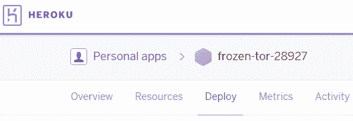

### Heroku CLI

我们将通过 Heroku 命令行界面( *CLI* )进行初始部署。

在您的 c9 环境终端上，登录 Heroku[它应该是默认安装的]

```
heroku login
```

输入您的凭据:

```
cd twitter-bot-bootstrap git init heroku git:remote -a your-heroku-app-name
```

部署应用程序:

```
git add . git commit -am 'make it better' git push heroku master
```

您应该在终端中获得构建输出:

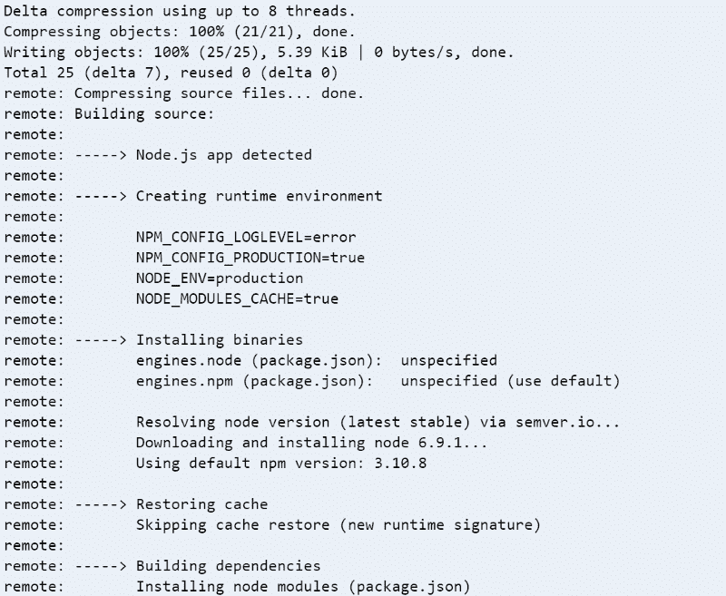

然后使用以下命令检查输出:

```
heroku logs -t
```

一切都好吗？酷！？

#### 配置 Heroku 变量

现在我们在 Heroku 上有了我们的 bot，我们需要添加环境变量来存储我们的 Twitter 密钥。这是因为我们存储密钥的`.env`文件列在了`.gitignore`文件中，这告诉 git 不要将该文件上传到 Heroku。如果将来我们想在 GitHub 中添加我们的代码，我们也不必担心`.env`文件会公开我们的密钥，因为这个文件会被自动忽略。

你所需要做的就是进入 Heroku 应用程序的控制台，选择“设置”部分，从`.env`文件中添加你的 Twitter 密钥。点击“显示配置变量”按钮，添加变量及其相应的值:

```
CONSUMER_KEYCONSUMER_SECRETACCESS_TOKENACCESS_TOKEN_SECRETSENTIMENT_KEY
```

一旦你建立了 Heroku vars，看看这个项目的`config.js`文件。您将删除此行:

```
require('dotenv').config();
```

你现在可以再次部署到 Heroku 了。您的控制台命令应该如下所示:

```
$ git add .$ git commit -m 'add environment variables'$ git push heroku master
```

然后，您可以使用以下命令再次检查 Heroku 日志:

```
$ heroku logs -t
```

你现在应该有一个机器人，你可以让它永远做它的事情，或者直到你决定要改变搜索标准？

#### 通过 GitHub 部署 Heroku

你也可以通过连接到 GitHub 来部署你的应用程序，并在每次你的主分支在 GitHub 上更新时自动部署到 Heroku，这足够直接了。

转到 Heroku 上的“部署”仪表板，选择 GitHub 作为部署方法，如果您已经将 GitHub 帐户连接到 Heroku 帐户，那么您可以搜索存储库，因此如果您分叉此 repo，那么您只需输入`twitter-bot-bootstrap`和**搜索**，然后您可以单击**连接**按钮，然后您可以从 GitHub 自动部署。

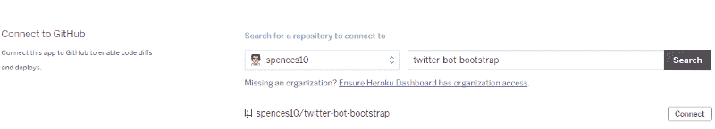

### Heroku 故障排除

你说它坠毁了是什么意思！？

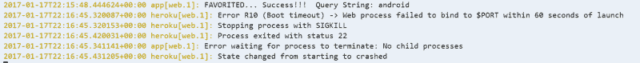

好的，我发现有时`worker`被设置为`web`并且它崩溃了，试着用下面的代码再次设置`worker`:

```
heroku ps:scale worker=0 heroku ps:scale worker=1
```

如果仍然崩溃，那么尝试在 Heroku 仪表板上设置`Resources`，我发现如果你在`web`、`heroku`和`worker`之间切换，它通常会稳定下来。基本上你需要设置为`worker` Dyno 这是导致`Error R10 (Boot timeout)`崩溃的原因，因为它试图使用其他资源之一，而它应该使用`worker` Dyno。

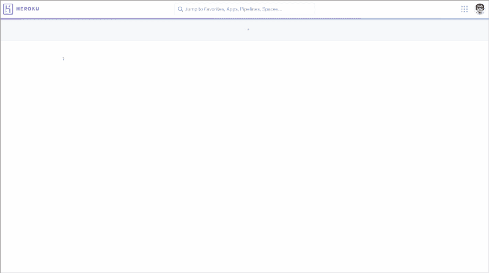

我使用的其他有用的 Heroku 命令:

```
heroku restart
```

默认情况下，如果您正在开发分支，即`dev`分支上工作，您只能推送您的主分支。如果您想在 Heroku 上测试，那么您可以使用:

```
git push heroku dev:master
```

### 方便的提示

如果你想把这个添加到你自己的 GitHub repo 里，又不想分享你的 API 密匙？然后你应该关闭跟踪。`env` 文件。从终端输入以下 git 命令:

```
$ git update-index --assume-unchanged .env
```

我在这个[要点](https://gist.github.com/spences10/5c492e197e95158809a83650ff97fc3a)中添加了我最常用的 git 命令

### 包扎

你的推特机器人现在应该上线了。您可以修改它并进一步配置它。

这是我的[库](https://github.com/spences10/twitter-bot-bootstrap),如果你想分支它并使用拉请求贡献回来。任何贡献，无论大小——主要特性、缺陷修复、集成测试——都是受欢迎的，但是会被彻底的回顾和讨论。

### 承认

这个想法的灵感应该归功于[@ amani self](https://twitter.com/amanhimself)和他关于创建你自己的 twitter 机器人的帖子。

[用节点创建一个简单的推特机器人](https://hackernoon.com/create-a-simple-twitter-bot-with-node-js-5b14eb006c08#.flysreo60)

如何制作带节点的推特机器人

twitter-mctwitbot

令人敬畏的推特机器人

详细介绍有用的 Twitter 机器人的其他帖子。

[www.brit.co/twitter-bots-to-follow](http://www.brit.co/twitter-bots-to-follow/)

[www.hongkiat.com/using-twitter-bots](http://www.hongkiat.com/blog/using-twitter-bots/)

走到这一步？哇，感谢阅读！如果你喜欢这个故事，请不要忘记点击侧面的❤按钮推荐它，并通过社交媒体与你的朋友分享它。

如果你想了解我更多，请访问我的[博客](http://spences10.github.io)，我的 [Github](https://github.com/spences10) ，或者发微博给我 [@ScottDevTweets](https://twitter.com/ScottDevTweets) 。

> 你可以在我的博客上阅读其他类似的文章。