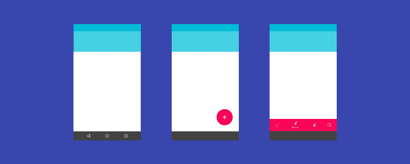
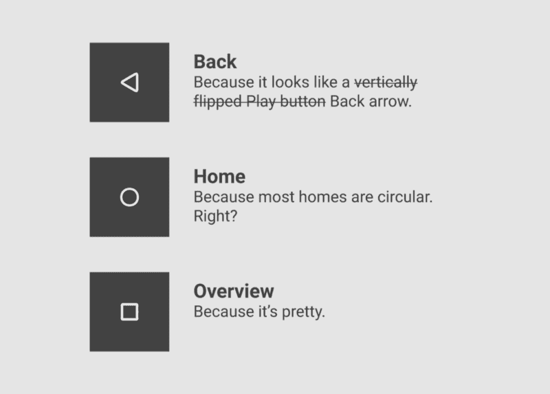
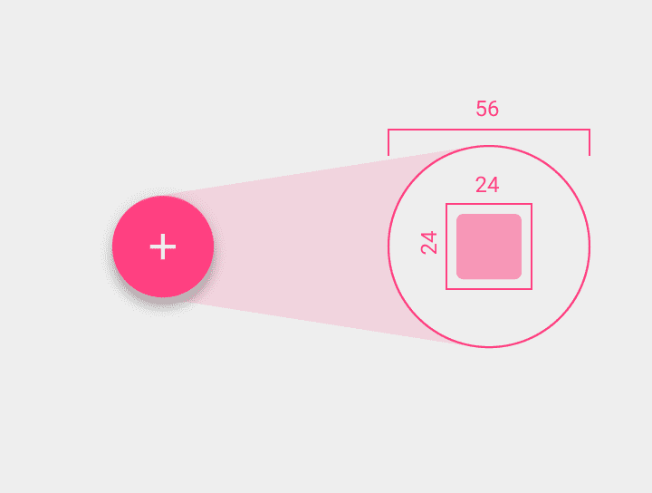
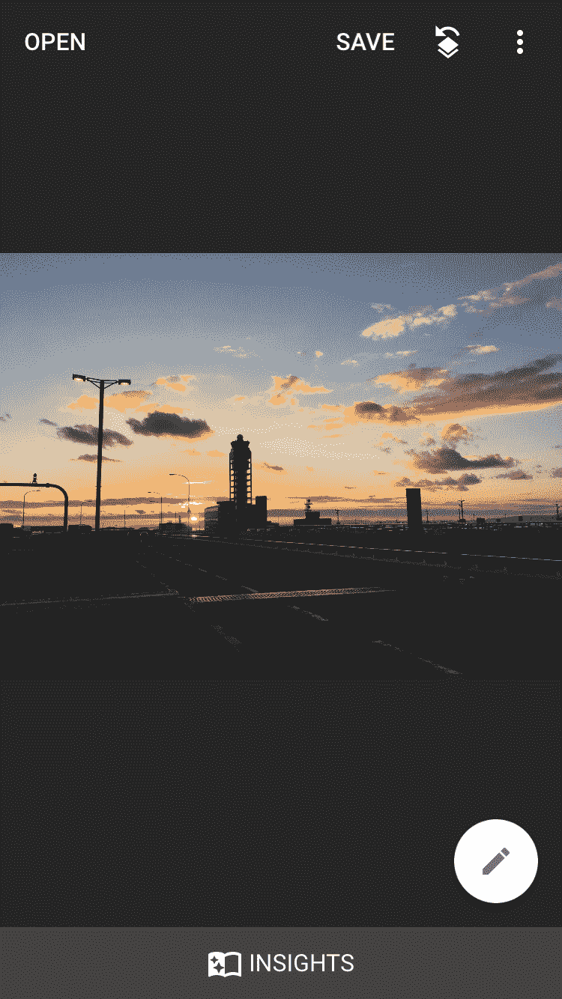
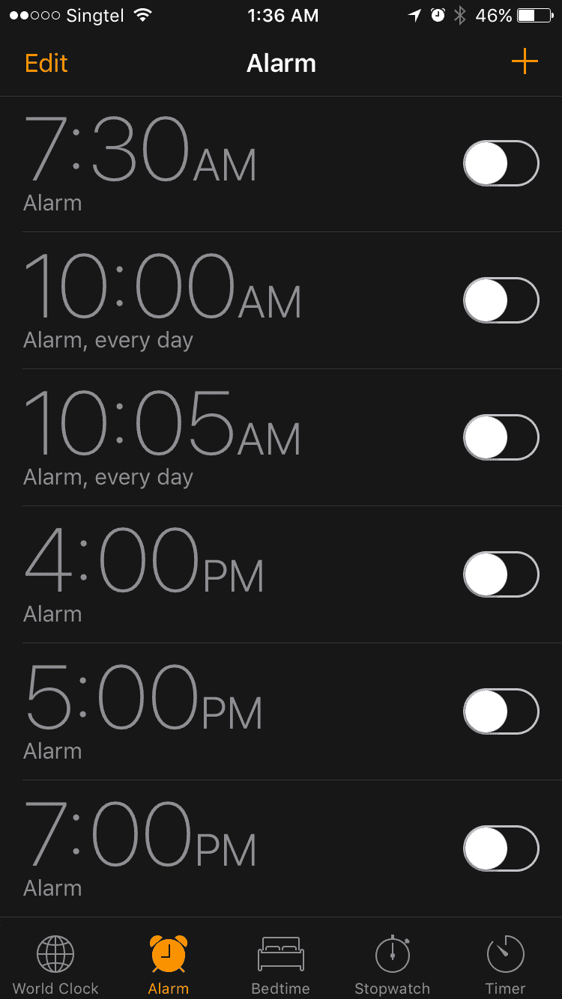
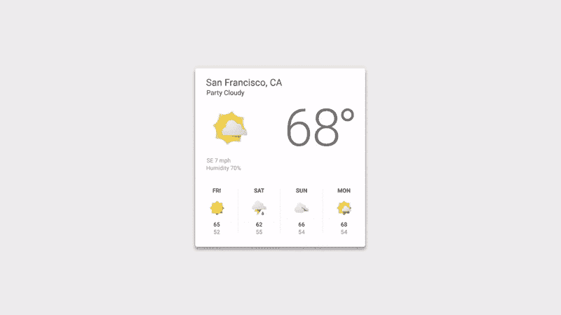
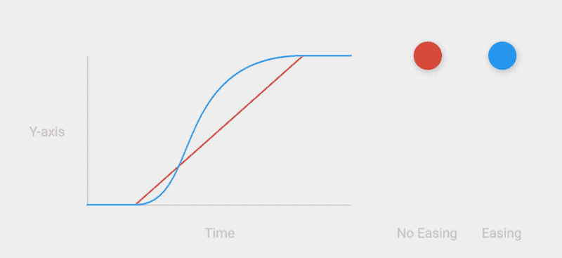

# 材料设计和神秘的肉导航问题

> 原文：<https://www.freecodecamp.org/news/material-design-and-the-mystery-meat-navigation-problem-65425fb5b52e/>

by Teo Yu Siang

# 材料设计和神秘的肉导航问题

2016 年 3 月，谷歌[更新了](http://www.androidauthority.com/bottom-navigation-material-design-guidelines-680207/)的材质设计，在其 UI 库中添加了底部导航栏。这个新栏位于应用程序的底部，包含 3 到 5 个图标，允许用户在应用程序的顶级视图之间导航。

听起来熟悉吗？这是因为底部导航栏多年来一直是 [iOS 用户界面库](https://developer.apple.com/ios/human-interface-guidelines/ui-bars/tab-bars/)的一部分(它们在 iOS 中被称为标签栏)。

Left: Material Design’s bottom navigation bar | Right: iOS’s tab bar

底部导航条是汉堡菜单的更好选择，所以他们加入材料设计应该是个好消息。但是谷歌版本的底部导航栏有一个严重的问题:**神秘肉导航**。

无论你是 Android 用户、设计师还是开发人员，这都会困扰你。

### 神秘肉导航是什么，为什么这么差？

神秘肉导航是著名网站[网页烂](http://www.webpagesthatsuck.com/)的文森特·弗兰德斯在 1998 年创造的一个术语。它指的是没有向你解释它们是做什么的按钮或链接。相反，你必须点击它们才能找到答案。

(术语“神秘肉”来源于美国公立学校食堂供应的肉，这些肉经过如此加工，以至于它们来自哪种动物已经无法辨别。)

An example of mystery meat navigation | [Source](http://gigi.nullneuron.net/gigilabs/on-mystery-meat-navigation-and-unusability/)

神秘肉导航是设计的标志，它将形式置于功能之上。这是糟糕的 UX 设计，因为它以牺牲用户体验为代价强调美学。这增加了导航任务的认知负荷，因为用户必须猜测按钮是干什么的。如果你的用户需要猜测，那你就错了。

你不会想吃神秘的肉——同样，用户也不会想点击神秘的按钮。

### 打击一:安卓棒棒糖的导航栏

Material Design 的第一个重大神秘肉导航问题发生在 2014 年的安卓棒棒糖。

Android Lollipop 在发布材料设计的同一场会议上推出，并展示了重新设计的用户界面，以匹配谷歌的新设计语言。

Navigation bar in earlier versions of Android

重新设计的 UI 元素之一是导航栏，这是 Android 操作系统底部的永久栏，为没有后退、主页和菜单硬件按钮的手机提供导航控制。

在 Android Lollipop 中，导航栏被重新设计成这样:

Navigation bar, Android Lollipop and up

看到问题了吗？

虽然以前的设计不太美观，但它或多或少很简单。不需要文本标签就可以理解 Back 和 Home 图标。第三个图标有点神秘，但总的来说，旧导航栏的 UX 还不算太差。

另一方面，新酒吧非常漂亮。等边三角形、圆形和正方形是几何完美的象征。但是这也是*对用户极其不友好。它是抽象的——导航控件也不应该是抽象的。是全面成熟的神秘肉导航。*

三角形图标可能类似于“返回”箭头，但是圆形和正方形对于导航控件来说意味着什么呢？

Making sense of the navigation bar icons

### 罢工 2:浮动动作按钮

浮动操作按钮是出现在应用程序中其他 UI 元素上方的特殊按钮。理想情况下，它们用来宣传应用程序的主要功能。

Specs for the floating action button | [Source](https://material.io/guidelines/components/buttons-floating-action-button.html#buttons-floating-action-button-floating-action-button)

浮动动作按钮也遭受神秘肉导航问题。根据设计，浮动操作按钮是一个包含图标的圆形。这是一个纯图标按钮，没有文本标签的空间。

事实是 [**图标难以理解**](http://uxmyths.com/post/715009009/myth-icons-enhance-usability) 图标，因为它们太容易解释了。我们的文化和过去的经历告诉我们如何解释图标。不幸的是，设计师(尤其是，似乎是材料设计师)很难面对这个事实。

需要证明只有图标的按钮是个坏主意吗？让我们玩一个猜谜游戏。

下面是一个列表，根据 Material Design 的[指南](https://material.io/guidelines/components/buttons-floating-action-button.html)，浮动动作按钮的图标是可以接受的。你能猜出每个按钮的作用吗？

Mystery button 1

好吧，这是一个简单的热身。它代表“方向”。

Mystery button 2

这个呢？如果你是 iOS 或 Mac 用户，你可能会说“Safari”它实际上代表“探索”

Mystery button 3

现在事情变得有趣(或令人沮丧)了！这可能是“在联系人中打开”吗？“救命，有人跟踪我”？也许这是你“给朋友打电话”生命线的一个按钮。

Mystery button 4

稍等，*这个*是“打开通讯录”的按钮对吗？或者这是“关于一个朋友的流言蜚语”,因为这个人是在一个演讲泡泡里面？

准备好最后一轮了吗？这是最糟糕的(也是最常用的)图标:

Mystery button 5

您可能认为“+”按钮很容易理解——它显然是一个用于“添加”操作的按钮。但是加*什么*？

*补充什么:*问题就在这里。如果用户需要问这个问题，你的按钮就是正式的神秘肉。可悲的是，材料设计应用程序的开发人员和设计人员似乎爱上了“+”浮动操作按钮。

正因为“+”按钮*看起来*如此容易理解，它最终成为浮动操作按钮最常被滥用的图标。想想当你点击“+”浮动按钮时，谷歌自己的收件箱应用程序如何显示*额外的*按钮，这不是用户所期望的:

The “+” button opens up a menu of… more buttons?

更糟糕的是，同样的图标在不同的应用程序中有着不同的含义。谷歌在收件箱和 Gmail 中使用铅笔图标来表示“撰写”，但在其照片应用 Snapseed 中使用它来表示“编辑”。

Same icon, different meanings: “Compose” in the Gmail and Inbox apps, “Edit” in the Snapseed app

浮动操作按钮旨在为用户提供一种访问主要操作的好方法。但事实并非如此，因为只有图标的按钮往往是神秘的肉。

关于浮动动作按钮的更多信息:

[**材质设计:**](https://medium.com/tech-in-asia/material-design-why-the-floating-action-button-is-bad-ux-design-acd5b32c5ef)
[**为什么悬浮动作按钮不好 UX 设计**](https://medium.com/tech-in-asia/material-design-why-the-floating-action-button-is-bad-ux-design-acd5b32c5ef)
[*材质设计是 Google 一年前推出的设计语言，代表了该公司在…*medium.com](https://medium.com/tech-in-asia/material-design-why-the-floating-action-button-is-bad-ux-design-acd5b32c5ef)

### 罢工 3:新的底部导航栏

这就把我们带到了 2016 年 3 月推出的底部导航栏。

对于底部有三个视图的导航栏，Google 的指导方针规定图标和文本标签都必须显示。到目前为止，一切顺利:这里没有神秘的肉。

Bottom navigation bar with 3 views: so far, so good

但是对于有 4 或 5 个视图的底部导航栏，Google 规定不活动的视图只显示为*图标*。

Bottom navigation bar with 4 views: mystery meat

还记得猜测浮动操作按钮图标的含义有多难吗？现在试着猜一排用来导航应用程序的图标。

这只是糟糕的 UX 设计。事实上，Nielsen Norman Group [认为](https://www.nngroup.com/articles/icon-usability/)图标*需要*一个文本标签，尤其是导航图标(重点是他们的):

> “为了帮助克服几乎所有图标都面临的歧义，图标旁边必须有一个**文本标签，以阐明其在特定上下文中的含义。…对于导航图标来说，标签尤为重要。”**

Material Design 的最新 UI 组件纵容神秘肉导航不仅令人沮丧，而且很怪异。为什么文本标签在有 3 个视图时显示，而在有 4-5 个视图时隐藏？

一个显而易见的答案是空间限制。

除了 iOS 中的标签栏设法包含 5 个图标，并且仍然显示每个图标的图标和文本标签。所以空间限制不是一个有效的理由。

iOS tab bar in the App Store, Clock and Music apps: 5 icons, all with text labels

谷歌要么认为图标可以充分表现导航行为(这很糟糕)，要么认为美观整洁比可用性更重要(这更糟糕)。不管怎样，他们的决定恶化了数百万安卓用户的 UX。

### 材料设计和形式胜于功能

当 Material Design 在 2014 年推出时，它的声势太大了。它很大胆，并且顺应了扁平化的设计趋势。鲜艳的颜色和动画的搭配让它看起来很漂亮。

“Make it pretty!” — Material Design designer | [Source](https://www.youtube.com/watch?v=Q8TXgCzxEnw)

但是也许它有点太漂亮了。也许在进行材料设计时，设计师们有点忘乎所以了。

一次又一次，谷歌对重要按钮和工具条的指导方针似乎是形式优先于功能。在 Android 的导航条中，几何美观被选择在可识别性之上。美学上的简单性在浮动动作按钮中得到支持，在这个过程中把它们变成了谜语。最后，视觉整洁被认为比底部导航栏中有意义的标签更重要。

这并不是说神秘肉导航是谷歌独有的问题。当然，你也可以在 iOS 应用中找到神秘的肉。但是它们通常不会出现在关键的导航控件和升级按钮中。它们在设计指南中也没有被明确地列为神秘的肉。

Speed graph showing the correct (blue) acceleration for animations

如果谷歌的设计者可以花时间和精力来创建动画的速度图，也许他们可以花一点时间来确保他们的设计不是神秘的肉。

毕竟，一个动画神秘按钮仍然不如一个静态但标签清晰的按钮令人愉快。