# ✅:每次你创建一个待办事项应用程序，一只小狗？死亡？

> 原文：<https://www.freecodecamp.org/news/every-time-you-build-a-to-do-list-app-a-puppy-dies-505b54637a5d/>

作者:赫利希·米塔尔

# *✅每次你建一个待办事项 app，一只小狗*？*消逝？*

[photo credit](http://sfcitizen.com/blog/wp-content/uploads/2010/03/321232241_f71a4313f9_o.jpg)

你知道当你试图学习新的东西，但对构建默认的示例应用程序感到厌倦的时候？

*这就是第一号动机杀手。*

我不想让我的学生失去动力而放弃。

*所以我列出了 28 个有趣的应用想法，你可以在[学习使用 Ruby on Rails](https://learnetto.com/users/hrishio/courses/the-free-react-on-rails-5-course?utm_source=fcc_medium&utm_campaign=blog_post_ideas_for_react_rails_apps&utm_medium=blog_post_ideas_for_react_rails_apps) 的过程中建立这些想法。*

这个列表假设你已经熟悉 Ruby on Rails(或者其他一些 web 开发框架)。所以后端位对于新手来说可能有点复杂，但是前端 React 位应该相对简单。

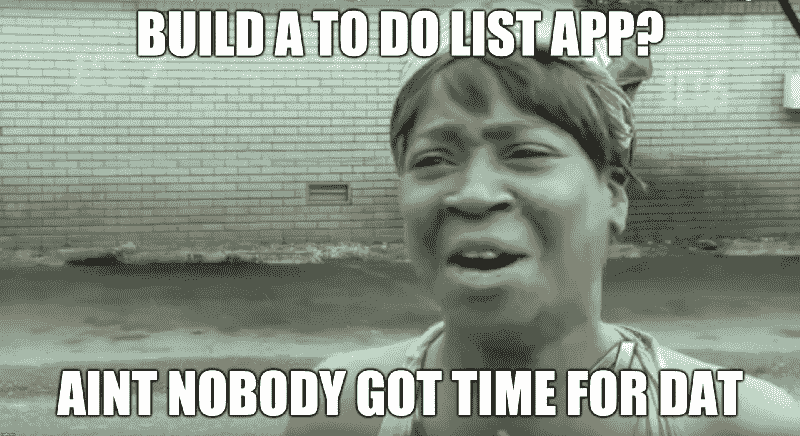

### *项目#1:一个用于预约的日历应用程序(像谷歌日历)*

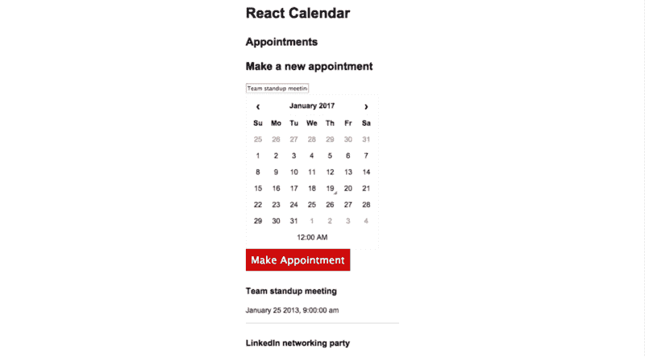

[A simple calendar appointments app](https://github.com/learnetto/calreact)

这可以从一个简单的应用程序开始，你可以通过添加更多功能和 UX 改进来逐步改进。

它将帮助你练习使用嵌套组件(比如日组件，嵌套在周组件中，或者嵌套在月组件中)。

*我在我的[免费 Complete React on Rails 课程](https://learnetto.com/users/hrishio/courses/the-complete-react-on-rails-5-course?utm_source=fcc_medium&utm_campaign=blog_post_ideas_for_react_rails_apps&utm_medium=blog_post_ideas_for_react_rails_apps)中使用这个应用程序作为例子。所以如果你想尝试一下，就去看看吧。*

*你可以在这里看到完整的步骤代码:*

*[**learnetto/calreact**](https://github.com/learnetto/calreact)*
*[*calreact-React 和 Rails 5 日历约会 app*github.com](https://github.com/learnetto/calreact)*

### *项目#2:一个用于寻找有趣代码库的 Github explorer 应用*

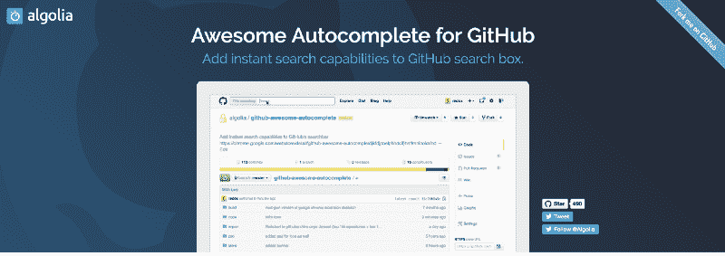

[https://github.algolia.com](https://github.algolia.com)

您可以完全在客户端构建搜索部分，但是您可以使用 Rails 将搜索存储在数据库中，并显示最受欢迎的搜索，这样会更有趣。

您将练习使用外部 API 和处理 JSON 响应。您可以尝试在服务器上预渲染组件。

*看看这个由 [Algolia](https://www.freecodecamp.org/news/every-time-you-build-a-to-do-list-app-a-puppy-dies-505b54637a5d/undefined) 开发的浏览器插件，让你的想法源源不断:*

*[**algolia/github-awesome-autocomplete**](https://github.com/algolia/github-awesome-autocomplete)*
*[*GitHub-awesome-autocomplete-:octo cat:在 GitHub 的搜索栏中增加即时搜索功能*github.com](https://github.com/algolia/github-awesome-autocomplete)*

### *项目#3:一款笔记应用*

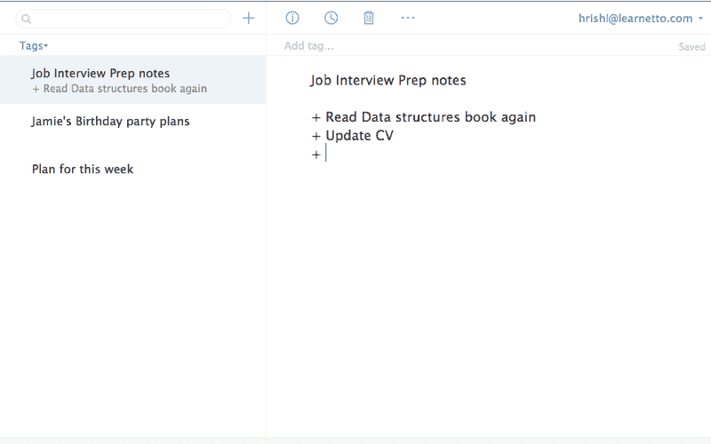

Simplenote

例如，通过启用自动保存，您可以看到 React 处理大量状态更改的能力。查看 [Simplenote](https://simplenote.com/) ，这是一个简单而强大的 notes 应用程序的好例子。

*如果这对于第一个应用来说太难，你可以首先尝试使用一个[外部文本编辑器组件](https://facebook.github.io/draft-js/)来了解它是如何工作的，然后实现你自己的:*

*[**Facebook/draft-js**](https://github.com/facebook/draft-js)*
*[*draft-js-一个构建文本编辑器的 React 框架。*github.com](https://github.com/facebook/draft-js)*

### *项目#4:在你的网站上添加一个聊天小工具*

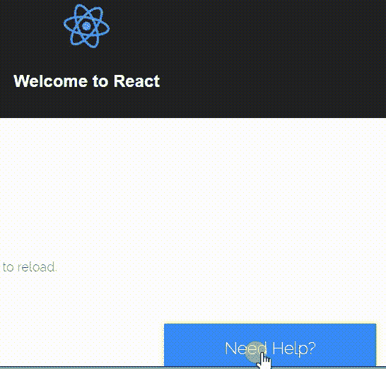

*使用 [react-slack-chat](https://www.npmjs.com/package/react-slack-chat) 组件向您现有的 Rails 站点添加一个聊天小部件。该组件完成了大部分繁重的工作，但是您可以通过在 Rails 中制作自己的 bot 和在 React 中定制小部件来获得乐趣。*

*组件的代码在 Github 上:*

*[**5 punk/react-Slack-Chat**](https://github.com/5punk/react-slack-chat)*
*[*react-Slack-Chat-一个漂亮的 Gooey / Material 设计的 Slack Chat 网页集成 Widget。*github.com](https://github.com/5punk/react-slack-chat)*

### *5 号项目:热图生成器*

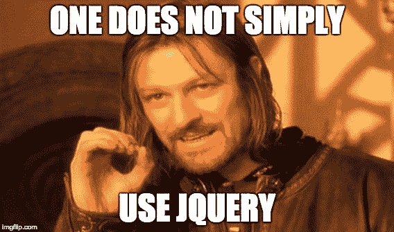

Rails 可以处理图像库和现有迷因的存储和服务。使用 React 渲染和处理用于制作迷因的表单。

你可以使用 ImageMagick 在服务器上生成迷因，或者使用 canvas 在浏览器中生成迷因。见[本回购](https://github.com/tranhungt/meme-maker)由[洪川](https://www.freecodecamp.org/news/every-time-you-build-a-to-do-list-app-a-puppy-dies-505b54637a5d/undefined) :

*[**tranhungt/meme-maker**](https://github.com/tranhungt/meme-maker)*
*[*meme-maker——制作你最喜欢的 meme，然后发给你的朋友！*github.com](https://github.com/tranhungt/meme-maker)*

### *项目#6:实时免费图片搜索应用*

Help Medium bloggers find their inner [hispter](https://unsplash.com/collections/397770/coffee-house?photo=d0QWndxSR38)

*使用[Unsplash](https://www.freecodecamp.org/news/every-time-you-build-a-to-do-list-app-a-puppy-dies-505b54637a5d/undefined)API 获得高质量的免费照片:*

*[**Unsplash/Unsplash _ Rb**](https://github.com/unsplash/unsplash_rb)*
*[*Unsplash _ Rb-Unsplash API 的 Ruby 包装器。*github.com](https://github.com/unsplash/unsplash_rb)*

使用 [React 动画插件](https://facebook.github.io/react/docs/animation.html)添加酷动画。

允许用户为他们喜欢的图片添加书签。你甚至可以尝试让后端只是一个 Rails API 应用程序，并为前端制作一个单独的 React 应用程序。

### 项目#7:读书俱乐部

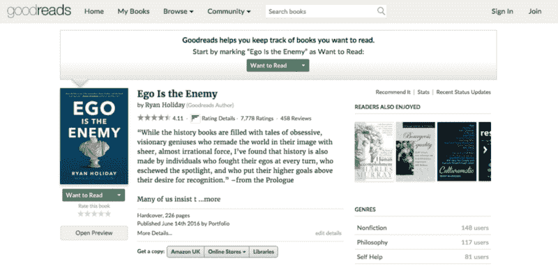

Goodreads is a great site to copy for this project

一个简单的应用程序，你和你的朋友可以分享你最喜欢的书并进行讨论(比如 [Goodreads](https://www.goodreads.com) )。后端可以是一个简单的 Rails CRUD 应用程序，但是你可以把前端做成一个单页 React 应用程序，并使用 React router 和 Redux。

### *项目#8:多个账户的 Twitter 网络客户端(如 Tweetdeck)*

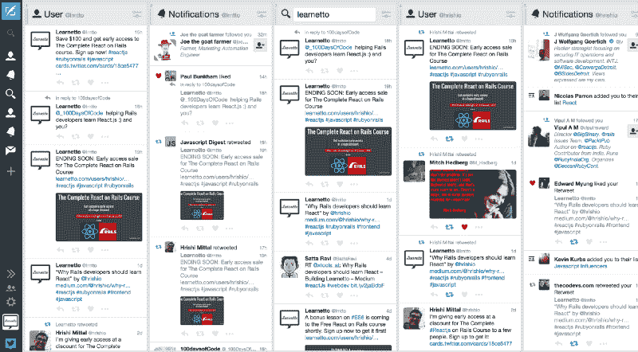

I use [Tweetdeck](https://tweetdeck.twitter.com) for running my personal and business Twitter accounts from one place

一个 Twitter web 客户端应用程序，你可以连接多个 Twitter 账户(使用 OAuth ),然后在用户界面上添加多个栏目——比如 feed、通知、搜索、直接消息。

*使用 Twitter 宝石[埃里克·迈克尔斯-奥伯](https://www.freecodecamp.org/news/every-time-you-build-a-to-do-list-app-a-puppy-dies-505b54637a5d/undefined) :*

*[**SF Erik/Twitter**](https://github.com/sferik/twitter)*
*[*Twitter-Twitter API 的一个 Ruby 接口。*github.com](https://github.com/sferik/twitter)*

这将给你带来无与伦比的快乐，来应对世界上对开发者最友好的公司荒谬的 API 速率限制。

你可以添加 Tweetdeck 风格的自动获取新的 tweets 和使用轮询或 Action Cable 的通知。

许多嵌套组件，你可以在 React 中尝试一些简单的动画。

最好从培养阅读能力开始。一旦你有了这些，你就可以添加发布、点赞和转发的功能。

### *项目#9: OpenStreetMap 定制 UI*

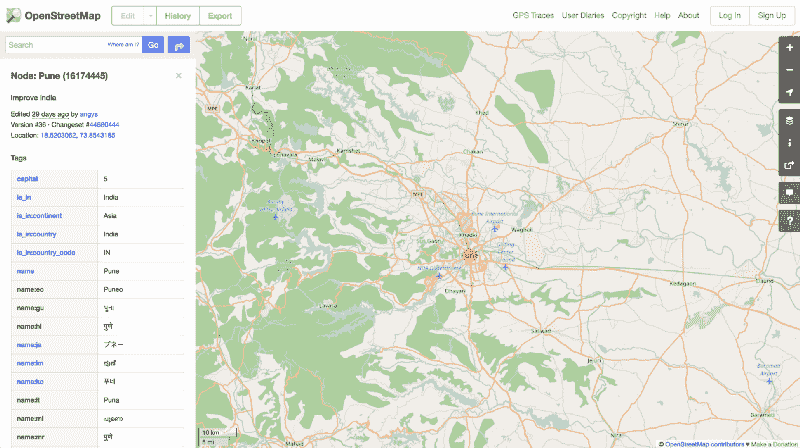

My hometown Pune (India) on [OpenStreetMap](http://www.openstreetmap.org/node/16174445#map=10/18.5564/73.9243) :)

*你知道 [OpenStreetMap 网站](http://www.openstreetmap.org)是一款 Rails 应用吗？*

*你可以[在这里](https://github.com/openstreetmap/openstreetmap-website/)，[在你自己的机器上设置](https://github.com/openstreetmap/openstreetmap-website/blob/master/INSTALL.md)，然后在前端添加 React！*

*[**openstreetmap/openstreetmap-网站**](https://github.com/openstreetmap/openstreetmap-website/)*
*[*openstreetmap-网站-为 http://www.openstreetmap.org 供电的 Rails 应用镜像(托管于 git://git…*github.com](https://github.com/openstreetmap/openstreetmap-website/)*

### *项目#10:团队午餐轮盘*

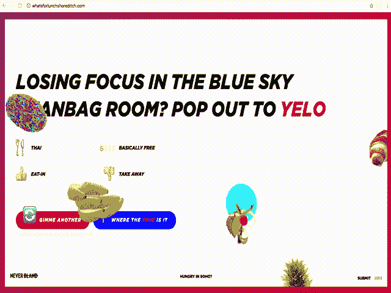

Check out [http://whatsforlunchshoreditch.com](http://whatsforlunchshoreditch.com/) built by [NEVERBLAND](https://www.freecodecamp.org/news/every-time-you-build-a-to-do-list-app-a-puppy-dies-505b54637a5d/undefined)

一个帮助你决定和你的团队去哪里吃午餐的网站。Rails 后端只需要一个简单的 CRUD 应用程序，让团队成员输入地点建议。你可以使用 Foursquare API 进行搜索和自动完成。

并将 React 用于一些可笑的动画！

如果你不想吃午饭，喝点咖啡或鸡尾酒，或者做点其他更刺激的事情。

### 项目#11:超级拖延者

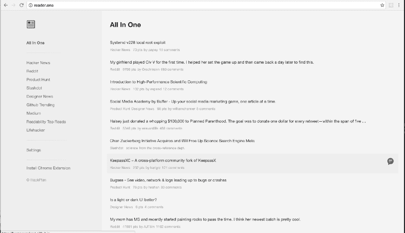

[http://reader.one/](http://reader.one/)

*一个你可以避开工作的网站——在一个地方阅读 Reddit、黑客新闻、[产品搜索](https://www.freecodecamp.org/news/every-time-you-build-a-to-do-list-app-a-puppy-dies-505b54637a5d/undefined)、Medium、Slashdot 等等。*

使用 Rails 后端保存用户帐户和偏好，并与不同的 API 对话。您也可以从客户端直接从 API 获取数据。

> **想和我一起建这些 app？来，看看我的[免费完整的 React on Rails 课程](https://learnetto.com/users/hrishio/courses/the-complete-react-on-rails-5-course?utm_source=fcc_medium&utm_campaign=blog_post_ideas_for_react_rails_apps&utm_medium=blog_post_ideas_for_react_rails_apps)，在这里我将教你如何在[使用 React with Rails](https://learnetto.com/users/hrishio/courses/the-complete-react-on-rails-5-course?utm_source=fcc_medium&utm_campaign=blog_post_ideas_for_react_rails_apps&utm_medium=blog_post_ideas_for_react_rails_apps) 成为一名职业选手，同时创建一些有趣的东西。**

### *项目#12:带行动电缆的聊天室*

Remember [AIM](https://www.flickr.com/photos/katemo/2372403984/in/photostream/)?

*除了学习 React，这将是一个很棒的小项目，可以尝试一下 [Action Cable](http://guides.rubyonrails.org/action_cable_overview.html) ，这是一个很酷的 Rails 5 新功能，为 Rails 添加了 WebSocket 支持。见[这些例子](https://github.com/rails/actioncable-examples)上手:*

*[**rails/Action Cable-Examples**](https://github.com/rails/actioncable-examples)*
*[*Action Cable-Examples-Action Cable Examples*](https://github.com/rails/actioncable-examples)*

### *项目#13:超小型(一个[中型](https://www.freecodecamp.org/news/every-time-you-build-a-to-do-list-app-a-puppy-dies-505b54637a5d/undefined)克隆)*

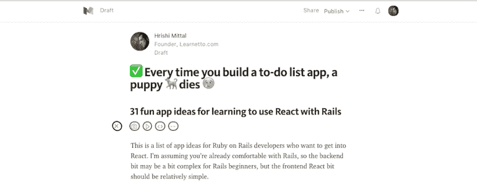

Because extra small is extra beautiful!

*查看[这一系列由](http://fancypixel.github.io/blog/2015/01/28/react-plus-flux-backed-by-rails-api/)[安德里亚·马志尼](https://www.freecodecamp.org/news/every-time-you-build-a-to-do-list-app-a-puppy-dies-505b54637a5d/undefined)撰写的博客文章，其中他详细描述了他如何用 Rails API 应用 React 和 Flux 构建一个中型克隆。*

*[**fancy pixel/Small-rails**](https://github.com/FancyPixel/small-rails)*
*[*Small-rails-Small，一个微小的克隆体的中等。rails API*github.com](https://github.com/FancyPixel/small-rails)[**fancy pixel/Small-frontend**](https://github.com/FancyPixel/small-frontend)*
*[*Small-frontend-Small，一个微小的中型克隆体。github.com*](https://github.com/FancyPixel/small-frontend)反应+通量前端*

你可以不使用 Flux 来构建它，但如果你准备好迎接挑战，这或许值得一试。

### *项目#14:面部标记者*

D to da A to da V to da I to da D to da C

一个你可以上传照片和给人贴标签的应用程序(就像在脸书上一样)。使用 [OpenCV Ruby gem](https://github.com/ruby-opencv/ruby-opencv) 进行自动人脸检测:

*[**ruby-opencv/Ruby-OpenCV**](https://github.com/ruby-opencv/ruby-opencv)*
*[*Ruby-OpenCV 版本化的分支为 Ruby 的 OpenCV 宝石*github.com](https://github.com/ruby-opencv/ruby-opencv)*

### *项目#15:类固醇上的主动管理*

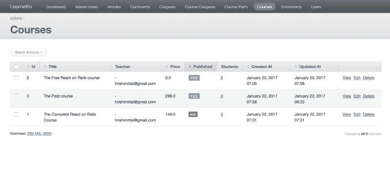

[ActiveAdmin](http://activeadmin.info/) default UI

*你可能使用过 [ActiveAdmin](http://activeadmin.info/) 来管理你的应用记录。但是用户界面并不令人振奋。您可以通过一次获取一个视图，并将其转换为一个风格优美的 React 组件来改变这种情况。*

*在这里查看 ActiveAdmin 代码:*

*[**active admin/active admin**](https://github.com/activeadmin/activeadmin)*
*[*active admin——Ruby on Rails 应用的管理框架。*github.com](https://github.com/activeadmin/activeadmin)*

### *项目#16:电子商务商店*

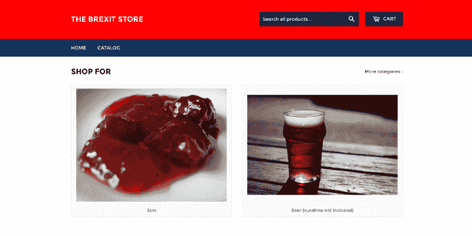

Sunlit uplands as a service

果酱、啤酒、英国国旗、咖喱，全部由 React on Rails 供应。如果你不想在 Rails 中构建商店特性，只需使用 [Spree](https://spreecommerce.com/) 并专注于练习前端的 React 组件。

*[**Spree/Spree**](https://github.com/spree/spree)*
*[*Spree-Spree 是一个完整的 Ruby on Rails 开源电子商务解决方案。*github.com](https://github.com/spree/spree)*

#### 猜猜看？我正在一系列教程中构建这个在线商店的想法。第一篇文章将会发表在 freeCodeCamp 的博客上！确保你在 Medium 上关注我，并在 Learnetto 上注册，以便将它收进你的收件箱。

### *项目#17:不邮寄黑猩猩*

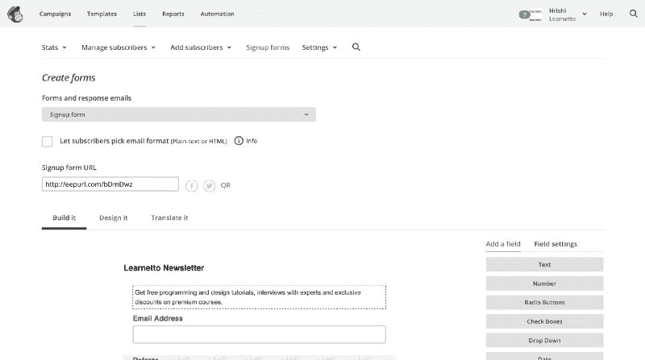

I have a love-hate relationship with Mailchimp

一个电子邮件简讯应用程序，有一个很好的用户界面，不会让你想撕掉你的头发。没有可爱猴子的废话？

你仍然可以使用 [Mailchimp API](https://developer.mailchimp.com/) 或者使用 [Sendgrid](https://sendgrid.com/) 。如果你使用过 Mailchimp，你会知道有很多功能可以尝试构建——查看/过滤/管理订户、设计表单、创建活动等等。

只需选择一个功能，并尝试构建它。大多数特性都涉及某种形式，所以将 UI 分成处理状态的 React 组件和一些无状态的功能组件应该是一个好的实践。

### *项目#18: Gmail on Rails*

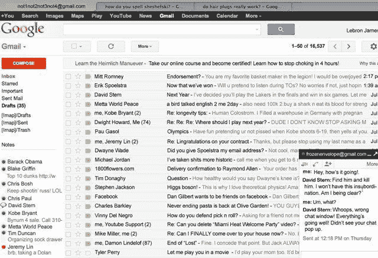

[LeBron James’ Inbox (2012)](http://mashable.com/2012/07/24/lebron-james-email-hacked/#Jq6nK.otogqq)

Gmail 有一个非常复杂的用户界面，但你可以从创建列表和阅读邮件的用户界面开始。或者搜索可能会更有趣？

*使用 [google-api-client gem](https://developers.google.com/gmail/api/quickstart/ruby) 并查看这个由[马克·布朗·☕](https://www.freecodecamp.org/news/every-time-you-build-a-to-do-list-app-a-puppy-dies-505b54637a5d/undefined)编写的令人敬畏的 React 教程和代码回购，开始吧:*

*[**mark brown4/Gmail-react**](https://github.com/markbrown4/gmail-react)*
*[*Gmail-react-A react . js 教程-Gmail*github.com](https://github.com/markbrown4/gmail-react)*

### *项目#19: DJ Spotify*

基于 Spotify(T2)的 DJ 应用程序。获得推荐，创建和混合播放列表，甚至允许其他人将歌曲添加到您的播放列表中。

*为 Spotify API 使用 [Ruby 包装器](https://github.com/guilhermesad/rspotify)gem:*

*[**guihermesad/rspotify**](https://github.com/guilhermesad/rspotify)*
*[*rspotify——Spotify Web API 的 ruby 包装器*github.com](https://github.com/guilhermesad/rspotify)*

我以前用它做过一个[小程序](http://songshaker.herokuapp.com/)，它很容易使用。Spotify 只允许音乐本身与他们自己的应用程序一起播放，所以你必须保持应用程序在旁边运行。

### *项目#20: Heroku 仪表板*

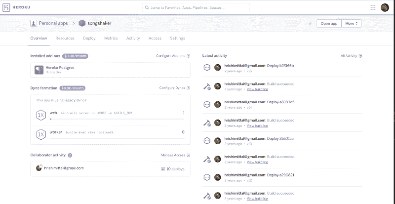

作为一名 Rails 开发者，你可能非常熟悉 [Heroku](https://heroku.com) 。这是一个用于快速部署和托管 Rails 应用程序的非常棒的服务——当你正在制作许多学习用的小东西时非常完美

建立一个简单的仪表板，列出你的应用程序，让你快速查看每个应用程序的关键信息。第二步，您可以添加编辑功能。

使用这个 gem 来访问 Heroku API:

*[**Heroku/platform-API**](https://github.com/heroku/platform-api)*
*[*platform-API-Ruby HTTP 客户端为 Heroku API*github.com](https://github.com/heroku/platform-api)*

### *项目#21: AWS S3 客户端*

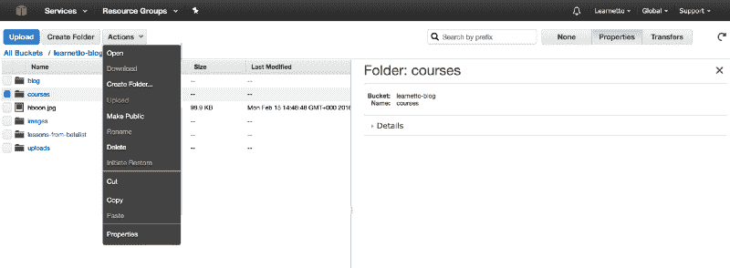

UI design ‘95

为管理你的 AWS S3 账户创建一个漂亮的现代用户界面。使用 [Ruby gem](https://github.com/aws/aws-sdk-ruby) 并从构建一个简单的文件浏览器组件开始。然后添加一个表单组件来上传文件。

*[**AWS/AWS-SDK-ruby**](https://github.com/aws/aws-sdk-ruby)*
*[*AWS-SDK-Ruby-官方 AWS SDK 为 Ruby。*github.com](https://github.com/aws/aws-sdk-ruby)*

### *项目#22:条带分析仪表板*

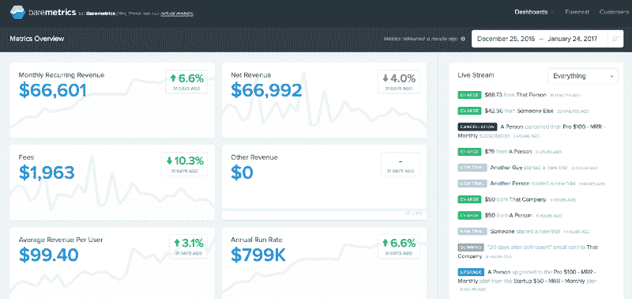

Check out [Baremetrics](https://www.freecodecamp.org/news/every-time-you-build-a-to-do-list-app-a-puppy-dies-505b54637a5d/undefined) for some inspiration — [https://demo.baremetrics.com/](https://demo.baremetrics.com/)

*一个仪表板，显示基于[条纹](https://www.freecodecamp.org/news/every-time-you-build-a-to-do-list-app-a-puppy-dies-505b54637a5d/undefined)数据的一些统计数据和图表。API 是[非常好的文档](https://stripe.com/docs/api/ruby)，这是一个很好的机会来尝试使用 D3 和 React(看看[这个](http://www.reactd3.org/)和[这个](https://github.com/QubitProducts/d3-react-sparkline))。*

### *项目#23:谷歌分析仪表板*

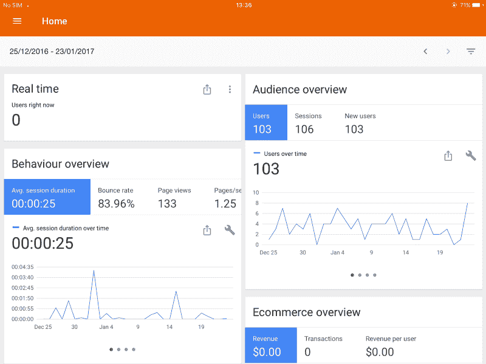

Look at the GA iPad app for inspiration (it’s much nicer than the website)

默认的 Google analytics web dashboard 混乱而令人困惑。你可以构建一个简单的只显示最重要信息的页面。

另一个使用 D3 的机会，或者你可以试试[另一个库](https://github.com/reactjs/react-chartjs)。

*你可以用[这个宝石](https://developers.google.com/api-client-library/ruby/apis/analytics/v3)访问 GA API。*

### *项目#24:习惯跟踪器*

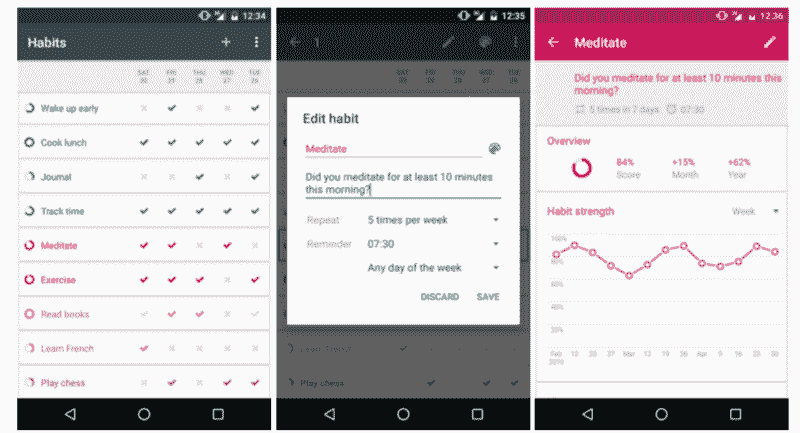

The [Loop Habit Tracker](https://github.com/iSoron/uhabits) has a nice simple UI

建立一个应用程序来跟踪你的日常和每周习惯——晨练、健身、跑步、烹饪、冥想、吉他练习、茶道？

为了获得灵感，看看[循环习惯跟踪器](https://github.com/iSoron/uhabits)或[蔻驰](https://www.coach.me/habit-tracker)。

使其便于移动，以便您可以在旅途中使用。一旦你熟悉了 React，你甚至可以使用 React Native 构建一个移动应用。

### *项目#25:健身仪表板*

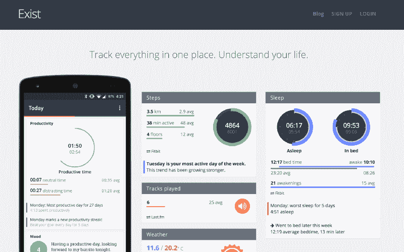

Check out [Exist](https://exist.io/) for inspiration (built by [Josh Sharp](https://www.freecodecamp.org/news/every-time-you-build-a-to-do-list-app-a-puppy-dies-505b54637a5d/undefined) and [Belle Beth Cooper](https://www.freecodecamp.org/news/every-time-you-build-a-to-do-list-app-a-puppy-dies-505b54637a5d/undefined))

为你所有的个人健身数据建立一个仪表板，从不同的应用程序中提取数据，并在一个漂亮的用户界面中呈现一些有用的统计数据。

*根据您、您的家人和朋友使用的应用程序，您可以轻松地从许多 API 中获取数据，如 [Fitbit](https://github.com/whazzmaster/fitgem) 、 [Google Fit](https://developers.google.com/api-client-library/ruby/apis/fitness/v1) 、 [Moves](https://dev.moves-app.com/docs/guide) 、 [Runkeeper](https://runkeeper.com/developer/healthgraph/overview) 、 [Strava](https://github.com/jaredholdcroft/strava-api-v3) 、 [Withings](http://oauth.withings.com/api) 等等！*

你甚至可以允许用户手动输入简单的数据，比如体重跟踪和日常锻炼。

您可以从显示报告开始，然后通过添加笔记和共享等新功能来增强它。

我为 Fitbit 数据建立了一个简单的仪表板。看这里的代码:

*[**learnetto/react fit**](https://github.com/learnetto/reactfit)*
*[*react fit——一款使用 Rails 5.1 和 react . js*github.com](https://github.com/learnetto/reactfit)*构建的健身仪表盘 app

### *项目#26:猜猜我的小品(游戏)*

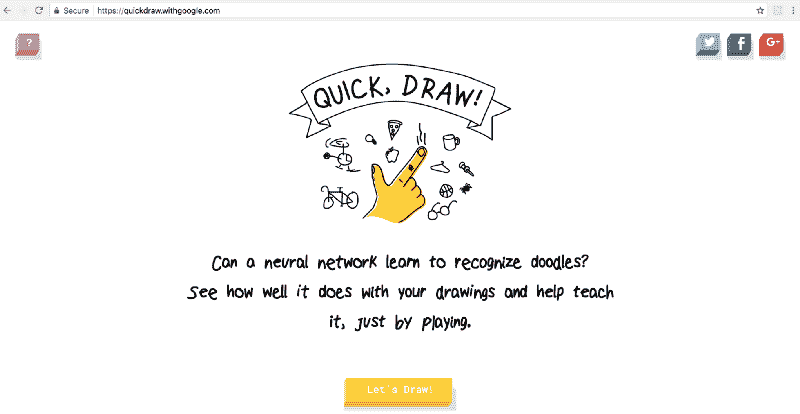

[Google Quick Draw](https://quickdraw.withgoogle.com/)

制作一个绘图应用程序，你可以用鼠标在里面画画，一个朋友必须猜出你画了什么。你可以用画布画画。见[反应-画板](https://github.com/svrcekmichal/react-sketchpad)作者[米哈尔·斯维克](https://www.freecodecamp.org/news/every-time-you-build-a-to-do-list-app-a-puppy-dies-505b54637a5d/undefined)关于如何开始的一些想法:

*[**svrcekmichael/react-画板**](https://github.com/svrcekmichal/react-sketchpad)T5
*[react-画板-用画布创建的画板](https://github.com/svrcekmichal/react-sketchpad)*github.com*

使用 Rails 上传和保存绘图，并展示给另一台计算机上的其他人。

*作为 fun 中的高级练习，加入[机器学习](https://gist.github.com/gbuesing/865b814d312f46775cda)，让计算机猜？*

### 项目#27:你写得像

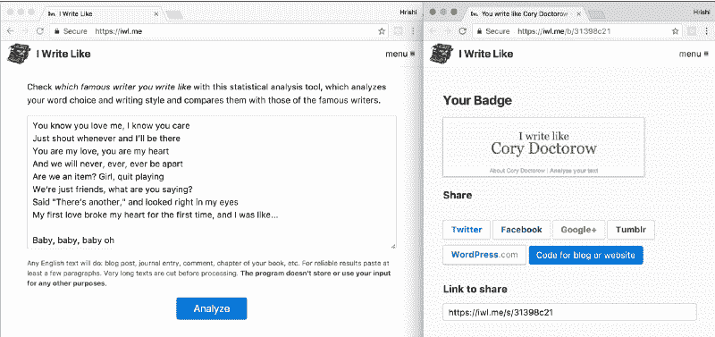

Always good to know who inspires famous internet people

*制作一个文本分类器应用程序，将你的写作风格与一位著名作家相匹配——就像[我写得像](https://iwl.me/)(由[德米特里·切斯特尼赫](https://www.freecodecamp.org/news/every-time-you-build-a-to-do-list-app-a-puppy-dies-505b54637a5d/undefined)制作)。*

*使用[分类器-重生](https://github.com/jekyll/classifier-reborn)对文本进行分类，并对处理表单做出反应。这个应用程序大部分是后端繁重的，所以尝试一些 [UI 动画](https://facebook.github.io/react/docs/animation.html)。见[这个回购](https://github.com/FormidableLabs/react-animations)一些很酷的想法:*

*[**FormidableLabs/react-animations**](https://github.com/FormidableLabs/react-animations)*
*[*react-animations-inline style 库的动画集合*github.com](https://github.com/FormidableLabs/react-animations)*

### *项目#28:创意板*

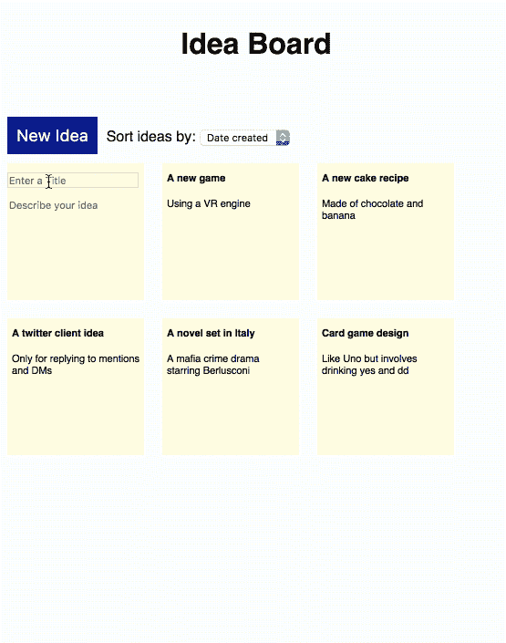

An Idea Board app with idea tiles

*使用一个 [Rails 5.1 API 应用程序和一个单独的 React 应用程序](https://learnetto.com/tutorials/rails-5-api-and-react-js-tutorial-how-to-make-an-idea-board-app)创建一个 Idea board 应用程序。创意板是一个简单的板，以方块的形式显示创意。您可以添加意见、编辑现有意见和删除意见。*

我已经做好了这个！看看这两个视频教程，它们将向你展示如何一步一步地构建这个:

*第一部分:*

*[***Rails 5 API 和 React.js 教程——如何制作创意板 app | Learnetto***](https://learnetto.com/tutorials/rails-5-api-and-react-js-tutorial-how-to-make-an-idea-board-app)*
*[Rails 5 API 和 React.js 教程——如何制作创意板 app | Learnettolearnetto.com](https://learnetto.com/tutorials/rails-5-api-and-react-js-tutorial-how-to-make-an-idea-board-app)*

*第二部分:*

*[***如何使用 React 过渡组制作组件动画| Learnetto***](https://learnetto.com/tutorials/how-to-animate-a-component-using-react-transition-group)*
*[如何使用 React 过渡组制作组件动画| Learnettolearnetto.com](https://learnetto.com/tutorials/how-to-animate-a-component-using-react-transition-group)*

这些教程涵盖了许多实用的概念，包括无状态功能组件、基于类的组件、使用 axios 进行 API 调用、不变性助手等等。

So many ideas!

现在，这是一大堆有趣的想法，可以让你开始你的 React on Rails 之旅！

**想和我一起建这些 app？来，看看 Learnetto.com 上 React、Rails 和更多的[免费教程。](https://learnetto.com)**

有其他想法吗？请在下面的回复中分享它们。

***请**？r **ecommend/clap？并分享这篇文章！***