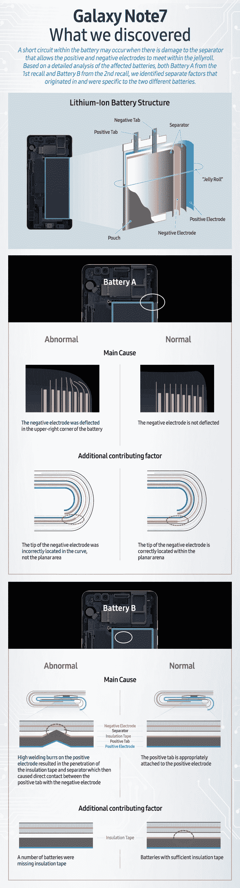

# 算法设计音乐厅会怎样？

> 原文：<https://www.freecodecamp.org/news/what-happens-when-algorithms-design-a-concert-hall-87c24eff20c/>

这里有三个值得你花时间的链接:

1.  算法设计音乐厅会怎样？( [3 分钟读数](http://bit.ly/2jIQ6F7))
2.  当你还在学校的时候，如何获得一份顶尖的技术实习和技术工作
3.  样式化组件是使用 CSS 和 React ( [4 分钟读取](http://bit.ly/2jhYDhd))的一种新方式

额外收获:210 万美国人仍在为 AOL 的 56kbps 拨号上网每月支付 20 美元

### 想到这一天:

> “计算机能否思考的问题，就像潜艇能否游泳的问题一样。”埃德格·w·迪杰斯特拉

### 每日一图:

三星完成了对爆炸 Galaxy Note7 手机的调查，并发布了电池着火的示意图:

编码快乐！

–昆西·拉森，自由代码营的老师