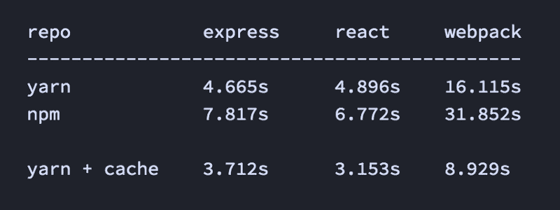
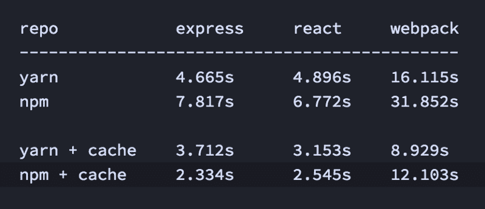

# npm 缓存:无名英雄

> 原文：<https://www.freecodecamp.org/news/npm-cache-the-unsung-hero-11e646c09791/>

作者西达尔特·克谢特拉帕尔

# npm 缓存:无名英雄


我喜欢 npm，并且相信这个包管理器是 JavaScript 在过去几年取得巨大成功的最大原因。

当 facebook 发布 yarn 时，JavaScript 社区非常兴奋。而且理由很充分。Yarn 的安装速度惊人。后续的安装甚至会更快，因为 yarn 会在您的机器上缓存已安装的模块。



Install speeds @ 12Mbps. Yarn = ?

但是有一个 npm 特性并没有得到应有的关注。

像 Yarn 一样，npm 也有一个内置的缓存机制，可以使后续安装超快。

以下是一些基准测试:



npm + cache is as fast as yarn + cache (if not faster)

太疯狂了，对吧？你猜怎么着:这个特性一直都是可用的，但是默认情况下是禁用的。

### 如何启用 npm 缓存

```
npm config set cache-min 9999999
```

就是这样。

现在像往常一样安装您的软件包:

```
npm install express
```

您可以使用[这个库](https://github.com/siddharthkp/npm-cache-benchmark)亲自尝试这些基准:

[**悉达多/NPM-cache-Benchmark**](https://github.com/siddharthkp/npm-cache-benchmark)
[*NPM-cache-Benchmark-Benchmark NPM cache vs yarn*github.com](https://github.com/siddharthkp/npm-cache-benchmark)

请注意，Yarn 不仅仅与速度有关——它还有其他的特性，如持续安装，这使它与众不同。

但是，如果速度对您来说是一个重要的考虑因素——对我来说也是如此——您应该再试一次 npm，这次是使用缓存。

感谢 [ashley williams](https://www.freecodecamp.org/news/npm-cache-the-unsung-hero-11e646c09791/undefined) 的评论，感谢 [npm，](https://www.freecodecamp.org/news/npm-cache-the-unsung-hero-11e646c09791/undefined)的精彩。

另外，你应该在推特上关注我。