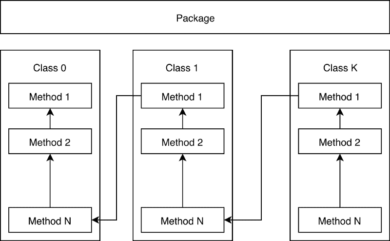
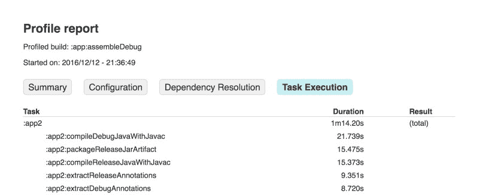
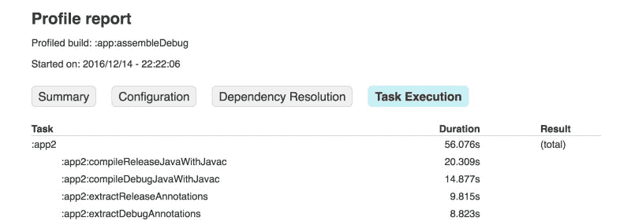
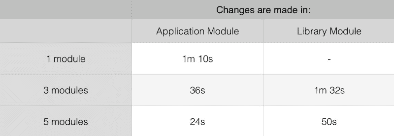
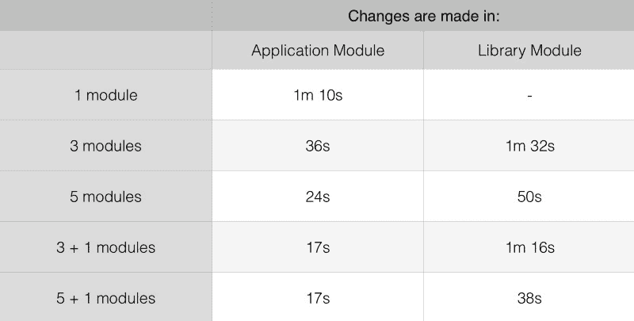
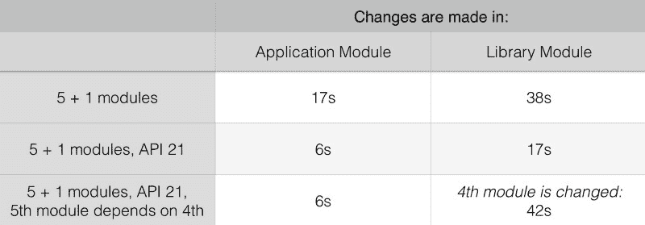
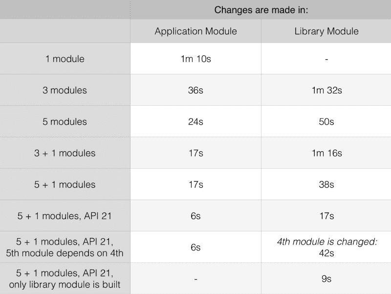

# 模块化如何加快你的 Android 应用的构建时间

> 原文：<https://www.freecodecamp.org/news/how-modularisation-affects-build-time-of-an-android-application-43a984ce9968/>

尼基塔·科兹洛夫

# 模块化如何加快你的 Android 应用的构建时间


开发人员将在应用程序的整个生命周期中不断添加新功能。更多的代码不仅意味着更长的构建时间——还意味着更长的*增量*构建时间。

对于有大项目的团队来说，等待新的构建最终会占用他们工作日的 10-15%。这不仅浪费了开发人员宝贵的时间——还使得测试驱动的开发变得极其乏味，损害了整体的代码质量。

将应用程序拆分成模块可能是这个问题的解决方案。我很想把我们的代码库按特性、按层或者其他快速而明显的方式分开。但首先，我决定创建一个实验并收集一些数据，这样我就可以做出更明智的决定。本文将探讨我收集的结果和我的发现。

在我们开始我的实验之前，我想谈谈这背后的理论，并解释我们如何减少增量构建时间。

### 一点理论

当你创建一个 Android 应用程序时，你必须至少有一个*应用程序*模块，这个模块在他的 *build.gradle* 文件中应用了 Gradle 应用程序插件:

```
apply plugin: 'com.android.application'
```

构建此模块的结果是，您将获得一个。APK 档案。

一个*应用程序*模块不能依赖于另一个。它只能依靠一个*图书馆。*这是应用了 Gradle 库插件的模块:

```
apply plugin: 'com.android.library'
```

由于发布了这样一个模块，您将获得一个。AAR 文件(Android 存档库)。比较到。JAR 文件。AAR 有一些 Android 相关的东西，比如资源和 Manifest。

任何库或应用程序模块的构建过程都可以粗略地分为五个阶段，这五个阶段可以用特定的分级任务来表示:

1.  **准备依赖关系。在此阶段，逐步检查该模块所依赖的所有库是否准备就绪。如果这个模块依赖于另一个模块，那么那个模块也会被构建。**
2.  **合并资源和处理清单。**在这个阶段之后，资源和清单就可以打包到结果文件中了。
3.  **编译。**这个阶段从注释处理器开始，如果你使用它们的话。然后源代码被编译成字节码。如果使用 AspectJ，这里也会发生编织。
4.  **后处理。**所有带有“转换”前缀的 Gradle 任务都是此阶段的一部分。最重要的是:`transformClassesWithMultidexlist`和`transformClassesWithDex` *。*他们生产。德克斯文件。
5.  **包装和出版。对于图书馆来说，这个阶段意味着创建一个。AAR 文件在最后，对于应用— .APK。**

正如我提到的，我们的目标是最小化增量构建时间。很难在一个实验中加快所有阶段的速度，所以我决定专注于最长的阶段。对于只有一个模块的项目，这些是编译和后处理阶段。合并资源和处理清单阶段有时也很耗时，但是如果 Java 代码不变，那么增量构建会非常快。

我们都知道，只有当输入不相同时，Gradle 才会在后续构建中运行任务。如果模块没有被更改，它也不会重新构建模块。这导致了以下假设:

> 包含多个模块的项目的增量编译时间比包含单个模块的项目要快，因为只有修改过的模块才会被重新编译

好吧，让我们看看这是不是真的！

### 实验设置


项目使用 Gradle plugins v2.2.2。最小的 Android SDK 是 15，根据 [API 级别仪表板](https://developer.android.com/about/dashboards/index.html)，它覆盖了大多数设备。所有模块都依赖于 *Butterknife* ，让项目更“有活力”，因为所有项目都有外部依赖。

在所有变体中，应用模块被称为*【app】*，而库模块被称为*【app 2】**【app 3】*等等。

每个变体总共有大约 100 个包，15，000 个类，90，000 个方法。组合起来就是两个 DEX 文件，差不多三个。生成的代码是虚拟的，以保持。APK 文件，缩小和收缩被禁用。

所有测量都是用 Gradle 内置剖面仪进行的。要使用它，你只需要在命令的末尾加上"- profile "，就像这样:

```
./gradlew assembleDebug --profile
```

因此，您将获得一个包含测量值的. HTML 文件。

对于每个设置，我重复每个测量 4 到 15 次，以确保我的结果是可重复的。

#### Java 代码生成器

手工编写所有 15，000 个类非常耗时，所以我用 Python 编写了一个简单的代码生成器。在[要诀](https://gist.github.com/NikitaKozlov/ff9d8e65d9d880a2f35e1cac58a84990)中有。下面你可以找到它生成的代码的模式。



正如您所看到的，每个下一个生成的方法都调用了前一个方法，下一个类的每个第一个方法都调用了前一个类的最后一个方法。这使得代码更具耦合性，并增加了编译时间。

#### 纯 Java 模块

我没有对纯 Java 模块做专门的实验。但是我玩了一会儿，我可以说它们通常比安卓的要快。发生这种情况是因为在构建期间执行的任务较少，例如，没有要合并的资源。

如果您对纯 Java 模块的结果感兴趣，请写下评论。或者你可以从 [GitHub](https://github.com/NikitaKozlov/GradleBuildExperiment) 中克隆项目，并根据你的需求进行修改。但是别忘了实际效果取决于硬件。为了能够比较您的结果，请在您的环境中重复一些实验。

#### 到处都有小损失

毫不奇怪，并行地做一些事情会降低构建的速度。即使在 Android Studio 中打开第二个项目也会使构建速度慢 5-10%。听音乐、看 YouTube 或浏览互联网会大大增加构建时间！我个人看到，在关闭了除 Android Studio 之外的所有东西之后，构建过程的速度提高了 30%。

所有实验都是在只打开必要的浏览器标签和一个 Android Studio 项目的情况下完成的。

### 让我们做实验吧

#### 初态

作为起点，我选择了一个包含所有 15 000 个类的单一模块的项目。对于此设置，增量构建时间为 *1m 10s* 。

#### 3 个模块

第一步是将一个模块分成三部分:一个应用程序模块和两个库模块。应用程序模块依赖于库，但是库模块彼此独立。每个模块大约有 5 000 个类和 30 000 个方法。

如果只在应用程序模块中进行更改，那么构建时间大约为 35 秒。与初始状态相比，赢了将近 30 秒。但是，当其中一个库模块被更改时，即使应用程序模块未被更改，增量构建时间也会增长到 *1m 50s* 。多 40 秒！

让我们看一下 profile 报告，看看是什么花了这么长时间:



Profile report of an incremental build with changes in library module (“:app2”). Since application module (“:app”) depends on the library one, it is also recompiled.

在上面的截图中，你可以看到大部分时间都花在了构建库模块上。您可能还注意到，对于库模块，调试和发布任务都被执行。Gradle 浪费时间执行两组任务，而不是一组！这就是为什么它比单模块项目多花了 40 秒的原因。

我们可以避免这种情况，通过将代码分成模块，使这个构建比我们最初的 *1m 10s* 更快。

但这不是唯一的问题。让我们看看*我们的应用程序模块如何依赖于库模块:*

```
*`dependencies {    compile project(path: ':app2')    compile project(path: ':app3')}`*
```

*上面的代码中有一个重要的问题:如果像这样添加一个库，那么应用程序总是依赖于*版本*的变体，独立于它自己的构建类型。在 Android Studio 中选择哪个变体也无关紧要。以下是 [Gradle 插件用户指南](http://tools.android.com/tech-docs/new-build-system/user-guide#TOC-Library-Publication)对此的描述:*

> *默认情况下，一个库只发布它的*版本*变体。该变体将被引用该库的所有项目使用，无论它们自己构建哪个变体。这是一个暂时的限制，由于梯度限制，我们正在努力消除。*

*幸运的是，可以改变我们的应用程序所依赖的变量。*

*首先，将以下代码添加到库的 *build.gradle* 文件中。它将允许库发布*调试*变种；*

```
*`android {    defaultConfig {        defaultPublishConfig 'release'        publishNonDefault true    }}`*
```

*其次，应用程序模块应该依赖于库模块，如下所示:*

```
*`dependencies {    debugCompile project(path: ':app2', configuration: "debug")    releaseCompile project(path: ':app2', configuration: "release")    debugCompile project(path: ':app3', configuration: "debug")    releaseCompile project(path: ':app3', configuration: "release")}`*
```

*现在，我们的应用程序的调试变体依赖于库的调试变体，并且它的发布依赖于它们的发布。所以让我们对模块 *app2* 做一些修改，然后重新构建它。完成这些更改后，我们可以再次检查我们的配置文件报告:*

****

*最显著的区别是没有了*:app 2:packageReleaseJarArtifact，*，这为我们节省了大约 15 秒。此外，其余任务之间的时间被稍微调整了一下，我们以*1 米 32 秒*结束。这比之前快了 18 秒，但仍然比我们的初始配置慢了 22 秒。对于仅在应用程序模块中的更改，构建时间几乎保持不变——在我们之前的配置中， *36 秒*对 *35 秒*。*

*不幸的是，我没有找到一个合适的解释，为什么它建立两种口味。我希望一旦这个 Gradle 限制被解决，那么这个问题也会消失。在 [AOSP 问题跟踪](https://code.google.com/p/android/issues/detail?id=52962)中讨论了同样的问题。*

*我还计划花一些时间尝试 Gradle 任务，以找到解决这个问题的方法。一种可能的方法是排除调试版本的所有发布任务。*

#### *5 个模块*

*显然，构建时间取决于代码量。如果您将代码量减少一半，那么构建也应该会快两倍。如果不是 3 个模块，而是将项目分成 5 个模块，那么构建时间应该会快大约 40%。*

*这几乎是真的。*

**

*如果仅在应用程序模块中进行更改，则增量构建时间约为 24 *秒。*对于库模块中的更改，增量构建需要*50 秒*。与最初的*1 米 10 秒*相比，这已经是一个胜利了。不过，我还有几招。*

#### *减少应用程序模块的大小*

*不管什么模块被改变，应用程序模块每次都会被重新编译。所以缩小它的尺寸是完全有意义的。理想情况下，它应该只是从一个单独的模块组装整个应用程序，也可能提供一个闪屏，因为闪屏通常依赖于许多功能。*

*关于 *3+1* 和 *5+1* 构型的想法就是这样诞生的。在这两种情况下，project 都有一个小的应用程序模块，它分别依赖于 3 个和 5 个库模块。所有库模块彼此独立，大小相等。让我们看看这会给我们带来什么:*

**

*我们可以观察到增量构建时间的进一步下降。即使库模块 *5+1* 发生了变化，构建配置的速度几乎是初始单模块项目的两倍。这是一个不错的进步。*

#### *为什么项目实际上依赖于 Butterknife？*

*这是我不得不承认的一点。有一个非常有力的理由来增加对 *Butterknife* 的依赖。*

*在初始配置中，增量编译从 *1m 10s* 中取出 *45s* ，但是如果 *Butterknife* 被移除，那么项目只在 *15s* 中编译！快三倍！没有 Butterknife 的整个增量构建是 *40s* 。*

*是图书馆的问题吗？*

*正如它所显示的——没有 *Butterknife* 项目编译如此之快是因为实际的 Java 增量编译，它对于使用注释处理器的项目是禁用的。你可以在 [Gradle 吉拉](https://issues.gradle.org/browse/GRADLE-3259)，在 [AOSP 问题跟踪](https://code.google.com/p/android/issues/detail?id=200043)中找到相关问题，在 Gradle [设计文档](https://github.com/gradle/gradle/blob/master/design-docs/incremental-java-compilation.md)中也有跟踪。如果你仔细看看 ASOP 问题跟踪者的问题，其中一条评论说:*

> **"增量 java 编译尚不支持注释处理器。这将取决于 Gradle 的变化。**

> *我们对应用 com.neenbedankt.android-apt 的项目禁用了它，因此它不再是一个重大问题。"*

*这就是为什么在没有通知的情况下构建会变慢。*

*就我个人而言，我不会将注释处理器从整个项目中移除。我发现像 *Dagger* 和 *Butterknife* 这样的库很有用。但是有几个没有它们的模块可能是一个好主意，这将使他们的构建更快！*

#### *还有一个技巧——提高 API 级别*

*编译并不是减慢构建过程的唯一原因。生产。DEX 文件也很耗时。尤其是当应用程序超出索引限制时。使用多索引配置增加了构建时间，构建系统需要决定哪个类去哪个类。DEX 文件。随着 Android 运行时的引入，Android 操作系统处理具有多个 DEX 文件的应用程序的方式发生了变化。Android Studio 文档是这样说的:*

> **“Android 5.0(API level 21)及更高版本使用了一个名为 ART 的运行时，它原生支持从 APK 文件加载多个 DEX 文件。ART 在应用安装时执行预编译，扫描`classesN.dex`文件，并将它们编译成单个`.oat`文件，供 Android 设备执行。”**

*这导致构建时间的减少。原因是每个模块产生自己的 DEX 文件，这些文件不加修改就包含在 APK 中。如果你看一下在构建期间运行的任务，你会注意到`transformClassesWithMultidexlist` 不再被执行。编译本身也变得更快了。你可以在这里找到更多使用 API 21 [制作香料的信息和说明。](https://developer.android.com/studio/build/multidex.html#dev-build)*

#### *实现最快的构建配置。*

*对于每个项目来说，使用 API 21 进行调试都是一件容易的事情。我尝试了一下 *5+1* 配置，结果令人惊讶:*

**

*即使库模块发生变化，增量构建时间也只有 *17 秒*！但是要考虑到所有的模块都是相互独立的。一旦引入了模块之间的依赖关系，构建时间就会从*的 17 秒*增加到*的 42 秒*(上表的最后一行)！*

#### *以测试驱动的方式开发库模块*

*对于单模块项目来说，测试驱动开发(TDD)困难的一个主要原因是构建时间。TDD 鼓励经常运行测试。一分钟内多次运行测试是一种正常的做法。但是当构建需要一两分钟的时候，以测试驱动的方式工作不会很有成效。*

*随着模块的引入，这个问题被自动解决了。在最后一个配置中构建一个模块只花了*9 秒*！它可以根据需要经常运行测试。*

### *结论*

**

*首先，也是最重要的，假设是正确的，模块化项目可以显著加快构建过程，但不是对所有配置都是如此。*

*第二，如果拆分是以错误的方式完成的，那么构建时间将会急剧增加，因为 Gradle 构建了库模块的发布和调试版本。*

*第三，对于一个有多个模块的项目来说，以测试驱动的方式工作要容易得多，因为构建一个小的库模块比构建整个项目要快得多。*

*第四，并行做很多事情会减慢构建的速度。所以拥有更强大的硬件是个好主意。*

*下面你可以找到本文描述的所有实验的结果:*

**

*请为提到的问题投票。解决其中任何一个问题都将是朝着更快构建迈出的一大步。您可以在下面找到所有链接:*

*   *[https://code.google.com/p/android/issues/detail?id=52962](https://code.google.com/p/android/issues/detail?id=52962)*
*   *[*https://issues.gradle.org/browse/GRADLE-3259*](https://issues.gradle.org/browse/GRADLE-3259)*
*   **[https://code.google.com/p/android/issues/detail?id=200043](https://code.google.com/p/android/issues/detail?id=200043)**

**所有代码都发布在 [GitHub](https://github.com/NikitaKozlov/GradleBuildExperiment) 上。**

**[**尼基塔·科兹洛夫(@尼基塔 _ E _ 科兹洛夫)|推特**](https://twitter.com/Nikita_E_Kozlov)
[*尼基塔·科兹洛夫(@尼基塔 _ E _ 科兹洛夫)最新推文:“https://t . co/wmg SJ 7 snw 1”*twitter.com](https://twitter.com/Nikita_E_Kozlov)**

**感谢您抽出时间阅读本文。喜欢的话别忘了点一下？*下文。***