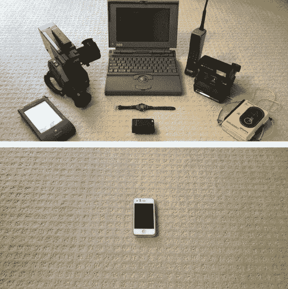

# 一个机器人如何让超级马里奥 64 和传送门在 1990 年的超级任天堂上运行

> 原文：<https://www.freecodecamp.org/news/how-a-robot-got-super-mario-64-and-portal-to-run-on-a-super-nintendo-from-1990-34b7ee132f83/>

这里有三个值得你花时间的链接:

1.  一个机器人如何让超级马里奥 64 和传送门在 1990 年的超级任天堂上“运行”
2.  用 1 分钟的时间用图片解释“缓存”的概念( [1 分钟阅读](https://cachingexplained.com/))
3.  NHTSA 对特斯拉自动驾驶仪的全面最终调查显示，撞车率降低了 40%

额外收获:本周我没有写科技，而是写了太空。我希望你能找到这份激励( [2 分钟阅读](http://bit.ly/2jV3u5V))

### 想到这一天:

> "如果可用性是唯一的设计考虑，我们都会骑着三轮车到处跑."—未知

### 每日一图:

20 年来的摩尔定律:

([图像信用](http://imgur.com/nuUGHaY)

编码快乐！

–昆西·拉森，自由代码营的老师