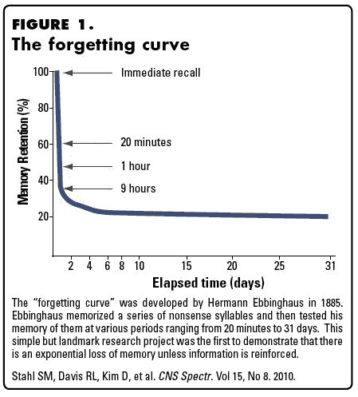
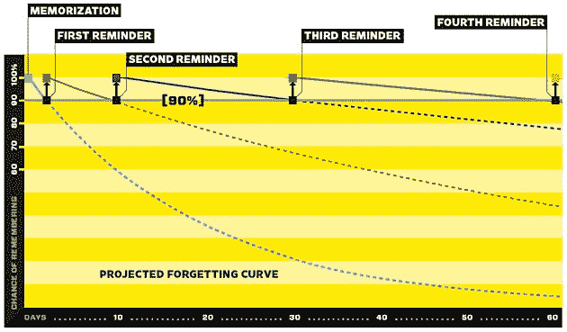
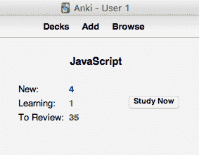
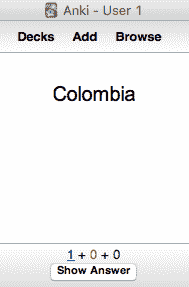
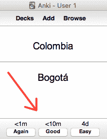
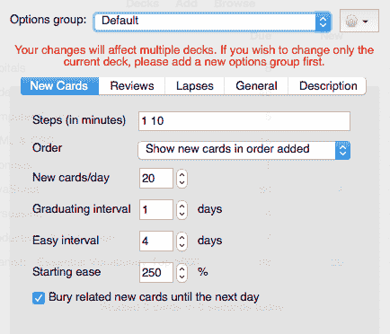

# 如何使用 Anki 的间隔重复来更快地学习编码

> 原文：<https://www.freecodecamp.org/news/use-spaced-repetition-with-anki-to-learn-to-code-faster-7c334d448c3c/>

史蒂文·吉尔伯特

# 如何使用 Anki 的间隔重复来更快地学习编码

[https://unsplash.com/search/photos/clock?photo=0gdHUhYkXDc](https://unsplash.com/search/photos/clock?photo=0gdHUhYkXDc)

想象一下，您可以加快学习速度，更好地记住编程基础、技术和命令。

今天我告诉你如何做到这一点，使用**间隔重复**和一个叫做 **Anki** 的免费开源工具。

许多人已经证明了间隔重复的好处:

*   危险！冠军罗伯特·克雷格说他的成功部分归功于使用 Anki 记忆琐事。
*   为参加[谷歌面试](https://medium.freecodecamp.com/why-i-studied-full-time-for-8-months-for-a-google-interview-cc662ce9bb13#.3d9qfnhq5)而全职学习了 8 个月的谷歌海克说:“*间隔重复是记忆的关键……随着时间的推移，通过重温和复习，你会成为专家。如果你这样做了，你就会到了无法忘记细节的地步*。
*   CDBaby 的创始人德里克·西弗斯(Derek Sivers)，[写道](https://sivers.org/srs)间隔重复是“*我在 14 年的计算机编程生涯中发现的最有帮助的学习技巧*”

对我个人来说，Anki 是我学习编码过程中不可或缺的一部分。我用它来记住 HTML、CSS、JavaScript 的重要思想，以及 Git 和 Bash 的命令。

我目前正在加州大学伯克利分校法学院学习延期，Anki 将 100%成为我掌握法律策略的一部分。

在本文中，我将介绍:

*   什么是间隔重复
*   Anki 如何帮助间隔重复
*   以及这些如何能加快你的学习，提高你对编程概念的记忆。

### 什么是间隔重复？

[间隔重复](https://en.wikipedia.org/wiki/Spaced_repetition)寻求解决遗忘的[问题。它认为，记住一条新信息的理想时刻是在你即将忘记它的时刻*。*](https://www.supermemo.com/english/princip.htm#optimal_intervals)

比如，假设你不知道[哥伦比亚](https://en.wikipedia.org/wiki/Colombia)的首都。假设现在我告诉你哥伦比亚的首都是哪里。

哥伦比亚的首都是波哥大。

让我们假设你的记忆力如此之强，以至于在你第一次接触它之后，你会记住这个新的事实——哥伦比亚的首都是波哥大，整整 20 分钟。之后你就会忘记。

但是，如果在 **19 分 59 秒**，当我们在喝咖啡的时候，我*提醒*你…

哥伦比亚的首都是波哥大。

…间隔重复理论说你现在能记住波哥大是哥伦比亚的首都，比如说 40 分钟。之后你就会忘记。

但是，如果我在 39 分 59 秒后再次提醒你…

哥伦比亚的首都是波哥大。

…你将能够在记忆中保留这段地理琐事更长的时间，比如说一个小时。

如果我们继续以这种方式进行，我一直提醒你哥伦比亚的首都是波哥大*确切地说是*在你即将忘记的时刻，记忆消失的间隔时间*成指数增长*从几小时到几天，然后到几个月，然后到几年。

最终，正如理论所说，波哥大是哥伦比亚的首都这一事实将或多或少地永久留在你的记忆中。

这种记忆力随时间下降的概念被称为[遗忘曲线](https://en.wikipedia.org/wiki/Forgetting_curve)，它是由[赫尔曼·艾宾豪](https://en.wikipedia.org/wiki/Hermann_Ebbinghaus)于 1885 年提出的。

Stahl et al 2010; CNS Spectr

这种想法——随着时间的推移间隔学习比填鸭式学习更有效率和效果——被称为[间隔效应](https://en.wikipedia.org/wiki/Spacing_effect)。

遗忘曲线和间隔效应是间隔重复背后的基本概念。

根据你的遗忘曲线，你决定提醒自己某个记忆项目(指任何一条信息)的最佳间隔，并相应地间隔出记忆项目的强化。记忆研究的先驱彼得·woźniak 总结了这些观点:

> 最佳间隔的计算基于两个相互矛盾的标准:

> 1.间隔应该尽可能长，以获得最小的重复频率，并充分利用所谓的间隔效应，即在一定限度内，重复间隔越长，记忆越强

> 2.间隔应该足够短，以确保知识仍然被记住

在这一点上，你可能会问，“但是当你快要忘记哥伦比亚的首都是波哥大的时候，你怎么会准确地知道呢？你怎么知道你的最佳区间是多少？”

当然，如果没有艰苦的反复试验和查尔斯·达尔文式的对细节的关注，很难精确到秒。但幸运的是我们不需要这样的勤奋，因为一个熟悉的朋友可以帮助我们:**软件**。

(你也可以使用一个叫做[莱特纳系统](https://en.wikipedia.org/wiki/Leitner_system)的非自动化系统。)

建立在大量记忆研究基础上的软件可以帮助你确定强化记忆的最佳时间。具体来说就是**间隔重复软件**。

### What is Anki?

[Anki](https://apps.ankiweb.net/) 是[开源](https://github.com/dae/anki)间隔重复软件**工具，由 [Damien Elmes](https://github.com/dae/) 开发维护。你可以把它想象成一种“智能抽认卡程序”,它利用间隔重复，使记忆更有效率。**

Anki 是建立在这样一个前提之上的，即你可以通过定期的、有策略的定时提醒来最好地记住知识。这意味着它建立在间隔重复的力量之上。

[Image credit](https://www.wired.com/2008/04/ff-wozniak/)

你可以用 Anki 记住任何需要记住的东西。

不过注意，Anki 并不能代替*学习*。你必须首先理解你正在学习的材料，然后把它交给 Anki，它将出色地帮助你记住你已经获得的知识。意思是 Anki 是理解之后学习过程的一部分。

[Image credit](https://www.gwern.net/Spaced%20repetition)

世界上还有其他的空间复制软件，比如前面提到的彼得·woźniak.发明的超级记忆软件事实上，Anki 实现了一个支持 SuperMemo 的[算法](https://en.wikipedia.org/wiki/Anki_%28software%29)版本。

我在这里关注 Anki 是因为我已经习惯了它，它运行良好，并且是开源和免费的。如果你使用过 SuperMemo 或其他 SRS 工具，请在评论中告诉我们你的体验。

如果你最终决定也使用 Anki，我仍然鼓励你[阅读一下](https://www.wired.com/2008/04/ff-wozniak/?currentPage=all)关于 Woźniak 的文章，以及他关于记忆、学习和[创造力](https://www.supermemo.com/articles/genius.htm)的观点，因为它极具洞察力。

就设备而言，Anki 有一个桌面版本，如果你以前没有使用过 Anki，建议你从它开始。还有:

*   一个免费的配套网络应用程序，AnkiWeb。
*   一个免费的安卓配套应用程序 [AnkiDroid](https://play.google.com/store/apps/details?id=com.ichi2.anki&hl=en) ，完全兼容并可与 Anki 桌面/网络同步。
*   对于 iPhone 用户来说，苹果商店里一款售价 24.99 美元的配套应用程序 AnkiMobile。

### How Anki works

要知道你可以深入了解如何使用和配置 Anki。我只给你一个高层次的概述，让你得到要点。

1.  你创建“ ***”副牌*** ”，这是一组代表广泛类别的牌。例如，“JavaScript”或“大写字母”可能是一副牌。

这里有一个桌面应用程序中的 Anki 甲板的例子。(现在不要担心“新”、“学”、“复习”。我一会儿将回到这些):

Example Anki deck

2.你添加“ ***卡片*** ”到你的卡片组，这些卡片可以用 HTML 和 CSS 定制。

卡片可能是标准的正反面抽认卡，你第一次看到的是正面。这里有一个“首都”的例子:

Example Anki card — front of Basic type

当你准备好回答时，点击**显示答案**以显示卡片背面的答案:

Anki card — front and back of Basic type

除了正反面抽认卡之外，还有其他类型的卡片，比如你想熟悉的[完形填空删除](https://en.wikipedia.org/wiki/Cloze_test)。完形填空删除是我一直使用的一种特别有用的卡片类型(事实上我的大多数卡片都使用完形填空删除),因为它在组织信息方面简单而有效。

创建 Anki 卡是一门艺术。你练习得越多，你就会做得越好。作为一条经验法则，你会想要试着遵循[最小信息原则](https://www.supermemo.com/en/articles/20rules)，这基本上意味着:

接吻——保持简单愚蠢。你希望你的卡片尽可能简单，因为简单更容易记住。

3.一旦你完成添加卡，你 Anki(实践)。

让我们回头看看哥伦比亚-波哥大卡，看看这个过程是如何运作的。

Choose when you’d like to be reminded again

点击**显示答案**后，你被带到卡片的背面，你问自己:

想出这个答案有多难？

*   如果您不知道答案，您可能会再次选择**，这将使您在**不到一分钟**内再次接触到该卡。**
*   **如果你在暂停并挖掘你的记忆库后找到了答案，你可能会选择**好的**，这将在不到 10 分钟的**中再次向你展示这张牌。****
*   **如果答案很简单，你选择**简单**，你将在**四天**内看不到这张卡。**

**Anki 的程序会跟踪你的进度:什么时候回顾哪些卡片。这意味着 Anki 正在做追踪每张卡片的遗忘曲线的乏味工作。**

**这就是用软件自动化间隔重复的力量。**

**我应该指出，你可以改变 Anki 的间隔重复算法的一些变量。为此，您可以进入您的牌组选项并定制您想要定制的内容，例如每天可审核的牌的数量、时间间隔选项以及其他变量。**

**

Customizing your deck options** 

**不过，在开始的时候，你可能想不去管这些设置，只使用默认设置。随着你对 Anki 越来越熟悉，你可以开始在牌组选项上有所创新。**

**要重新访问我们的 JavaScript 平台:**

**

Example Anki deck** 

*   ****New** 表示您已经在 JavaScript 卡片组中添加了 4 张新卡片，它们已经准备好接受审核了**
*   ****学习**意味着，如果你正在处理一副牌，并且你选择了，比如说，**好的<** 10m，Anki 会将那张牌存储在学习队列中，并在 10 分钟后再次向你展示。更多细节请看这里。**
*   ****待审核**是指待审核卡片的数量。**

**随着你越来越多地使用 Anki，这一切都会变得更加清晰。**

### **如何开始使用 Anki**

**关于教程和如何使用 Anki，网站上的[文档](https://apps.ankiweb.net/docs/manual.html)是惊人的，可能会回答你的大多数问题。而且还有几个很有帮助的[视频教程](https://www.youtube.com/channel/UCFt1oYUNiwkMaJTSZiFEodQ)。**

**同时，我会给你一份如何开始使用 Anki 的清单，因为清单[会有所帮助。](https://www.amazon.com/Checklist-Manifesto-How-Things-Right/dp/0312430000)**

**1.阅读德里克·西弗关于间隔重复的文章,因为它强化了我所说的许多内容。**

**2.阅读这篇连线采访彼得·woźniak 的文章，因为它给了你一个关于间隔重复、学习和记忆研究的整体概述。**

**3.阅读彼得·woźniak 的《有效学习:形成知识的二十条规则》，因为它给了你如何形成和构建你的 Anki 卡片的技巧。**

**值得注意的是，记住间隔重复不能代替学习。重要的是，你首先要理解材料，然后再进行有间隔的重复。先了解再用 Anki 强化。记住使用亲吻法制作卡片，并尽可能在卡片中使用意象。**

**4.创建您自己的套牌。**

**5.记得保持你的甲板宽广和一般。例如，如果你正在学习 JavaScript，不要创建一个叫做“闭包”的平台，另一个叫做“原型继承”。相反，创建一个“JavaScript”平台。更多详情，请参考文档中的[适当使用台面](https://apps.ankiweb.net/docs/manual.html#manydecks)。**

**6.成为删除完形填空的一员，因为这将极大地帮助你的学习。**

**7.了解缺点。**

**空间重复有一些缺点。干预回忆是其中之一。**

**例如，你可以想象在回忆中遇到干扰，比如马提尼克岛、马里图阿尼亚和毛里求斯的首都，因为它们的名字都很相似。**

**有些干扰是难以避免的，在这种情况下，您可能希望实现其他内存黑客。但是你可以通过简化你的卡片来限制不利因素。**

**在这里(向下滚动到缺点)和这里(向下滚动到对抗干扰)了解更多关于缺点的[。](https://www.gwern.net/Spaced%20repetition)**

**9.请记住保持您的卡片和副牌同步。选择一个像桌面版本一样的“家庭基础”，然后在每次做出改变时与 AnkiWeb 和其中一个移动应用程序同步。你努力创造你的卡片和套牌。避免不得不重做工作的头痛。**

**9.让 Anki 成为一种习惯。为了看到安奇魔法的成果，你必须做出决定，并承诺每天查看你的卡片。把 Anki 和一杯咖啡联系起来。或者早上。或者午餐时间。或者一些积极的东西。想办法让 Anki 成为一种习惯。**

#### ****回顾:****

*   **间隔重复是这样一种观点，即如果你在遗忘的时候接触到一条信息，你会最有效地记住这条信息。**
*   **Anki 自动间隔重复。这是一个非常有效和有用的记忆工具。**
*   **Anki 可以帮助您建立计算机编程基础、技术和最佳实践的知识库。**
*   **除了计算机编程知识，你还可以使用 Anki 记住任何你想添加到你记忆中的东西。**
*   **记住:Anki 是学习过程的一部分，而不是替代。你首先要明白。然后用 Anki。**

**如果你有问题，你可以发微博给我，地址是 [@gilbertginsberg](https://twitter.com/gilbertginsberg) 或者通过 [GilbertIndex](https://goo.gl/DgxjEj) 找到我。**

#### ****延伸阅读:****

*   **[间隔重复](https://en.wikipedia.org/wiki/Spaced_repetition)，维基百科**
*   **[遗忘曲线](https://en.wikipedia.org/wiki/Forgetting_curve)，维基百科**
*   **[间距效应](https://en.wikipedia.org/wiki/Spacing_effect)，维基百科**
*   **[Herman ebinghe](https://en.wikipedia.org/wiki/Hermann_Ebbinghaus)维基百科**
*   **[莱特纳系统](https://en.wikipedia.org/wiki/Leitner_system)，维基百科**
*   **安奇的创造者达米恩·埃尔默斯**
*   **[Anki docs](https://apps.ankiweb.net/docs/manual.html)**
*   **彼得·woźniak 的《超级记忆的一般原理》**
*   **彼得·woźniak 的《创造力和天才的根源》**
*   **在学习实践中优化重复间隔**
*   **想要记住你将学到的一切吗？《连线》杂志加里·沃尔夫的算法**
*   **使用间隔重复软件记忆编程语言**
*   **使用间隔重复系统来学习和保留技术知识。杰克·金塞拉**
*   **[间隔重复](https://www.gwern.net/Spaced%20repetition)由 [@gwern](https://twitter.com/gwern)**