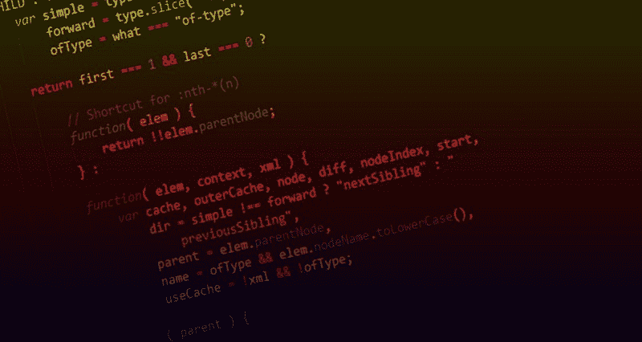

# 初学者的 JavaScript 学习计划

> 原文：<https://www.freecodecamp.org/news/a-beginners-javascript-study-plan-27f1d698ea5e/>

由 JS

# 初学者的 JavaScript 学习计划

所以你想学 JavaScript？恭喜你！在 2017 年，有比以往任何时候都多的可用资源，以各种各样的格式供您开始使用。

虽然历史上从未有过学习新技能的好时机，但考虑到大量的可用选项和这些材料在质量上的巨大差异，如果你试图找出最好的方法，这也是最令人困惑的。如果你在编码之旅的早期阶段曾经被推荐过*雄辩的 JavaScript**，你应该知道我在说什么。*

*我希望在这篇文章中为初学者指明一条道路，让他们开始掌握 JavaScript 技能。这是我个人一直遵循的一条道路，并取得了成功，最近完成了 freeCodeCamp 的前端证书。*

*3 个月后，当你把所有事情都整理好，并决定了最佳行动方案(或转向更有成效的事情)时，一定要给我写信。*

### *第一步:freeCodeCamp 的 JavaScript 部分*

*freeCodeCamp 是一个学习网络开发基础知识(甚至更多)的绝佳资源。*

*从现在开始，我假设你熟悉 HTML 和 CSS，但是如果你完全是编程新手，freeCodeCamp 也可以帮你解决。*

*使用一个友好的浏览器内文本编辑器，freeCodeCamp 将首先让您初步了解流行的 JavaScript 库 jQuery，然后深入到纯 JavaScript 语法，以及如何执行各种任务，如布尔运算、字符串和数组操作、循环等等。*

#### *第 1.5 步:用 Codecademy 的 JavaScript 曲目进行强化。*

*如果你和我一样，你需要一些支持。并不是所有的事情都会在第一轮就被理解。*

*一种选择是重新做 freeCodeCamp 练习，但我更喜欢使用多种资源来保持新鲜有趣。获得他人对同一话题的观点也是很有价值的。Codecademy 在这方面很棒。你会从稍微不同的角度经历许多相同的领域和问题。*

### *步骤 2:托尼·阿里西亚的 JavaScript:理解奇怪的部分*

*一旦你完成了 freeCodeCamp 的面向对象和函数式编程模块，以及 Codecademy JavaScript 课程的所有内容，你就有希望做好更深入的准备了。*

*[*《JavaScript:理解奇怪的部分*](http://learnwebdev.net/) 是一个优秀的优质视频系列，它以一种非常容易理解的方式深入到语言的工作中。这个 11.5 小时的系列节目充满了实用的信息，你将能够在你的节目中使用。*

*在这个全面的系列文章中，您将了解到作用域、闭包、原型继承、一级函数等等。这 20 美元花得很值。*

*与任何书籍或视频课程一样，一定要跟着编码，并记下自己的笔记以供日后参考。*

*当您完成本系列时，继续应对 freeCodeCamp 的挑战，并开始他们的中级前端项目。这些项目是无指导的，这听起来可能很可怕，但我保证你会通过做它们学到很多东西。当你陷入困境，不知道如何实现某个功能时，它们会迫使你直面知识中的空白，并迅速提高你的谷歌搜索技能。*

### *第三步:凯尔·辛普森的《你不知道的 JS》*

*我不确定我能对这个系列说些什么，但在这一点上，它是不可思议的。一旦你完成了 Tony Alicea 的课程，开始阅读*你不知道的 JS* ，同时继续从事 freeCodeCamp 的课程和项目。辛普森比你的钱更值得，但是如果你付不起钱，这些书都可以在[的 GitHub](https://github.com/getify/You-Dont-Know-JS) 上免费获得。*

*你至少应该阅读*范围&闭包*和*本&对象*原型卷。这些书会强化你从托尼·阿里西亚那里学到的东西，有时也会反驳和挑战那些材料。这很好！Kyle Simpson 是一个固执己见的人，获得他对事物的专家观点是非常有价值的，比如面向对象编程范例在 JavaScript 这样的语言中的有用性。即使有些问题超出了你的理解范围，简单地意识到它们也是有价值的。*

*本系列将使您成为更好的开发人员，同时也让您了解 JavaScript 社区中当前发生的各种意识形态冲突。*

### *关于奋斗，不知道答案，坚持不懈的一些笔记。*

*会有很多次你碰壁——当你不知道某个问题的答案，觉得永远也想不出来的时候。当这种情况发生时，我想分享一些技巧。*

#### *1.走开*

*休息一下。离开电脑。喝点茶或咖啡。想一会儿别的事情。让你的头脑清醒一会儿是很有价值的。当你回来的时候，你会惊讶地发现有多少次你能够快速地解决问题。*

#### *2.请求帮助*

*不要不好意思或羞于寻求帮助。有时候，你只需要朝着正确的方向轻轻一推，就能回到正轨。根据我的经验，人们喜欢帮助别人，并且非常乐意花几分钟时间解决你的问题。Gitter 上的 [freeCodeCamp 社区和](https://www.google.com/url?sa=t&rct=j&q=&esrc=s&source=web&cd=1&cad=rja&uact=8&ved=0ahUKEwjthY_M6cvRAhUPfiYKHTqAAMQQFggbMAA&url=https%3A%2F%2Fgitter.im%2Ffreecodecamp%2Ffreecodecamp&usg=AFQjCNFfb6q1G6N2Ey3sX2DIbLk6CY4LxA&sig2=AhiYRwdihtqToCnjhhGkPw&bvm=bv.144224172,d.eWE) [CodeNewbie Slack 频道](https://codenewbie.typeform.com/to/uwsWlZ)在这方面非常棒。*

#### *3.继续做别的事情*

*如果你真的得不到，换个话题也无妨。当你在一个或另一个项目上感到停滞不前的时候，有几个项目让你在它们之间跳跃是很好的。*

### *这只是一个指南*

*学习是高度个人化的。在我成为一名自给自足的 JavaScript 开发人员的过程中，我上面提到的所有资源都对我非常有帮助。*

*我写这篇文章是因为我在试图从 150 万教育资源中做出选择时所经历的挫败感。在收到一些善意但误导的建议后，很高兴找到一个最终对我有用的计划("*雄辩的 JavaScript* 是一本适合初学者的好书！")，以及大量的开始和停止。*

*虽然我远非 JavaScript 专家，但我希望从一个还记得完全初学者是什么样子的人那里提供一些观点。如此多的教学材料(理所当然地)是由他们行业的大师们撰写的。但是，许多大师已经忘记了作为一个卑微的初学者的经历，并期望新来者在逻辑上做出荒谬的联系和跳跃。这就是为什么如此多的教学材料可能完全没有帮助。*

*如果这个计划对你有帮助，激励你开始，或者甚至让你对不同意见感到愤怒，我很乐意在 Twitter 上听到你的声音。*