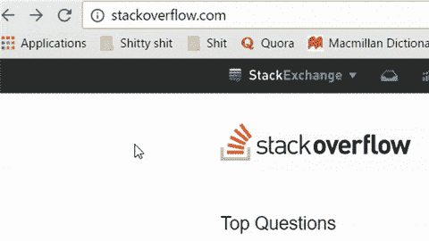

# 我如何在 10 周内学会深度学习，然后通过识别红绿灯赢得 5000 美元

> 原文：<https://www.freecodecamp.org/news/how-i-learned-deep-learning-in-10-weeks-then-won-5-000-by-recognizing-traffic-lights-f3e7b1b37ea/>

这里有三个值得你花时间的链接:

1.  我如何在 10 周内学会深度学习，然后通过识别红绿灯赢得 5000 美元( [11 分钟阅读](http://bit.ly/2jvEZ1L))
2.  谷歌加速移动页面的问题( [4 分钟阅读](http://bit.ly/2jGmkO5)
3.  “广告技术”公司是你不能再忍受阅读新闻的原因

额外收获:如果你正在考虑构建一个 API 混搭应用，这里有一个 API 精选列表( [3 分钟阅读](https://github.com/abhishekbanthia/Awesome-APIs?utm_source=SitePoint&utm_medium=email&utm_campaign=Versioning))

### 想到这一天:

> "好软件的功能是让复杂的东西看起来简单."——格雷迪·布奇

### 今日趣事:

如果你导航到 stackoverflow.com/admin.php，他们会嘲笑你试图访问他们的控制，把你重定向到一个愚蠢的 YouTube 视频。

编码快乐！

–昆西·拉森，自由代码营的老师