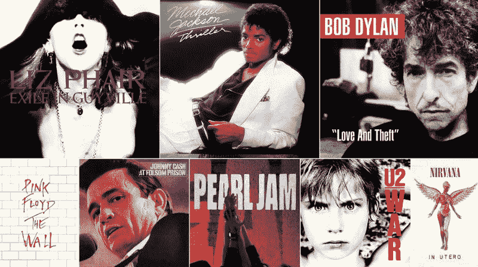
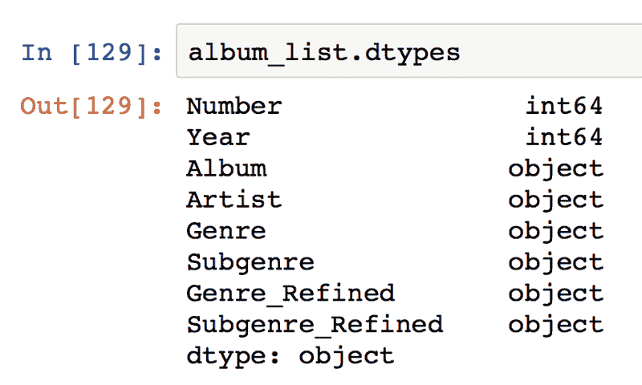
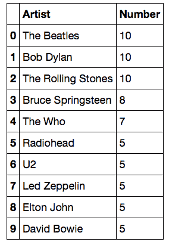
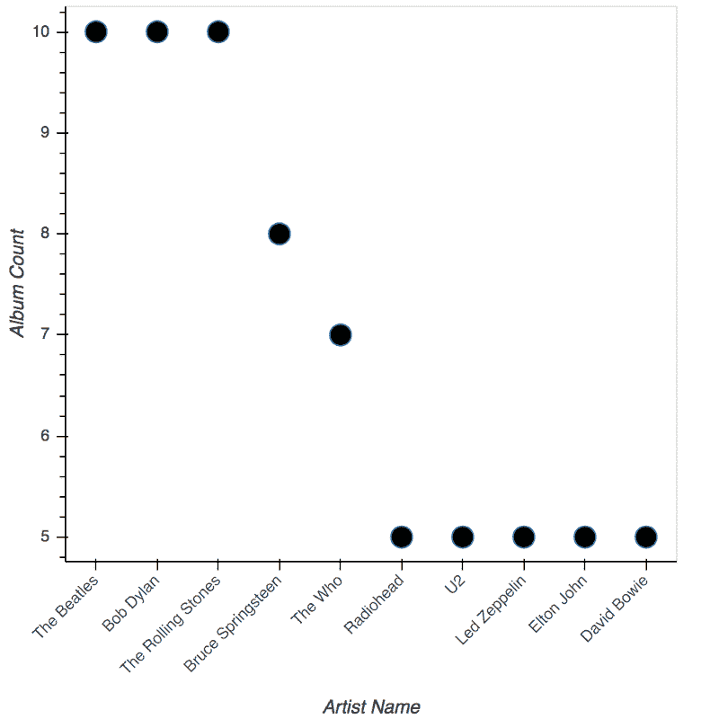
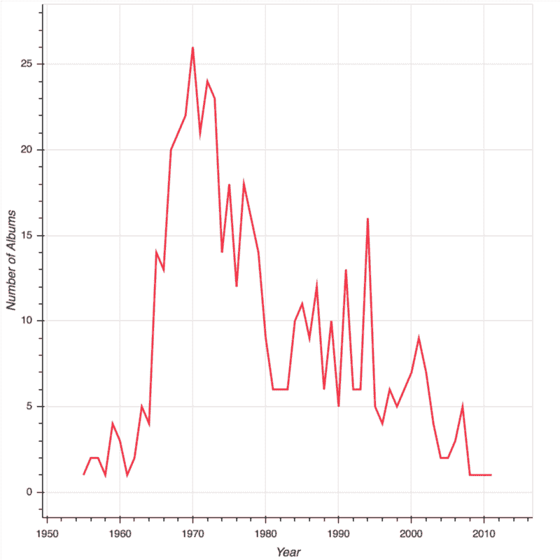
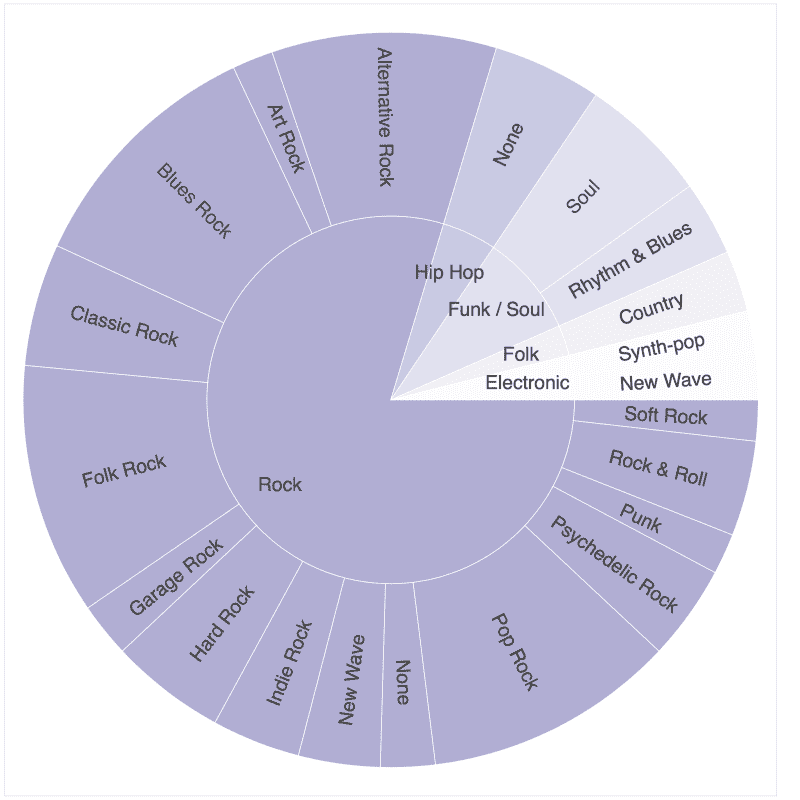
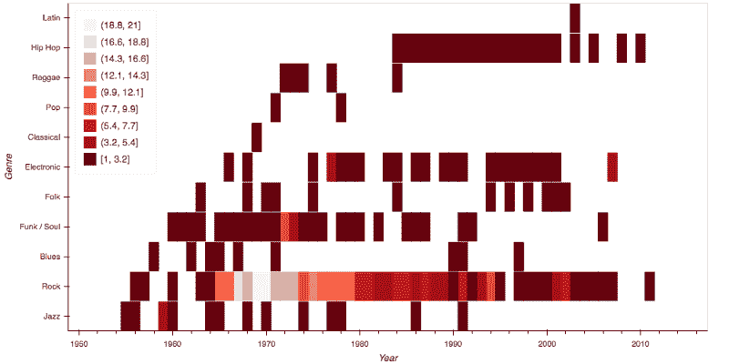
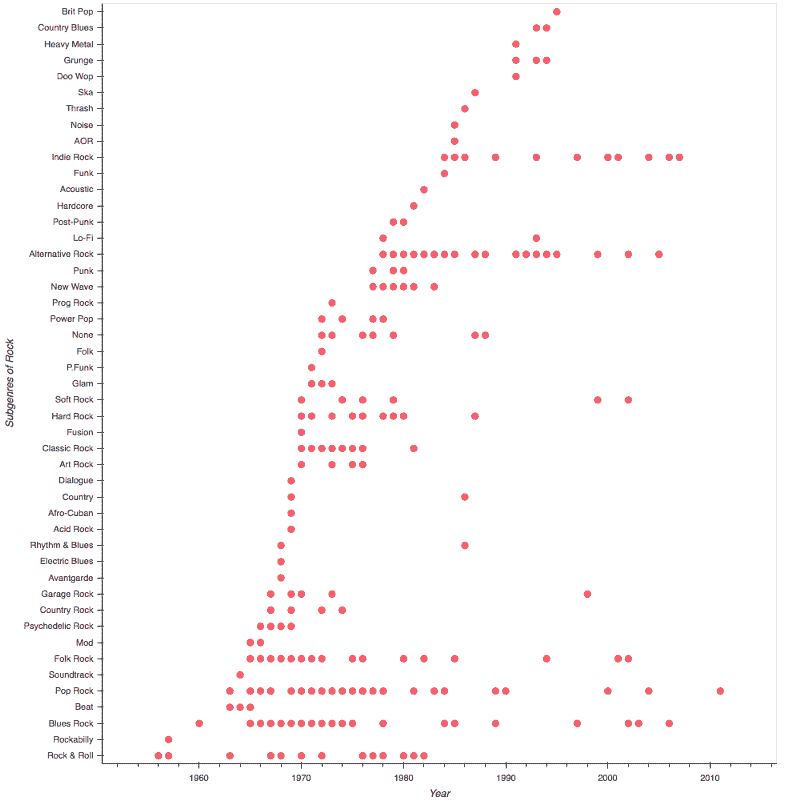
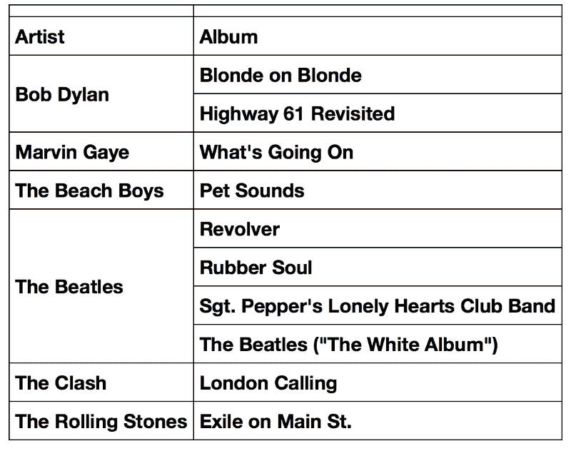

# 滚石 500 张最伟大的专辑用熊猫和散景形象化了

> 原文：<https://www.freecodecamp.org/news/visualising-rolling-stones-500-greatest-songs-using-bokeh-78ebc0eaff3f/>

高森·库尔马

# 滚石 500 张最伟大的专辑用熊猫和散景形象化了

**Source:** [500 Greatest Albums of All Time](http://www.rollingstone.com/music/lists/500-greatest-albums-of-all-time-20120531)

2003 年,《滚石》杂志就音乐家、制作人和行业高管最喜欢的专辑进行了调查。其结果是一个名为“有史以来最伟大的 500 张专辑”的特刊

这份名单在 2012 年进行了修订，主要收录了 20 世纪 60 年代和 70 年代的美国和英国音乐。

作为一个狂热的音乐爱好者和有抱负的音乐制作人，我听各种各样的音乐。滚石乐队的名单对我来说是摇滚音乐的入门。

有一天，当我浏览 [Kaggle](https://www.kaggle.com/notgibs/500-greatest-albums-of-all-time-rolling-stone) 以挑选一个简单的数据集并测试我新获得的数据可视化技能时，我偶然发现了上传为 CSV 数据集的列表。我决定亲自动手，用[熊猫](http://pandas.pydata.org/pandas-docs/stable/)探索数据，用[散景](http://bokeh.pydata.org/en/latest/)可视化结果。

Bokeh 是一个用于交互式可视化的 Python 库。它具有强大的界面，支持高级图表、中级绘图和低级建模。

我用来阅读、提炼、探索和可视化数据的完整代码可以在我的 [GitHub](https://github.com/itzzthad/kaggle-exercises/tree/master/rollingstones-dataset) 页面上找到，也可以在 Kaggle 上提交的这个[笔记本](https://www.kaggle.com/thadx89/d/notgibs/500-greatest-albums-of-all-time-rolling-stone/exploring-and-visualizing-using-bokeh/notebook)中找到。

这篇文章将描述我所采用的方法，包括我的可视化和我从构建这些方法中获得的洞察力。

### 获取和组织数据

获取数据很简单，因为它是在一个 500 x 6 的 excel 电子表格中。我所要做的就是使用`[read_excel()](http://pandas.pydata.org/pandas-docs/stable/api.html#input-output)`函数将它直接读入熊猫数据帧。

数据框有 500 行，每张专辑都列出了图表号、年份、专辑、艺术家、流派和子流派。genre 和 Subgenre 列在一个字符串中有多个逗号分隔的值，所以我必须在第一个逗号处拆分字符串，并只保留新列中的第一个值，作为专辑的 Genre 和 Subgenre 的最相关分类。

添加了“流派 _ 细化”和“子流派 _ 细化”列后，主数据框变成了 500 x 8。

我在 Jupyter 笔记本上使用了 Python 3.5.2 内核(Anaconda 4.2.0 发行版)。

**My master data frame**

### 探索数据并获得洞察力

在大多数情况下，我采用了使用 pandas 内置的`[groupby()](http://pandas.pydata.org/pandas-docs/stable/groupby.html)` 函数的拆分-应用-合并策略，而对于一个单独的案例，我采用了使用 pandas 内置的`[pivot_table()](http://pandas.pydata.org/pandas-docs/stable/reshaping.html)`函数的整形策略。我把结果数据框输入散景图和数字中。

以下是我提出的问题以及它们的可视化结果。

### **榜单上拥有最多专辑的前 10 名艺人**

为了获得前 10 名艺术家，我在艺术家列上使用了`groupby()`，进行了计数，并对结果数据帧进行了排序，以获得拥有最多专辑数量的前 10 名艺术家。

为了可视化结果，我使用了来自[散景图](http://bokeh.pydata.org/en/0.10.0/docs/reference/plotting.html)库中的一个图形对象，并使用`circle()` 方法绘制了黑色圆圈。

**Top 10 artists**

显然，甲壳虫乐队、鲍勃·迪伦和滚石乐队分别以 10 张专辑高居榜首。

### 列表中专辑数量的年度统计

为了得到这个，我在年份栏上使用了`groupby()`并进行计数，之后我按年份对数据进行了分类，并使用来自[散景图表](http://bokeh.pydata.org/en/latest/docs/reference/charts.html)的折线图绘制了结果数据框。

**Year wise distribution of albums**

列表中最大数量的专辑发行于 1970 年。20 世纪 60 年代末和 70 年代初发行的专辑也很丰富。最后一次高峰出现在 20 世纪 90 年代初，这是流行音乐、R&B 音乐和嘻哈音乐爆发的原因。

### 顶级流派和子流派

为了识别热门流派和其中的子流派，我使用 pandas *pivot_table()* 函数对数据进行了整形，其中我将索引设置为 Genre_Refined 和 Subgenre_Refine 列，并将`aggfunc`参数设置为 count。

在使用子分类中应该有超过 5 张专辑的条件提取了数据帧的子集后，我将数据帧馈送到散景[圆环图](http://bokeh.pydata.org/en/latest/docs/gallery/donut_chart.html)并将[调色板](http://bokeh.pydata.org/en/0.10.0/docs/gallery/palettes.html)设置为 Purples9。

**Top Genres and Subgenres**

岩石和它的亚属覆盖了大约 80%的选择。嘻哈、R&B、灵魂、乡村和电子音乐专辑占据了剩下的 20%。

### 按年份分类的每种类型的歌曲

为了得到这些数据，我对年份和流派做了一个`groupby()` 提炼，进行了计数，按年份对值进行了排序，并将结果数据帧输入到一个散景热图。这次我用了 Reds9 调色板。

**Heatmap of Songs in Each Genre by Year**

显然，60 年代末和 70 年代的摇滚乐专辑数量最多。这些年来，放克、灵魂和爵士音乐专辑的数量减少，为嘻哈和电子专辑铺平了道路。

### 多年来岩石的亚类

为了获得这些数据，我对年份、流派 _ 精炼和子流派 _ 精炼做了一个`groupby()`操作，进行了计数，并对数据框进行了子集划分，以便在流派 _ 精炼列中只包含摇滚。然后，我将生成的数据帧输入散景热图。

**Subgenres of rock over the years**

最初几年以摇滚乐为主，到 20 世纪 60 年代中期，蓝调摇滚和流行摇滚的数量慢慢增加。到了 20 世纪 70 年代中期，另类摇滚开始崭露头角，接着是 80 年代中期的独立摇滚。

### 前 10 张专辑汇总

最后，我按照艺人分组后总结了榜单前 10 的专辑。

**Top 10 Albums grouped by Artist**

最终的结果并不令人惊讶。《滚石》杂志的列表大多包含摇滚及其各种子类别的歌曲，也有一些嘻哈、R&B、灵魂、乡村和电子音乐专辑。

如果你和我一样，喜欢偶尔重温披头士、鲍勃·迪伦、滚石乐队以及 60 年代和 70 年代其他摇滚乐先驱的音乐，我建议你听听这些顶级专辑，然后从那里开始探索。

如果你好奇，你可以在这里阅读专辑的完整列表[。](http://www.rollingstone.com/music/lists/500-greatest-albums-of-all-time-20120531)

我是一名技术顾问、数据科学爱好者和有抱负的音乐制作人。如果你有写作的机会或有兴趣接触工作，请随时写信给我，联系高森网络商务。

如果你喜欢这篇文章，请点击推荐按钮，并与你的朋友分享。