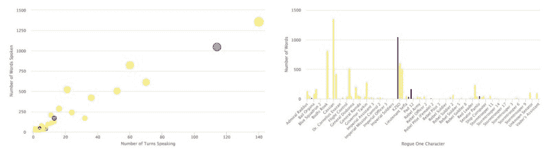
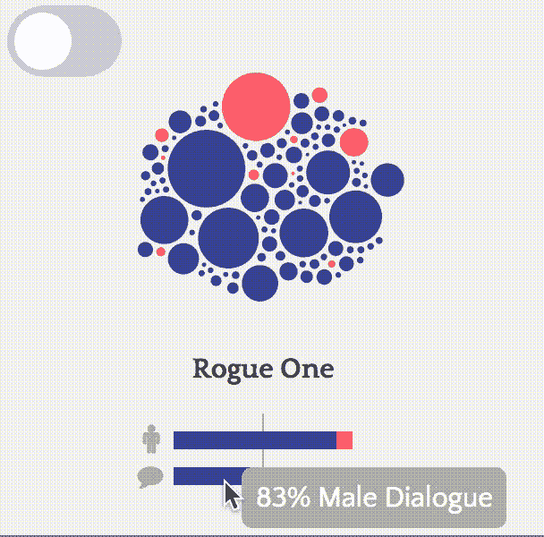
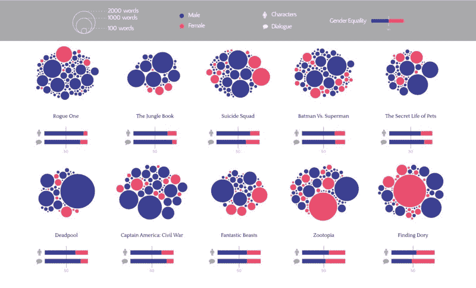

# 在 2016 年最大的电影中，女性只说了 27%的话。

> 原文：<https://www.freecodecamp.org/news/women-only-said-27-of-the-words-in-2016s-biggest-movies-955cb480c3c4/>

作者安柏·托马斯

# 在 2016 年最大的电影中，女性只说了 27%的话。

Image by: [Animoplex](http://animoplex.com/)

2016 年的电影预告片向观众承诺了这么多坚强的女性角色。琴·厄索。多莉。哈利·奎恩。朱迪·霍普斯。神奇女郎。我觉得今年可能是好莱坞大片中性别平等的一年。

我错了。

而且我不是轻易做出这个声明的。

作为一名科学家，我依靠数据来回答我对这个世界的疑问。我有数据支持我的说法。事实上，你可以拥有我为了更好地理解这个主题而制作的数据、代码和结果数据可视化。但首先，让我告诉你我是如何变得如此感兴趣的。

这一切都是从我去看《侠盗一号:星球大战》开始的。这部电影的所有宣传材料都表明琴·厄索(费莉西蒂·琼斯饰演)是主角。我是说，看看海报。

当你的照片比别人的大几倍时，你可能就是主角。

我一开始没有注意到的是 Jyn 是海报上唯一的女性。

我走进电影院，希望看到男女并肩作战。我离开的时候，觉得自己一只手就能数清电影中的每个女性角色。虽然 Jyn *是主角，但我深刻地意识到，她往往是任何场景中唯一的女性。*

一个女主角人数如此之多，这种感觉异常熟悉。然后我意识到 Jyn 和 Leia 公主相隔 39 年也遭受了同样的不平等。我被一种需求淹没了，那就是想知道《星球大战》电影中的女性形象到底发生了怎样的变化。但是拿今天拍的电影和几十年前拍的电影做比较似乎不公平。

因此，我决定在 2016 年全球票房最高的 10 部电影中寻找女性平等。他们是:

*   [美国队长:内战](http://www.imdb.com/title/tt3498820/?ref_=nv_sr_1)
*   [寻找多莉](http://www.imdb.com/title/tt2277860/?ref_=nv_sr_1)
*   [疯狂动物城](http://www.imdb.com/title/tt2948356/?ref_=nv_sr_1)
*   [丛林之书](http://www.imdb.com/title/tt3040964/?ref_=nv_sr_1)
*   [宠物的秘密生活](http://www.imdb.com/title/tt2709768/?ref_=nv_sr_1)
*   [蝙蝠侠大战超人:正义黎明](http://www.imdb.com/title/tt2975590/?ref_=nv_sr_1)
*   [流氓一号:一个星球大战的故事](http://www.imdb.com/title/tt3748528/?ref_=nv_sr_2)
*   [死池](http://www.imdb.com/title/tt1431045/?ref_=nv_sr_1)
*   [神奇动物和在哪里可以找到它们](http://www.imdb.com/title/tt3183660/?ref_=nv_sr_1)
*   [X 特遣队](http://www.imdb.com/title/tt1386697/?ref_=nv_sr_1)

这些电影里那么多厉害的女性，肯定有男女平等的吧？

### **数据**

既然我决定了我要调查什么，我需要弄清楚如何去做。类似的数据探索项目集中在对话和 T2 屏幕时间的平等上。这两个似乎都是不错的选择，但我希望能够在电影和角色层面报道平等。

最后，我决定探索电影的对话。这个选择让我能够把注意力集中在故事中活跃的角色上，并从我的分析中剔除不说话的角色。

对我来说幸运的是，忠实的影迷经常会把电影对白转录下来，并在网上免费发布。如果我找不到抄本，我就用隐藏字幕文件代替。为此，我重新看了一遍电影，并手动给角色指定台词。

这个过程是爱的劳动。这很费时间，但我不后悔。

### 分析

一旦我有了所有的成绩单，我只需要阅读。txt 文件转换成 [R](https://cran.r-project.org/) 并把字符和它们的行分开。对于星球大战外传：侠盗一号的文字记录，这个过程是这样的:

现在我有了一个包含字符和单词列的数据框，我必须给每个字符分配性别。为了与我的分类保持一致，我想出了一些简单的规则:

1.  可能的话，根据其他角色使用的代词来指定性别。比如一个人物被别人称为“他”或“他”，那么他就被归类为“男性”。
2.  如果在整部电影中没有使用代词，但是角色被命名或署名(在 [IMDB](http://www.imdb.com/) 上)，使用男演员或女演员的性别。请注意，男演员或女演员的性别是根据截至 2017 年 1 月的公开信息假设的。
3.  如果角色没有使用代词，并且角色没有被命名或被记录，请参考隐藏字幕。有时他们会认出说话的人。
4.  如果所有这些都失败了，根据角色的声音做出一个有根据的猜测。

我首先要说的是，这些方法并不完美。事实上，这里有一些警告:

1.  如果一个男角色是由一个女演员配音的(反之亦然)，并且这个角色从来没有被其他角色用代词称呼过，那么他可能会被错误地标注。(我觉得没有发生这种事，但一切皆有可能。)
2.  与角色的物理化身无关的声音(例如，计算机的声音)根据其配音演员/女演员的性别进行分类。
3.  我永远无法真正知道任何角色的性别，但我正在利用我所掌握的线索和信息。

再说一次，我远非万无一失，所以如果你发现了我的错误，请[告诉我](https://proquestionasker.github.io/contact/)。

所以现在我只需要计算每个角色说的单词数。同样，我可以在 R 中使用`dplyr`和`stringi`包来实现这一点。

值得注意的是，我在这个分析中包括了每个说话的角色。所以，是的，每个大喊“等等，停下来”的冲锋队员也包括在内。

Spoiler Alert: The stormtroopers in Rogue One are all voiced by men.

### 数据可视化

我有我的数据。不幸的是，一张张字数和角色名字的表格并没有给任何人太多的洞察力。像任何好的数据探索项目一样，是时候将我的结果可视化了。在我找到最好的一个之前，我不得不反复工作。

散点图和条形图都用小角色掩盖了角色。

简单的气泡图更好，但很难识别单个字符。理解电影级别的统计数据也很有挑战性。

Which bubble is which?!

最后我决定学够 d3.js，把[做成交互图形](http://amber.rbind.io/2016MovieDialogue/)。这里，每个气泡代表一个字符，气泡的面积根据说出的单词数进行缩放。母泡和公泡可以分开，以便更好的洞察。下面的堆叠条形表示电影级别的信息。

Full interactive version [here](https://proquestionasker.github.io/projects/MovieDialogueInteractive/)

去吧，看看[全互动版](http://amber.rbind.io/2016MovieDialogue/)。

有兴趣自己探索原始字数统计数据吗？我已经把所有用来生成这些可视化的数据和代码都开源了。这里有:

[**ProQuestionAsker/2016MovieDialogue**](https://github.com/ProQuestionAsker/2016MovieDialogue)
[*通过在 GitHub 上创建账户，为 2016 moviedialogue 发展做贡献。*github.com](https://github.com/ProQuestionAsker/2016MovieDialogue)

### 外卖食品

好了，分析完成了。我有一个奇特的(并且有趣的)可视化。我发现了什么？

我建议在继续之前花一点时间看一些“有用”的东西，因为这篇文章很快就会变得非常令人沮丧。

噢，太可爱了。感觉好吗？

好了，开始了。

这是所有 10 部电影的可视化效果的静态版本:

*(如果你想了解互动可视化，请点击[这里](https://github.com/ProQuestionAsker/2016MovieDialogue)。)*

The interactive version of this visualization can be found [here](https://proquestionasker.github.io/projects/MovieDialogueInteractive/).

这里有几件事我需要指出:

在 2016 年的十大电影中，没有一部是女性演员占 50%。

《寻找多莉》是最接近这个平等水平的，有 43%的女性角色。为了公平起见，这部电影还需要 8 个以上的女性角色。

星球大战外传：侠盗一号是最差的。只有 9%的说话角色是女性。在这 10 个角色中，1 个是电脑声音，1 个出现在屏幕上不超过 5 秒，1 个是说一个词的 CGI 客串。

在 2016 年排名前十的电影中，只有一部电影中有 50%的对白是女性角色。

《寻找多莉》也名列榜首，有 53%的女性对白。但是，76%的对话来自多莉一个人。

排在最后的是《丛林之书》,只有 10%的对话是女性角色说的。请记住，这是在让斯嘉丽·约翰逊为历史上的男性蛇 Kaa 配音之后的*。*

We’re gender equal….Trusssssssst in me….

这里还有一些:

*   《寻找多莉》和《疯狂动物城》是 2016 年前 10 部电影中仅有的两部女性角色对话最多的电影。
*   《美国队长:内战》决战 5:1 中女性角色寡不敌众。整部电影，他们只贡献了 16%的对白。
*   《蝙蝠侠大战超人》中蝙蝠侠说话比超人多 2.4 倍，比神奇女侠多 6 倍。
*   星球大战外传：侠盗一号 78%的女性台词来自琴·厄索。
*   虽然哈利·奎因在 X 特遣队是一个备受关注的角色，但她说的话只有弗洛伊德/死亡射手(威尔·史密斯饰演)的 42%。值得注意的是，阿曼达·沃勒(维奥拉·戴维斯饰演)说话频繁，总共只比 Deadshot 少了 222 个单词(16%)。

我开始这个项目是因为我有一种感觉，星球大战外传：侠盗一号的演员阵容和对话没有在男女角色之间平均分配。我很震惊(也很难过)地发现，去年排名前十的电影中几乎没有一部是男女平等的。

我们可以做得更好。

*增加了*:如果你正在寻找更多这样的研究和数据探索，请查看:

*   [2007-2015 年 800 部热门电影中的不平等现象](http://annenberg.usc.edu/sitecore/shell/Controls/Rich%20Text%20Editor/~/media/10575E37F34248C585602A69C18F2CBE.ashx)(包括性别、种族/民族、性取向和残疾)
*   [这次探索](http://polygraph.cool/films/)从 2000 个随机选择的 20 世纪 80 年代至 2010 年的电影剧本中
*   [这项研究对 2014 年& 2015 年](https://seejane.org/research-informs-empowers/data/)的 200 部大电影进行了调查
*   [2014 年最大电影中的女性形象](http://womenintvfilm.sdsu.edu/files/2014_Its_a_Mans_World_Report.pdf)
*   关于 2016 年动画电影中性别平等的推特帖子

TL；DR Version:在每一项调查中，女性代表了(平均)30-35%的说话角色。

*增加*:对我的方法或结论有疑问或意见吗？请查看我的后续文章，其中包含了最常见的问题。

我分析了 2016 年最大的电影中的对话，它引发了很多对话。
[*几周前我发表了一篇关于我对 2016 年票房最高的 10 部电影的对话分析的故事。我是如此…*medium.com](https://medium.com/@ProQuesAsker/i-analyzed-the-dialogue-in-2016s-biggest-movies-and-it-started-a-lot-of-conversations-b9c815f24313)

如果您喜欢这篇文章，并希望看到更多类似的内容，请点击下面的绿色心脏，并在您选择的社交媒体网络上分享。

在我寻找一份数据科学工作的同时，我目前正把时间花在个人项目和数据可视化上。因此，如果你有一个有趣的项目想法(或工作咨询)想与我讨论，请通过 [Twitter](https://twitter.com/ProQuesAsker) 或通过[电子邮件](mailto:amberthomasmsc@gmail.com)联系我。

谢谢大家！